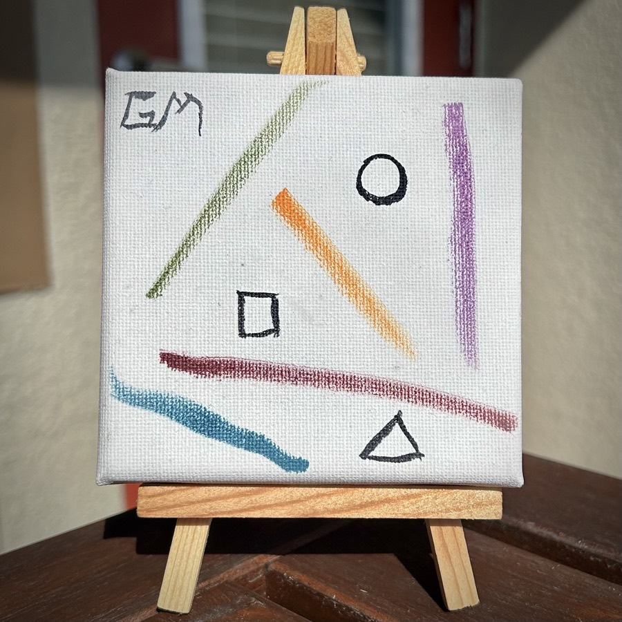

# Dreams (2021/10/08)

Coming off the idea of returning to my roots of art, I took the idea into the realm of the somewhat uncontrollable. My dreams are often quite basic and completely disconnected from my reality.

I also often dream in muted colors. They are still vivid. But nothing really shines brightly. When I do dream in black and white, those dreams are closer to my reality.

In this piece, the only lines that connect are the ones in a single shape in black. The colors never intersect with anything. Yet everything is connected to the white canvas.

As of late, I have been dreaming so much more than usual. And these latest dreams are both color and closely tied to my reality. A few are so closely connected to my real world that I acted upon them recently.

In each case, my dream and my actions in response affected someone else in my life. Both I and the other person were blessed by God in some way during our interaction. I never imagined when I painted this piece that a few years later its meaning would be realized.

