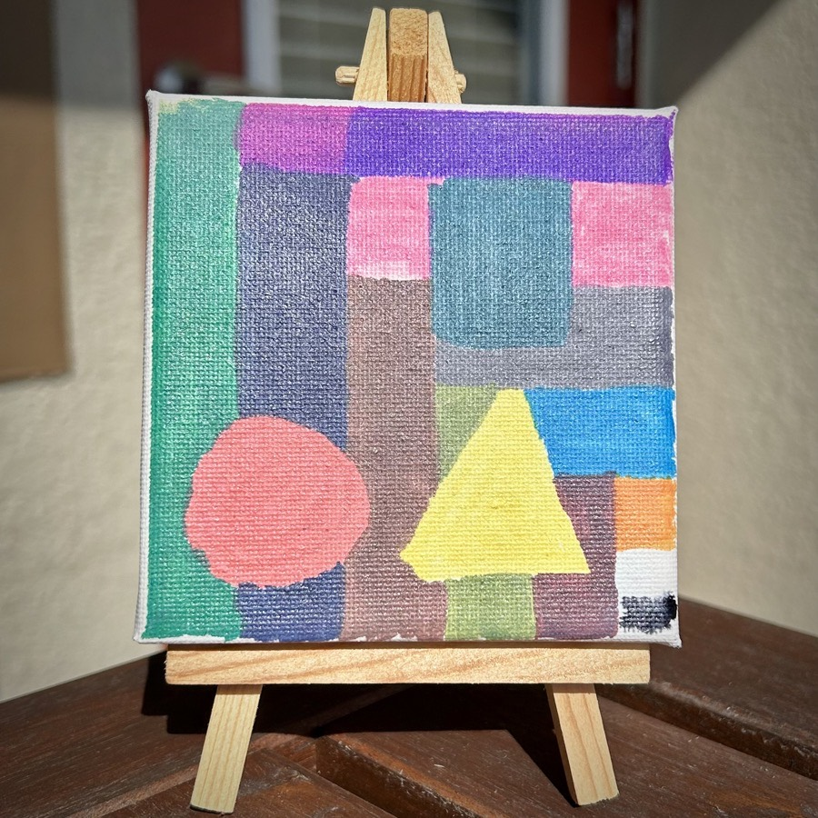

# Only the Beginning (2021/10/02)

At a very young age, we learn basic shapes, lines, and curves. All of the building blocks that make up creativity. It's an easy way to understand what it takes to eventual create a masterpiece. This is a far cry from a masterpiece. Even as I painted it, I knew I could do so much better. But that was sort of the point of this piece.

It connected me back to when I was a child. Those early developmental years were when my creative mind began to form. On my most recent trip back to Indiana, I was drawn to the old art my parents still had on the walls in their home. I walked my son through some of the work I had done as a child. It was great to remanence on when the spark of creativity ignited to the flame that still burns today.

Creating this primitive piece was a solemn reminder that everything begins somewhere. Although I was 43 when I painted this, being that it was my rebirth into painting, I am proud to display this in my home from time to time.

