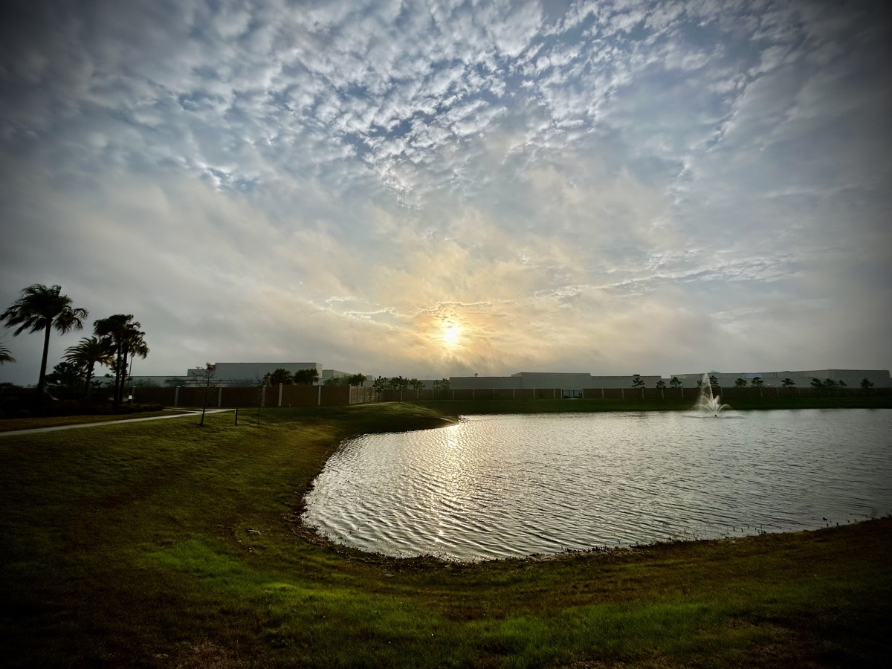
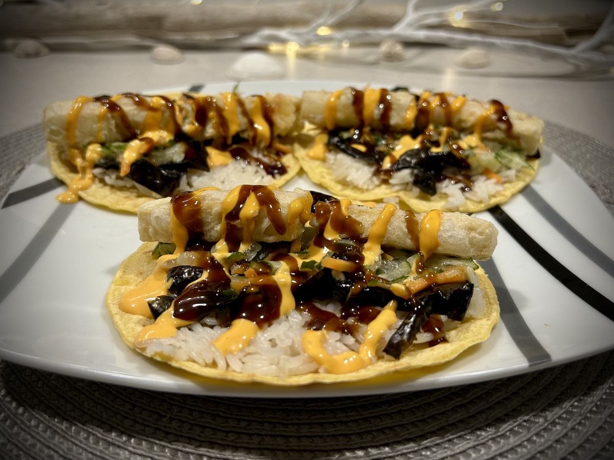
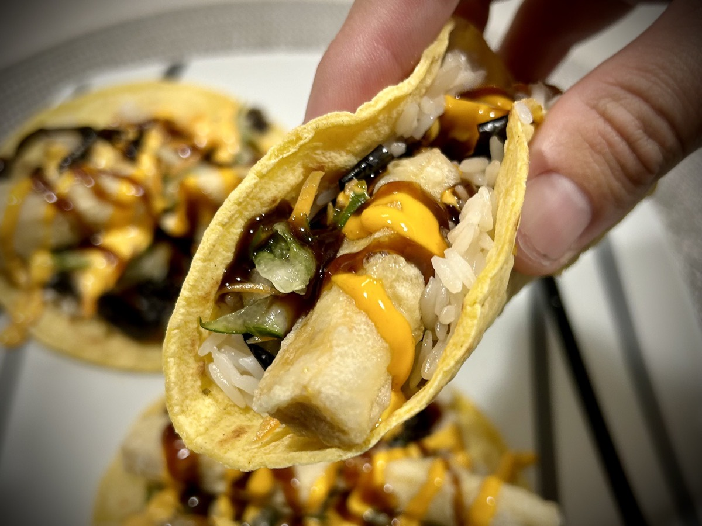

# Coffee, Paradise Freezing, and Tofu Tempura Tacos

## Coffee

As per my goal, I woke up around 5am today. It's nice to set goals and achieve them. It gives a sense of accomplishment. Some goals should be small and simple. Such was the case for changing my sleep schedule to 9pm-5am. Other goals, like my health goals from 2023, need to be larger. The small goals can give me what I need to feel like I'm making progress in life. But if I keep to just small goals, it will give me a false sense of achievement. Having those larger goals as well seem to carry the achievement with more gravitas. Regardless of big or small, I still celebrate all of the wins! Especially when it comes to goals.

I'm especially grateful for reaching my goal of waking at 5am today. It took me more than 30 minutes to make coffee this morning! Getting up so early meant I had plenty of time for the issues I faced with my coffee today. I ground my coffee fresh today and set about preparing the coffee maker as I do every day. As it began brewing, I got to thinking about how I hadn't cleaned the machine this month. I had traveled to Indiana to conclude the year back in December. I typically clean the machine at the start of the month when I change air filters in my AC unit. And although I did not clean my coffee maker, I did clean and change out the filter in my water dispenser; which I do so every 6 months. So "why didn't I do the coffee maker", I thought to myself.

Once the coffee was done brewing, I dumped out the remaining water from the reservoir, rinsed the filter (I use reusable filters), and proceeded to take that first refreshing sip. Bleh! It tasted gross! I took another sip to confirm. Yep! Gross! I then thought, well, perhaps it was the blend of coffee I was using today? I don't particularly enjoy it. But I'm drinking it because I bought it. I had been rotating 4 different blends this winter. I decided to brew another mug full of the same blend to see if it was just a fluke that it turned out so horrible this time as I didn't recall it being so bad last time. Guess what!? That second brew was just as bleh!

As I didn't particularly enjoy this blend anyway, I decided to toss out what beans I had left of it. And then proceeded to clean the machine. I figured either way, I wasn't going to enjoy that blend and the cleaning was well past due. I clean the machine by brewing 6oz of distilled white vinegar through the machine. This dislodges any particle buildup within the tubes and mechanisms of the machine. I then run plain water through it to rinse out the remaining particles and remove that vinegar taste and smell. I do 2 runs of 12oz of hot water each. At this point, the coffee maker is as clean as it's going to get!

I also cleaned out my coffee grinder. I do that every few weeks anyway. Today felt like it was a good time to do so. I ground a fresh batch using a different blend. One that I truly love! I then went about brewing the coffee as I always do. Hoping for the best, I took that first sip. Eureka! It was perfect and refreshing! Normally it only takes a few minutes to brew my morning mug of coffee. Today, it needed to teach me a lesson. Stick to the cleaning routine!

The same goes for my soul. Over time, life's circumstances can cause a buildup of a nasty set of emotions. From stress to anxiety, there are so many things attaching themselves to the inner peace of my soul. Every so often, this causes me to feel bleh. And if not properly cleaned out, this can lead to spiritual and mental fatigue. I need to take a moment on a regular basis to clean out my soul. It isn't something to do only once a year. It is something I need to add to a monthly or weekly routine. Some sort of interval that helps keep myself in check and keeps the tubes and mechanisms that make my soul brew clear.

## Vitamin G

Today, I’m going to be grateful for all that I do have. I’m not going to focus on all of the things I do not or no longer have. When I make an account of it all, I have everything I need and a lot that I want.

Philippians 4:8-13 reads,

> Finally, brothers and sisters, whatever things are true, whatever things are honorable, whatever things are just, whatever things are pure, whatever things are lovely, whatever things are of good report: if there is any virtue and if there is anything worthy of praise, think about these things. Do the things which you learned, received, heard, and saw in me, and the God of peace will be with you. But I rejoice in the Lord greatly that now at length you have been thinking of me; in which you did indeed take thought, but you lacked opportunity. Not that I speak because of lack, for I have learned in whatever state I am, to be content. I know what it is to be poor, and I also know what it is to be fortunate. In any and all circumstances I have learned the secret both to be filled and to be hungry, both to abound and to be in need. I can do all things through Christ who strengthens me.

1 Thessalonians 5:16-18 reads,

> Always rejoice. Pray without ceasing. In everything give thanks, for this is the will of God in Christ Jesus toward you.

I have a grateful heart today. Just as it was with Paul in his letter to the Philippians, I too know what it is to live in poor conditions and to live with an abundance of blessings. I have been both near starvation and filled with more food than I should have eaten. I have been in need and have provided for those in need. Especially today, I feel content with all that I have and for that which I have not.

## Freezing and Paradise

Now that I live in Florida, I often compared the weather conditions here with those back in my birth state of Indiana. On my phone's home screen, I have weather conditions and forecasts for both my former "hometown" and my now hometown. I simply swipe over to that part of the screen and there it is! In the Winter months, it gives me great pleasure to see how much warmer and sunnier it is in Florida. And today, the morning here was quite warm while it was in the single digits back in Indiana. It was around 4F back there and in the 70s here with the sun shining. So, what did I do? I took my breakfast and work computer out on my patio and worked for several hours. There was even a pleasant breeze for a while. Around 11am or so, I decided to come inside. The wind was really picking up and a storm was on its way off the gulf. Having already heard a bit of thunder, I didn't want to chance lightning striking the swimming pool about 20 feet from where I was sitting! This all said, it's suppose to be in the 30s here tomorrow morning. So, it will be too chilly for me to work outside tomorrow...hehehe

## Tofu Tempura Tacos

Yesterday, I wrote about an idea I had for tofu tempura tacos. Well, I gave it my best shot tonight and did it! These were by far the best sushi tacos I have made. Doing the tempura homemade was perfect! And it was super simple! I made way too much batter. But that's mostly because I eat alone and only needed enough for 3 tacos. But here is the basic recipe:

* 1 cup sifted all-purpose flour
* 1 cup ice cold water (and I truly mean ICE COLD)
* 1 egg

Before you make the batter, be sure the oil in your deep fryer is hot and ready and be sure to coat your protein or veggies with all-purpose flour to help the batter stick. In my case, I coated pieces of tofu. Using chopsticks, slightly scramble the egg. It doesn't need to be super scrambled for best results. Mix in the ice cold water using chopsticks. Finally, slowly mix in the flour using chopsticks. Don't mix it too much. Some clumping is expected for best results. Then you dip your protein or veggies in the batter and place it in the frying oil. Once it is slightly browning, remove from the oil and place on a paper towel lined plate to allow the excess oil to be absorbed. What you have now are fluffy tempura delights!

For the tacos, I used yellow corn tortillas, placed a thin layer of sushi rice, then strips of nori, followed by a carrot and cucumber slaw I made by marinating the veggies in roasted garlic rice vinegar, placed the tofu tempura on that and topped it all with a drizzle of Sriracha mayo and hoisin sauce. This Taco Tuesday Treat was terrific!

## Out of time

I had a lot more to write about today than I had time for to write. Work got in the way of my writing time...hehehe But that's okay! If it is truly important, I'll recall the best stuff another day and write about it then. But rather than in journal form, it may end up in a book! I can imagine some of the things I journal about might end up in a book as well. That's actually one of the reasons I started writing this blog. The entries I make not only keep me in the practice of writing, they also contain some insights that I may later explore for my expanded writings. That's the beauty of writing. Everything can be used to help myself or future readers. I want my life, and my writings, to improve the lives of others. It is my prayer that God will use me in this way. What He has been teaching me and what I've been writing isn't for me alone. He has something to say to both of us...you and me. We are in this together. God made us this way!

By the way, after all that coffee adventure I had this morning, I decided I would give my old slow pour coffee making a try tomorrow. So I got out my old decanter and gooseneck kettle to make old fashioned coffee tomorrow. I'm in for a real treat! After the lesson I learned about cleaning out my soul on a regular basis, I realized there was another lesson in there. Sometimes I get so accustomed to technology helping me get things done quicker, I often forget that slowing down and doing things manually or the old way can sometimes be therapeutic. Doing a slow pour for coffee is an art form of sorts. And making coffee that way should be as calming and peaceful as it use to be. When I made coffee using slow pour in the past, I did so because I was dealing with circumstances that were causing me a great deal of stress. With all the time I now have in the mornings, taking it slow with something as simple as making coffee might just be a great way to cleanse my soul at the start of every day.