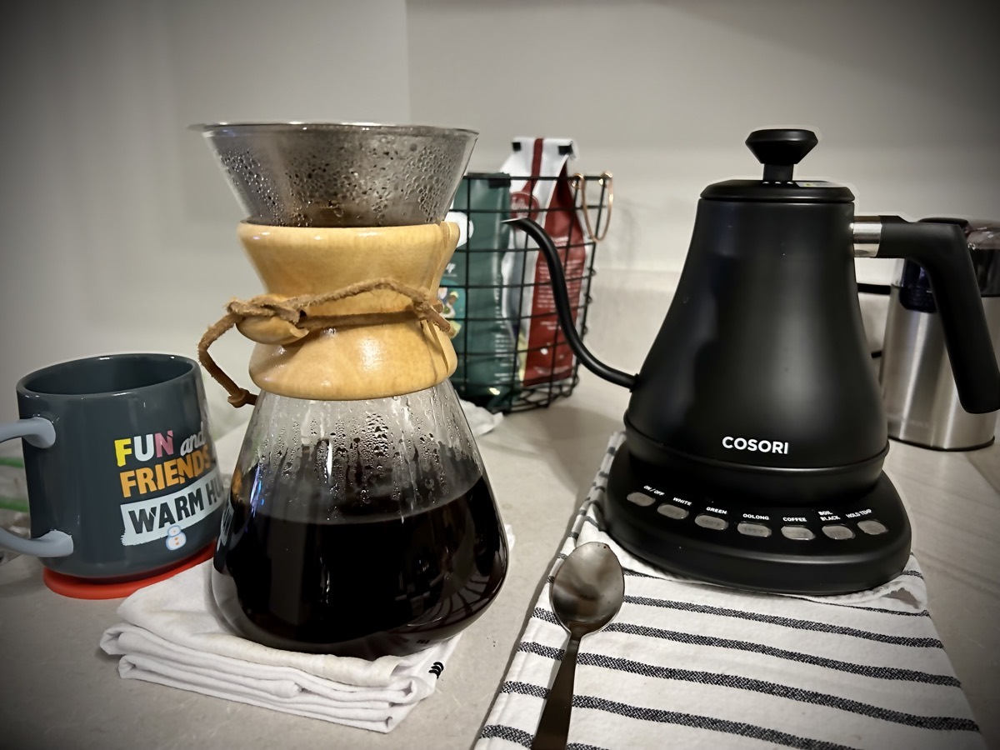
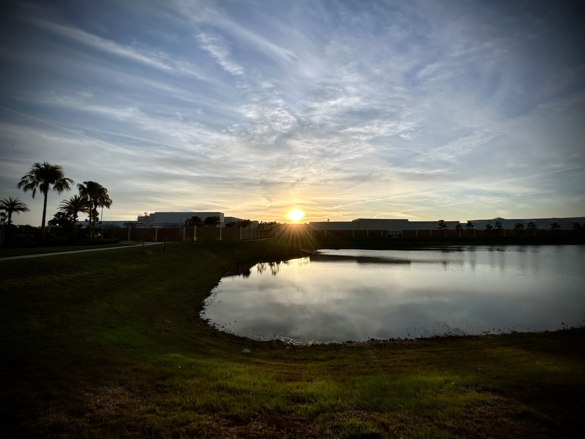

# TBD

## Workout

I am by no means a workout enthusiast. Most of my life, in fact, I have refused to workout. I was never concerned with not being able to lift heavy objects and I really don't like that super muscle look of the gym going dude. However, as I was on my health journey last year, I started feeling inspired to at the very least take another look at working out. I'm still not the least interested in having that muscle look or anything. I have found that it is a great way to exercise when walking or running outdoors isn't possible. Towards the end of the year, I pulled back on my workout routine for a bit due to holidays mostly.

One of my goals for getting up at 5am was to get back into my functional strength and core workouts. I told myself that if I were to be able to get up at 5am for 3 straight days, I would begin my 2024 workout routine. I indeed stuck to that! On that third day, which was this past Monday, I did a workout. Today was the next workout day for me. I was still in pain from a few days ago and really didn't want to do my workout...hehehe Upon the prompting of the Holy Spirit, I went through with my workout today. Although I'm still a little sore, I feel fantastic! My body and mind really needed this today.

## Slow Pour Coffee

WOW!!! I had forgotten how amazing slow pour coffee was!!! Not only is the taste so much better, the action of manually and slowly pouring the hot water from a gooseneck kettle over the grounds in a decanter truly is a spiritual experience. Another bonus is that it doesn't matter how big or small my coffee mug or cup is! Since the coffee rests inside a decanter, I can pour as much as I need in any size mug! Using my single serve machine, I always preferred the max of 14 oz. Any smaller mug or cup just wouldn't do. With this slow pour technique, I can easily pour another mug or cupful without brewing another batch. I can see my coffee mug and cup collection soaring now!

## Vitamin G

For today's post, I'm going to reach back to a past post I made over a year ago. Just as I was back then, I'm working through some trauma. So it feels appropriate to revive and update from the past:

> I must work through my pain. Like an untreated wound will fester and become infected, untreated emotional trauma can fester and infect my soul.

I draw a lot of wisdom from the book of Proverbs. There isn't a direct 1 to 1 connection between an specific passage and today's Vitamin G. However, there are several the inspired it when I first wrote it. As I researched it further today, a passage popped up that has appeared now 3 times this week. It is Proverbs 3:5-6; which reads,

> Trust in God with all your heart, and don’t lean on your own understanding. In all your ways acknowledge Him, and He will make your paths straight.

The best treatment for the emotional recovery of past trauma goes well outside the realm of my understanding. To get straight to the root of the problem, I must acknowledge God. He knows what happened. He knows me better than I know myself. He knows what my future holds. Who else better than Him to help me work through my pain!?

## Walk

On Wednesdays, I must take a late lunch hour as there is a meeting scheduled right in the middle of the time I take my lunch on other days. With me getting up earlier now, I get hungry a little earlier. Around 11:30am today, I decided I couldn't wait until my lunch hour. So I threw together a quick salad I could eat while working. In doing so, this freed up my entire lunch hour time-wise. So I decided to take a walk despite the cold temperature. On this walk, I heard God speaking to me about a few things. Here is what He laid on my heart...

### Rain

When the storms of life come, as a human, all I seem to be able to see is the rain. I can try to find shelter from the pouring rain or stand there and get soaked. I can cry all I want and the tears just blend in with the rain if I stay in the storm. If I do find shelter, I might not cry as I need to in an effort to hide my pain from others.

What does God see, though? Using the storm analogy, God sees what the rain can do. It helps take precious nutrients to a plant's roots. It can wash away debris from a pathway. The rain can fill streams, rivers, and lakes to provide water for wildlife. The same goes for how He can use the troubles I face to nourish my soul or prepare me for something else down the road. The circumstances may not feel comfortable or they may be an inconvenience at the time, but God knows I need to face it to get out of it what I need to thrive.

The whole of Psalm 139 applies to this. However, this passage sums it up best; Psalm 139:16

> Your eyes saw my unformed body. In Your book all of my days were ordained and written before any of them came to be.

He knows! Who else should I be asking guidance from?!? Certainly not from myself. And certainly not anyone else that He hasn't sent to help! If it should rain on me, why should I complain? I should be thanking God that He will be clearing the debris in my way!

### Stuck

Minister where we are

Apostles were with Jesus for 3 years 

Others get Holy Spirit immediately 

Others take a lifetime

Not about me…about Him

He understands it all...we don't

### Find God…chase God

Find Him in the circumstances 

Not about me, not about them (friends, family, parents, kids, those who are suffering), it’s always about Him 

Sin caused this...God restores