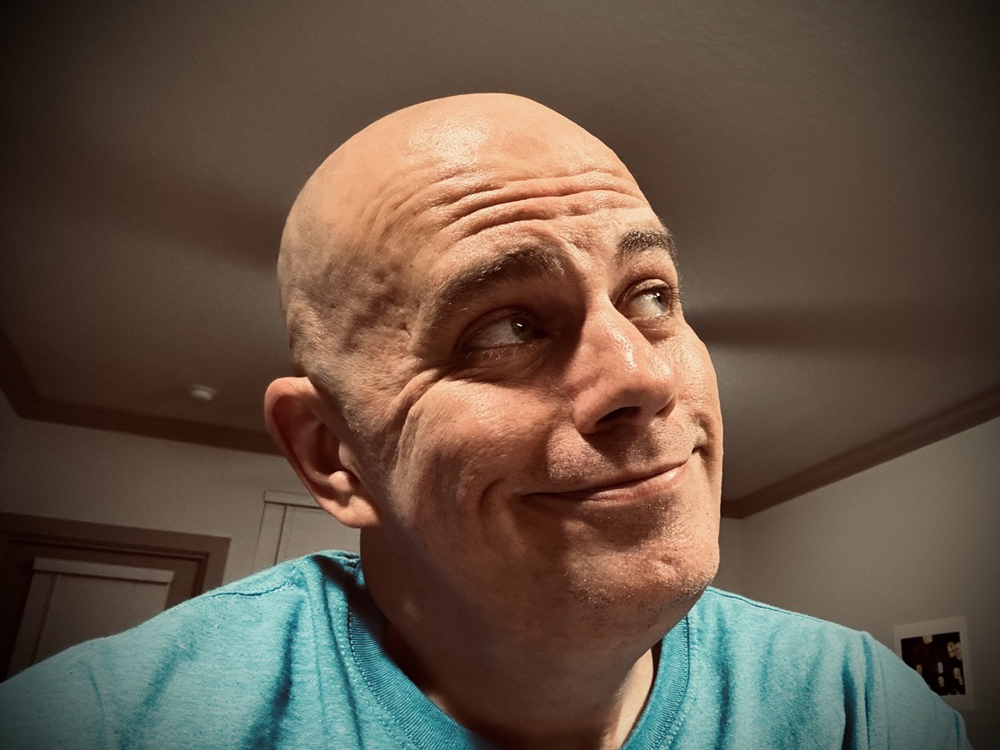

# TBD

## God's Temple (My Body)

Taking care of my body is an act of worship

With my new sleep schedule, I have been experimenting with my time management. One such experiment is in regards to my workout schedule. Whether it be my strength and core training or my walking or running routines, it is difficult to settle on a nice pattern in the Winter months in Florida.

Today, I did day 3 of my strength and core training. I achieve this workout Monday, Wednesday, and today, Friday. I've been doing it in the morning as I have managed to wake up by 5am every day this week. Today, I added some core exercises that also help with back pain caused by working a desk job. I have a standing desk. But that isn't enough to overcome years of back torture...hehehe

While I was doing this new core training, I got to thinking about how I was doing my workout during those first 3 hours of the day before work. Today marks 111 days I have started my day with God. Giving Him the first part of my day has been more than a game changer. It has been LIFE changing.

As I was working on my physical health, I realized I was taking care of God's temple. The body is considered a temple of the Holy Spirit. Therefore, taking care of my body is actually an act of worship. Doing a workout in those early hours of the are like continuing to give God the first fruits of my day. 1 Corinthians 6:19-20 states,

> Don’t you know that your body is a temple of the Holy Spirit who is in you, whom you have from God? You are not your own, for you were bought with a price. Therefore glorify God in your body and in your spirit, which are God’s.

Although that follows the context of sexual sin, I believe it also applies to exercise and diet. In 2005, I attempted to take my own life. I literally wanted to die at the age of 27. The years following that I didn't want to live into my 40s. As I entered my 40s, I no longer wanted to die. However, I felt like I was actually dying. In 2023, as I was going from 44 to 45 years of age, I started working on my physical health. The months that followed proved that I was in fact not dying! Now, well, I want to live until I'm 135 and beyond! Isn't God amazing?!? I'm going to continue to take good care of His temple, my body, until I'm at least 135. Just you wait and see!

## New Face

I have had either a VanDike, goatee with a mustache, or beard most of my adult life. When I first grew out my facial hair, it was out of laziness. Shaving every day, or every other day, was a chore. Who wants a chore that often?!? Truth is, there are always daily chores. But I had plenty in my life that shaving just wasn't a priority...hehehe So, laziness settled in pretty easily.

As I gain weight in my 20s, my beard became a way to hide my obesity. My neck and large cheeks were easy to hide behind hair. In my 30s, I even had a season when I allowed my head hair to grow to hide the fat bludge on the back of my neck. At least in my mind, my hair is what people's eyes were fixed on when they looked at my face and head.

With the extreme weight loss of 70 lbs over the last 12 months, I thought I'd give a fresh smooth shaven look a try. At first, I was like, WHOA! It was quite a shock. It had been so long since I had ever shaved my face completely. For a day or so, I wasn't sure I liked it and thought I'd immediately allow my pepper beard to grow back. This morning, however, I decided to continue to shave my face for the time being. So, I give you my new face!

