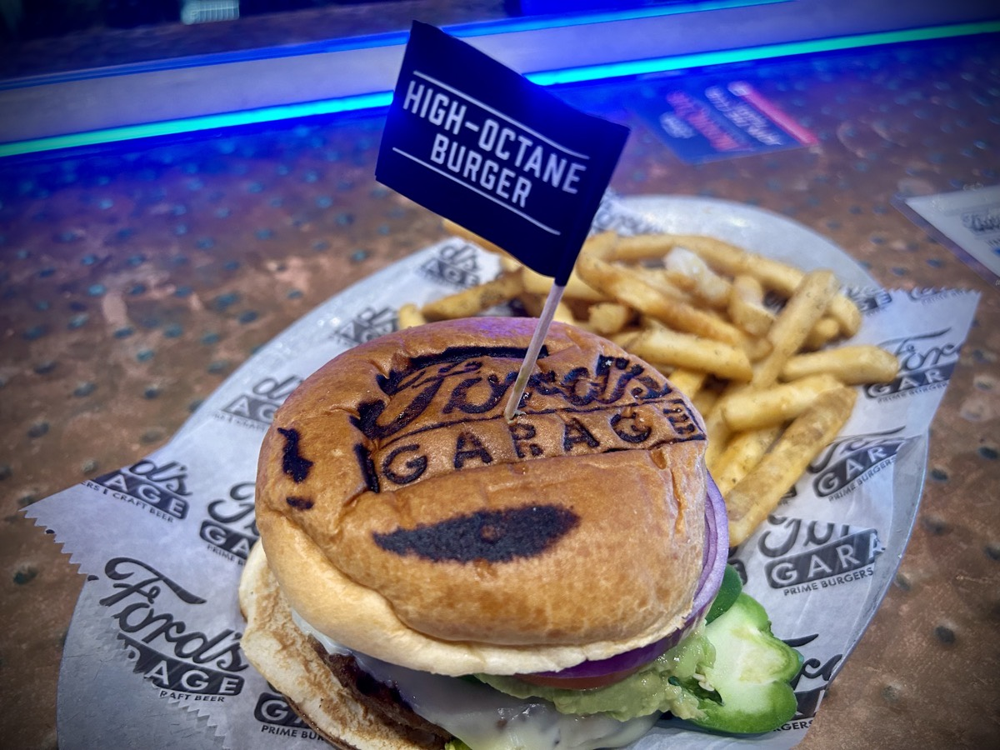
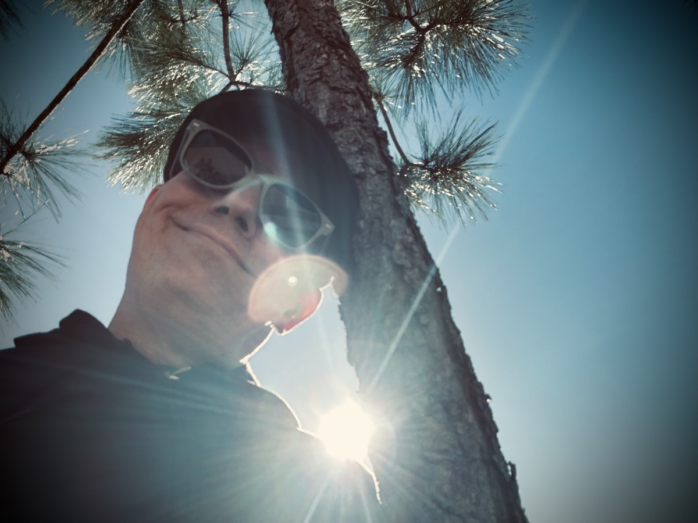

# Mostly Unplanned

## Arcadia’s Tears

As I alluded to a week ago, sleep has been a challenge and a struggle for most of my life. I suppose it had a lot to do with my anxiety. I would always be worried about something or someone. Even when I would sleep, I'd toss and turn all through the night thinking about whatever it was that was causing my anxiety. I was even on medication for this problem for a season. The medication was a controlled substance and actually had a street version. I never did seek out that street version, but for years I was never without that prescription! And as a controlled substance, it was highly addictive!

Although I was also seeking counseling for my anxiety, that medication was a welcome crutch at the time. The sad thing, the medical industry in the USA seems to have no issue prescribing medications for just about everything. This is usually in lieu of getting to the root of the problem. What I've chosen to do with medication is only rely on it to relieve the symptoms long enough to get right down to those roots. I never want to be dependant on medication. At one point with the aforementioned medication, I most certainly did not enjoy the fact that I was taking a controlled and highly addictive substance. The withdrawal I endured when I went off of it is nothing I would ever wish on my worst enemy! Talk about sleepless nights! The shaking, the scratching at my skin, the thought of wanting to open up my head and squish my brain! It was one of the most difficult challenges I have ever faced.

That was 14 years ago. And the crazy thing to me is now I sleep great. I still have anxiety. However, I deal with it in a health way now. I'll watch a funny movie. I'll take a long walk. I'll write poetry to express my emotions. Whatever it takes, I'll do something productive now. Last night, I wrote a poem to help me cope with the tragic loss of life this week in the small community of Arcadia, Florida. Although I did not know these people, my friend Dan very much knew them. The teenager was one of Dan's students. I mentioned this tragedy yesterday in my blog entry. When my friends and family hurt, I hurt. So I wrote that poem. As soon as I posted it on my Threads account, I fell right to sleep. No medication necessary! God has given me the gift of words. I'm grateful that I can express myself in these ways. Sometimes the words seem like nonsense to the average reader. But it means something to me. And it means something to someone else. I always hope it helps others. I may plant the seeds and water them, but God helps it grow. Here is that poem:

```
Arcadia's Tears

The eyes are all aglow
The words pour out as sweet wine
The heart yearns for better days 
The lips express the heart’s desire

A life is but a bittersweet presence
Here for but a moment
How much longer is the wait
Why can’t sweet relief be now

Sadness will not overcome
The night is for mourning
The morning is for celebration
The sun rises once more

Why struggle
Why fight
Find rest
Find peace
```


When I write such things, and when I write "Vitamin G," I'm just planting seeds. Expanding on any of it is just me watering those seeds. But it is God who actually makes everything grow. Today's verse of the day in the YouVersion Bible app comes from the following passage. The VotD was just verse 7, but here is 1 Corinthians 3:5-7,

> Who then is Apollos, and who is Paul, but servants through whom you believed, and each as the Lord gave to him? I planted. Apollos watered. But God gave the increase. So then neither he who plants is anything, nor he who waters, but God is who makes it grow.

I pray that all who read what God lays on my heart will grow from it. Even in the worst tragedies, or from the worst trauma we experience, God is good.

## Prayer Service

Today was the second Saturday prayer service for the 21 days of prayer and fasting. I actually do not have the words to truly express how amazing these prayer services are. It is never quite what I had expected going into them. And each one is quite different. The worship time was inspired. It never feels rehearsed. The guided prayer time is also inspired and does not seem premeditated in anyway. The personal prayer time is simply a time where I speak my prayers to myself while the band plays softly in the background. A lot of folks came to mind today and I prayed for them. Also, this week there were little cards with the name and photo of one of the children or staff at theChapel School in Haiti. theChapel is the name of my church, by the way. I brought one home to pray over a child every day for the foreseeable future. The child I'm praying for is Niknerson Etienne :pray:

Part of the prayer focus today included a bit of direction from 1 Thessalonian 3:10; which states,

> ...night and day praying exceedingly that we may see your face and may perfect that which is lacking in your faith?

The focus that comes from this short verse is to pray frequently, pray sincerely, and pray specifically. Here Paul and Timothy are praying night and day (frequently) that they may see the people of the church again (sincerely) and may perfect the faith in those believers (specifically). The best way to know how to pray is to look at such examples in the Bible of others praying. This blueprint for a prayer has encouraged me to do the same. I'll pray frequently, sincerely, and specifically!

Once again, the worship team sang "Battle Belongs" by Brian Johnson and Phil Wickham. And once again, I literally fell to my knees during the chorus when I sang "So when I fight, I'll fight on my knees...With my hands lifted high." That still amazes me so much. To have the physical strength and stamina to be able to just fall to my knees and then be able to get back up without a struggle whatsoever. I use to struggle to get up out of a chair, let alone the ground!

After the service, I decided I would give Rulu Coffee another try. This time, I went with one of their specialty drinks that was a cinnamon roll flavored latte and I got an actual cinnamon roll to go with it. Although I wasn't all that impressed last week, my second opinion was much better. It is definitely no Joffrey's Coffee like the stuff I brew at home. But I'm certainly glad I gave them a second try. As I mentioned last week, I can see myself working from this little coffee shop at the church during the week from time to time.

## Ford's Garage

As far as chain restaurants go, there are very few that I would call impressive enough to praise. Especially in my own personal journal. But I was incredibly impressed with Ford's Garage. At least the Wesley Chapel location here in Florida. The vibes were very much that of a vintage garage. All of the staff were wearing what looked like grease monkey cloths and even the bathrooms had sinks made out of old tires. There were 2 bar areas and each had an old vintage looking Ford car lifted up on what looked like those car lifts you'd see in a working garage. As the barkeep walked around one of the corners of the bar, they'd walk on one of those tubes that'd you see in the driveway that set of a bell to indicate a customer had arrived at the garage. The car over the bar I was sitting at even had a vintage sounding car horn the barkeep would cause to go off. And there was exhaust smoke they could trigger to come out the back of the old car. It was too cool!

One of the things I've known this place to be know for are their burgers! The reasons I even ventured into Ford's Garage today was because their menu includes a veggie burger patty as an option. When I asked them about the veggie burger, they mentioned that they could also make any of their other burgers with the veggie patty. So, I ordered their High-Octane burger that listed several spicy ingredients. When it came out, it looked just as good as any amazing burger I had ever had or made. This was a good sign. Lately, I've found that cutting the burger in half is my preferred way of eating burgers. This time was no different. Seeing the cut side profile of the burger gave me that confidence that it was not only indeed a veggie burger, but that it had the appearance it was house-made. It did not look like the inside of any of the veggie burgers like the Beyond Meat or Impossible Meat brands. Another good sign! And if that weren't enough, I quickly noticed that the jalapeño peppers on this High-Octane burger were freshly cut. Once again, a good sign! These weren't any "out of a can" jalapeños!

I was impressed with the quality and taste of the burger. I was especially impressed with the veggie patty. When I began my pescatarian diet journey, I had my doubts about these meatless alternatives. However, places like Ford's Garage are getting it right! The rest of the ingredients came together in expected ways. It was a great tasting burger. I'm sure it's beef counterpart is just as good for any carnivores who wish to go with the regular hamburger option. Also, an honorable mention goes to their fries. They are seasoned well and I did not need any sauces to dip them in. I'm a believer that if a fry is seasoned just right, it does not need anything else. Theirs fit that attribute really well.



## In the Groove Walk

Once I returned home after the day's adventures in prayer and food, I decided I would take a walk. It was a bit cold today. But I thought I'd still enjoy a nice stroll. I was listening to oldies music and couldn't help but dance. Just imagine, a middle aged man in a wool hat, sunglasses, and a jacket dancing while walking around a pond! And get this, the music was being played in earbuds! Only I could hear the music! I did not concern myself with what others were witnessing as I did this. I often find myself doing that while at the Disney and Universal theme parks as the music is playing over their speakers. So, why not do the same randomly on an afternoon walk!?

As I was doing this, I came across a few of my neighbors who were either walking themselves, walking their dogs, or riding their bike. Regardless of how I looked and what they may have been thinking, I continued to walk and dance to the music playing in my ears. A few of my neighbors stopped and talked with me for a bit. The ones who did were also walking their dogs. So I was able to pet 3 dogs today! Woohoo!!! I also officially met 2 of my neighbors I had not previously introduced myself to. I had seen them several times since I've lived here and even gave the occasional wave with a "hello!" But today, they were interested in talking to me.

Another neighbor I talked to is someone I was already on a first name basis with. He and his wife had observed my early days of walking when I began my health journey. When we finally met last year, they had encouraged me on my journey as they were watching my transformation unfold. Those 2 literally saw me dropping weight and gaining speed every single week for the past year. How cool is that! Seeing myself from their perspective was definitely a motivator on this journey! Also, their dog seems to love me. As I was walking today, I had encountered him 3 times. And each time, he was jumping and running with joy along my neighbor's side so he could get to me quicker. It was so adorable. It was so neat to see his excitement!



## I Love Today

I love days like today. With the exception of going to prayer service this morning, I had experienced the day unplanned. I just got in the car and drove. When I got home, I got out there and danced while walking. This is the sort of day I needed.

Unlike today, however, tomorrow has a bit of a surprised planned. If all goes well, I'll be writing about that tomorrow night!