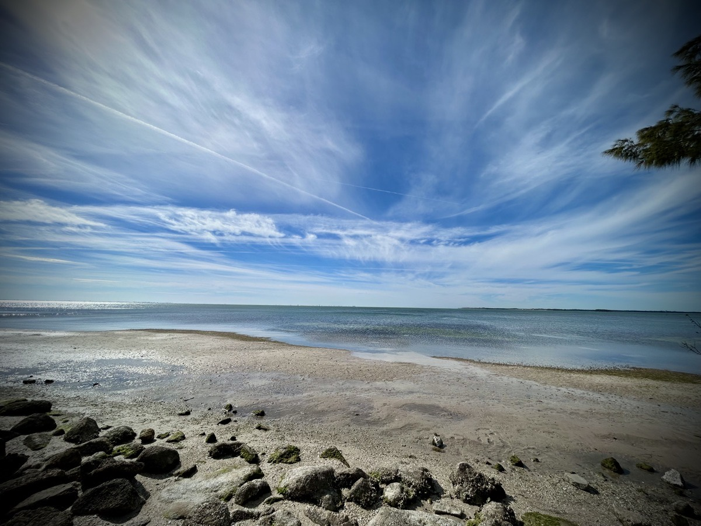
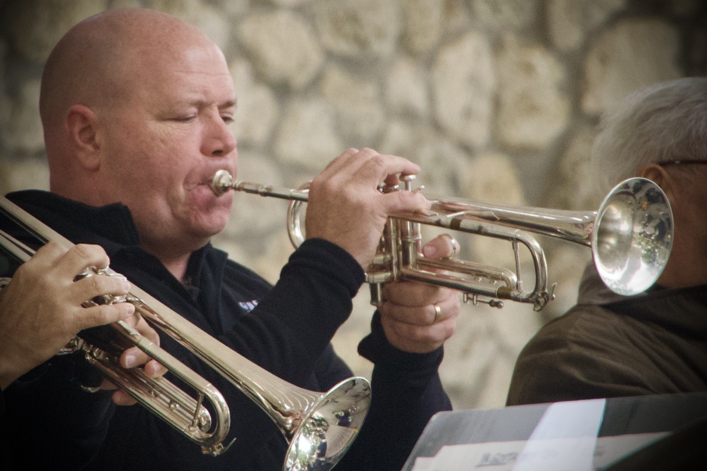

# I'm Here for You

## Best Self Forward

Over the course of this past year, I've been searching out who "Greg Marine" truly is. I've spent most of my adult life in a romantic relationship and often found myself truly lost in who I was on my own. When I'm in a relationship, I tend to absorb treats of the other person or sacrifice important parts of myself for the sake of the relationship. Although compromise is an important aspect of being in any relationship, whether it be romantic, simply a friendship, or being a parent, I'm learning that it is important not to lose myself in the process.

I've been observing couples this past year. One common observation I have made is that each person in the couple tended to have something negative to say about the other. They often complained about something specific they wished the other would stop doing or stop being. Also, in each case, it was something I was not observing myself. I could only see the good in the other person. With a few exceptions, I honestly could not see what negative trait each of them were talking about.

I got to thinking about what it was I would say about my partners over the years when I would talk about them to other people. I don't recall ever speaking ill of any of my romantic partners. Not even once. The negative stuff only surfaced in my speech after the relationship had met its demise. I suppose it was the "love is blind" part of my love for my partners. I wanted to see the best parts of them and therefore could only see that.

Here's the rub, as humans, we tend to put our best selves forward. When we are in public, we will most likely be on our very best behavior. That is often what parents teach there children, after all. It isn't until we are behind closed doors that our true selves will surface. I for one will put my guard down and allow myself to act however I please when I'm at home. Being on my best behavior when I'm out and about can be exhausting! So why not put on those comfortable clothes at home and and just be me?! Whoever it is that am...hehehe Since I'm assuming others do this as well, I'm guessing that what people say about their significant others' flaws are more about who they are at home than who they are in public.

Having observed this tendency, I realize my attitude about this is all sorts of wrong. Rather than being one person in public and "my true self" at home, I want be who I am regardless of where I am. So, if my true self isn't who I am in public, perhaps I need to reevaluate who I want to be! That way who I am behind closed doors is the same best self that I project myself to be as others see me. I'm not saying that I can't have flaws. But what I am saying is that if there is something I would never do in public, I probably shouldn't be doing it at home either. And there are some obvious exceptions to this...like sleeping on the couch if I want to...hehehe But if there is an actual behavior that I don't want to show, I need to drop it completely from my personality. I'm sure there will be more on this topic in the future as I continue to explore this further!

## Romance

On my walk yesterday, one of my neighbors was telling me how much of a nice guy he and his wife thought I was and that I needed to find a partner. He was one of the people who had been watching me do my workouts around the pond over the last year and that's how we got to talking last year. Anyway, he knows that I've had trouble in the past in the romance department. I think he and his wife really want to set me up with someone...hehehe

I politely declined the idea of being on the lookout for a partner. As I mentioned above, I'm trying to find myself. I'm trying to make sure I know who I am before I end up losing myself in a relationship again. My history shows trouble in this area. So for now, that is a boundary I'm keeping in place. That said, the conversation he and I had yesterday got me to thinking about who is my ideal partner?

I had actually given this quite a bit of thought last year. If I were to ever open the door to the possibility of being in a romantic relationship ever again, I wanted to be sure I had a list of traits that were deal breakers should a possible partner not have them. In contemplating this, I realized I hadn't thought of the list of traits I felt would make me an ideal partner! Any list I would make as an expectation for her would certainly need to be the same list I would want her to expect from me. After all, a romance is a two way street. Being unsure of who I was, I shelved this topic. That is, until my neighbor brought it up yesterday...hehehe

I'm definitely looking for a partner. Someone I can support and who will support me. Shared interests aren't that important because interests change over time. But being a cheerleader in each other's interests is a must! I also want to be someone who doesn't always have the answers but is someone who is willing to always help them find the answers. If all she needs is someone to hold her as she shares her pain, that is who I want to be. I don't want to be someone who will say, "Well, here is what I think you should do!" Sometimes, she just wants to say something and have someone listen. And, of course, vice versa. Yes, disagreements will happen. But I believe in respect and true partnership. It isn't about what I can get out of the relationship or even what I can put into it. I'm beginning to believe that relationships should be about supporting each other in this lifetime. No "ideal" person. No list of traits. No expectations. Just, "I'm here for you." God will take care of the rest!

This is by no means something I have given enough thought and prayer to. I have so much "baggage" to unload before I can be the "I'm here for you" partner. I don't want my past wounds to bleed on anyone else. I have to take care of the trauma before I can support anyone else. For now, I'm going to be the best friend I can be to anyone God places in my life. I can be the "I'm here for you" kind of friend with the boundary of "as your friend." Romance, should it ever come back into my life, will need to be in God's timing at this point. I'm still learning who I am as "Greg." I need to be an "I" or "me" before I can be an "us" or "we."

## Sinkholes

SUUUNDAAAY!!! My lead pastor, when he is the one preaching on a Sunday, comes out and shouts, "SUUUNDAAAY!!!" I absolutely LOVE that! It's my kind of vibe. This week, the lead pastor, Pastor Q, gave the sermon. This was the second week of "Sinkholes." This week's topic, "Envy!" That's right! One of the most difficult emotions I have had in my life. From a Biblical perspective, it is basically when I see what someone else has that I don't and I villianize them for it. I begin to begrudge them for what they have that I don't. It isn't that I actually want what they have. I just hate them for having it! This is a general summation of the issue. But I think it is pretty accurate to what I've experienced in my own heart over the years.

I'm not sure I've ever spoken to my brother about this, but I use to envy him. He had the wife, the children, the house, and the job. The "White picket fence" sort of life I thought ever man should have. And it wasn't because I didn't have it. It was simply that I thought he was doing all the "right" things in life. In my heart, I almost hated him for it. There was actually a time when I avoided seeing him and his family. That season has even recently been brought up in my discussion with my parents. I always reassure my parents that the issue was mine and my brother had done nothing wrong. If he or they are reading this right now, this brief paragraph is about that time in our family's life...hehehe

A few of the obvious stories about envy found in the Bible are that of Cain & Abel, Joseph & his brothers, and Saul & David. If you aren't familiar with any of those stories, reach out to me. I'll be happy to go into detail. But like Cain felt about his brother Abel, and Joseph's brothers felt about him, and Saul felt about David, I had the kind of "hate" in my heart that pretty much killed my brother in my heart. I've since resolved the envy I had. But it was a great reminder today about how such an emotion can cause the erosion that will bring about a sinkhole.

I will never be my brother. Even if I did exactly what he did to build the life he has, I cannot possible be him. Moreover, if I tried to be my brother, I would never be what God created me to be. As I was stating above, I've been trying to figure out who I am as myself. Part of that process is understanding who God made me. I really can't do that if I'm comparing myself to other people. I also can't really do that if I'm concerning myself with what other people are doing. They are living their life and I should be living mine. On "judgement day," I'm not going to be compared to other people. God isn't going to say, "Why didn't you build the life your brother had?" He isn't actually going to judge me at all considering Jesus died on the cross for my sins. But He is more likely to question me about what I did with the resources He gave me in my lifetime than He would about the resources He gave to someone else, right!?

To avoid the sinkholes caused by envy, I really need to let all of that stuff go. I have the life I've been given. I have Blessings, and I have trouble. But it is my life. No one else's. There were times when I hated my life and myself. There were times when I absolutely loved my life, yet still didn't love myself. Right now, I love both my life and myself. There isn't any room for envy anymore. And I'm looking forward to what God is showing me in this season!

## Drive Part 1

After church, I began a 3 hour road trip. I was very much looking forward to this drive! Yesterday, I had mentioned there was a surprise planned for today. My best friend, Dan, was going to be playing a gig in the beautiful city of Naples, Florida. After moving down to Florida a few years ago, he started getting his name out there to follow his passion of playing trumpet. Oddly enough, in all the years I've known him, I had never heard him play! As he began to play gigs here in Florida, I really wanted to find the opportunity to see him play. Today presented itself as the perfect of such opportunities.

I had reached out to his wife to see if she and their son were planning to be there today. They weren't able to be there. But I did mentioned I was planning to surprise Dan by showing up. I'm glad I had reached out to her. She recommended I take a chair as the park they were playing in had a stage without seating. It was an open area. Good to know! I looked at the route between this park in Naples and my church and discovered I was going to be able to make it down with time to spare if I left right after church.

The drive down was just lovely. I mean, truly a blessed day to be driving down Florida's gulf coast. Just before reaching Tampa Bay's Skyway bridge, I stopped off at the rest area to use the restroom. I had already been on the road for an hour with 2 hours to go. I really needed to take that pit stop! And I'm glad I did. The view from that area is amazing. I've never actually stopped there. In all the times I've crossed over the bay, I never once stopped to see what the bay looks like from the causeway.

This was my first visit to Naples. Anytime I'm traveling to a new place, my biggest anxiety is about where to park. When I arrived in Naples, my anxiety peaked! So I prayed...I prayed that God would take me right where He wanted me to park. That may seem like a silly little prayer. But I cannot possibly describe the anxiety I have with parking. So this was a big prayer for me. As I entered 5th Avenue, where the GPS directions told me the park was located, I drove down the street for a bit. I figured I might make a few passes around the park to evaluate the parking situation. There was a free parking garage nearby. So my anxiety went down a little. Just before I got to the end of 5th Ave., someone was pulling out of a parking spot! WOW! God provided the perfect timing for a parking spot! And it was within a few hundred feet of where the concert was taking place! I immediately thanked God for providing and then asked Him to remind me of this exact moment anytime I may doubt Him in the future!

## The Gulf Coast Big Band

I really didn't know what to expect today. I hadn't even really noticed the name of the band Dan was playing in today. He is a part of a few different groups now. I just knew when and where his gig was today. I also knew this was going to be my first experience with Naples, Florida. I had only previous driven near Naples on I-75 on my way from the Florida Keys to Fort Myers in December 2020. With this being my first time hearing Dan and also first time being in Naples, I figured it was going to be a great day regardless of anything else.

The name of the group is The Gulf Coast Big Band. The "big band" part of the name was an awesome clue as to the sort of music I was going to hear today. I absolutely love big band and jazz music. I often listen to it as a "radio station" with my Apple Music account. I even once digitally remastered a big band live recording for a late friend of mine back in the late 90s of a band he was in "back in the day." I'm in literal tears thinking about how moving today's experience was for me!!!

I've known Dan for well over a decade now and I had never heard him play. WOW! This dude is ALSOME!!! Yes, I spelled that word exactly as it is suppose to be...it's how we spell that word between us...a story for another day. He had a few solos today and it was beautiful! As he describes playing the trumpet, imagine singing at the highest octave you can possible sing and then go one octave higher! As a singer myself, I knew exactly what he meant. The dude is incredible. On top of that, the entire group is amazing.

The concert was free. It was held at a public park and anyone was welcome to enjoy the music. Just before intermission, they talked about a scholarship program they do to help students begin a life in music. During intermission, they took up a collection to help fund this scholarship program. They also have other expenses that go along with their performances, such as renting out venues. However, none of the band members are paid. They are all volunteers who love to share their passions and talents with the community. That is something well worth supporting!

You can find out more about this group on [their website](https://www.gulfcoastbigband.com/)

## Drive Part 2

The drive home was gorgeous. I didn't take any pictures as I did not stop. But it was a beautiful time. I listened to worship and praise music most of the trip home. Traffic was pretty good. I find it difficult to describe Florida drives. It could be that I spent most of my life in the midwest. But there is just something special about driving around Florida. Especially on a Sunday. It has a calming peace about it. Between the sky and the greenery throughout the Florida landscape, Florida is a beautiful place to just drive.

## I Love Today

I made it a priority to write tonight. I had written the section "Best Self Forward" this morning before church. But the rest was after I got home tonight. This just felt like a day I needed to journal before the day's end. Partly because I want to write each day during this 21 days of fasting and prayer. But mostly because it was another day I absolutely loved!

Just liked yesterday, I love today. It was overall a fantastic weekend. Mostly unplanned and completely God inspired.