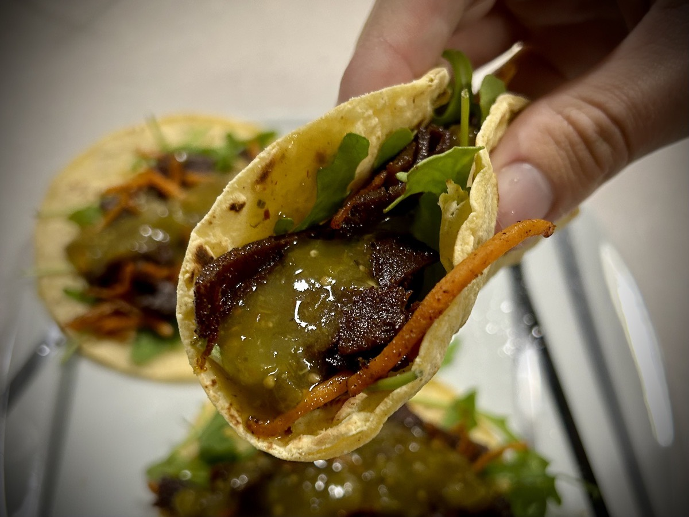

# A Time to Every Season

## Verse of the Day

Today's VotD in the YouVersion Bible app is the prayer that I have literally started each day with for the past 115 days. It's the Lord's prayer from Matthew 6:9-13. It was 115 days ago when Pastor Q challenged me, in his sermon, to seek God first every day. He posted on the church website his simple daily routine that he starts with. I have no idea if he does it every single day. But the first thing listed was the Lord's prayer. So, each day before I do anything else, I recite Matthew 6:9-13 verbatim. I follow that up with saying the same in essence, but in my own words. I claim the Lord's prayer as my own. His is a blueprint by which all my prayers should begin, right?

Having this as the VotD was an excellent reminder that Jesus made it easy to know how to pray. And throughout scripture, He shows me what I should pray about. My time in God's Word these past few weeks has truly been an eye opener. My mind's eye, that is. My heart's eye. My soul! From an intellectual perspective, I have always known this as I grew up in the Faith. However, I have not truly understood what all of this means until this season of my life.

## Small Sustainable Changes

I'm starting to get questions about "how" I lost so much weight over the past year. I always start off my answer with "small sustainable changes." In the past, anytime I wanted to make a change in my life, I dove in head first and all in. The results always ended the same way. I burned out quickly and found myself bouncing back to my old ways.

In the case of weight loss, I've done this before. In 2017 & 2018, I dropped about 80 lbs in 3 months. The sounds insane, but it happened. I went on a keto diet and burned through fat quickly. But I went all in and ended up not only burning fat, I burned out my spirit. It wasn't long before I gave up on the process and gained most of that weight back.

This time around, I simply made small sustainable changes over time. And I gave each change about 3 weeks to set in. If something wasn't working or sustainable within that 3 weeks, I'd try something else for the next 3 weeks. Those small sustainable changes became new solid habits. And those good habits have now formed in a changed lifestyle.

This was a slow process. But that's kind of the point. It's a process. There isn't a "get rich quick" scheme to anything that actually works for me. In fact, trying to find the quickest way to anything, for me, is just plain lazy...hehehe Anything worth doing truly does take me time. The price can be steep, but the returns are immeasurably greater.

I'm grateful God gave me the strength to do this process. If it weren't for Him, I would not have gotten anything to work out right. This has been the single hardest year of my life. It is difficult to see how that could be when you look at me. I've always got a smile on my face and warm hug in my arms. Plus my weight loss makes my whole body look so much better than it was a year ago. But it all came with battles no one could see. That's where God comes in. In all of those battles, He went before me. He had already won all of those battles!

## A Bit Off

I've been a bit off today. I'm not feeling all that well physically. I'm exhausted. I am also starting to feel it spiritually. I've been so hyper focused on my physical and spiritual health that I have neglected my mental health a little. I'm wearing myself out. Not burning myself out, though. It is more about how I just need to stop and rest.

When I am not giving myself the right amount of rest, my body, soul, and mind has a way of just shutting down and making me rest...hehehe I could clearly feel it on Sunday. When I stopped near the ocean, I had one of the most peaceful moments. I took that photo, then went on my way. My heart was telling me that I needed that moment. Once I arrived in Naples, I sat and enjoyed some of the best live music I've experienced in quite a while. But then I "just had to" write about the whole experience when I got home.

Although I do not regret writing that night, I do feel like my body and mind were already telling me I needed to rest. These past few days have been rough. Surprisingly, I've been very productive at work. I'm just ready to shut off my body, my soul, and my mind. Just for a short while. As a part of this process, I've already started to decline opportunities I would have otherwise said yes to. I do feel guilty I've had to say no. But that comes from my people pleasing personality. The reality is, I can't keep going without rest.

## Taco Tuesday

Well, it's another Taco Tuesday to celebrate! I really do love celebrating Tuesdays...hehehe This week, I went with a plant-based steak alternative. I sautéed the "steak" with carrots in ghee that I seasoned with garlic, paprika, chili powder, and cumin. That was a delicious combination! I laid all of that on a bed of arugula in yellow corn tortillas and topped it all with salsa verde. I thought they were incredible.

## Finish Line

There are 4 days remaining in this year's 21 days of prayer and fasting. The proverbial finish line is on the horizon! As it was last year, I truly believe this has been a life changing experience. Although I'm exhausted, I have enough in me to finish the race God put before me and will still have enough physical, spiritual, and mental strength to celebrate as I cross that finish line. I know this because my strength comes from God!