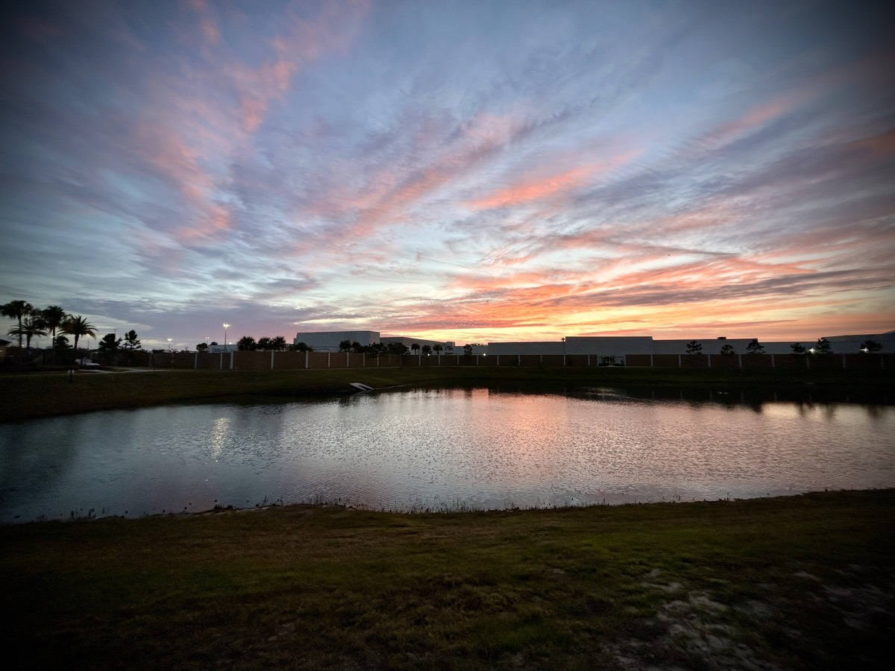

# So Far So Good

## "My Grace is sufficient"

I cannot count how many times I've prayed for some sort of relief. Whether it be from an injury or the mental pain that came from past abuse, it seems like I'm always asking God to take something out of my life. Although there isn't anything fundamentally wrong with asking for such, I am finding that my attitude has an impact on how I ask. My problem has never been with the asking. The problem has always about why I'm asking.

I'm going to go ahead and admit it! I am a weak man. I'm physically weak. I'm spiritually weak. I'm mentally weak. I have always had trouble lifting objects no one else seems to have trouble lifting. Over the course of nearly 46 years, I can count on my hands how many times I've actually trusted God. And let's just say, the majority of my Vitamin G sayings come from my struggles with mental health!

Anytime someone sees strength in me, what they are actually seeing is God's Grace. I mean this quite literally and not in some sort of spiritual or religious perspective. That is how God's Power has worked in my own life. Where I am weak, He is strong. I cannot say it any simpler. Just as Paul states in 2 Corinthians 12:9,

> He has said to me, “My Grace is sufficient for you, for My Power is made perfect in weakness.” Most gladly therefore I will rather glory in my weaknesses, that the Power of Christ may rest on me.

...I too have experienced this. Although Christ did not audibly state this directly to me, the passage has always shown up just when I have needed it. I'm going through this right now. I have weaknesses I'm begging God to take away from me. I have afflictions I am just too tired to bear any longer. At least as a man. Yet, God hasn't removed them from my life. Why, oh why?!? Because His Grace is sufficient for me.

Do you know what is greater than my afflictions? Namely, there are at least 2 things great. The first is my sin. If you take all of my problems and sum them up, most of them can be directly linked to the sin in my life. And that is where the second comes in. His Grace is also greater! It covers over a multitude of sins and provides the actually relief I need from my afflictions.

I'll give a "for instance." I have terrible social anxiety. You can't really tell when I'm out and about just by looking at my face. But inside my head, I'm screaming. On occasion, this manifests itself on the outside when you might see me rubbing an object or tapping on something rapidly. It doesn't look to the average person that anything is wrong. Yet, deep inside me, I just want to fly away. And it is far worse than this simple explanation.

But here is the thing, my social anxiety will be completely gone when I get to Heaven! No matter how long I live on Earth, I know that when I enter into His Heavenly Kingdom, I will never feel this social anxiety ever again. I find comfort in that while I'm here in His Kingdom on Earth. That doesn't mean the anxiety goes away. It is just something I can bear. So, like Paul in 2 Corinthians 12:10,

> Therefore I take pleasure in weaknesses, in injuries, in necessities, in persecutions, and in distresses, for Christ’s sake. For when I am weak, then am I strong.

...I'll take pleasure in my weaknesses. Not for my sake. But for His. It is definitely a tough attitude to maintain. So I'm learning to ask God for His strength instead of asking for relief from the affliction. I imagine this will always be a struggle. But only a struggle here on Earth. And compared to eternity, my time here is extremely short!

## Rest

Yesterday I lamented on how exhausted I was feeling this week. I ended up finishing my writing around 7:30pm. I couldn't go straight to bed because that is a tad early even for my new schedule. But I still ended up in bed early and fought myself not to go to sleep too quickly. I didn't want to wake at like 3am, after all. I ended up falling asleep around 9pm, fortunately. I began to wake up around 5am. But I decided not to get up. I knew that my body and mind needed the rest more than I needed to keep a strict schedule. So I slept about 45 minutes more. I really needed the rest I received last night!

I felt quite a bit better today. I am still not operating at 100%. However, I had a productive day that included a lunchtime walk in the sun of about 2 miles. I achieved a sleep goal, all of my fitness goals, and my dietary goals for the day. I even hit all of my goals for work today. And if that weren't enough, I also worked my prayer and Bible reading/study goals in. So I'd say it was a successful day. And now I'm finishing today's blog entry. Rest is always a good idea!

## Book

I'm very excited to return to active development of my book next week. With it having been almost a year since writer's block set in, I feel relieved that the project hasn't failed. Of course, I'm talking about my first book. I'm already thinking about a few other possible projects to follow! How exciting is that!?!

I still need to settle in on a title for the book. As I've previously mentioned, the original title was "My First Year as a Bald Man" and then I changed it to "Vitamin G." However, as I also mentioned, there is already a book by the "Vitamin G" title out there. I believe it is about gratitude. So the title makes sense.

I often wonder if people think the "G" in my version of Vitamin G is from my first name. I imagine most people presume it is from my first name. And quite honestly, that makes the most sense at first glance. Especially since I've had a few nicknames over the years that had the "G" based on my first name. I was reminded today that I once went by Bogey G, a name related to my playing Disc Golf; aka Frisbee Golf or Frolf.

I suppose "Vitamin G" might have started as an extension of my first name. However, I actually attribute it to God. Vitamin G is unequivocally Vitamin God. Although the messages are always written in a general way, they are all inspired by what God has taught me through my own struggles and trauma. I really do not feel called to reveal the source of the "G" to the general public for now. I'm not actually hiding it. In fact, I'm writing about it right here...hehehe But I do feel we are living in a world that will immediately dismiss a book by its cover.

The idea that people "judge a book by its cover" is evidenced by all of the people in the world who reject the Bible without knowing what it actually says. I suppose that is partly due to the fact that so many so called Christians show the world a bad image of God. But those are just false witnesses or false prophets. So rather than broadcast this as a faith-based endeavor, I allow the words to speak for themselves. I hold true to what Jesus told me in John 13:34-35; which states,

> A new commandment I give to you, that you love one another. Just as I have loved you, you also love one another. By this everyone will know that you are my disciples, if you have love for one another.

There is no judgement in any of the Vitamin G I write about. In all of it, I speak love. I do so because love needs to win. I didn't receive any of the wisdom, inspiration, and motivation in judgement. All of it was received in love from my Father in Heaven. So, I'm writing Vitamin G in book form in such a way that it relates to all people. Then, as an aside, I'll also be releasing a devotional Bible study that will relate to each chapter. That way, anyone can go deeper should they wish to or if God calls them to do so.

## Shorts

I ordered some new shorts today. Just before my trip to Indiana last month, I purchased new jeans. I hadn't worn jeans in about 9 months. With my extreme weight loss, I needed some new jeans for the winter and for the temps in Indiana. Now that it is beginning to warm up in Florida again, I realized I needed new shorts now as well!

I already knew this was coming. I was already noticing my shorts didn't fit anymore last year. I kept tightening the belt more and more all year. In fact, I finally ordered new belts too because I found myself folding over the extra length of the belts I had in the belt loop of my shorts! And I have lost a little more weight since December.

I haven't been this small in about 24 years. At one time, I had a size 38-40 waist. Now I'm back down to 32. When I first tried on my new jeans, I honestly thought they might be too small. Yet they slipped right on with room to spare! They are actually size 33. I did that just in case. Turns out 32 is my new size after all! So, that's the size I ordered for my shorts. I'm starting with just 2 for now. If I like them, I'll order more!

## Day's End

I'm looking forward to sleeping tonight. Although I slept well and long last night, I still feel as though I have need for more rest even tonight. It still amazes me that I've been writing every day for the past 18 days. I would have liked to have written a journal every day last year for the 21 days of prayer and fasting. It would be nice to look back upon the experience with a "microscope" of sorts that comes from reading about the experience as written while going through it. That is why I decided to give it a try this year. So far so good!