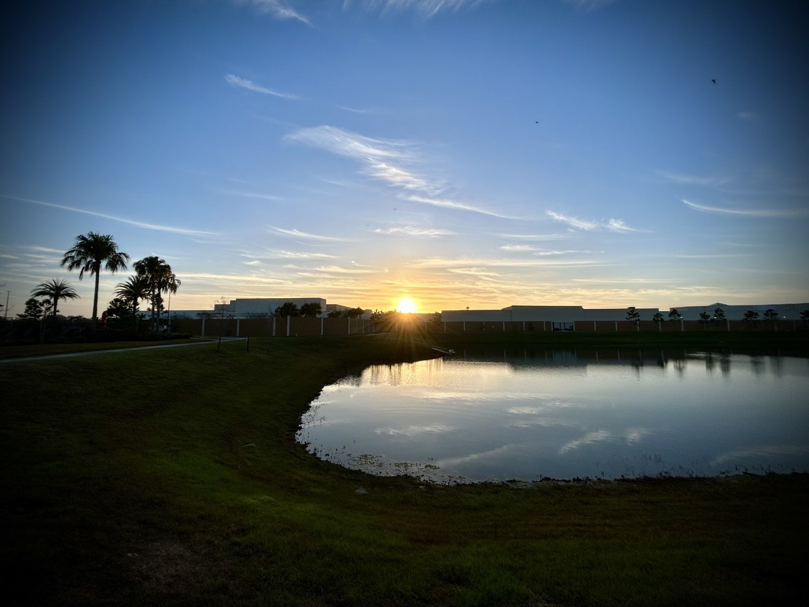
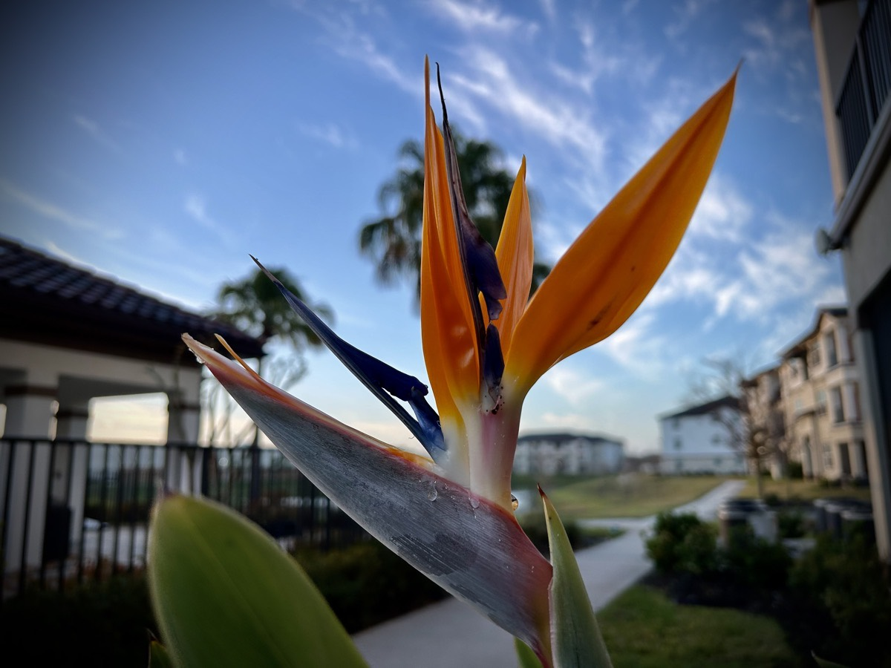

# Interruptions in Paradise

## Attitude of Gratitude

Believe it or not, I use to be a pessimist. I use to think that whatever could go wrong would go wrong. No matter how hard I might try to make something work out, it was like subconsciously I would derail my own life. There were always outside forces at work to make matters worse. And it seemed as though I would steer into them deliberately. I couldn't be happy with anything and I honestly believed I did not deserve anything good in my life.

That's a depressing thought, isn't it? "I did not deserve anything good in my life." You might say I was a cross between the Eeyore character in Milne's original stories and the Eeyore adaptation from Disney. I was a depressed and pessimistic old grey donkey that still had compassion for others around me. I was willing to allow other people to use me because I did not believe I was good for anything else in life.

This was my internal struggle until the events of 2020. When I saw the world falling apart, there was a part of me that felt like, "well, the rest of the world is like me now!" That's when my mind flipped like a switch. I could probably write an entire book on how things changed for me in 2020. But to sum it up, I had a huge attitude adjustment. As I compared myself to the world's reactions to those events, I realized that I no longer wanted to be so pessimistic about my own life. Just like the world, I deserve better than what my thought life was doing to me.

As people were losing loved ones, jobs, homes, and their lifestyles, I took inventory of my own life. I lost loved ones, my job, and eventually my home, family, and lifestyle between 2020 and 2021. I had actually been through all of this before! Many times, in fact. Yet, every single time, my life had been restored. This led to a revelation of sorts in my thought life. All of the therapy I had received over the years and the encouragements in the scriptures came flooding back into my mind.

You might say, I changed from having a gloomy outlook on life to having an attitude of gratitude. I started to look at what I did have instead of what I didn't. This was something completely new for me. Years of self doubt, self harm, and self detriment were suddenly being stripped away from my thoughts and actions. I stopped self sabotaging my life and realized I was actually a pretty cool guy with a great life.

I say the "cool guy" part with a sense of humility. This revelation came with it an overwhelming understanding that my life was not just my own. It was God's and a life worth sharing with others. Sharing my struggles and how I am overcoming them has become a passion that is burning in me like a wild fire. When I start to look at all of the wonderful things I actually do have in my life, I know it has truly been a wonderful life. It could have been a lot better, sure. But it could have been a lot worse also. Having an attitude of gratitude keeps me focused on what is truly important and helps me ignore what isn't.

## 5K

I ran an exercise 5K today. Boy was it tough! Due mostly to the weather, I haven't taken a run as much as I'd prefer to lately. I'm looking forward to more consistent running weather. Since I haven't been consistent yet this year, I had to walk part of it to recover my heart rate a bit. That's just me being smart about my exercise. I probably could push a little harder. But I'm listening to my body and giving it about 85%. It isn't like I'm training for a race. And I'm not running with anyone else at the moment. So my pace is all up to me!

It did feel great to be out in the warmth running again, though. Also, the first part of the run was when I was listening to today's session of my "Bible in a Year" plan. The rest of the run, I had praise and worship music playing. It was a very uplifting time with God. Both my body and my soul were refreshed with this run.

## Trauma

Some of my past trauma resurfaced today. It is always rough facing the past when this happens. I'm not really ready to write about it yet. And I'm not really sure I'm ready to talk about it either. I hope that I do get to a point where I can talk about certain things soon. Part of what came up today was from the time period I refer to as the dark period of my life.

Perhaps I'll write it all down privately so I can digest it a bit. Then I may seek some counseling over it. I've actually already gone through counseling. But since those memories still surface today, I feel like I have not quite dealt with it all. Fortunately, it did not stop me in my tracks today. It was just a replay that I did not want to see today.

## Back on Track?

These last few days, I have been sticking to my sleep schedule really well. I'd love to say I'm back on track. But tonight, I have a late conference call for work. It shouldn't last too long. But it is well after my bedtime...hehehe So I might be sleeping in a little tomorrow.

As I have eluded to before, how I have been sleeping these past few years has been a blessing. For nights like tonight, I'm not too concerned about getting a full night's sleep. The only reason I bring it up is the fact I was struggling with physical, spiritual, and mental exhaustion just a few days ago. I pray that tonight does not disrupt me too much for tomorrow. Fingers crossed!

