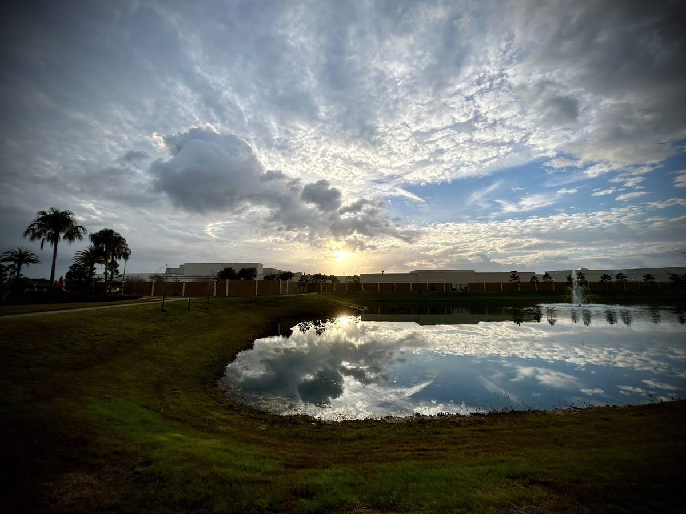
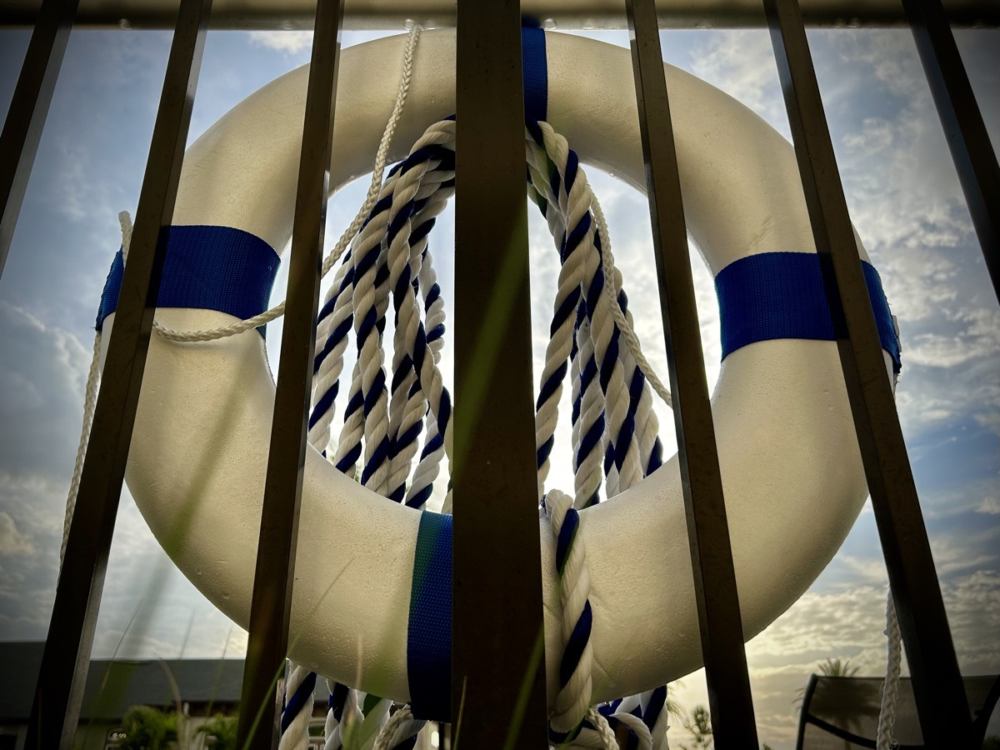
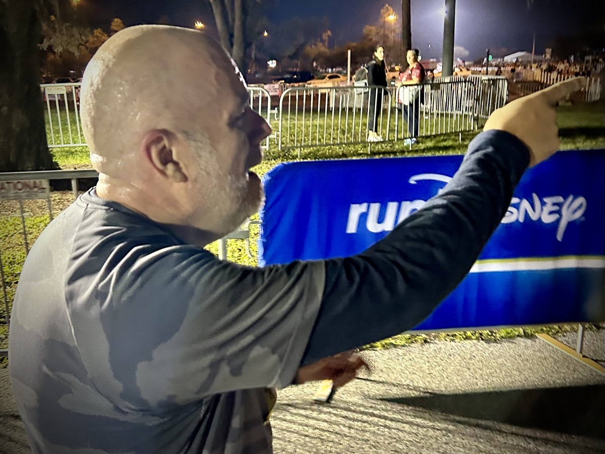

# Oh Look, The Finish Line

I have **a lot** to talk about today...So hold on to your seats! But, you'll only need the edge of that seat. Lean in!!!

## Getting to Know Me

As I have previously stated, one of my goals for 2023 was to learn who "Greg" is. I had spent so many years being a part of a relationship that I did not actually know who I was. I was always getting lost in the relationship. Again, compromise is important. Giving up who I was, was not the right choice. Nevertheless, I have been in a state of discovery for at least a year now.

One of the many ways I attempted to find out who I am was to pretty much say yes to anything. And by anything, I actually mean any new experiences. I cannot count how many new experiences I had in the past year. There were so many, in fact, that towards the final quarter of the year, I finally began saying no to things. I recall even stating a few times that I was exhausted from all of the new experiences I had throughout the year. Luckily, most of my family and friends understood and had compassion when I would say no to certain things at the end of the year.

During my run yesterday, a new revelation struck me. Those experiences did not truly help me see who *I* was. It simply showed me who my friends were in the shared experiences. I hadn't actually taken the time to spend time alone asking myself questions to get to know me.

One thing I mostly do alone is walk and run. On my many walks and runs, I spend quite a bit of time either praying to God about what's on my mind or simply listening to what He might have to say to me. During yesterday's 5K run, I received a very important message. He told me,

> The more you get to knowing and understanding Me, the more you get to knowing and understanding Greg.

God was telling me, the more I know about God, the more I get to know about "Greg." What an amazing message to hear! My Creator knows me better than anyone else. Who else better to tell me about myself?!? If I continue to listen to the voices of my past, I would think I'm the worst person to have existed. If I listen to God's voice, and the ones He sends to speak to me, I hear about a person who is adored.

A good friend of mine recently said, "Just remember, it's you who people admire and adore." If that wasn't God speaking through them, I don't know who it was! I literally have never been told people admired or adored me. Now, I imagine there are those who always have. But to finally hear those words meant the world to me. Followed up by, "Know God, know Greg" really brings me to my knees in happy tears!

## Spiritual Problems - Spiritual Solutions

One of the concepts I've recently adopted, and believe I may have already talked about, is the fact that God has gone before me in my struggles. He has already won the battles I'm currently fighting. In today's session of the 21 days of praying and fasting, Pastor Jason talks about how spiritual problems require spiritual solutions. And the Word of God is our greatest tool. When we speak the Word of God, we can fight our battles through Christ. In Ephesians 6:12, we're told,

> For our wrestling is not against flesh and blood, but against the principalities, against the powers, against the world’s rulers of the darkness of this age, and against the spiritual forces of wickedness in the heavenly places.

The battles I am facing today aren't of this world. Yes, I have earthly issues I must attend to. But they really aren't the issue. As my brother in Christ, Kerry, reminded me last night, the exhaustion I was facing earlier this week was most likely a spiritual attack. Especially on the day when I was reminded of past trauma that I hadn't thought about in years!

Although I still wasn't able to talk about the details, we did talk about how there were reruns in my mind that I am just so tired of see play over and over in my mind. He reminded me that last week I was so excited about what God was teaching me during this 21 days of prayer and fasting. But now he was observing a change in my demeanor.

Kerry was noticing that I wasn't my chipper self this week. In talking about what I was facing, he immediately recognized it as a spiritual attack. After we talked, and he had prayed over me, a new sense of rest and peace came over me. And today's further scripture reading for the 21 days of prayer and fasting rung true. James 5:13-18 reads,

> Is any among you suffering? Let him pray. Is any cheerful? Let him sing praises. Is any among you sick? Let him call for the elders of the assembly, and let them pray over him, anointing him with oil in the name of the Lord; and the prayer of faith will heal him who is sick, and the Lord will raise him up. If he has committed sins, he will be forgiven. Confess your sins to one another and pray for one another, that you may be healed. The insistent prayer of a righteous person is powerfully effective. Elijah was a man with a nature like ours, and he prayed earnestly that it might not rain, and it didn’t rain on the earth for three years and six months. He prayed again, and the sky gave rain, and the earth produced its fruit.

I'm grateful for my friend and brother in Christ, Kerry. I'm so glad God has been bringing us together to meet on a regular basis. Our friendship has been a real blessing over the past year. Together, we are fighting spiritual problems with spiritual solutions!

## Respect vs. Trust

I've written about how I have trouble trusting people. Due to past trauma, trust is something I have a deep difficulty with. And I'm not referring to the kind of trust like who I welcome into my home or who I might be relying on for a ride to and from an event. I'm talking about the sort of trust where I can share the details of what I struggle with. I am not too shy about sharing that I have struggles. But I never talk about what actually happened. Most of what I say is quite surface level...

Something I've learned over the years is that everyone deserves my respect. But not everyone deserves my trust. Part of the reason I even have trauma to deal with is the fact that I trusted someone and they abused that trust. One of the best lessons my dad taught me at an early age was that people needed to earn his trust. I completely ignored that advice for most of my life up until about 2021.

Simply stated, trust is something that needs to be earned. Respect is something that is given. Respecting others says more about who I am than it does about who they are. I can respect anyone without actually trusting them. Respect is about having regard for their feelings, rights, or traditions. Whereas, trust says more about who they are than it does about who I am. Trust is about whether or not they are reliable or true to who they say they are.

If I am trust worthy, I will respect them. If they are trust worthy, they will respect me. Over time, we will both earn each others trust. If they show me any sort of disrespect, then it is most likely that cannot to be trusted. And likewise, if I disrespect them in anyway, they really shouldn't be trusting me. This being the case within our relationship at the very least.

On my end of this, I must pray and put my trust in God. Only then will He show me who He has provided in my life whom I can trust. With this mindset and state of soul, I will someday be able to go beyond the surface and truly begin to heal from my past through the help of God's chosen.

## Complicated Simplification

Without going into too much detail in why I believe this, I truly believe that software engineers are some of the laziest people I know. Oh, and yes, I'm a software engineer! We will do anything we can to automate our way out of doing any task. That is quite the common experience I have had in the industry over the past nearly 3 decades. That's right! Decades!

Although the above statement has been mostly true in my years in software, I did have 1 boss that wasn't like this. He always felt that if it only took a little bit of time, why take the time to try to program ourselves out of doing the task. At the time, I wasn't sure I agreed with him. I always thought that if I was doing the task multiple times, those times would eventually add up and quantify the need to automate it.

Fast forward to today. Literally today! I had a conversation in which I pushed back on the idea of being what I would refer to as a lazy programer. I imagine they wouldn't think of it as lazy. But I was being challenged to find an existing and reusable solution as opposed to creating my own. The reason I pushed back was because my use case did not warrant the overhead of trying to fit someone else's solution into my simple task.

This brought about an idea I may explore more for my industry. Simply put, in an effort to simplify, do not over complicate! Something that was taking me a few hours of work would have cost me days of work had I gone with a ready made solution like they were suggesting. I know this because on another project I'm working on, I took their direction and have been using prebuilt components and trying to fit them all together like a LEGO set or puzzle pieces. I have been working on that project for well over a year with no end in sight. However, the new project I'm working on at the moment, where I pushed back on this concept, I know I'll be completed with it in a month or two.

Again, I say, "In an effort to simplify, do not over complicate!"

## Shhh!

My friend Chérie put me on to something today. When I face extreme anxiety and I need to stop and breathe heavily, I can exhale with a pronounced "shhh" sound. It achieves a few things. Firstly, it is like telling my soul to "shhh!" Or be quiet! Secondly, when I exhale with that sound, my mind can focus on the sound. Centering my mind on this sound means I'm not thinking about anything else. I'm especially not thinking about whatever it was causing my anxiety.

I needed this today. As I eluded to above, this week has been full of spiritual attack. And one very human circumstance occurred today that caused me enough anxiety that I had to put this new technique to work. The human circumstance was likely being influenced in the spiritual realm. Later on, I had another instance where I almost felt like I needed this. But it resolved itself before I needed to "shhh!!!"

I appreciate my friend for sharing this technique! I was surprised I needed it on the same day she shared it...hehehe

## Today's Best

I'm not really a competitive person. Even when I use to play sports, I never really concerned myself with winning or losing. I recall this one time I was playing in a Disc Golf tournament for the Amateur division of the Pro Disc Golf Association (PDGA). In each round, the player with the lowest score on their groups card would be awarded a prize and would be given a higher level group to play with in the next round. I had scored not only the best on my group's card, I had also shot the best round of Disc Golf I had ever played. I was super excited, received the award, and played with a set of much better players in the next round. I never played as well as I did that round ever again...LOL

You know what, I didn't care. I was having a blast! My attitude was such that all I really wanted to do was have fun. Once I stopped having fun, that is when I finally gave up playing in those tournaments. I apply the same attitude today when I run. It was only a year ago that I began my health journey. And less than a year since I've been running. And to think of it, it has been about 3 months since I ran in that runDisney event back in November.

I never want an attitude where I have to be the best at anything. Not that trying to be the best is a bad thing. I'm simply saying that I don't need to be the best. My ego and level of pride probably wouldn't want to go down that road. Although I'm not competitive, I am still human. So I don't ever want to grow my ego! I try to just do my own personal best.

That said, I also realize that always chasing after my own personal best can grow my ego and pride. Today, I wanted to run my personal best 5K time. Yesterday, I ran one in just over 37 minutes. My personal best is 35 minutes. That was just over 2 weeks ago. I wasn't really trying to hit a best yesterday and was only off the pace by 2 minutes. So, I figured, today is the day I can crack that 35 minute barrier!

Today, I ran a 5K in 39 minutes. Not only was I 2 minutes slower than yesterday, I was now 4 minutes slower than 2 weeks ago! Ugh, right!?! To say I struggled today is an understatement. I mean, I *really* struggled today. So, it was actually no surprise I ran today's in 39 minutes. But guess what? I thought I was on pace for over 40 minutes. Coming in under what I was expecting as I was running is a blessing!

This got me to thinking about what that 39 minutes really means to me. First off, it is still about 7-8 minutes faster than my time in November at the runDisney event. The fact I'm running faster than that event barely 3 months later is still quite the accomplishment. Also, I ran 5K yesterday. **YESTERDAY**!. This is the first time I've run a 5K two days in a row. Again, quite the accomplishment considering where I was only a year ago. And the conditions surrounding today's run were not only different than the one 2 weeks ago, but quite different than yesterday's.

There are a great number of factors to consider that make an impact on the results. Weather, the food I've eaten that day, the amount and type of sleep I had the night before, and what stressors I face in my day are only a few of the factors which make a significant impact on how my run will go. And the same is true with just about any tasks I take on! No matter what I'm facing, I need to remember that there are so many other things influencing the outcomes of my circumstances. Some I can control and some I cannot.

To circle back around to being the best; or not being. I do not need to be *the* best at anything I'm doing. I just need to do *my* best. Furthermore, it just needs to be my best for *today*. It never needs to be my best over all.

## Fasting...Ending

Well, it's day 20 of the 21 days of prayer and fasting. And just like I felt after hitting the 3 mile marker at my runDisney 5K event, I can see the finish line!!! I'll be writing another entry tomorrow to complete the 3 week journey. But I'll be taking a short break from writing in this blog. My goal for this 3 weeks was to write every day. But I don't plan to write *every* day here after that. I need to be able to focus on writing other types of content. I have books and poems to write. There is so much ready to leap out of my mind and through my fingers!!!

I had so much to write tonight, in fact. And there were actually 2 sections I removed. One I had written most of but didn't feel it quite fit in this entry. And the other I didn't even bother writing. Both are topics to be expressed in their own feature length blog entries as opposed to being a subsection of today's. And that's what still amazes me about these past 3 weeks. I have written more in these weeks than I have ever done in all the years prior **combined**! And there is *so* much more to write than I've written in these 3 weeks. WOW!!! I can't wait!

