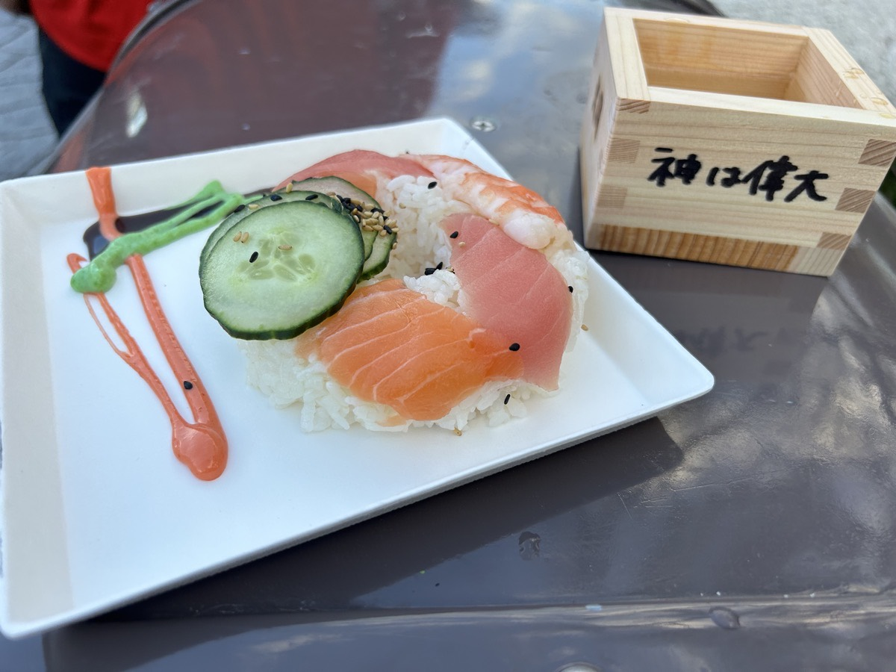
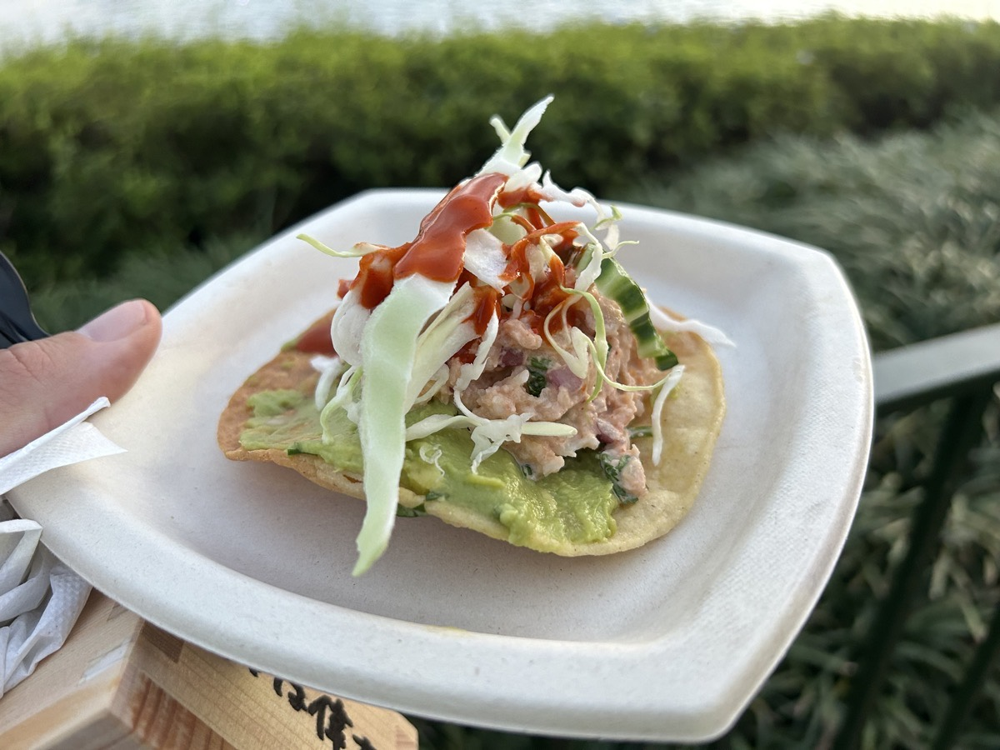

# Only the Beginning

## The Finish Line

I made it! 21 days! Woohoo! This morning, I crossed the finish line!!! I won't talk much about the actual experience this has been. But that's because that is all I have been doing for 3 weeks...hehehe

What I will say is that I'm different now. And I'm going to embrace this different person God has been working on me to become. Pastor Q gave us a passage to help us know how to stay different. It is one that came up earlier in this experience when God told me to share it with a few people who needed encouragement. It is only fitting that it be the one to take me across the finish line of this experience and propel me into the next. After all, this is **only the beginning**! The passage is Isaiah 40:31,

> ...but those who wait for the Lord will renew their strength. They will mount up with wings like eagles. They will run, and not be weary. They will walk, and not faint.

## End of Fasting

Today was a day to celebrate. So I have ended my fasting. But here is what that means. I have decided to completely give up candy. I'll still enjoy the occasional treat; especially if it is offered to me by a loved one. I will also continue to enjoy non-candy treats such as pastries. But I tossed out all of the remaining candy I had at home. I'm done with it. My sweet tooth is gone! Candy will no longer be a regular part of my diet. I will not be using it as a "reward" for being good with my exercise and diet. I'll have to find something else for that.

Secondly, I haven't yet turned on my TV to watch any shows or movies. I'm not in any hurry to do so. If I need to relax sometime, I may turn it on for a bit. But I don't plan to make it a regular part of my routine ever again. For example, I'm not going to go back to watching TV to go to sleep. My mind is now trained to go to sleep when my head hits the pillow. I don't mean that literally. But it really doesn't take long to fall asleep now.

That brings me to seafood. I had previously mentioned that I really missed it. I had been craving it in the middle of this experience. Well, after I posted I was really missing it about 5 days ago, I stopped craving it so much. I was actually tempted to leave seafood out of my diet indefinitely. Well, today, I decided to have some fish, shrimp, and lobster. And it felt pretty good to enjoy them as a celebration of making it through.

## EPCOT International Festival of the Arts

Where I had this seafood was at EPCOT. Before prayer service this morning, my sister texted to see if I was available to hangout today. I confirmed I was and told her I would meet up with her after the service. So I dropped by her house after. We discussed what we might do and eventually landed on the idea to pop on over to EPCOT to check out this year's Festival of the Arts.

One of the main focuses we had for the day was to enjoy some of the culinary art through the food they have for the festival. Among other things, I went for the sushi doughnut and Tostada de Langosta to get in some seafood. The sushi had salmon, tuna, and shrimp. The tostada had lobster. Yum!

Since this isn't a review of the food at the festival, I'm not going to go into the rest of what I had. But here are some photos of the first seafood I enjoyed to celebrate ending my fast...hehehe

The sake cup says "God is great" in Japanese. You can't see it in the photo, but the other side of the cup says "Greg."

This was a bit spicy. And I loved it! I may try to make this at home.

## It is finished

Well, this year's 21 days of prayer and fasting experience is now finished. I'm glad I wrote a journal entry each day for it this year. It will be nice to go back and read all of these entries as I go throughout the year. As I mentioned above, I'm different now. I want to stay different. And I want to embrace the difference!

