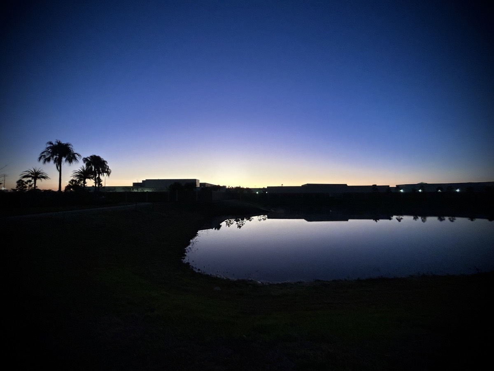
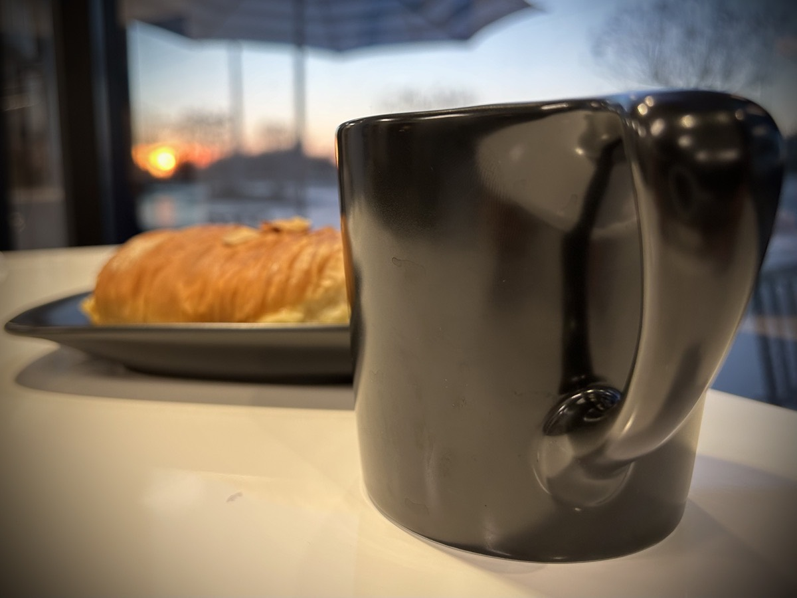
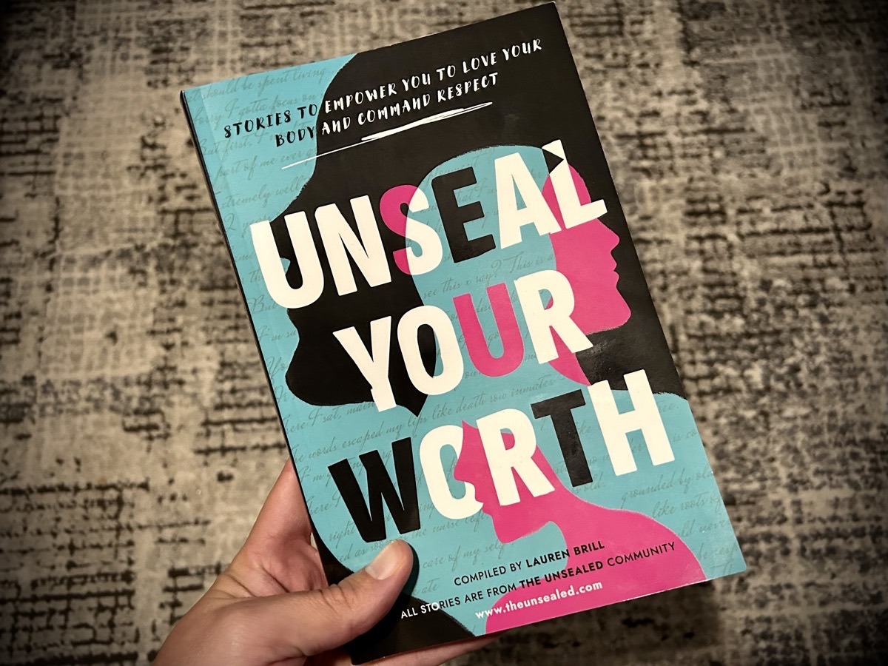
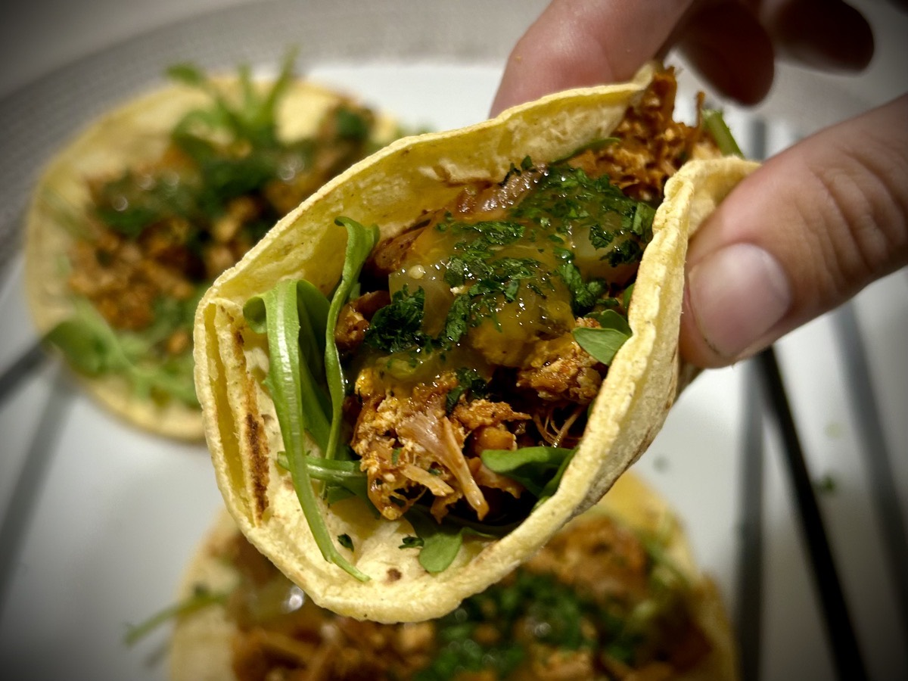

# So, I bought a book...

## Rise and Shine

I had some interesting dreams last night. In one dream, I encountered Kevin Max. He was going through a hard time and just needed someone to listen. In another dream, I was navigating an office building with an old friend of mine. At one point, we ended up separated and I tried to call him.

I often wonder what my dreams mean. Today, I woke with an overwhelming desire to go to Rulu Coffee at my church. So, after my morning time with God, I packed up my work laptop and headed to church! Before leaving, though, I noticed how beautiful the sky was. It wasn't quite sunrise yet, but the glow of the impending rise of the sun was gorgeous!

I arrived at church before the sun began to show. After getting a cup of coffee and an almond croissant, I sat down just in time for the sun to begin peering in the horizon of the field across the street. The timing of everything was just perfect for these moments to happen.

Aside from this beautiful view of the sunrise today, I did make a bit of a mistake. Before I went to Rulu for coffee, I had my usual coffee at home. I then followed up my regular Rulu coffee with an iced latte I could sip on while I worked. So I had 3 styles of coffee today. After a few hours, I was truly feeling awful. Way too much caffeine! It wasn't until the late afternoon before I came down from that. And it felt more like a crash into the evening...hehehe

## Succeeding through Failure

I really wanted to give up today. I wanted to take off half the day so I could lay down and sleep off the ill feeling I was experiencing. And there wouldn't have been anything wrong with that. Sometimes the body is just saying that it needs to rest. I also began to question whether I was hearing God tell me to go to Rulu to work for a bit or if it was just me being crazy.

I pushed through knowing I had done this to myself, albeit by accident. I also realized it really was God encouraging me to go to work for a bit at Rulu. After all, that beautiful sunrise is something I'm going to remember for a while! Oh, and someone recognized me today! I am still not sure, but I think it might have been the drummer who played in the worship band this past weekend.

If I recall correctly, his name was Bobby. He approached me to see if I "was the guy in the front row on the right side of [the worship center]." After a quick review of where I sit, I agreed that I must be the guy...hehehe He encouraged me by telling me he loved the energy I exude in my worship. He didn't use those exact words. But it was something like that...hehehe

It makes me think about how just a year ago, I didn't have the energy to dance as much as I do now. I worship with so much energy now that my Apple Watch records it as exercise automatically...LOL And apparently I worship in a way that others notice! So, I figure if other people can see how much I love God, God Himself must see it! And considering I sing to an audience of One, thee ONE, that makes my heart happy.

Also, I managed to have one of my most productive days at work in quite some time! The time at Rulu propelled me through a piece of the project that allowed me to continue being productive at home even though I wasn't feeling well. Woohoo!!! I'm so glad I didn't take a half a day off. And now I feel fine. It really was just the caffeine.

## Unseal Your Worth

Last year, my friend Chérie mentioned she was going to be in a book. It was a part of a larger project being compiled by a group of writers she was in. Last week, she sent me a video with the caption of "Hehe do you know this person? 🤭" The video starts zoomed in on the cover of a book and then zooms out and pans down to the list of authors. It then zoomed back in and shows her name! Yay!!! I just had to buy a copy!!!

The project is compiled by Lauren Brill and includes writings from [The Unsealed Community](https://theunsealed.com/). Chérie's poem is very relating and inspiring. And I'm looking forward to reading the rest of the book. I may put down my other in progress books and just read this one all the way through. I'm even considering joining this community. I'll explore it a bit and see if it looks like a community I belong in.

In the meantime, you can check out [Chérie's page](https://theunsealed.com/members/cherthing/) to read her contributions to the community.

## Taco Tuesday!

For this week's Taco Tuesday "celebration," I made Chili Lime Jackfruit and Tofu Tacos 😋 The jackfruit and tofu are resting on a bed of arugula and topped with salsa verde and cilantro. Per usual, they are all snuggled up with yellow corn tortillas.

## Good night!

I'm happy to be writing tonight. I took the last few days off from writing since I had written so much in 3 weeks. I really needed a break. But I can honestly say I really missed it! The compromise tonight is that I wrote...but didn't write as much as I was writing previously in a single day...LOL So, good night!