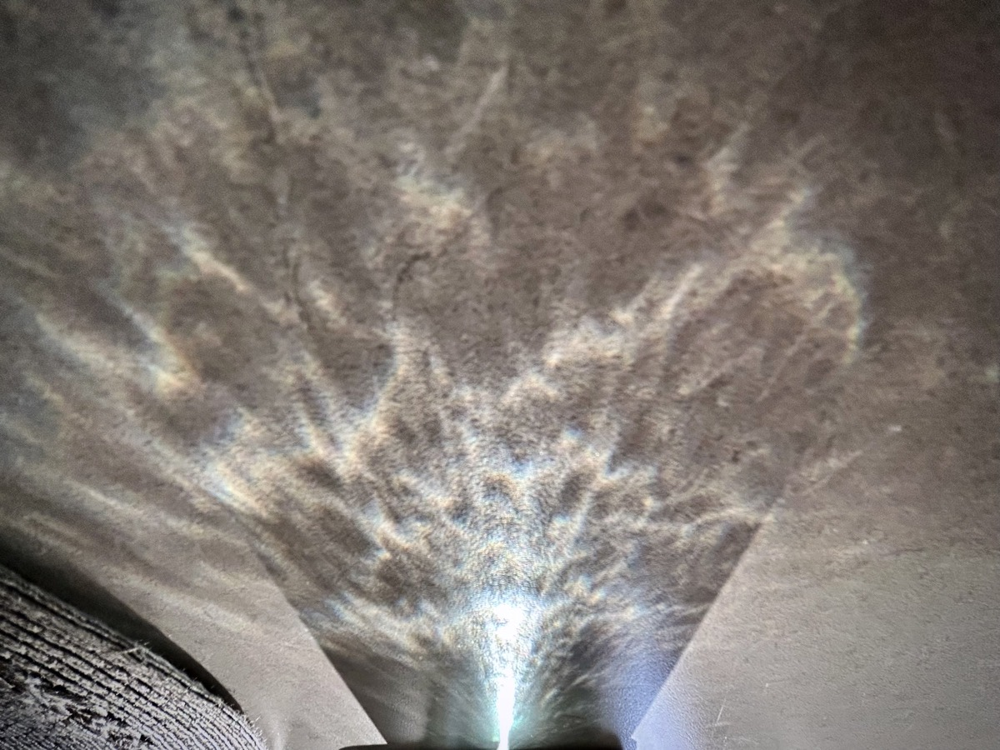
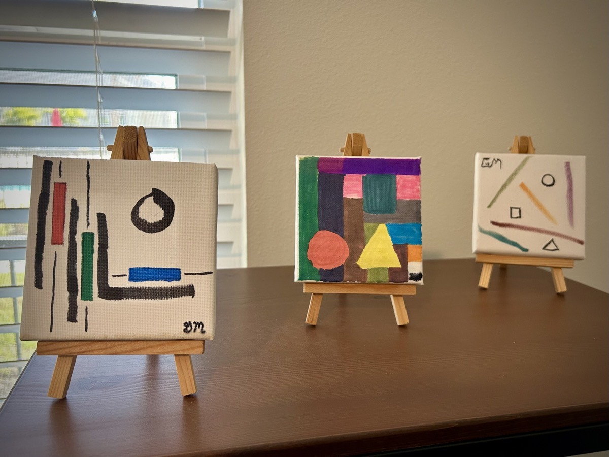
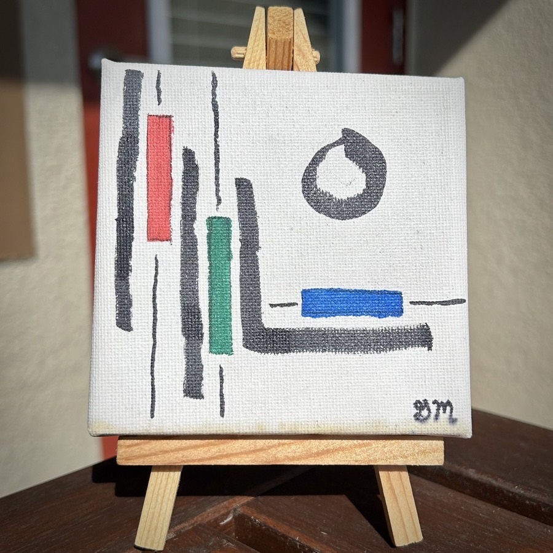

# TBD

## Who am I, Who are You?

People only know what I show them about myself. I put up certain boundaries for people. And as they earn passage beyond each boundary, they get to know a little more about who I am.

When I was a child, my parents knew me quite well. In those early years, I didn't have boundaries. I was too young to even know what a boundary was. And people like my parents had never given me any reason not to trust them. So, I'm sure my parents likely even knew what I was thinking all the time.

As I grew, that changed. Whether it was through their reactions, or my not always agreeing with people, I eventually learned to establish some walls around parts of myself. The trick then became knowing who I should and shouldn't allow passed each wall. Whom should I give a key to the door and whom should I say, "You shall not pass!"

When I got married in 2001, I decided to allow my then wife through all of the barriers I had built over the 23 years prior. That makes sense, right? Why else would you marry someone if you didn't fully trust them? It hadn't dawned on me that she might have built her own boundaries that I too needed to earn me way through.

At the end of that marriage, after she had seen all of me and rejected me, I got right back to tending to the maintenance of those walls I had been neglecting during the 9 years of marriage. All of the insecurities I had about myself were now exposed, they were fully realized through the eyes of another.

It has now been just beyond 14 years since the events that led me to stop showing anyone all of myself. The closest anyone gets to see the real me is through my writing. And even then, I'm only expressing surface level thoughts. There are some writings that go way deeper. But they are often phrased in such a way that only I and God know the true meaning behind the words.

Boundaries can be a good thing. They protect me and they protect others. Not everyone has earned my trust. And not everyone will. This goes both ways, as well. I only want access to the parts of someone they are comfortable sharing with me. And I want to be at a level of wisdom and maturity to handle those parts.

As it was with my first marriage, I wasn't ready for the innermost parts of her heart anymore than she was ready for mine. I don't truly or actually know anyone outside of what they show me. And until I am ready to accept what is on the other side of that door, I don't want to know someone. It isn't about whether or not I'll like what I see. It is more about whether or not I can be trusted with it.

I am finding it to be an important step in my growth to come to this realization as I approach my 46 birthday. I'm getting to know God more. And therefore, I'm getting to know myself more. Who am I? I am God's. Who are you? You are God's. The closer each of us is to God, the closer we can become to each other. 1 + 1 = 3...You, Christ, and Me!

## February Paintings

About each month, I switch out which mini paintings I have on display on the top shelf of my display. It has been quite a while since I last painted one for myself. So, it seems that around every 6 months or so, I end up cycled through my small collection. This month, I'm back to some of my earliest works from my 2021 renascence. As rudimentary as they may appear on the surface, they actually have quite the deep substance underneath.

### Ensō RGB (2021/11/01)

An [ensō](https://en.wikipedia.org/wiki/Ens%25C5%258D) is a Zen-based artist's expression of painting a circle form in a single brushstroke which signifies the mind is free to allow the body to create. During those early days, I would often paint an ensō to give myself permission to be authentic self. Being the technology enthusiast that I am, along with being an expressionist, I wanted to convey what I saw every day into a single painting.

Although it is a bit more complicated than this, all colors in the spectrum can be represented by 3 basic colors; red, green, and blue. Since the early days of color television, this has been the general case. I'm not going to dive deep into the other colors that go into this concept. However, for this painting, these 3 express my intentions.

When I look at this work, what I see is myself being given permission to fully create in my mind everything I have ever seen, what I am seeing in that moment, and everything I will ever see going forward. On a single 4 inch by 4 inch canvas, I can see my entire world without space or time.

Selah :pray:

### Only the Beginning (2021/10/02)

