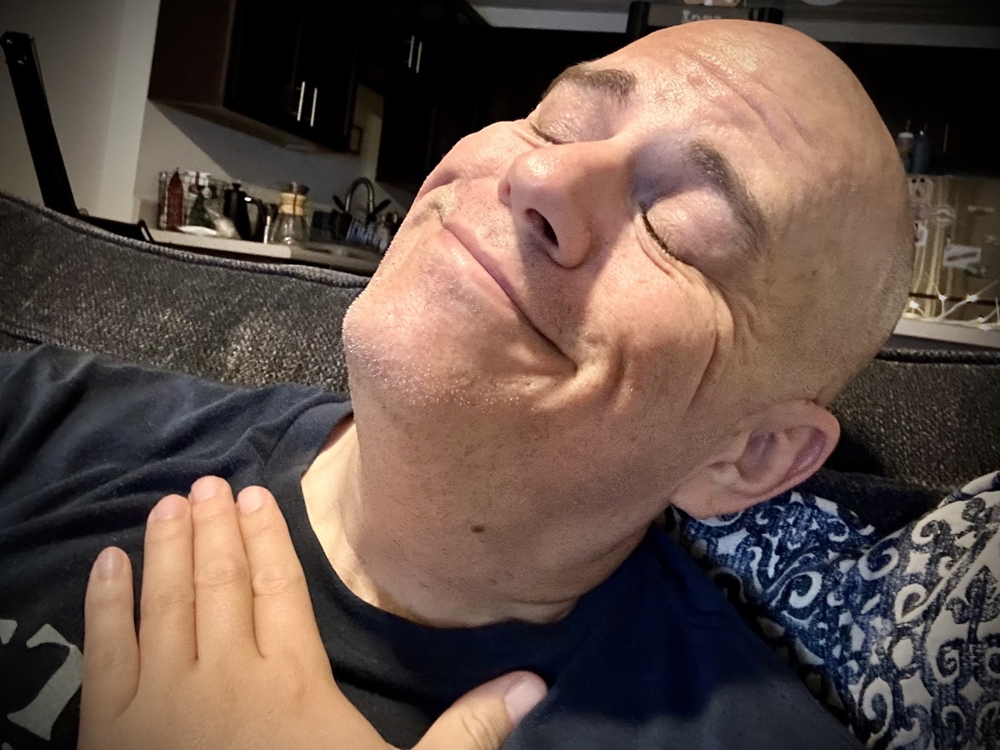

# Ensō

## Who am I, Who are You?

People only know what I show them about myself. I put up certain boundaries for people. And as they earn passage beyond each boundary, they get to know a little more about who I am.

When I was a child, my parents knew me quite well. In those early years, I didn't have boundaries. I was too young to even know what a boundary was. And people like my parents had never given me any reason not to trust them. So, I'm sure my parents likely even knew what I was thinking all the time.

As I grew, that changed. Whether it was through their reactions, or my not always agreeing with people, I eventually learned to establish some walls around parts of myself. The trick then became knowing who I should and shouldn't allow passed each wall. Whom should I give a key to the door and whom should I say, "You shall not pass!"

When I got married in 2001, I decided to allow my then wife through all of the barriers I had built over the 23 years prior. That makes sense, right? Why else would you marry someone if you didn't fully trust them?

At the end of that marriage, after she had seen all of me and rejected me, I got right back to tending to the maintenance of those walls I had been neglecting during the 9 years of marriage. All of the insecurities I had about myself were now exposed, they were fully realized through the eyes of another.

It has now been just beyond 14 years since the events that led me to stop showing anyone all of myself. The closest anyone gets to see the real me is through my writing. And even then, I'm only expressing surface level thoughts. There are some writings that go way deeper. But they are often phrased in such a way that only I and God know the true meaning behind the words.

Boundaries can be a good thing. They protect me and they protect others. Not everyone has earned my trust. And not everyone will. This goes both ways, as well. I only want access to the parts of someone they are comfortable sharing with me. And I want to be at a level of wisdom and maturity to handle those parts.

In the case of my first marriage, I wasn't ready for the innermost parts of her heart anymore than she was ready for mine. I don't truly or actually know anyone outside of what they show me. And until I am ready to accept what is on the other side of that door, I don't want to know someone. It isn't about whether or not I'll like what I see. It is more about whether or not I can be trusted with it.

I am finding it to be an important step in my growth to come to this realization as I approach my 46 birthday. I'm getting to know God more. And therefore, I'm getting to know myself more. Who am I? I am God's. Who are you? You are God's. The closer each of us are to God, the closer we can become to each other. 1 + 1 = 3...You, Christ, and Me!

## February Paintings

About each month, I switch out which mini paintings I have on display on the top shelf of my display. It has been quite a while since I last painted one for myself. So, it seems that around every 6 months or so, I end up cycled through my small collection. This month, I'm back to some of my earliest works from my 2021 renascence. As rudimentary as they may appear on the surface, they actually have quite the deep substance underneath.

### Ensō RGB (2021/11/01)

An [ensō](https://en.wikipedia.org/wiki/Ens%25C5%258D) is a Zen-based artist's expression of painting a circle form in a single brushstroke which signifies the mind is free to allow the body to create. During those early days, I would often paint an ensō to give myself permission to be my authentic self. Being the technology enthusiast that I am, along with being an expressionist, I wanted to convey what I saw every day into a single painting.

Although it is a bit more complicated than this, all colors in the spectrum can be represented by 3 basic colors; red, green, and blue. Since the early days of color television, this has been the general case. I'm not going to dive deep into the other colors that go into this concept. However, for this painting, these 3 express my intentions.

When I look at this work, what I see is myself being given permission to fully create in my mind everything I have ever seen, what I am seeing in that moment, and everything I will ever see going forward. On a single 4 inch by 4 inch canvas, I can see my entire world without space or time.

Selah :pray:

### Only the Beginning (2021/10/02)

At a very young age, we learn basic shapes, lines, and curves. All of the building blocks that make up creativity. It's an easy way to understand what it takes to eventual create a masterpiece. This is a far cry from a masterpiece. Even as I painted it, I knew I could do so much better. But that was sort of the point of this piece.

It connected me back to when I was a child. Those early developmental years were when my creative mind began to form. On my most recent trip back to Indiana, I was drawn to the old art my parents still had on the walls in their home. I walked my son through some of the work I had done as a child. It was great to remanence on when the spark of creativity ignited to the flame that still burns today.

Creating this primitive piece was a solemn reminder that everything begins somewhere. Although I was 43 when I painted this, being that it was my rebirth into painting, I am proud to display this in my home from time to time.

### Dreams (2021/10/08)

Coming off the idea of returning to my roots of art, I took the idea into the realm of the somewhat uncontrollable. My dreams are often quite basic and completely disconnected from my reality.

I also often dream in muted colors. They are still vivid. But nothing really shines brightly. When I do dream in black and white, those dreams are closer to my reality.

In this piece, the only lines that connect are the ones in a single shape in black. The colors never intersect with anything. Yet everything is connected to the white canvas.

As of late, I have been dreaming so much more than usual. And these latest dreams are both color and closely tied to my reality. A few are so closely connected to my real world that I acted upon them recently.

In each case, my dream and my actions in response affected someone else in my life. Both I and the other person were blessed by God in some way during our interaction. I never imagined when I painted this piece that a few years later its meaning would be realized.

## Unseal Your Worth

I'm half way through my most recent book purchase, ["Unseal Your Worth"](https://a.co/d/9M6afIt). Typically, it takes me a very long time to read a book. I have always found it difficult to engage when reading. So I normally will read a book very slowly. This has not been the case for this book.

I just received it this past Tuesday and have already read 134 pages. Each letter in the book is written by a different author. So the styles vary quite a bit. However, I have found each story to be relatable and engaging!

There are a few I cannot relate to directly. But the way they write with such passion, I have found it to be enlightening even when I cannot relate. There are so many I can directly relate to, though. This book is making me feel so far less alone than I've felt for so many years.

I'm glad I purchased this book in physical form. I normally just get the digital version and read it in the Kindle app. I only have a few handfuls of books in physical print. Most of which are cookbooks. The nice thing about having this one in physical form is that I can now share it with others who may not otherwise purchase it themselves.

Speaking of which, I never would have sought after this book myself had my friend, Chérie, not been a part of the project. Not because it isn't a subject I'm not interested in. Quite the contrary, actually. But rather because I wouldn't have known to look for it. Even the cover appears to be targeting a female audience.

All the years of abuse I've personally wrought upon myself, and the abuse by others, has paid a mighty toll in my life. My poor body. It has been with me this whole time. Carrying my soul within its frame. A vessel and temple of the Holy Spirit. Yet, I and a few others have treated it like a garbage bag to fill with refuse and to be tossed to the curb for the dustman to collect.

My broken body is far more than a throw away bag for refuse. My broken body is a work of kintsugi. Each broken piece tells a story. Each seam joined together by a hope that God can restore that which is destroyed by us.

I no longer have mottainai, or a feeling of regret that something is wasted. I am what I am. My body is not a wasteland anymore. It is a canvas on which God and I can paint a new work of art. With each loving stroke of the brush, a new Ensō gives my soul the permission it needs to create a new life for itself.

I will embrace wabi-sabi! I will see the beauty in my flaws and imperfections. Each stretch mark, each scar, and each wrinkle has a story to tell. Every single hair grows from a truth that my body is more than the sum of its parts. The history of every cell praises the God who created it!

Accepting the changes, or mushin, brings me peace. I no longer seek to hold tight onto that which was. Aside from God Himself, the only constant in this life is change. Change does not mean my body is getting worse. Change means my body has more story to tell!

Being at peace with my body has been a challenging process. Even through the past year with my health journey, it has been a struggle of tug of war between my mind's torment and my body's desire to exist. "I just want to feel good again" I would tell my body. My body responded with, "Don't let me die!" We compromised with kintsugi. We, my body and mind, took the broken pieces and mended them with gold. We have stories to tell. And we are happy.

## Your One Life

I've started reading another book. This one is all about the one life I have to live here on Earth. "Own It. Live It. Love It." is the subtitle of this one. I'll be reading the book one chapter at a time, one day at a time. I've only just begun and I already know this is going to be a hard one. But in a good way.

The first chapter is titled "It's Later Than It's Ever Been." This opening chapter pretty much sums up the idea that I don't really know how many days I have and that they are truly numbered. And no matter how many days I have left, I have one less today than I had yesterday.

At the end of each chapter are some reflection questions. For this chapter, they hit so hard that I can see this book is going to be a lot of work. I have a strong feeling it is going to take me through a journey that will open up my mind to making the most of the time I have left.

1. *On a scale of 1-10, how would you rate your current level of satisfaction with your life?*\
    I gave my life a rating of 3. The question further asks why did I give myself that number. I think about all the talent and opportunities I've wasted in decades of my life. Not that I necessary feel that way today. I'm making this evaluation as of before I decided to read this book. Picking up the book is an indicator that I know I need to do something with my life. So here we go!
1. *Complete the following statement. Someday I hope to...*\
    Someday I hope to love someone. I once asked God to show me who He wanted me to marry or take the desire to care for someone out of my heart. It's now 24 years and 3 failed marriages later and I still desire to care for someone. My answer to this question almost makes me angry. A healthy kind of anger. Similar to how Biblical characters such as Abraham experienced God. God made a promise and, like Abraham, I was impatient. I tried to do things my own way and in my timing. And like Abraham, I sure have made a mess of things!
1. *This is a 3 part question:*
   - *What's healthy?*\
     Caring for my body and mind
   - *What's broken or stuck?*\
     Me!
   - *What's confused?*\
     I am!
1. *If your life ended this month, what would you regret?*\
    I would most regret the pain I have caused others.

It may seem like I'm being hard on myself. And in many ways, I am. However, the book asks for honest answers. I feel these honest answers are going to lead somewhere with the guidance of this book. It's a book based on Biblical principles from a modern perspective just like any other Christian book I've ever read. And I'm looking forward to exploring myself on this journey over the next month or so.

## Slow Walk

I took a walk this evening. And it was probably the slowest I have ever walked. It took me an hour to walk 2 miles. To anyone who may have seen me walk before, they may have been concerned why I was walking so slow today.

The simple truth is I was enjoying being outside. I had the kind of day that felt like a warm hug. It was just what I needed just when I needed it. Taking my walk slowly was just an extension of that.

Just like a few weeks ago, I was able to play with and pet a few dogs this time. I really miss my dog. I hope she's happy. I'm sure she is. She doesn't know why I'm not her daddy anymore. And for that, I'm grateful.

I listened to praise and worship music during this walk. The final song on the walk was "I Speak Jesus." My first time hearing and singing this song was at my current church. So, it was within the last 16 or so months. And it is one of my favorites now.

As I sing this song, I think of specific people and speak the name of Jesus into their lives. It brings me to tears every single time.

To all who read this...I speak the name of JESUS...over your life. Whatever you are facing. Whatever troubles you. Whatever your anxiety is. If you are depressed. If you are sick. If you have been the victim of trauma. Or if you have an addiction. Whatever your circumstances. I speak the name of Jesus.