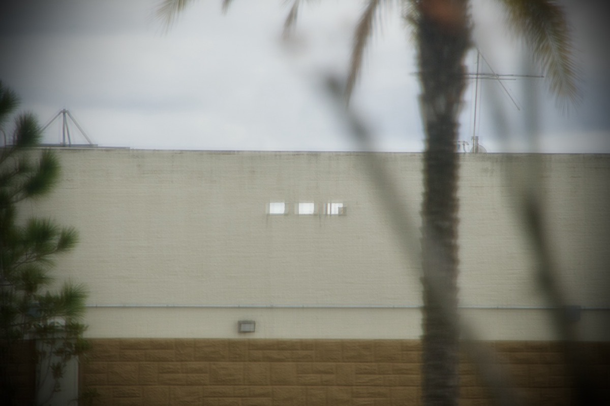
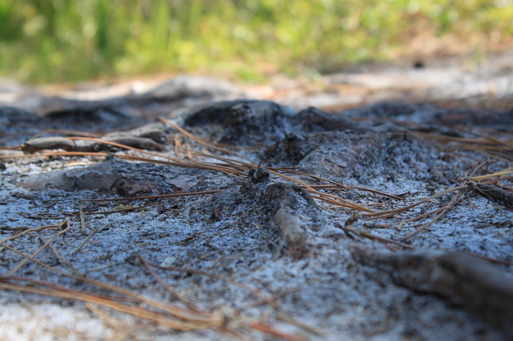
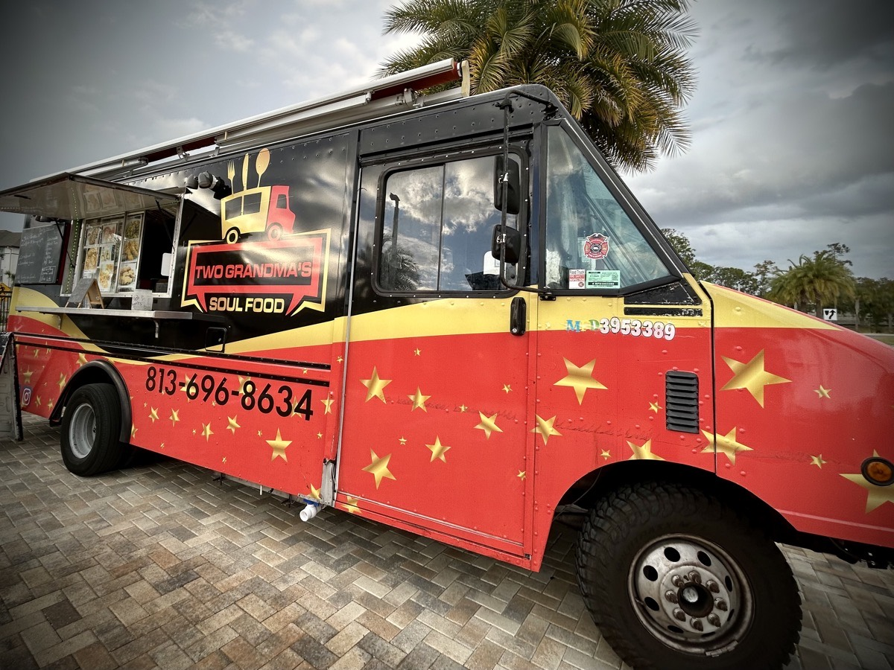

# Gutters, Wrong Time, Just Me, and Soul Food

## 3 Hole Gutter

Gutters are designed to direct the overflow of rain water away and through a channel to a place where it can flow freely and as to not cause damage to a structure. I often see such a gutter when I look outside from my patio. There is this 3 hole gutter outlet near the top of a wall on the nearby mall adjacent to my apartment complex.

I imagine the most important purpose to those gutter holes I see is to keep the roof of the mall from collecting too much water and thus causing the roof to collapse. These 3 holes likely serve a great purpose to avoid the possibility for a great amount of damage to occur to the overall structure of the mall's building.

The roots of a plant are designed quite differently than gutters. Roots will absorb water and help provide nourishment to the plant. Water helps to transfer important nutrients in the soil into a plant through the root system that also helps keep the plant upright in the soil in which it is rooted.

Unlike a gutter, roots are eloquently purposed with stopping the flow of water away and instead directs water directly into the path of what a plant needs to grow and sustain its existence on the earth. Even after a tree falls or is cut down, the roots often remain in the ground as a reminder of what their purpose is. And sometimes the roots will appear outside of the soil as if it is waving to say hello...hehehe

When I first started shaving my head in early 2020, one of the first things I noticed is that rain no longer bothered me. When I allowed my hair to grow, I hated to be in the rain as my hair would get wet and the water would pour down my face. It was so annoying!

Now, when it rains on my head, the water seems to bounce off or take a path down my head other than on my face. I love being able to walk through the rain without it bothering me anymore. I see people huddled under umbrellas or ponchos or running through the rain trying to avoid getting too wet.

Regardless where I stand on my feelings toward rain, it has its purpose in life. Life needs water! All living things need it in some capacity. Sure, it's nice to get needed water from a faucet or a bottle. But the natural world needs the flow of water from the sky and through waterways such as rivers and streams.

Anything created by humans seems to need to control the water that flows in, around, or over it. The idea that water can destroy something a human has built becomes evident when it rains so much that a flood occurs. Hence the purpose of a gutter. But what about all that God has made?!?

God created me. He knows every part of me. He knows when I need the rain and when I need the sunshine. He also knows when I need both. There are no gutters around me to protect me from what I think the rain is doing to me. Instead, He is growing roots within my soul to help me absorb the nutrients my soul needs when it does rain in my life. Although I was speaking literally previously, I am of course speaking figuratively now.

Last week, I received the news that my company was outsourcing the work I am currently doing. This not only affects me, but most of my colleagues that I've worked with these past 4 years. I honestly felt I would serve out the remaining years of my career with this company. Yet, here I am looking at the final months of my time with the company already.

I know God is teaching me a valuable lesson during this season of my life and career. He has always provided regardless of my circumstances. And this will be no different. He isn't going to use a gutter system to divert the troubling waters around my soul this time. He is going to allow the roots He is has formed in my soul to absorb some valuable lessons here. What those lessons are remains to be seen. However, I feel so strongly rooted that I know I will overcome yet another season of change in this life.

Back to the literal, I was rained on yesterday. There was a light drizzle on my way to church. During the service, you could hear it clearly pouring down as the rain hit the roof of the building. Although not as hard as during the service, it was still raining when I got out of church. As I mentioned above, the rain just bounced off my bald head and never covered my face. I'm fortunately in that regard.

We needed the rain in here my area. The ground has been getting pretty dry lately. And I need the rain that comes through my circumstances. My spirit needs some nourishment to keep growing! I'm grateful for the 3 hole gutter I see across the way from my apartment. It is a nice reminder why God didn't make gutters around my soul. But rather roots to help my soul absorb the Living Water.

## Wrong Place, Wrong Time

I don't know about you, but I often feel like I was born in the wrong place at the wrong time. It will likely be one of many questions I'll ask God someday, but why was I born in the mid-west United States in 1978!? Sure, I wouldn't exist if my parents hadn't met. Sure, my son wouldn't exist if I hadn't met his mother. Sure, my hometown wouldn't be quite the same if I hadn't grown up there.

Based on such things as what music I love and the sort of movies I enjoy has me feeling as though I might have been born in the wrong era. Not to mention that I honestly do not love the mid-west. It took me years to escape the region. But I have never been happier living anywhere than I do now that I'm in Florida. That said, I might have been just as happy living in California or New York. Anywhere except Indiana and Illinois!

I don't regret where I am from or when I was born. Honestly, I wouldn't be who I am today without the places and events of my life. And those would not have occurred in any other time or place. So, why do I feel like I am so out of place in this world?

I don't know how I came to feel this way. I know God has a plan and a reason for when and where I was born. And I know I am in the place I'm supposed to be today. Where does He plan to take me next? I don't really know. You know what, I'm actually pretty excited about where He may take me next!

I think part of my problem is that I have no control over my life. I mean, I do have control over my own decisions. But there is so much I cannot control. I'm honestly glad I don't have control, though. Considering how much of a mess I have made of my own life thus far, I'm glad God is in control. Going forward, I hope to always look to Him for guidance.

The great thing about being alive today is that I can build a life now that reflects the traditions of other cultures and listen to the music of a time I long to be a part of. I'm going to build a home that takes me to a time and place that I long to be a part of. And I'm going to embrace the time and place God placed me when I leave my home.

## Where You Go, There You Are

Today I was in chapter two of *Your One Life*. In this chapter, I'm reminded that I spend a lot of time with myself. I spend more time with *me* than I do with anyone else in my life. If I sleep about 7 hours a day, that means I'm awake with myself for about 17 hours per day!

Having so much time with myself means that I need to be my own leader. No one else can lead me with the amount of time I spend with *me*. I can have mentors and inspirers aplenty. But in the quiet moments of the day, there is just me.

As a self-leader, I want to lean on the best leader of all existence. God, my creator is the One I want to lean on. No matter where I am or where I go, He is with me.

As with the previous chapter, this one ends with some questions...

1. *When was a moment in your life that you "came to yourself" and made a life-altering change?*
   The most difficult, and somewhat most recent, moment I've had that was life-altering would have to be when I moved to Florida in the Spring of 2022. I was running away from my past and all of the triggers I could no longer mentally bear.

1. *This one is a two part question. Answer the following two questions as a way to honestly take stock of your life:*
   - *What's missing?*
      Choosing happiness
   - *What must change?*
      I need to stop choosing that which makes me unhappy

1. *Another 2 parte question:*
   - *How would you describe your self-talk?*
      Self-degrading, I'm not good enough, I don't deserve any better
   - *What story are you constantly telling yourself?*
      I am unworthy

1. *Where do you tend to give yourself a free pass? In other words, where do you tend to come up with excuses or rationalize?*
   I tend to think about God will forgive me anyway. And only I am this hard on myself. So no matter what mistakes I make, does it really matter? Of course it does! This thought is just an excuse to keep making mistakes.

Like the last chapter, I'm being a bit hard on myself. It's my honest reality. I want this book to change how I live and how I think. So if I'm absolutely honest, I think I can better dissect who I am and who I want to be for the rest of my life.

I'm a different person today. I've mentioned that a few times since the end of this years 21 days of prayer and fasting. And like I've said before, I want to remain different. I want to embraced different. I need to be different. What I've been doing isn't working.

## Two Grandma's Soul Food

From time to time, food trucks make an appearance at my apartment complex. Some having been excellent, while others have turned out to be ones I'll avoid. A few days ago, we received a notice that the first food truck of the year was going to arrive today! *Two Grandma's Soul Food*

This was a new food truck since I've lived here. So I was pretty excited to give them a try. We got a reminder text message today and it included a link to be able to pre-order online. This is a huge plus for me. I like to take a good look at the menu before I decide if I want to even try something new. And with the option to order ahead of time, I had the awesome option to order and pay before they even arrived.

Being on a pescatarian diet, I was pleased to see they had some seafood and veggie options. My diet is a choice. So I'm very fortunate and privileged to have choices that accommodate to my desires. Dropping flesh meats from my diet has been a life changing choice. And I was very excited I could still enjoy a food truck experience while sticking to that diet!

I went with a combination of catfish and shrimp. The veggie side I chose was collard greens. And I added a piece of corn bread. I won't go into how much I love collard greens. But the ones I was served today were absolutely amazing! The corn bread was mid. And the catfish and shrimp were far better than I expected.

## I Hope for the Best

I haven't reviewed this entry to see if it makes any sense or if there are any typos. Honestly, sometimes I read it and it makes sense in the moment. Even typos escape my attention sometimes. So I'm not sure why I proofread my journal entries. This isn't a book. Even if something I write in this journal becomes a part of a book, I can just proofread it then. If you are reading this and you have my personal number, feel free to point out something I missed in today's journal entry...LOL