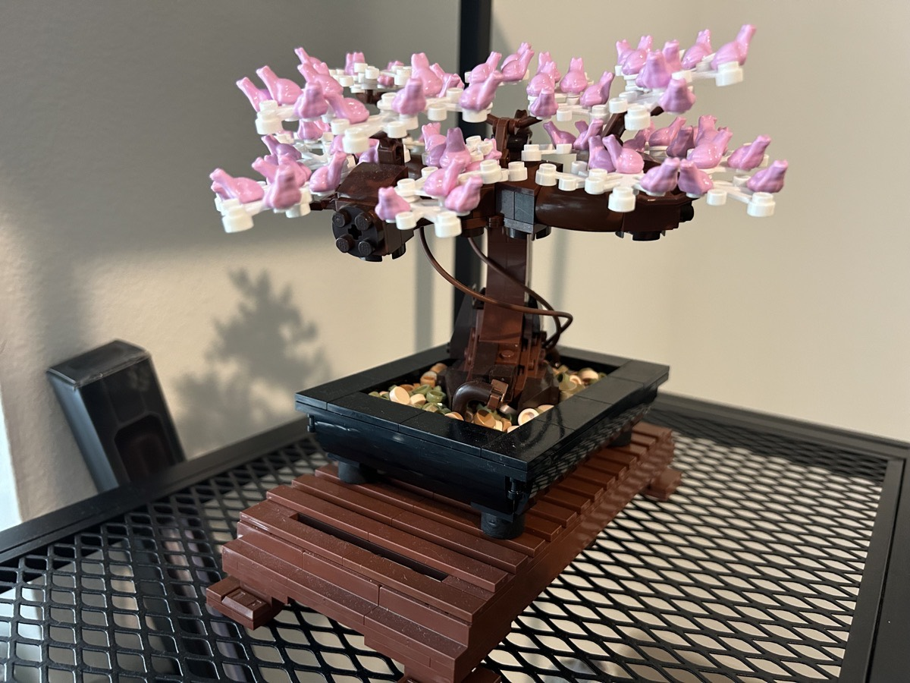

# Zoom, Zoom, Zoom, Tofu, and Spring!

## 8:05 am

Good morning! A new day! Same circumstances...hehehe I decided to take another mental health day. Between getting home late, and getting very little sleep as a result, and the fact I did not quite resolve what I was going through yesterday, I really felt like I needed another day away from my routine.

I love routine. So much so that when all is well in my world, breaking the routine can be a bit annoying...hehehe However, when I'm depressed, breaking the routine helps out in a way. I still did my prayer and daily refresh time to start my day. I also shaved and showed. Those few things are basically a must to jump start my day.

As tempting as it might be to go to Disney again today, I don't plan on it. Although it was good that I went yesterday, I feel as though it did not complete accomplish the goal I had yesterday. The only other thing I have planned today is a video chat with Chérie that I'm very much looking forward to.

We've been chatting over text for nearly a year now. We originally met on Twitter. That's just about the only good thing about Twitter...LOL I'm still tempted to leave that place...LOLOLOL But we've haven't yet spoken over the phone or over a video call. I enjoy friendships like this. Not only does our friendship feel genuine, it feels easy; if that makes sense. Easy as in we can message each other all day some days. While others, we may not message each other at all but there isn't a feeling of *Is there anything wrong?!?*

It took me a while to ask her if we could talk over video. I had been considering it for a little over a month. I was slowly contemplating it because we live so far apart. The nice thing about texting is that it is asynchronous. I shoot off a message with no expectation that I'll get a reply quickly. It's just a matter of when we have the time to respond to each other. But a call or video requires planning and absolute focus for the moment. With our time zones being 3 hours difference, I didn't want to be an inconvenience for her.

That thought was a bit selfish of me. How could I possible know if it was inconvenient for her?!? Since our friendship is genuine, she'll have just as much time to focus in the moment as I do, right!?! So throwing all presumption aside, I finally asked her. Her response put a smile on my face...*Of course!* she said...hehehe And so we will be doing a video chat over Zoom this evening. Well, this afternoon for her...HAHAHA

Although texting will likely remain our main form of communication, I think video chatting will go well and I hope it becomes a regular occurrence. She was such a huge blessing for my year last year. I want to grow the friendship this year. In my life, there are only a few friendships that have rooted and remain to this day. I imagine ours might do the same. The distance between us doesn't bother me one bit. And I hope to go out there to visit with her some time soon. Or should I say, soonish...I'm still waiting to see how this work situation pans out this year...hehehe

## 11:00 am

I definitely did not go to Disney today. I've also canceled any plans to go this weekend. Today, I just felt called to remain home. And for the weekend, the forecast shows rain most of the weekend. With the lower temps and rain, it doesn't sound like fun. The crowd levels should be lower as a result. But since I live about a two hour drive away, if I got tired of dealing with the rain and temps, it would seem like a waste of a drive. If I lived closer, I might risk it.

Right now, I'm pressing some tofu. I'm going to give air fried tofu a go for lunch today. One of the dishes I had last night was deep fried tofu. I liked the crispy texture to it. I have attempted air fried tofu before. It did not turn out. I hope I succeed today. I'm going to marinate it in coco aminos for about 15 minutes. I'll then toss it in cornstarch. I'll air fry at 375F for about 12 minutes.

I'll be making ramen with broccoli and carrots to go with the tofu. I'll probably through together a hot sauce to go with it all as well.

I've been watching the Marvel show *Echo* on Disney+. I tend to watch all of the Marvel shows. They are all connected. But this one has been a bit strange for me. The story doesn't really make much sense. I think I only have 1 episode left. Perhaps it will have more meaning when the next Marvel show or movie comes out. That is how these things have been going. Each show and movie is part of a greater whole. It can get exhausting following the stories. I have to recall past plots to see how they fit into new ones...hehehe

Tofu is ready to be cut and marinated. Fingers crossed I get it all to work out!

## 12:21 pm

Although the tofu wasn't a disaster this time, it didn't work out quite like I'd hope. It wasn't very crispy. I think part of the problem was how I coated the cornstarch. I probably didn't press the tofu long enough either. So far, the best way I've been able to find to make tofu crispy on the outside is to sear them in ghee before cooking them in sauce.

Other than that, lunch tasted pretty good. I think I overcooked the ramen too. But again, it all tasted pretty good. The textures were the only thing a bit off. Although important, it didn't distract from the experience.

I finished *Echo*. It had a disappointing ending for me. But it does appear that it is leading into another show. Perhaps the new *Daredevil: Reborn* show that's coming.

I'm not sure what all else I'll be doing today. I may watch a little more TV. I have other shows to catch up on. I haven't been watching much TV lately. That feels pretty good.

I may also need to take a nap...hehehe

## 4:08 pm

I just woke up for a nap...hehehe Funny how I thought I might need one and now I'm back to journaling after having had one. After my last session, I went for an exercise walk. It felt great being outside again. With this walk, I gradually increased my pace on each mile. And on my final lap around the pond, I did a quick jog.

Once I back inside, I setup the new Zoom app on my Apple TV and made sure it all worked well with my iPhone as the camera. Late last year, Apple introduced a new feature that allows me to use my TV and iPhone as a way to video chat with FaceTime. Zoom then added that feature their service. I love it because I can just sit on my couch and video chat to my heart's content.

The iPhone as the camera is a sweet feature. The phone can sit on my TV stand and it follows me as I move. I have no idea how it works. But it works really well. I used the feature back in December to briefly join a Christmas party my family was having back in Indiana. I FaceTimed with Malachi and it was like the family was in my living room. I love it when technology works that well.

After I confirmed that all would work out, I read another chapter in the book *The Wild Heart of Florida*. This chapter described a river up in northern Florida that really isn't accessible by conventional means. It's source is a natural spring and a large portion of it is protected by a swamp. So there isn't any commercially owned and operated lands around it. Most rivers here are carved out by lots of houses to have that river *view*, thus ruining the natural real view of the river.

I don't made humans filling up beautiful landscapes. After all, humans are a part of nature too. But I do like it when there are places still untouched. There is concern with over development here. Some of the ecosystems here have been interrupted or completely destroyed by over development.

My eyes got really heavy ofter reading. They typically do. Since I didn't get much sleep last night, it only makes sense that today I was tired enough to take a nap. I turned on my white noise app, laid my head on a pillow while I lay on the couch, and I was out immediately. I never fall asleep that quickly. Although I don't recall the content, I know I dreamed a bit. So it must have been a deep sleep. And now I feel revived a bit.

I'm going to get ready for my call with Chérie. She mentioned she was available earlier if we wanted to talk soon. Let's see if she's ready now!

## 7:20 pm

I just got off from my call with Chérie. It was wonderful getting to chat face to face! And we talked for quite a while too! Zoom appears to have reinforced their call limit on the basic plan. But we were able to work through that by going back and forth on who initiated a call.

It is so great having an authentic connection. Even though this was our first call, it felt like we have been friends for years. We even had those moments when we'd say something like *as I was telling you the other day*. I only bring that up because the friendship is still newish. But it feels as thought it isn't, if that makes sense!?

I love that little laugh of hers...hehehe It's warm and makes my heart happy.

## 8:52 pm

I believe this day achieved what it needed to in order to help with my depression. Stepping out of my routine these last few days was a good thing. Depression is still casting a shadow. It does that sometimes. I imagine people won't see the depression on my face. I'm not *faking it until I make it* or anything like that. Sometimes I smile to help make others feel good. I have one of those contagious smiles, I think. And if I can make someone else feel good, that helps me feel better too.

The key for me is not to get stuck like I did in the past. I need to move on. I need to grow. That is something that is different than I was before. I use to get so stuck it was like trying to walk through mud waist deep. All these years of learning new coping skills is truly paying off! And learning from others is helping. That's why I like to share my own struggles. Perhaps how I deal with things will help someone else.

Depression is something I *have*. It isn't something that I *am*. Identifying that and acknowledging it takes me a long way to recovery each time I face this ugly beast.

I'm going to be on the lookout for *my* people. I'm going to continue being my authentic self. I know that I'll attract people who like who I am. I'll also begin to be attracted to others that I like for who they are. There are over 8 billion people in the world. My circle can be small and tight. I don't need to settle for anyone who doesn't fit into that circle.

None of this is easy. And that's okay. In fact, it's probably best that way. Working hard helps build character anyway. This doesn't mean everything is going to be hard, though. I might seem to be contradicting myself a bit. What I mean is that it might be hard at first. But the more I do it, something that was hard becomes easier. Every step leads to the next.

As I go into this weekend, I'm thinking about spending some focused time on writing. I'm ready to go beyond this journal. It's time to revisit the chapters of my book already written and explore what new chapters come to be. This weekend will be a perfect opportunity for this.

I'm not yet sure what order these will be in, but the 4 sections of *Vitamin G* will be *Grace*, *Gratitude*, *Generosity*, and *Growth*. Each of these sums up the entirety of all that makes Vitamin G what it is. As I write each chapter, I'll ask the question *which of these 4 does this chapter fall under*. If it applies to multiple, I'll focus on which most describes the essence of the chapter.

I still need to land on a title, if not *Vitamin G*. Perhaps it will come as I write this year. Or I may just keep that title and develop a subtitle that separates it from the existing book with the same title. Names and titles are so hard...hehehe I think it's because it is an important part of identifying anything. Like our own names.

Once again, I'm not going to go back over today's journal entry to proofread it or see if it all makes sense. It was raw and in the moment today, like yesterday. I didn't proofread yesterday's either. The point of this journal is to be a bit raw anyway. I'm doing this for me and for anyone who wants to know me a little more. 

I put the white and pink branches and blooms on my LEGO Bonsai tree today. I imagine the real trees in Japan still have a few weeks left before this happens. But it felt like a good day to do this for my little tree.

I'm in the same season of my year. Winter is almost over for my spirit as well. Spring is almost here. Speaking of which, the actual equinox isn't on my birthday this year. It will be on March 19 instead due to it being a leap year...hehehe

I use to be a night owl. I use to do my best work between 10 pm and 3 am. Due to my career and how business works in the USA, I have to keep a 8 am to 5 pm work schedule. I sure do miss my nights. I was reminded of my old schedule today. It has been years! I wonder if I'll go back to staying up late when I retire from this career? Like everything in life, this is only for a season.

Today was a good day...