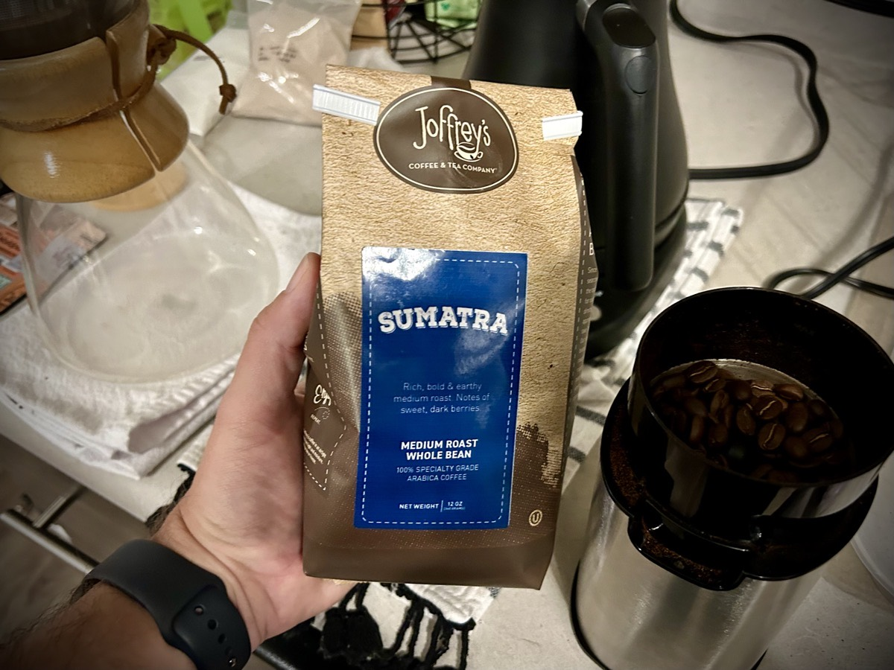

# TBD

## Mind Download

As I finally sit down to begin journaling for the day, it's around 10:15 am. There has already been a lot on my mind. I sure wish I could just download all of my thoughts and of it be transcribed into text.

In a way, that's what journaling is. I'm taking my thoughts and putting them into words that at least partial convey the meaning behind those thoughts. I just isn't always in real time. I suppose that's a good thing, though. This gives me time to really think about what I say and how I want to say it.

I actually prefer that in most of my interactions with people...hehehe Once texting became a thing, I welcomed it! I even bought one of those fancy phones with a QWERTY keyboard to make it easy to text. I never did get into using a numerical pad to key out a text. But the nice thing about it is that I can really think out what I want to say. And I can look it over before I hit send.

When I speak with people in person or over the phone, I tend to repeat myself. Before I speak, I've gone over what I want to say several times. So when I speak, it sometimes comes out on my mouth a few different ways. I often wonder if the one listen has picked up on that and is annoyed that I just said the same thing multiple times.

The benefit of being able to download my thoughts is that I can review everything before I put it out there. Sure, there are somethings I'd rather never get out of my head. I imagine it might scare a few people...LOL j/k But it sure would be nice to be able to have a look. Sometimes I think of something I'd like to write down but can't because I don't have a medium nearby to do so. Later, I'm left with wondering what profound statement I wanted to remember...HAHAHA

Then again, it would seem the most important stuff does end up getting written. I'm grateful that I have the means to do what I do. I love to create. And being able to put into words how I feel, what I am doing, and some of the wisdom God has given me to share is an incredible blessing.

## Food, Glorious Food

I've been on this vegetarian diet for almost 4 months now. Sticking the the pescatarian style of the diet has been both challenging and rewarding. I haven't really been craving flesh meats at all this whole time. In fact, that is the reason I gave the diet a try.

My concern now is all of these meat alternatives I've been trying for the last 4-6 weeks. Like any processed food, there are some ingredients that aren't the best. There are always ingredients whose sole purpose is to maintain color or shape of the food. Personally, I don't concern myself with that. I do think appearance and texture are important to the dining experience. However, not at the expense of health.

My overall health, although quite improved over a year ago, has hit a sort of plateau. I'm not loosing or gaining weight; which is nice. My energy levels have been great. However, those have peaked. My activity level could use some improvement. Aside from more exercise, I'm curious what sort of changes I'll be making next with my diet.

I do feel as those flesh meats will become a part of my diet again. I don't really miss it. But I'm also not concerned about animals. Even in the animal kingdom, animals eat animals. What started me on the vegetarian tract was listening to my body. It was telling me to make the switch. I just feel as thought it's only for a season.

If I have a message to give anyone who wonders about my diet and exercise choices, I believe it is this: listen to your body. No one knows how you feel more than you do. And even if you don't understand how you feel, you are your best advocate. There isn't a end all be all routine. And there isn't a quick fix to anything. When trying anything, listen to how your body reacts to it. And if you have health issues, find the root of the problem. Treating the cause is so much better than treating the symptoms.

I was going to write up all the details about my own personal journey. I've since reconsidered. What worked and is working for me may not work for someone else. I'll continue posting on social media about what I'm doing in the moment. But I only hope to encourage and inspire others by example. If I'm more specific, the risk is that someone may try exactly what I'm doing and only make themselves worse.

As a side note, I found myself in Walmart this morning...LOL I need envelopes and didn't want to pay much. I large box was less than $2 there. While there, I decided to venture over to grocery. I found some great prices on scallops and tilapia. So I picked up some seafood while I was there. Those were a few things I had been out of stock of for quite some time.

I think I'm going to start venturing out to the local farmer's markets. Sourcing my eggs, produce, and seafood straight from the farms and fisherman seems like the best idea. I'd rather support small business and the local economy. Plus the ingredients should be better. I believe that will be the next evolution of my diet. Building relationships with the community while giving my body better quality seems like a great idea. Especially if I want to live until I'm 135...LOL j/k

## Sumatra

My favorite coffee brand is [Joffrey's](https://joffreys.com/). Although you can get Starbucks on Disney property, the exclusive provider of Disney branded coffee is Joffrey's. When I started to drink coffee, I loved the connection their brand brought to my love of all things Disney. When I order from them, I rarely get the same blends and flavors more than once.

I mostly order the Disney branded blends and flavors. It started with getting the flavors that are found in the resorts and restaurants. It then grew into ordering flavors based on some of the Disney movies and shows. However, I often do order their other blends and flavors that aren't Disney themed.

Last month, Joffrey's introduced me to a new blend named Sumatra. It hails from Mandheling region of Indonesia. I tried it for the first time this morning. I felt the flavor was rich and bold. It had a slightly sweet finish. The aroma greeted me before each sip and I found the experience of this coffee to be quite pleasant.

I'm not easily impressed with coffee. To each their own on what is best for them. But I absolutely love Joffrey's. This Sumatra blend is one of the top I've had from them. I'll likely order this one again in the future.

## Wake Up Friend Owl

Long before Olaf was born, there was a funny little bunny named Thumper. Thumper was my favorite Disney animated character prior to Olaf. Now that I've started up my art for the year, I decided it was time to paint myself a painting...hehehe

It made the most sense to paint Thumper. The first time we see his foot in action is when he is trying to wake up Friend Owl. When I was a kid, I was mesmerized by his cute little foot rapidly thumping. So that's the painting I'm working on now.

I'm starting off on my iPad once again. It's great to have that so I can experiment with lines and colors without the risks associated with physical medium. Once I'm happy, then I can apply the practice on the real thing. Plus it's fun to have a piece of digital art in case I decide to do something with it later.

## Unstuck

It seemed for years that I was stuck all the time. Whether it was an endless cycle of bad habits or just being unhappy with my circumstances. It was sort of like being in a mind prison. I don't recall if I've written about that yet, or not. But it is something I keep going back to in my mind.

Fortunately, the door to my mind prison was actually unlocked. All I needed to ever do was walk out the door. Of course I had fear that there was a guard out there who would drag me back to my cell. The guard had my face. It was always me dragging myself back into that prison.

I'm finally unstuck now. That mind prison no longer exists and I walk as a free man today. I'm no longer the *victim* of the past trauma I was holding onto. I'm finding that the only way I am truly a victim of anything is if I allow it to continue to control me. To allow it to keep me in that mind prison cell.

That's not to say something else can come along and cause me to be the victim of a new circumstance. But what I truly believe is that I can and will rise above my past and anything that happens in the future. I'm done being stuck!

## Rain

It has been raining off and on all day. It has been a pleasant change of weather. With the exception of colder temperatures, I've been really happy with the weather today. As I mentioned above, I did venture out earlier today. It wasn't raining then, though. And the colder air wasn't much of a bother.

We've needed the rain. Unlike my neighbors to the north, it doesn't get very cold here. So the plants are always growing. We have sun most days. So those plants also need the rain! I've noticed the water levels are a bit low in the lakes, ponds, and streams near me.

I'm glad I stayed home. I may still go out for dinner later. But it definitely wouldn't have been a fun day at Disney. I think I'm good with my Disney fix until the 28th. I'm planning to start my day at EPCOT that day. I think the Flower and Garden Festival begins on the 28th. I don't I've ever been to one of the festivals on opening day. So that should be fun!

The rain should help with that festival as well. They use living plants for the topiaries throughout EPCOT. I've taken photos of some of them at the beginning of the festival and then again towards the end. You can clearly see growth over the span of those months...hehehe

## Begin at the End

Today, I read chapter 5 of *Your One Life*. In it, the author describes his first time being the pastor of a funeral. I recall what I believe to be the first funeral I ever attended. It was for my maternal grandmother's funeral and I was about 4 or 5 years old. Possibly younger. Aside from seeing my mother crying and having a family meal at my house, all I can really remember is that I didn't really understand what was going on.

I've since attended more funerals than I can count and was a pallbearer at 3 of them, I believe. There were 2 funerals I did not attend for loved ones because I just couldn't bear all the death I had experienced in my lifetime. But I'm good with death now. For some, it is the end. For me, it's the closing of a door that will never open again. After the events of 2020, death of others does not break me anymore. And having attempted suicide 19 years ago, my own death remotely scare me. In fact, I'm more afraid of being alive than dying. True story!

This chapter also talks about the difference between a compass and a clock. In the context of *Your One Life*, a compass is what sets our vision and direction for our life. A clock manages the time in which we will accomplish that vision and direction. The compass points in the direction and the clock allows us to implement the plan.

This chapter did not end with reflection questions, per se. It does have some questions to answer. But they lead into developing a *life purpose statement*.

- *At the end of the day, what matters most to me?*\
  Was I a blessing or a curse today? That simple question sums up what mattered most in my day. Were the decisions I made something that allowed me to bless others? Or were they the kind that left someone else feeling hurt. Luckily there are days when I do not really interact with anyone. So I can take a breather knowing that my decisions likely didn't affect anyone that day...hehehe

  I do have days when I just want to make all decisions based on my own desires. On those days, I still hope I'm a blessing. But it still matters how I feel about what it is I want out of the day. As I continue to learn how to set healthy boundaries, I imagine what matters most to me at the end of the day may evolve. Just because I gave up on my hopes and dreams 24 years ago doesn't mean I cannot rebuild today. I made that decision myself. No one made that one for me. And no one is making the decision today. I am. I will live a life that matters to me going forward.

- *At my funeral, what three words or phrases do I want people to use when talking about me?*\
  He gave the warmest hugs. My life was better having him in it. He showed me how to become the best version of myself.

- *What would I like my one-sentence epitaph to be?*\
  See you real soon!

- *What changes would I make if I knew I had only one year left to live?*\
  One of the desires for my life is to live forever. By that I mean be remembered. So, I suppose I would set out to create something every day. I'd have 365 works at the end of that final year. 365 parts of who I am to share with the world so the world would never forget me. I know that if even one person remembers me in some way, I'll live forever. Even if they never knew me in person, they'd ponder the meaning of my writings, admire the brushstrokes my paintings, listen to my singing or playing of music, and soak in the beauty captured by my lense.

The remaining paragraphs of the chapter challenge me to develop my *life purpose statement*. This will not be something I'll accomplish today. It will likely take days, or even weeks, to fully vet. I don't want to pressure myself into coming up with the *perfect* statement. I want it to become a compass by which I can find true north in my life. Then I'll use the clock, or time I have left, to implement that statement into my one life.

Although I do agree that I actually have only one literal life, I don't really resonate with that concept. Figuratively speaking, I'm on like the sixth or eighth iteration of *Greg*. I've rebuilt my life several times. I'm blessed in that regard. To be completely honest, I'm growing tired of rebuilding. So, I'm hoping that by going through this book and developing things like a *life purpose statement* I'll be set on my final iteration of myself.

