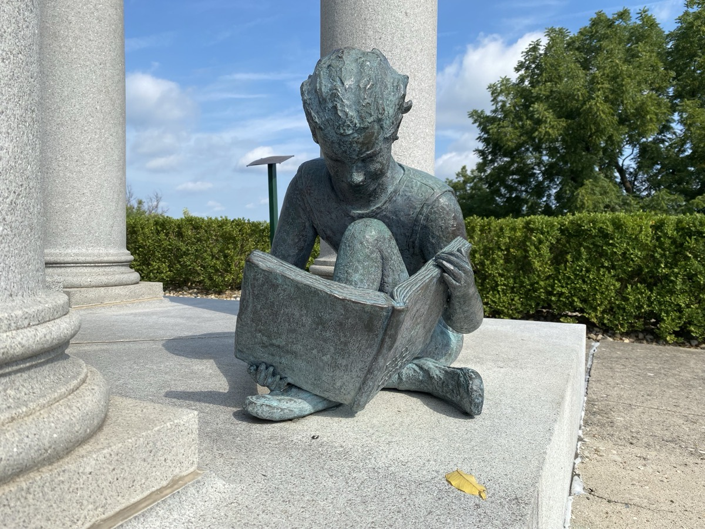
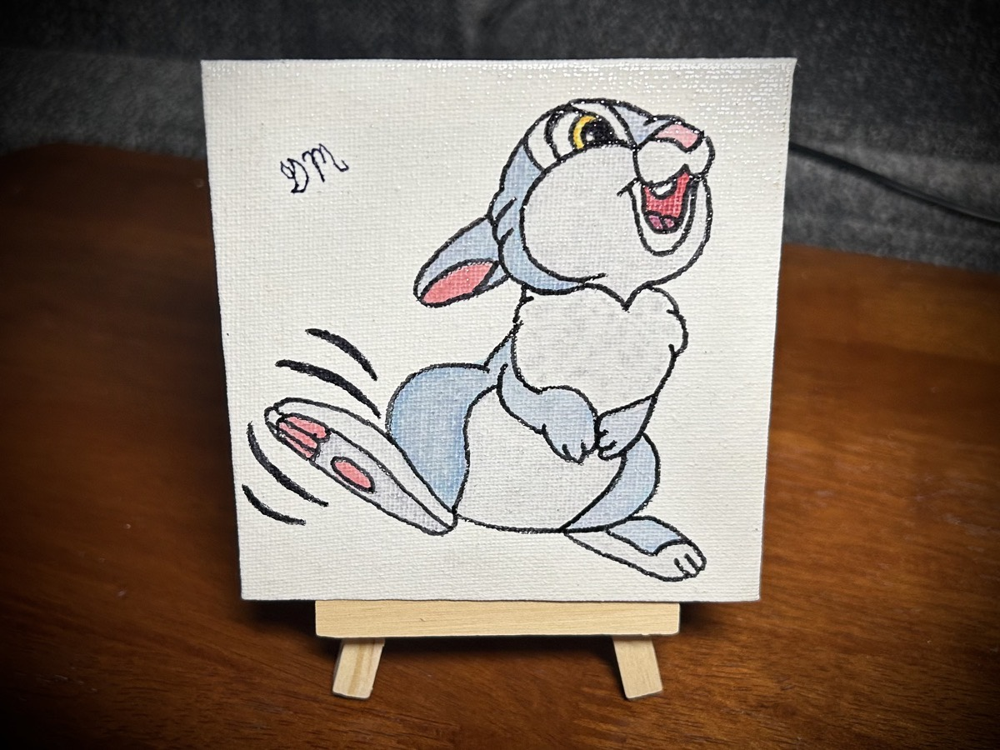
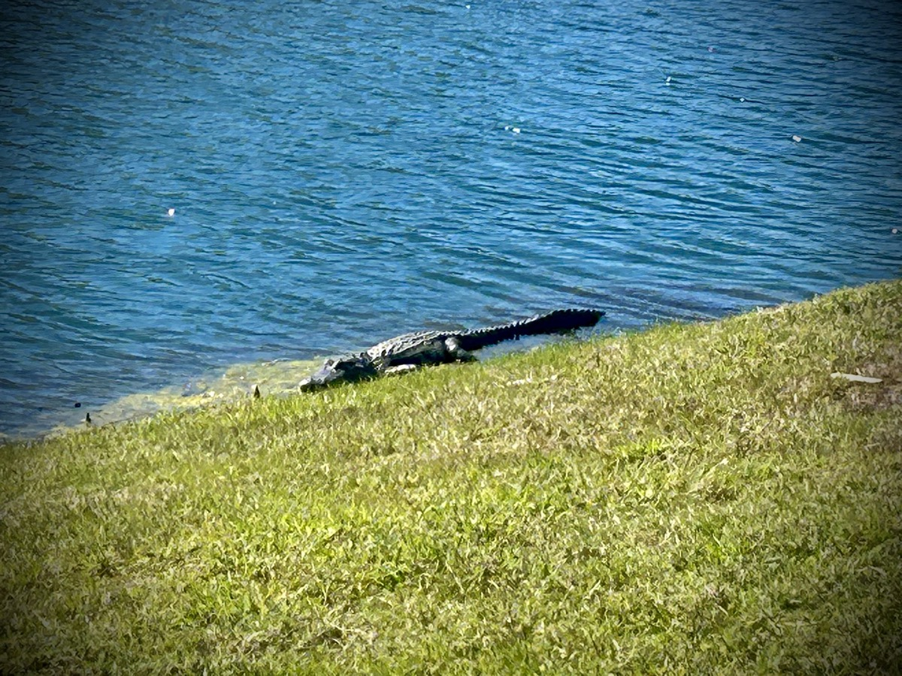
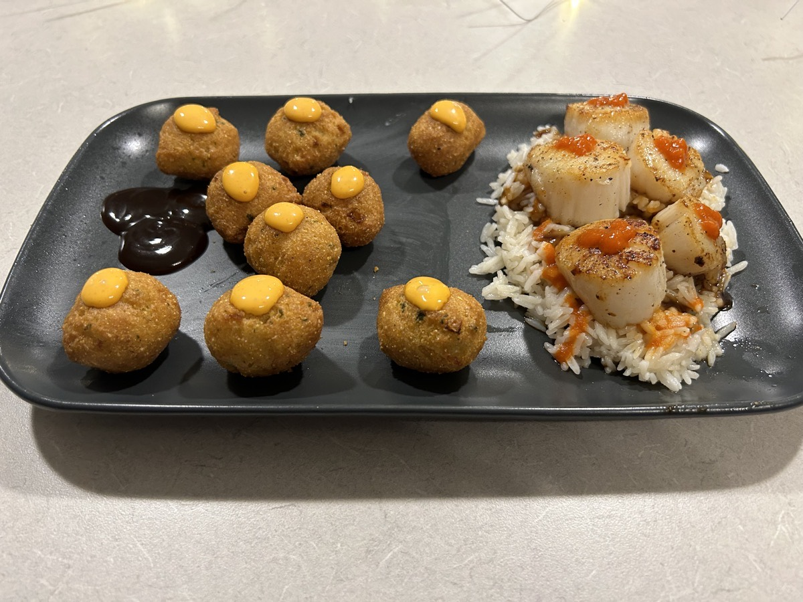

# A Day to Remember

## Little Orphant Allie

I had one of the strangest dreams this morning. I had dreamt I wrote about my *very small* connection to *Little Orphan Annie*. And here I am writing about it!

I grew up hearing about one of my distant cousins from a very long time ago. James Whitcomb Riley was a renowned writer and poet from the mid-19th century through the early 20th century who was known for writing children's stories and love poems. My small connection to him is that his mother was a Marine by birth.

He wrote a poem originally published in an Indianapolis news paper by the name of *The Elf Child* and later renamed it to *Little Orphant Allie*. However, due to a typo, the title was actually published at *Little Orphant Annie*. Riley wanted to have it corrected but ended up keeping the new name.

The name *Allie* was named after a bound servant in his childhood home by the name of Mary Alice "Allie" Smith and the poem was about the stories she would tell Riley and his siblings when they were children. The moral of the stories, and the poem, was to mind your parents...hehehe

It was later adapted into a comic strip, where it was then changed to *Little Orphan Annie*, into a few movies, and a Broadway musical. That musical was eventual adapted into a film in 1982 named *Annie*. At the young age of 4, I went to see that film in the theater.

Little did I know then that I was in a small way tied to that movie and its rich history dating all the way back to 1885 when *The Elf Child* was first published. There is a phonograph recording of my late cousin reciting the poem. It's in a old Hoosier dialect from the state I'm from, Indiana. I may record myself reciting it someday. I think it would be pretty cool since he is in my family tree. Being so fond of how things *were supposed to be*, I may title it *Little Orphant Allie* in honor of Mary Alice "Allie" Smith as James Whitcomb Riley originally intended. Then again, he did accept the typo...hehehe

You can read more about all of this, including the poem itself, on [Wikipedia](https://en.wikipedia.org/wiki/Little_Orphant_Annie).

As a side note, his tomb is at the highest point in Indiana. He was laid to rest in Crown Hill Cemetery. The tomb is at the crest of Crown Hill and casts a shadow on the tombs of even a President of the United States...hehehe He's a very important part of Hoosier history as well as my family history. There's a children's hospital named in his honor as well. He's going to live forever...LOL

## Bald Eagles at Big Bear Lake

On my weekly call with my parents last night, they mentioned they had been enjoying a live feed from California of a pair of bald eagles tending to 3 eggs. It came up during a conversation about background noise while I'm working. I use to just have the TV going with some random show I'd already watched. The point was to drown out the stray noises from apartment living.

I'm not sure how they stumbled upon this particular live feed. Perhaps it was during their recent trip to San Diego and the visit to the zoo there. I didn't ask...hehehe But I was interested and had dad send me the link. I've had it on for most of the day today. The natural sounds of Big Bear Lake and the interactions of the eagles have been a pleasant change from having music or TV playing.

Check it out: [Big Bear Bald Eagle Nest Live Feed](https://www.youtube.com/live/B4-L2nfGcuE?si%253D3efuKMXN0uRWXOTW)

## Vitamin G

Today's post seemed to hit deep with a few people. It's something I've been actively working on for the past few years. Today felt like a good time to finally put it out there. It mostly comes from the following:

Colossians 3:13

> ...bearing with one another, and forgiving each other, if any man has a complaint against any; even as Christ forgave you, so you also do.

Ephesians 4:32

> And be kind to one another, tender hearted, forgiving each other, just as God also in Christ forgave you.

Mark 11:25

> Whenever you stand praying, forgive, if you have anything against anyone; so that your Father, who is in heaven, may also forgive you your transgressions.

What I posted today was *I need to forgive so I can release and let go of the pain that caused my wounds. I do not want to bleed on others who did not cause these wounds. Scars may remain, but there is freedom and healing in forgiveness.*

There are several stories I could tell in the book about this one. I'm not sure any of mine would be appropriate, though. Some of the folks involved are still around and I have no desire to hurt them by writing about what happened between us. I may need to write a parable or something to illustrate what this means and how one can apply it to their life. I could also just draw straight from the Bible on the subject. I can also tell one of my stories without naming people. I actually do that in most of my stories anyway. The issue I think I might run into is if someone recognizes the story. Unlike my other stories, this one would be about how someone hurt me and not how I hurt someone else.

I may not even need to tell a story with this one. Everyone has their own story where they were hurt by someone. This one could just be about how forgiving others is the best path to take.

I could also not include this one at all...LOL We shall see...hehehe

## *My* First Painting Since July 2022

I looked at my art archive and saw that *Wake Up Friend Owl* is the first painting I have done for myself since July 2022. I realize now I need to make something for *me* more often than that. I love to make these for other people. But I need to also take care of me, right?!?

I really love how this one turned out. I can see the mistakes I made. But I actually find beauty in those mistakes. It adds to its uniqueness, don't you think?

I need to remember to add this to the art section of my website. Since I don't sell my art, I think it'll be okay to put it on there. If ever I do sell art on my website, I'll be sure to make a note on those that aren't for sell. I do not wish to sell art based on another's intellectual property. Especially Disney's! That, and the fact I just love to paint these characters for the fun of it.

## Walk into a Jog

It was a gorgeous day today. It was a tad on the chilly side. But I wanted to get out and walk. Although I wore my running shorts, I put on one of my long sleeve wicking shirts. It keeps me warm in the cool air but also cools me off by wicking away the sweat when I start to get hot.

The first thing I noticed in the pond was a creature I hadn't seen in *these here parts* (tips cowboy hat up) in a while. There was an alligator sunbathing on the bank of the pond. After I spotted him, it didn't take me long to notice that all of my bird friends were nowhere to be seen. That made me sad. So many new birds had been coming around since there haven't been alligators for months. The moment one comes back, all of the friendlies fly away.

I'm happy for the alligator, though. It seemed to be enjoying the sunshine as much as I was...hehehe And even though the air was a little chilly, I had a great walk that turned into a jog. I walked the first 2 miles while increasing my pace each lap. For the final mile, I jogged the rest of the way. I didn't even stop for short walking breaks. I just kept running. I felt so good that I wished I would have had more time to keep running.

About an hour before my walk and jog, I had a power blend that included spinach, quinoa, chickpeas, and a few other things. (One of the eagles just started to squawk and it scared me...hehehe) I think that might have been why I had some extra energy today. When I was finished running, I honestly felt like I could go another 5K!

## Conclusion

Aside from the above, I had a very productive day at work. This was one of those days where I felt quite accomplished personally and professionally. So, I wanted to write down these highlights. I don't want to forget this day.

For dinner, I made scallops over rice with hush puppies. I tried to do some art with it this time. There are 7 hidden Mickeys in this. I don't really like how it turned out visually. And the taste was so-so. But it was fun to make and trying to be artistic with the plating was good practice...hehehe

Oh, I've decided to take a few mini vacations instead of banking all of my PTO for a payout. After taking those few days off last week, I realized the importance of PTO.

So, next week I'll be taking a few extra days besides the one for the meetup. I'm going to make it a small Disney trip. I'll head there after work on Tuesday and stay until Thursday night. I'll have time to myself from the moment I get there until around 3pm on Wednesday for the meetup. Then I'll just enjoy being with my friends as I've let go of what happened on New Years! (Thanks Chérie!) I'll play Thursday by ear. As of now, I'm hoping to just spend the day alone at the parks or at the resort hotel. If someone wants to meet up briefly, I'll try to keep an open mind.

I'll be staying at the Coronado Springs resort again. I stayed there for a *staycation* last summer and had a blast. I may take a few jogs around the property while I'm there. Last time I could only walk it. Now I can run!!! Yay!!!

The other mini vacation is in May. My parents are coming down. My sister and her fiancé will be getting married at the courthouse that week. So I'll take that day off for whatever that will be like and then I'll take the following few days to spend with my parents. I believe they'll be here for about a week. I'll be working a few of the days they are here. But they understand that. They like to explore the area when I can't be around. I think we may do a day at Disney that week too. My dad has never seen the *Beauty and the Beast* show at Disney's Hollywood Studios. Mom and I want to take him to that.

Today was a great day. I loved today...