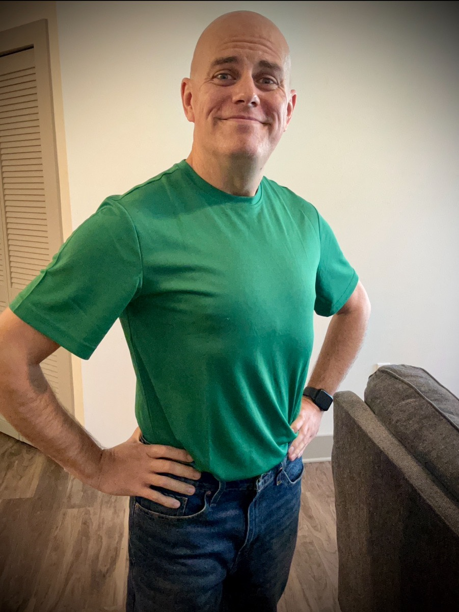
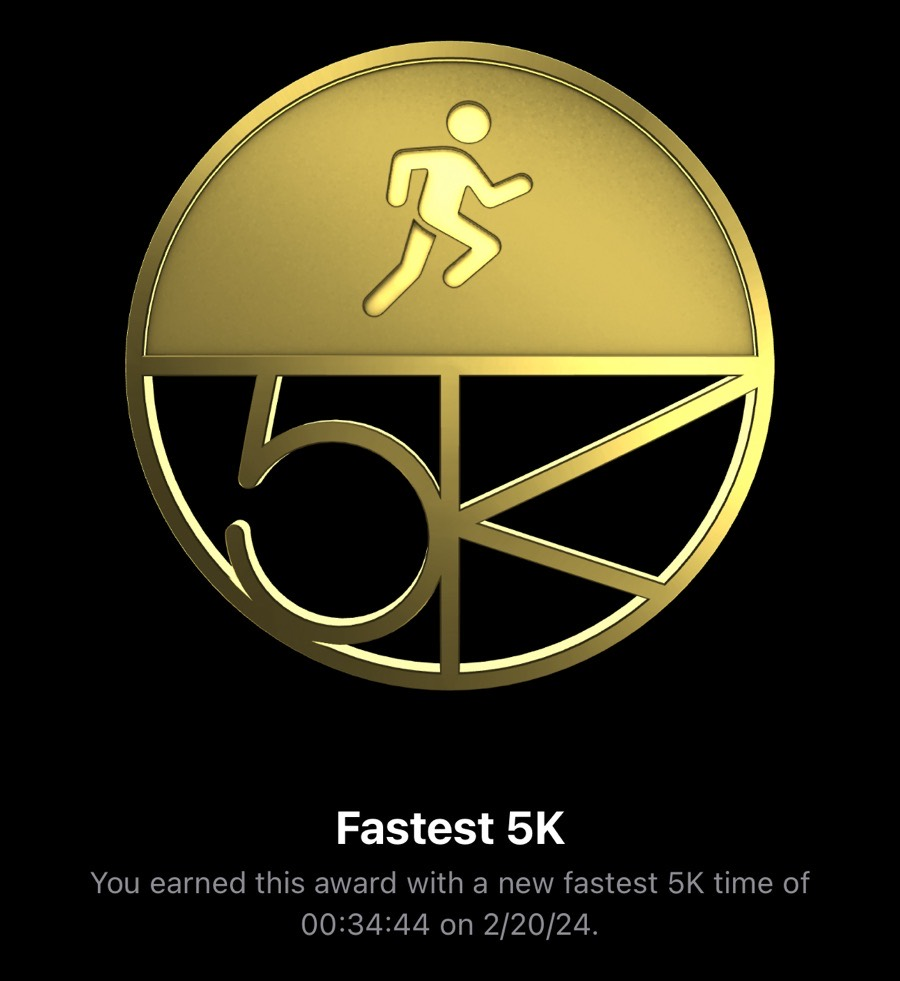

# TBD

## Broken Record

Sometimes I feel like I'm a broken record sitting on the player sort of on repeat. In the context of today, it is in regards to my health journey. I posted some exciting news on my social media accounts. And these posts always seem to get a ton of engagement. But should I keep talking about my progress?

The first of the big news was that I tried on a medium size shirt for the first time in over 20 years and it fit. Although losing weight wasn't the original goal, the fact that the results of just wanting to feel "good" had the added bonus of weight loss was a huge plus. If I compared my largest size to what I am today, I have lost an entire person in weight.

The second piece of good news was that shortly after I posted my medium size shirt news, I went out and ran a 5K in personal record time. Today just felt like the day I would accomplish a new personal best. As I ran, I just kept going. I didn't even take any walking breaks this time. I just kept on running.

I didn't know I had run my personal best until sometime later. I opened up Apple Fitness and saw that award. I literally broke down in tears, feel to my knees, bowed to God, and thanked Him for bringing me through everything to get to this moment. I then, once again, literally jumped to my feet and praised God with arms lifted high. I repeated this a few times. I can hardly believe that I can even fall to my knees and jump up onto my feet. That is a miracle!

My posts about this have been getting attention. I even made mention of the thanking God part. Perhaps that will be a good witness. But I still feel a bit guilty for posting about my health journey again. That seems like last year's news. I'm not sure I should feel guilty, though. Should I?

I'm still a work in progress, making progress. I want to bring others along on this journey. I'm hopeful that my posting these things will help encourage others. The part I'm not sure gets across to people is that I was not in a great place physically when this began. I looked like I was strong. But never was. I did look obese. But I didn't look like I had the heart trouble I did. I always smiled. But no one knew I was in constant pain.

Now I can lift heavy (to me) objects and carry them a great distance. I'm now as thin as I was in my early 20s and my heart is doing great. And my smile is no longer covering up physical pain. It is a true testament to God's restoration power in the human body. Especially a body I had not been taking care of for decades!

Perhaps I'm being too hard on myself again. Maybe I should keep talking about this life changing process. Maybe someone out there needs to see this so they can become motivated. I don't really know. Of all the struggles I've overcome, the one that still eludes me is confidence. I often post and then retreat expecting that what I posted will not be well received.

## No Vitamin G

Speaking of that, I didn't end up doing any official *Vitamin G* today. I began writing one. Then deleted it. I then wrote another one. Click, deleted! I went for a third and backspaced out of that one too. I almost gave up completely. But then I ended up posting something I felt needed to be said:

> The struggle, it’s real! But we aren’t alone. There is always someone we can reach out to. We just need to make the effort to do so.
>
> So we must ask ourselves, “Do we want to keep struggling or do we want to do something about it!?”
>
> I hope you have a terrific day 🙌

That one was something I was bold enough and confident to say. Yes, the struggle is real. But so is our strength to overcome it. There is *always* someone who can help. If I can reach out for help, anyone can. I'm the weakest person I've ever known. All of my experiences have led to finally saying, "Do I want to keep struggling or do I want to do something about it!?"

It was almost 4 years ago that I finally decided to do something about it...LOL If you look at the date today (2024/02/20), you can probably guess what was going on almost 4 years ago...hehehe It is like March 2020 is an epoch of sorts. It is at least one in my life.

Yes, I still struggle with things. But it is so different now. Making that choice to start doing something about it goes way beyond all the counseling I've been through and all the medication I've been on for mental health. The counseling and medication just treated the symptoms. It never really got to the root of my issues.

After 4 years, I'm still learning to discovery those roots. I'm still finding them and figuring out the causes of everything. I can safely say, though, I'm facing everything with such a better attitude. When I go back and re-read these journal entries, I'll know what I mean. It's hard to describe it. Some of what I say here may seem contradictory. However, on the surface, I'm just talking it all out. Deep down I know I'm doing great!

