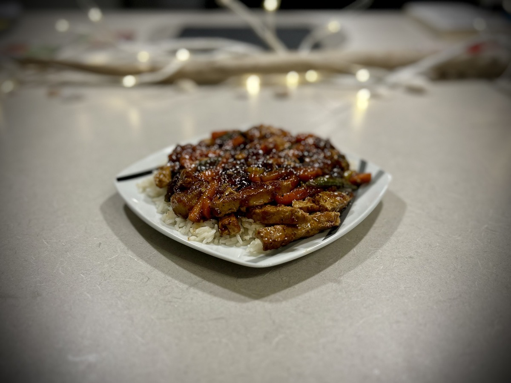
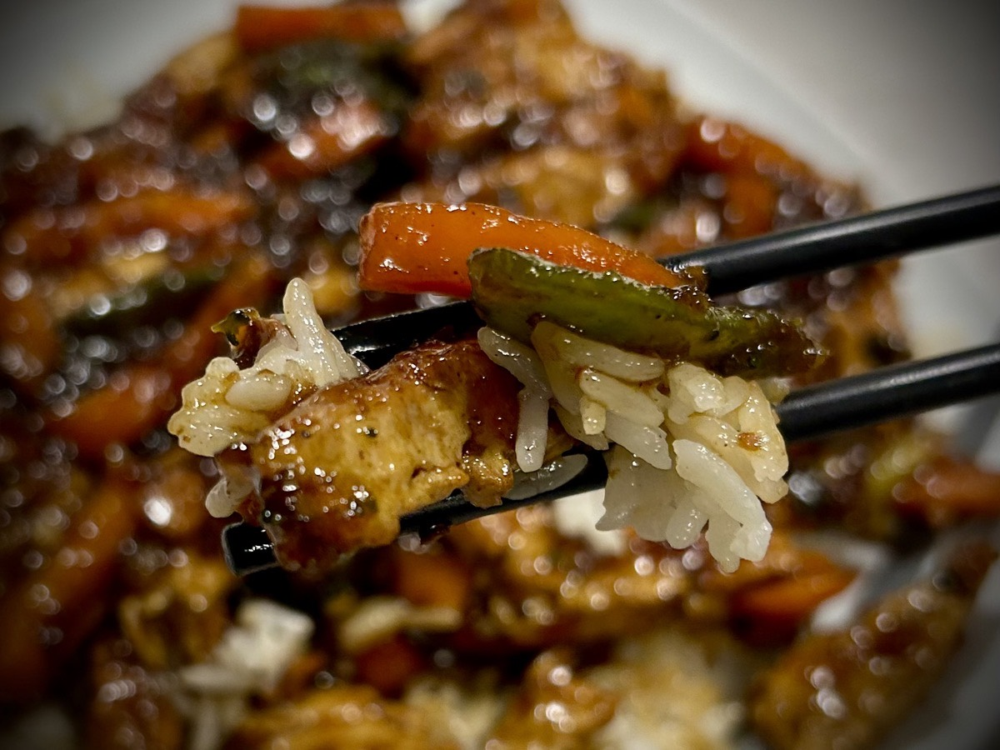

# TBD

## Dreams

Wow! I had some crazy dreams last night! And they felt so real. Sometimes that happens. Sometimes I have dreams so vivid they are more like memories than they are dreams. These dreams were also in vivid color. Often times, the colors are muted or noir.

In the first dream, I was taking a selfie with a group of men. They weren't men I knew. And I don't mean that as in knowing them in real life. I mean that I in the dream, they were random strangers. We were taking the selfie as a group of men who all shaved our heads...hehehe It was one of those "Hey, nice haircut!" joking moments between people. So we took a funny selfie.

If I were to dissect the possible meaning behind this dream, I'd say it is an answer to a question I've been pondering. I've been contemplating whether or not I should allow my hair to grow back or continue shaving my head. It's a simple question in regard to all of the changes my body has been going through lately. It's the same sort of question I asked myself about shaving my beard. I ended up shaving the beard and I'm glad I did.

However, with my head, I like the feeling I had in the dream. I'm going to keep the bald head. I'm really happy with it. One reason I've question this is I often wonder if women find me attractive as a bald man. I really shouldn't care. But I do. And that's okay. I like the feeling of being attractive to someone even if it is just a simple, "he's cute!"

Now, back to the dreams. I had driven my car up to the bald eagle nest at Big Bear Valley in California. I was switching out a video cassette tape in a recording devices that was on the tree observing the nest. I made it back into my car just in time for one of the bald eagles to perch on the top of my car on one of the crossbars I have for my kayak...hehehe Scared me to death!

A park ranger showed up to check on me and wondered why I hadn't moved in hours...LOL When she showed up, the eagle flew up to the nest to join its partner. That's when I noticed an observation deck up in the mountain that was above the eagle nest. It seemed as though park visitors had been watching me this whole time...HAHAHA

Oddly, I did not feel embarrassed by the situation. It was a matter of me doing something I had been tasked to do and part of it made me feel uneasy and scared. But in the end, everything turned out okay.

One of the things I recall the park ranger said to me was, "Besides a huge headache, are you doing okay?!?" By headache, she was referring to the *very* loud squawks from the eagles...LOL Even with my windows rolled up, they would have been incredibly loud in that close proximity. I chuckled at her comment and said I was fine. I thanked her for rescuing me and I went about my day observing the bald eagles from a distance...hehehe

This dream set my mind at easy about some of the anxieties I've been experience regarding what I post. I think as long as I'm doing what I'm called to do, I should be fine. People are watching. But there isn't anything to be embarrassed about.

As far the colors of the dreams. The bald headed selfie dream had a blue theme. Several shades, in fact. And for the bald eagle, the color that stood out the most was the yellow of their beaks. I've never researched the meanings of colors in dreams. There may not be much to that. The symbolism of the events in the dreams are usually my focus when I go to interpret dreams.

## Vitamin G

At the beginning of the year, I set out to do a "Bible in a Year" reading plan. I'm happy to say that today was day 52 and I'm still on track! Yay!!! I'm not doing an exhaustive study with this one. The primary goal is to get through the Bible in the year. I do other plans to dive deeper into specific topics.

I may do a chronological ordered study in the future modeled after what I'm doing this year. But I'm not ready for that just yet. For now, I'm building a sustainable habit. That's the most important lesson I learned last year on my health journey and now I get to apply it in other areas of my life.

Last month, I went through the books of Genesis and Job. One of the most important stories from Genesis was that of Joseph and his brothers. At first, the brothers wanted to kill him. But they ended selling him into slavery. That brought Joseph into Egypt. Although he was a slave for a time and also spent some time in prison, he eventually became the second in charge over all of Egypt. This happened because he interpreted the dreams of pharaoh.

I was reminded of these events through my dreams last night and one of my Bible studies on getting past my past. Genesis 50:20 states:

> As for you, you meant evil against me, but God meant it for good, to save many people alive, as is happening today.

What Joseph's brothers did to him led Joseph right to the place God needed him to be in order to save so many during a great famine. This included Joseph's family.

In response to my own dreams, and this passage from Genesis, I was inspired to post: *Sometimes people will do something to us that they purposefully intend to cause us harm. And as wrong as that is, we still have the opportunity to turn it around into something good. Let’s learn from it and keep moving forward!*

## Work

I had a good day with work today. I was productive enough to feel good about the day. But I wasn't all that busy. I'm becoming more confident in my work lately. I think it's because I know that what I'm doing will add value to my team during the upcoming transition to the new company. The more value we have, the more likely the transition will go smoothly for us.

I'm no longer all that concerned about what is in store for all of the changes. The unknowns are still unknown. I have a good feeling that my team will be going to the new company. And if we don't, I know that I'll get a good letter of recommendation from my boss. The severance package is insanely generous if I get to that point. And I know God is always providing. I really have nothing to worry about. I've always had my needs met; just like that sparrow :)

## Walkabout

I didn't run today. And I didn't really do an exercise walk either. But I did walk a 5K. It turns out that my leisurely walks are now just as fast as my exercise walks use to be about a year ago...hehehe Isn't that too funny...LOL Progress!

All of my bird friends were back today. The alligator was nowhere to be seen. That didn't keep me from keeping an eye on the water the whole time, though...LOL I'm sure they will never charge up that hill from the pond up to the sidewalk. But you never know!

I took a photo of some red flowers that were near the water, though. So I was keeping a very close eye on the water while I did that. I'm not going to share the photos I took, though. They were for a certain warm hug meant just for that person.

The walk was so refreshing. It's nice to take it easy sometimes. And I still burned enough calories to record it as an exercise. So I closed all of my rings today after all. That always feels pretty good.

## Dinner

For dinner, I made a Korean plant-based *chicken* stir fry. It had been a while since I had done a stir fry. It turned out pretty good. I really need to buy a wok. That's the best way to make what I did tonight. I just used a standard pan.

When I posted about the meal, I decided to take the plate photo from further away to show that it was a small plate. Instead of just talking about what I'm eating, I wanted to convey that importance of how much I'm eating. Portion control is incredibly important. It isn't just about the quality or the balance of ingredients. I had spent so many years overeating.

I don't know for sure, but I think I probably ate like 4000+ calories a day. And that was mostly junk. During my weight loss stage, I probably averaged 1500-2000 calories. Now that I'm increasing my activity, I'll need to eat between 2000 and 2500 to maintain my weight and supply my body the energy it needs.

## They're Baaaccckkk

I've noticed my shakes are back. I've had a benign trimmer in my brain for around 25 years now. It started to improve almost immediately when I moved to Florida 2 years ago. And they were pretty much gone by the end of last year.

For the past week or so, I've noticed the shakes are slowly coming back. They aren't so bad in the afternoon and evening time. It's mostly in the morning. So it could be related to when I eat. If that's the case, I'll need to start eating something in the morning even if I'm not feeling hungry.

I typically don't feel hungry until around noon. I sometimes will eat as early as 9 am, though. But with my getting up so early this past month, that might be a clue into what I'm experiencing. I'll experiment and find out!

It is something that was on my mind today. It isn't something I'm too concerned about. The brain scans from 24 years ago showed it was benign. And I was surprised they were all but gone last year. The health industry in the USA the way it is now, I highly doubt I could get a brain scan today. I'd have to be showing signs of degradation before insurance would consider it. It's been difficult to get the tests Malachi needs for his problems. I can't imagine what it would take to get me a brain scan today...ugh!

## Good Day

Today was the third day in a row that was a good day. I loved today!