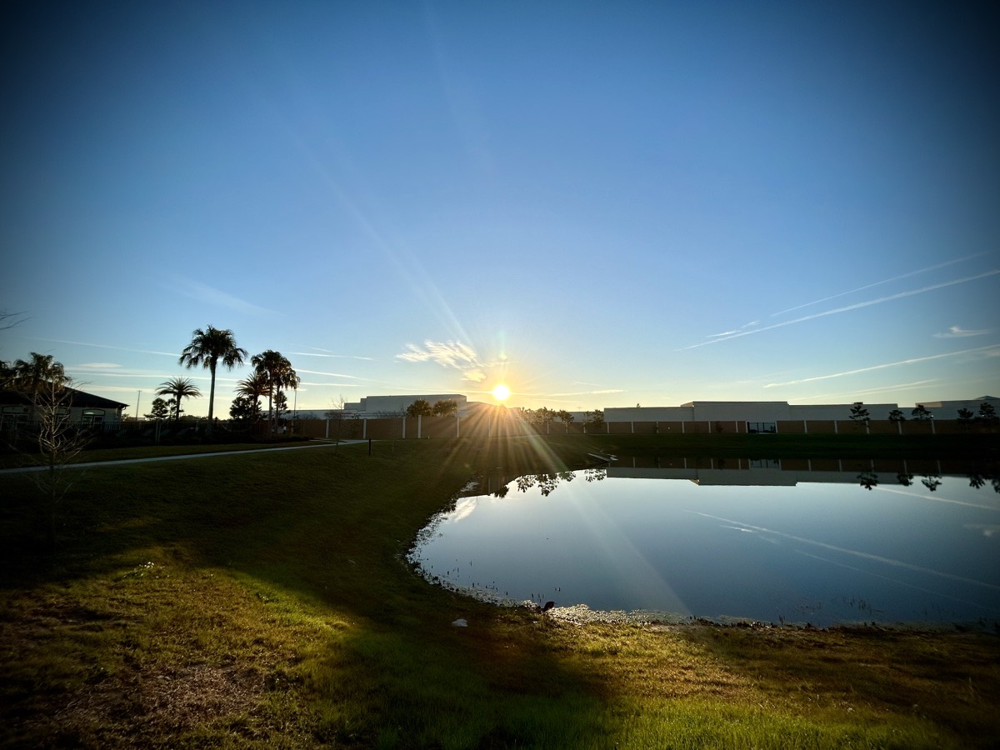
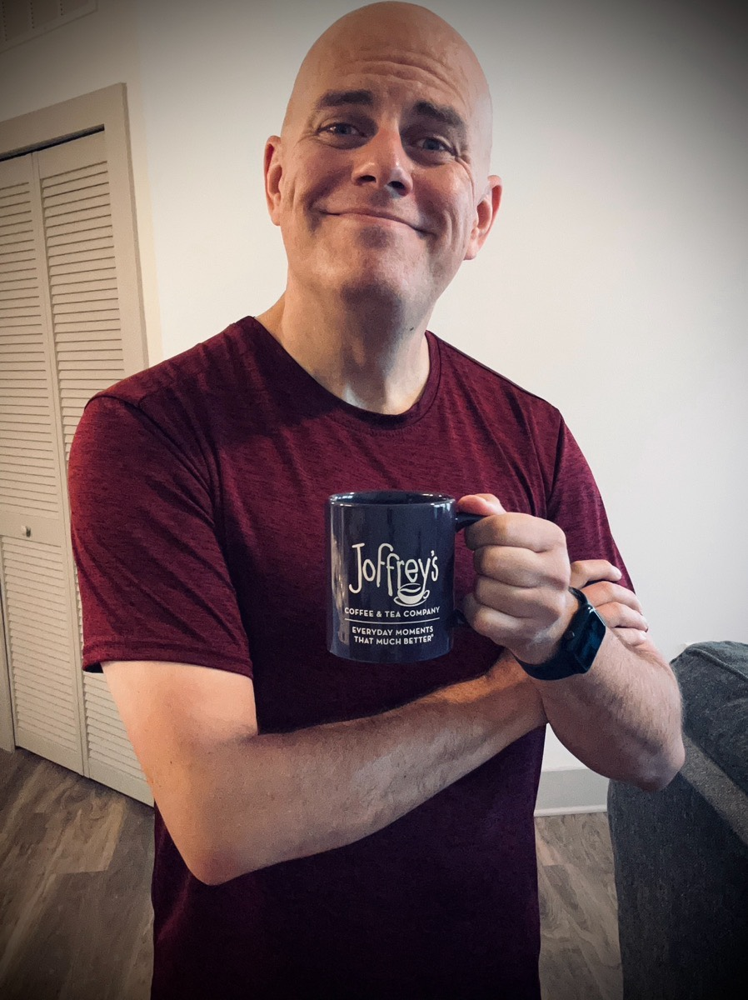

# Sites, Acceptance, Tea, Play Ball!, and Judge Doom

## Website

I've been giving my new website some thought. I like the way my blog is going. So far, it has just been a personal journal. I'll probably keep it that way. Any sort of *blog post* other than a journal entry can be considered an article and will just go on my writing site instead of this blog.

I've already established the art site. I just need to get busy moving my existing art pages from the old site to the new one. Then I can begin publishing the rest of my existing art and any new art as I create it.

I'll create a photography site to hold all of my photo content. I'll just publish low resolution copies of my photos. I may sell some photos someday. So I don't want to publish the original high resolution photos on that site. Plus I'd want to toss on a watermark for the ones I sell.

I'm not sure if I'll create a recipe and food site again. The last 2 iterations of my website have included recipes. I seem to have some interest from family and friends to have a *cookbook* of some sort. If I do that, I'll create such a site. But I'm not sure. It seems like a good idea. I'm just not good at writing down my recipes...LOL Then again, publishing them on a website would get me motivated to finally write it all down...hehehe

As for my writing, I'm not quite sure what I'd call that part of my site. And I'm not sure if I'll lump it all together or make separate sub-sites. I have books, stories, poems, haiku, and articles. Does all of that belong under a single umbrella? Or do I divide it up a little? Decisions, decisions...hehehe

If I ever get around to producing music again, I'll probably setup a music site as well. Between singing covers or writing my own music, I'm more likely to post them on my own site instead of trying to sell any of it. With covers, I'll have to deal with licensing. With my own music, I'm not sure if anything I can come up would be worth selling. So it is mostly just for friends and family to enjoy if they want to...hehehe

## Vitamin G-ish

It was another day without any specific inspiration for Vitamin G. But I did make a post. It was a beautiful sunrise and I felt cute enough to post a coffee selfie...HAHA That's enough to inspire a little note. And it seemed to be well received.

*Please get outside if you are able. Your body, mind, and soul needs you to take care of yourself 🤗 Don’t be overwhelmed. Just do the next right step. After that, do the next right step… [and repeat]*

This is the philosophy every over-thinker needs to adopt! I've been trying to employ this philosophy more and more. It seems to be working really well right now.

## Work/Change

I attended a meeting today where they presented some info on how to deal with change and transition. The company is doing its best to help us all through what is currently going on. I do appreciate that. It just feels like corporate dribble some times...hehehe Today's felt genuine, though. It wasn't material being presented by a third party. It was internal employees who know and understand our actual culture. So I'm glad I tuned in.

I wish I had better notes from the meeting. All of the info was presented pretty quickly. It was a lot to take in and only an hour to consume it. One of the concepts that I can relate to is that changes like what we are going through now can be like a puzzle without the box top. There is a picture we can slowly figure out. But without knowing what the end result will be, we need to sort of feel our way through it. That makes sense to me!

They also went over the different between change and transition in the context of what is going on. Change is external. It is what is happening to us. Whereas transition is internal. It is how we are personally processing the change. Change is happening no matter what. I get to ride this transition going on in my mind and I'll make the most of it.

I'm starting to accept this change and I'm really looking forward to what is to come. It's like I have gone through the stages of grief already. That is a bit strange for me, to consider going through them so quickly. But it is just a job. I'm fine being at the acceptance stage already...LOL

## Afternoon Tea

I rarely drink an afternoon tea. When I do, I truly enjoy it. I may make it a regular thing. Right now, I have a raspberry rose herbal tea from [Joffrey's](https://joffreys.com/shop/tea/rooibous-herbal-teas/raspberry-rose/). I've had another of their teas before and really liked it. On my last coffee order, I included this tea in the order.

Although I exclusively drink Joffrey's coffee at home, I'm not necessarily going to drink their teas exclusively. I'll probably seek out other brands. Drinking tea would be more for my health than anything. Coffee isn't about health. It's more about tradition...hehehe

I hear some teas have nutritional properties that can help with my health. I don't have any specific concerns. But balancing out such things a electrolytes are a better way than drinking those fitness beverages and pedialyte.

While I was running today, I had a brief moment when I wanted to give up for the day...give up on the run, that is. It wasn't that tough a run today. I just wasn't feeling it. I quickly shook that off and had the thought, *I'm tired of giving up*. That attitude can really make a difference! It sure did on my run! I didn't hit my personal best today. But I sure did feel fantastic at the end of my run. And I was reminded afterward that a year ago I couldn't even run at all!

With this inspiration, I decided to do an afternoon post.

*Afternoon tea by Greg Marine: When I think about giving up, I remind myself I’m tired of giving up. Sure, I also get tired of the “keep going” sometimes. But it has cost me more to give up 😉 When you feel like giving up, please know I’m rooting for you!*

## LA Dodgers

Today was the opening day of MLB Spring Training. I've never watched a Spring Training game before. My first exposure to this part of the MLB season was when I first moved to Florida. Not too far from where I live is one of the major MLB Spring Training areas. Most of the Florida training facilities are a quick drive away! They might all be right here, actually.

I use to follow MLB teams like the Cubs and the Braves. I eventually lost interest. I'm one who really enjoys the stadium experience. I don't enjoy watching sports on TV nearly as much. I'll sometimes watch American Football. But even that is rare.

I decided to give the Dodgers a try this season. Oddly enough, it wasn't because of the new players they contracted with in the off season. I hear it was the biggest deal in MLB history or something...hehehe I don't really know anything about that. I decided to follow them for a girl...HAHA

Chérie has been a huge support over the last year. And she's a huge Dodgers fan. I wanted to support her interest in the team. That's the good thing about team sports. There is a team spirit outside of the team itself. I thought it would be fun to give that a try for her. If I can't keep my interest going throughout the season, I hope she doesn't hate me...LOL I know she won't...hehehe

Our friendship is not based on the Dodgers. It'll be one of my new things this year. That's all. Something fun for me to try. And it gives us something else to talk about. When I make a trip out to California, perhaps we'll see a game together if it works out that they're playing in LA or Anaheim. I hear Anaheim is a better stadium. And if I recall, it is closer to Chérie anyway.

By the way, they won today. It's just Spring Training and doesn't officially count for the season. But just imagine if they win the World Series this year! That would mean they'd have won the first game of the year and the last...that's pretty cool!

## One Seriously Disturbed Toon

So, I'm watching *Who Framed Roger Rabbit* for the millionth time...LOL I wanted something playing in the background as I wrote this journal entry. When I do that, I usually turn on something I've seen so many times that I can enjoy it without paying close attention to it.

It reminded me that I want to do a Disney bound of Judge Doom...hehehe Well, technically, it would be more of a cosplay thing than Disney bounding. Even though the movie was featured back in the 90's at then Disney's MGM Studios, the movie isn't actually Disney.

I have a pair of glasses I use for my Olaf bounding that actually make me look similar to Judge Doom. With my weight loss, my face structure resembles that of Christopher Lloyd's in the late 80's. If I find glasses like the ones he wears in that movie, and get a black hat, I could put together a look like Judge Doom...LOL I probably wouldn't wear a similar trench coat, though. The only time I could do that is on the coldest of winter days here. With it being an all black look, the Florida sun will make me warm even on a cool day.

I think I could pull off that look really well. And I find it fun to do bounding and cosplay. I've done it for Star Wars during the Star Cruiser experience I did in August and Olaf on Thanksgiving in November. I want to look into doing other Disney characters. And this Judge Doom idea sounds perfect for me too!

## Bedtime

Oh, would you look at the time. I need to start heading to bed. Another good day this week. I loved today!