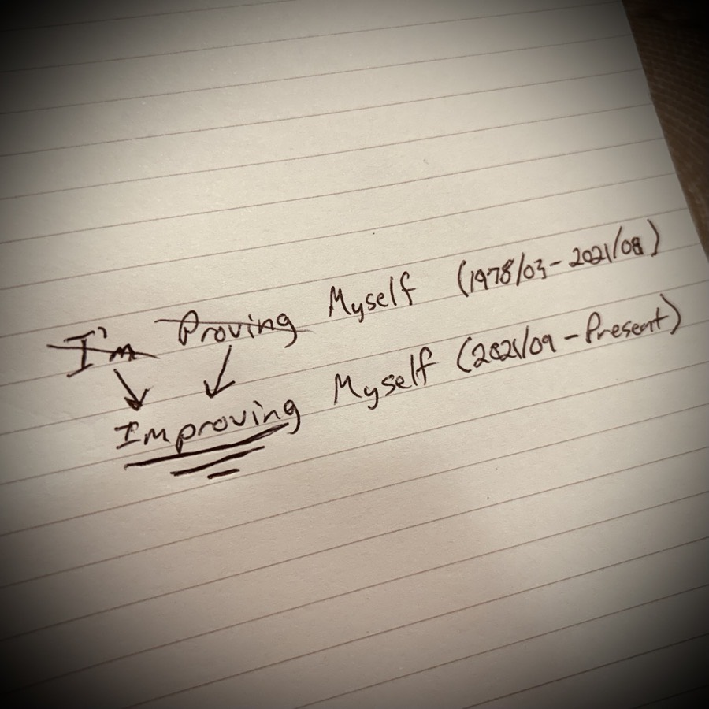

# TBD

One of the nice things about being along in this time of my life is I have a great amount of time to reflect. That can also be a curse...hehehe But today, I'm going to focus on the positive side of this. That is one of the many things God has been working on in my life. He has been helping me focus on the positives.

Lately, I have been reflecting on those relationships I have that are uplifting. Those that add to my life as opposed to taking something away. And conversely, which relationships where I add to their life as opposed to taking something away from them.

This isn't limited to relationships that are ongoing, either. Even with a once in a lifetime interaction, a sort of relationship is formed in some way. Even simply smiling at a random stranger can leave an impact on that stranger that they carry with them the rest of their life.

Each interaction I have with others provides me an opportunity to learn what can add to someone's life and what could take away from them. I do not always know what impact I have made on someone. In fact, that isn't ever really for me to know. My responsibility is to always grow as a person and child of God with each impact I make.

Something I am learning in these reflections is that the trauma I've experienced has given me too strong an appreciation of the little things. That may sound slightly odd, but please allow me to explain. When someone does anything for me, it is as if it is the best thing to have ever happened to me. Even if it is simply talking to me while waiting in line at Disney, I get overly excited that someone is talking to me...hehehe

I've learned to tone down my excitement, though. I'll sometimes still internalize my excitement. But I have tamed my outward reaction. It seems as though the people who have never experienced my level of trauma understand how the littlest of blessings can mean so much to someone like me. And that's okay. I get it now really. I still express my appreciation. Just in a more normal way I guess...hehehe

I'm experiencing a great deal of pain in my jaw today. So much so that I have taken Tylenol a few times. I was working today and needed to be able to function. After all, I just took a little vacation...LOL Oddly enough, I was quite productive with work despite the pain. That's unusual for me.

This jaw pain is the result of all those years of neglecting my health. My mouth is a complete mess. It looks like I have been smoking meth for years; although I have never done that...hehehe I'll need a completely new set of teeth for my entire mouth. That will also be a painful experience...when I actually have it done. On the bright side, I have an extremely high tolerance for pain. God will get me through all of this as He already has...hehehe

I saw a post today that said something to the effect of *stop proving yourself and start improving yourself*. That inspired me to make a note in my physical notepad...

From birth through August of 2021, I spent all of my effort on proving myself. Whether it was to make my parents proud of me, or trying to get people to like me, I would do just about anything to gain approval. I didn't know what it was like to approve of myself or accept who I was.

In September of 2021, however, I broke free. I had my renaissance creatively, and it was the first time I had ever experienced peaceful rest. This was when I truly began to work on improving myself. Not only did I begin looking at life from a new perspective, I also began using a new mindset.

When I saw that post today, it triggered the reminder of what happened inside me just over 2 years ago. I went from thinking *I'm Proving Myself* to *Improving Myself*. And what a difference this has been making in my life ever since.

I have absolutely nothing to prove. In fact, the only thing I need to know is that I'm a child of God. Keeping a Kingdom focus is all the focus I need right now. Acknowledging God in my life and seeking His Will in and around my life is the sort of mindset that will help me improve.

It is like I was holding on to the chain of an anchor that has been keeping me in place all these years. The whole *hey look I can hold fast and weather this storm* mentality. And although there isn't anything wrong with weather a storm, the truth is that God is bigger than the storm.

I let go of that chain and released the anchor. The moment I did so, the storm ceased. I started to believe the whole *hey storm, look at how big my God is* mentality.

And I've been sleeping well ever since...

I've been improving ever since...

I had thought about making a *Vitamin G* post about this. I've since decided I need to write a poem or something. Or perhaps a short story. Something that tells the story that is meant to be told. This inspiration is far more than a simple social media post. Let's see where this goes, shall we?!?

I had beef broccoli for dinner tonight. I used a Birds Eye dinner kit for it as my jaw pain is just too much to have been my usual chef self. I did add carrots and shiitake mushrooms to it, though. It turned out pretty good.

What I'd like to do in the near future for times like this is to pre-make some meals and freeze them each month. I wouldn't leave them in very long. But they'd be ready for such a time as this. I could easily toss them in the skillet or oven; depending on what the meal was. I'd still have a delicious home cooked meal while I fight through the pain...hehehe

I ordered 2 LA Dodgers mugs the other from the MBL Shop website. I just checked on my order and it looks like they are shipping now. The latest update was within the last hour. So UPS hasn't actually picked up the package yet. Hopefully I'll have an ETA by tomorrow. I'm glad they'll be here in time for the season opener on my birthday...hehehe

