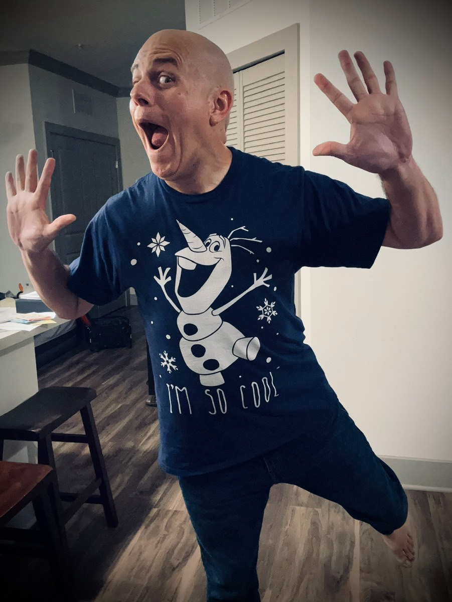

# I'm So Cool! j/k

Happy Birthday Grandma! She turned 89 today. I'm one of the lucky ones who still has a living grandmother at my age. There are so few left from her generation. I only have a few aunts and uncles left myself. I'm grateful to still have who I have. I didn't call her today, though. She can't hear anymore. So I could only text her.

We still text almost every day now. It's kinda funny how moving away has brought me closer to my family in Indiana. The exception would be my son. He and I rarely talk. He has his own life now. He does give me time when I go up there, though; which is nice. I'm trying to get him to come back down here this year.

I managed to get through the day without taking any Tylenol...woohoo!!! There is still a level of pain today. But my jaw feels quite a bit better than yesterday. On a 10 scale, I'd say I was at around a 7 or 8 yesterday. Today, it is below a 5. I imagine I'll wake up feeling no pain.

I attempted a new sleep technique last night. I failed with it. However, I think that was because of the pain. I set my white noise app to turn off after 7 hours instead of 8. I only require about 6 and half hours. But keeping the white noise going seems to keep me in the sleep zone up to and sometimes well past 8 hours. So I've decided to start pulling the app back a little. I'm starting with 7 hours.

What happened this morning after it turned off was a mental choice to stay in bed. I ended up sleeping an extra hour to make it 8 total still. I talked myself out of getting up because I knew my body is healing from the infection causing my pain. I'm glad I did! Going all day without medication is a huge win! So, when I say I failed with my new technique, I'm using the term loosely...hehehe

I sure have been missing my workouts...hehehe I'm not an indoor workout person. So it has been a little rough in that area this Winter. I don't feel like going to my gym at the complex to use the treadmill. The good news is I'm maintaining my weight. I'm no longer losing or gaining. I've managed to use this lull in workout activity to figure out the right amount of calorie intake based on my level of activity for the week.

When I'm highly active, like I was last week at Disney, I eat more. When I'm not quite as active, like this week since I've been home, I back off a little with how much I consume. All while maintaining a balanced diet. So far, this has been working really well this Winter. It's funny how I never thought about such things prior to a year ago...HAHAHA

I'm looking forward to warmer weather and being outside more. I'll be able to get back to my regular running routine as well as kayaking and paddle boarding. I haven't been out on the water since November. Perhaps next Winter I'll plan some trips down to the Keys so I can still get in some quality H2O time...hehehe

It's raining right now. I love the rain these days! I think I may have talked about it before. How I always hated Indiana rain but love Florida rain...hehehe I'm not sure if we needed it. But I'm so grateful for it. I hear there is a possibility for severe thunderstorms over the next day or so. We had one on Sunday that woke me up. It was at just the right time for me to get up anyway. So it worked out well, actually.

I bought a new shirt a little bit ago. I haven't yet shown it off. I love the shirt. But it is a little too big. I ordered it before I was ready to try medium shirts. So, it's a large. It fits fine, really. I just feel more confident in mediums now. Which is funny because I only have 2 so far. All of my other shirts are larges. I wish I had bought this one as a medium, though. It was right before I got those 2 medium shirts. Anywho, here it is!

*I'm so cool!* Right?!? HAHAHA Anyone can see why I love this shirt. I suppose I should start wearing it outside my home. It isn't like I look fat or anything. I no longer carry body shame. I sure use to. But those days are gone now. I'm still slowly getting use to standing tall(ish) and trying not to care what other people think of how I look.

The Dodgers are playing the Angels right now. I hope they win tonight. I can't be their good luck charm for this game...hehehe It isn't available here this time. I fell asleep to one of the games last week at Disney. They carry the MLB network at the resort...hehehe It was nice to be able to connect with them while on vacation.

Speaking of Dodgers, my mugs do not have an updated ETA yet. Per UPS, it appears they are still at the warehouse. The MLB Shop website shows they have shipped. So they must be in a box ready to be picked up by UPS. Or they were picked up by UPS and still in transit to the first hub. Or, and more likely, pirates have taken my mugs!!! HAHAHA j/k It's fun to imagine the craziest backstories for these things...hehehe

I'm shopping for a new Bible. I've only been using the Bible app for the last few years. All of my Bibles were destroyed in a flood a few years back. I lost a lot of stuff in that flood. Life happens that way sometimes. The saddest part is how old some of those Bibles were. One of them was the one I had since I was a child. Another was a Thompson Chain Reference Bible my parents gave me when I graduated high school. And if memory serves, that is when I lost my Hebrew and Greek references as well. Hundreds of dollars in Bibles, just gone...hehehe

It will take a while to rebuild that collection. I do feel a little guilty it has taken me this long to decide to start rebuilding my library, though. I've gotten use to using the Bible app. It's a very useful tool. But it isn't the same as the physical books. And now that I'm reading physical books this year other than the Bible, I've gotten the itch to do the same with the Bible. Wish me luck! Maybe I should build a little ark to put all my Bibles in so they float in the next flood...LOL

Speaking of the Bible, I'm getting close to the end of Numbers. It looks like I'll be finished reading it this week. Then on to Deuteronomy. I've been enjoying going through the *Bible in a Year* plan. I've been doing other studies outside of that. But I think I'll be looking into some new studies soon. I'd like to dig deeper...