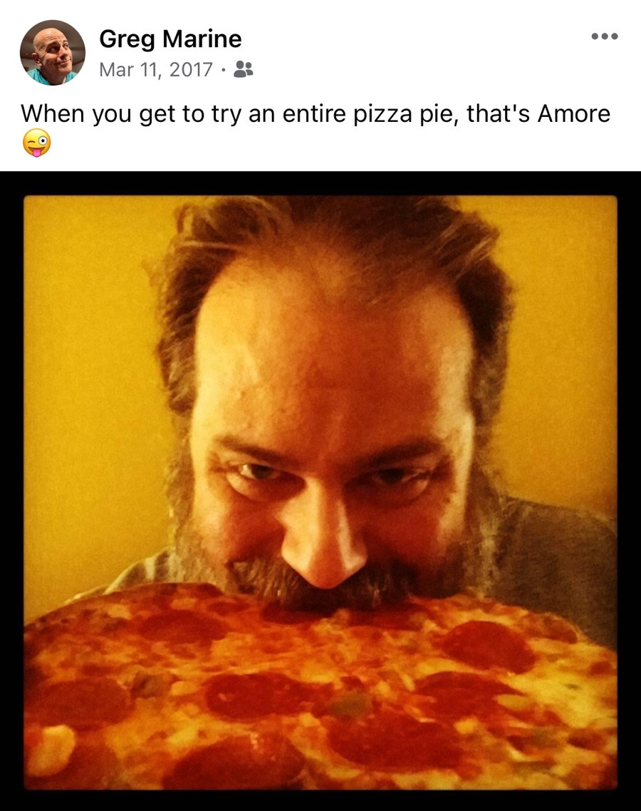

# TBD

## Laughing Seagulls

Growing up, my family semi-annually visited Florida for vacation. That's when my love for Disney and the beach began. I absolutely loved that yearly trek down to the Sunshine State. I never remember if we did Disney first or the beach. But it was almost always both.

For the beach, we often stayed at this little condo called The Beach Comber on Longboat Key. By today's standards, that condo building is basically a shack...hehehe But back in the day, it was the most luxurious accommodations this wanderlust kid had ever seen...LOL And I *survived* a tropical storm there once!

One of the things I can vividly remember is we always bought a loaf of bread to feed the seagulls on the beach while we were there. One of the most fascinating things to me as a child was there ability to hover above us and catch the pieces of bread in mid air!

With those squiggly analog lines all over the screen, fast forward to now...hehehe I see seagulls every :clap: single :clap: day :clap: LOL They no longer fascinate me...HAHAHA I don't really hate them or anything. They are just *everywhere* here...hehehe

What I noticed most about them now is that they sound like they are laughing at me...LOL That's right, *laughing*! At *me*! Of course, they aren't really. But when they are in groups and squawking at each other, that is exactly what they sound like to me...LOL I go to the beach, laughing :laughing: I go to the grocery, laughing :laughing: I take a shower...well...they aren't in the shower...but they are probably outside somewhere, :laughing: HAHAHA I kid, of course. It's fun!

## Facebook Memories

Sometimes, Facebook is good about helping us remember fond memories of things we posted about years ago. Other times, it reminds us of things we'd much rather forget ever happened or got posted...hehehe Today, I was reminded of those years when I had long hair, a large beard, and one of the clear reasons I use to be a huge man.

I decided to repost the memory on my Facebook feed with a caption of *This is one of the reasons I use to be huge :rofl: Back in my long hair and big beard days :woozy_face:*

When I post stuff like that, I'm hoping for a laugh, or for someone to join in on the sarcasm. It's supposed to be fun. But there is usually one or two people who don't really get that and make other comments. That's why I didn't post it on my public social accounts. Just my private Facebook account.

Well, one of my friends texted me directly with their response. I'm glad they didn't post it on my page. It was the sort of comment that makes me not want to post about stuff like this. I'm sure their intentions were noble. But it stung a little. What can you do?!? I'll brush it off, I guess. I'm journaling about it in hopes that I won't let it bother me.

It actually wasn't anything mean. I just feel like they know me well enough to know that what they said might not be what I needed to hear. I suppose I am wrong. And that's okay. I don't hold that against them. I could have just talked to them about how I really feel. I'm honestly at a point in my life where I can express how I feel in a constructive way. I chose not to in this case, however.

If I do a similar post in the future and get a similar response, I will likely say something then. There is also a chance I'll sleep on this tonight and decide to talk about it with them tomorrow...hehehe I care about this person and I don't want there to be anything between us that might cause me to drift apart from them later. I just need to decide how much this bothers me. Can I just let it go? Or do I *need* to talk about it? The answers to those questions will dictate what I should do.

Above all else, prayer! I'll definitely be praying about it. It is the type of thing that I need to pray about. There is no question about that! I have found so many answers through prayer and scripture as of late. God will guide me to what I need to do. I praise Him for that! The reason I question myself on this is whether or not I'd be making them feel bad for making me feel bad? That's a constant struggle for me...hehehe

