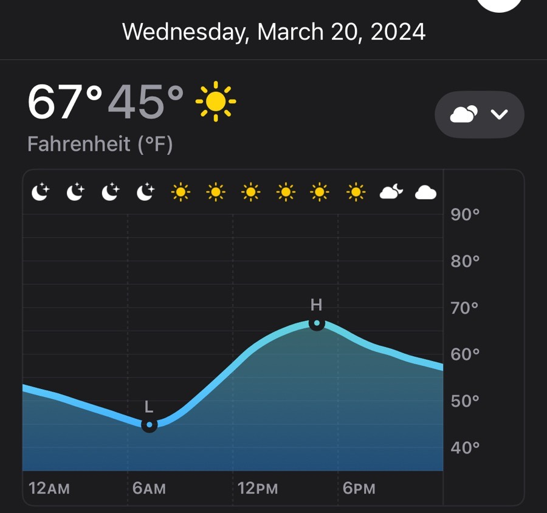
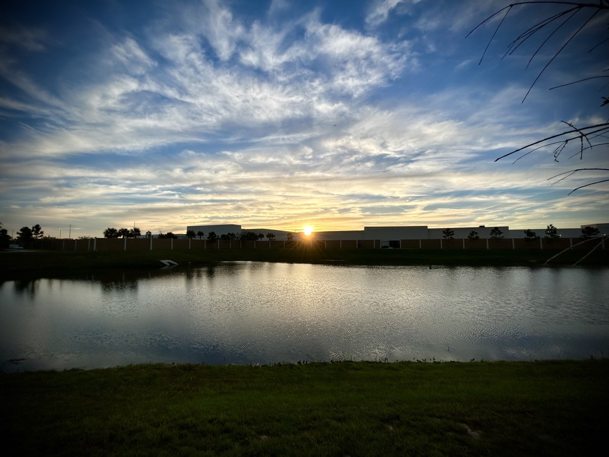

# Seagulls, Facebook Memories, Church, and Mind Prison

## Laughing Seagulls

Growing up, my family semi-annually visited Florida for vacation. That's when my love for Disney and the beach began. I absolutely loved that yearly trek down to the Sunshine State. I never remember if we did Disney first or the beach. But it was almost always both.

For the beach, we often stayed at this little condo called The Beach Comber on Longboat Key. By today's standards, that condo building is basically a shack...hehehe But back in the day, it was the most luxurious accommodations this wanderlust kid had ever seen...LOL And I *survived* a tropical storm there once!

One of the things I can vividly remember is we always bought a loaf of bread to feed the seagulls on the beach while we were there. One of the most fascinating things to me as a child was their ability to hover above us and catch the pieces of bread in mid air!

With those squiggly analog lines all over the screen, fast forward to now...hehehe I see seagulls every :clap: single :clap: day :clap: LOL They no longer fascinate me...HAHAHA I don't really hate them or anything. They are just *everywhere* here...hehehe

What I notice most about them now is that they sound like they are laughing at me...LOL That's right, *laughing*! At *me*! Of course, they aren't really. But when they are in groups and squawking at each other, that is exactly what they sound like to me...LOL I go to the beach, laughing :laughing: I go to the grocery, laughing :laughing: I take a shower...well...they aren't in the shower...but they are probably outside somewhere, laughing :laughing: HAHAHA I kid, of course. It's fun!

## Facebook Memories

Sometimes, Facebook is good about helping us remember fond memories of things we posted about years ago. Other times, it reminds us of things we'd much rather forget ever happened or got posted...hehehe Today, I was reminded of those years when I had long hair, a large beard, and one of the clear reasons I use to be a huge man.

I decided to repost the memory on my Facebook feed with a caption of *This is one of the reasons I use to be huge :rofl: Back in my long hair and big beard days :woozy_face:*

When I post stuff like that, I'm hoping for a laugh, or for someone to join in on the sarcasm. It's supposed to be fun. But there is usually one or two people who don't really get that and make other comments. That's why I didn't post it on my public social accounts. Just my private Facebook account.

Well, one of my friends texted me directly with their response. I'm glad they didn't post it on my page. It was the sort of comment that makes me not want to post about stuff like this. I'm sure their intentions were noble. But it stung a little. What can you do?!? I'll brush it off, I guess. I'm journaling about it in hopes that I won't let it bother me.

It actually wasn't anything mean. I just feel like they know me well enough to know that what they said might not be what I needed to hear. I suppose I am wrong. And that's okay. I don't hold that against them. I could have just talked to them about how I really feel. I'm honestly at a point in my life where I can express how I feel in a constructive way. I chose not to in this case, however.

If I do a similar post in the future and get a similar response, I will likely say something then. There is also a chance I'll sleep on this tonight and decide to talk about it with them tomorrow...hehehe I care about this person and I don't want there to be anything between us that might cause me to drift apart from them later. I just need to decide how much this bothers me. Can I just let it go? Or do I *need* to talk about it? The answers to those questions will dictate what I should do.

Above all else, prayer! I'll definitely be praying about it. It is the type of thing that I need to pray about. There is no question about that! I have found so many answers through prayer and scripture as of late. God will guide me to what I need to do. I praise Him for that! The reason I question myself on this is whether or not I'd be making them feel bad for making me feel bad? That's a constant struggle for me...hehehe

I don't want them to second guess everything they say to me just because I felt a little sting this time...you know? So, I am approaching it with their thoughts in feelings in mind as well as my own. This feels like a healthy way to approach it. Perhaps that's my prayer. *Lord, please help me find the words that will convey my own feelings whilst being mindful of theirs. In this way, our friendship will strengthen and You will be Glorified in this friendship transaction.*

## Birthday Weather Report

The weather for about the next week is going to be wonderful. That is, until my birthday...LOL My birthday forecast became available today...hehehe There is still hope and a chance that the weather will shift by then. Here's to hoping :crossed_fingers:

It will likely be a really nice day regardless. But if it is going to be as cool as forecasted, I will not be going out on the water...hehehe I do not yet own thermal active wear. I do plan to own some. I have just been waiting for my weight to be in its final place. I'm really close. Just not 100% on *target* yet.

I'm certain I do not want to go to Disney that day. So, if the water isn't an option, I may do some exploring around my region again. There are so many places I have yet to see that are in a short distance from my apartment.

## Calvary Chapel Golden Springs

Yesterday, I virtually *attended* the Sunday service for [Calvary Chapel Golden Springs](https://www.calvarygs.org/) in Diamond Bar, California. It's the church Chérie use to attend and she still watches. And she was actually there at the church yesterday! I watched the same service she was attending yesterday. It was like we went to church together; at least from my perspective. Her perspective, I can imagine, would have been a little different considering she was physically there...hehehe

Although I was in my own living room, I still stood and sang the songs along with the congregation. I opened my Bible and followed along as Pastor Ries was teaching. I made notes in my notebook. All as if I was sitting right there in the sanctuary. It was an experience I would like to continue for a little while and see how God uses this.

The sermon style was reminiscent of what I experienced growing up. It was unlike the sort of style typically found in churches these days. I found comfort in the fact we were hearing the full context of an entire chapter of 2 Samuel; chapter 12. Sure, there is value in the modern church doing life application style sermons. However, I can do a life application study on my own. At church, I want to worship and do a more in depth contextual study of the meaning of the Word.

There will definitely be more on this to come...whether it be more of Calvary Chapel, or some other way of me digging deeper into God's Word.

## Balance

After I recorded a *sit with me a minute* video for Chérie, I took today's *Vitamin G* photo. And then I wrote these words:

> For many, yesterday started out rough and continued through the day because of the time change 😱
>
> It was a reminder that how the day starts can affect the entire day. Likewise, how we end the day can affect how the next day starts! Let’s be careful how we begin and end each day.

It seems to be common that people have trouble adjusting when we *Spring Forward* and *Fall Back* each year. I always prepare myself for it. In the *Spring*, I'll go to bed an hour early. In the *Fall*, I'll stay up an hour later. But I've trained my mind to sleep on a schedule not directly based on a clock. Perhaps that isn't common?

Regardless, this inspired me to write today's post. Not only does how we start our day affect the entire day, how we end the day can too. That is why I have mindfully considered this over the last several months now.

I'm getting to bed a little later tonight than I'd like. But today's journal entry was just that important. I had things I needed to *talk* out. And I know that if I didn't journal tonight, I was going to wake up with the wrong things on my mind...hehehe

I probably would wake up tomorrow thinking about that text I received today. Now, I know I won't. Or at the very least, it won't be bothering me anymore. Likewise, my early morning hours of prayer and Bible time have consistently led me to having a positive mindset for the rest of the day.

I learned a year ago through experience the importance of diet and exercise for my physical health. Later in the year, I learned the importance of sleep, meditation, and prayer for my mental and spiritual health. Getting started is probably the hardest part. But once I got into the right cadence, it has become one of the easiest things for me.

It all comes down to balance, doesn't it? Consistent and purposeful balance. This has also afforded me the flexibility to introduce new and exciting things in my life. Unexpected things, really. Including a new habit of reading. The sunrise hits me differently now. And the birds' song is much sweeter.

My mind prison cell still shows up from time to time. The anxiety monster grabs hold of me and drags me back in there. However, it seems as though I'm much quicker at realizing I'm not stuck in there anymore. After I sleep, I wake up and walk right out that prison cell.

I praise God for this balance. I imagine someday I won't sleep in that mind prison any longer. For now, I'm glad the warden (me) at least installed a new comfy mattress...LOL