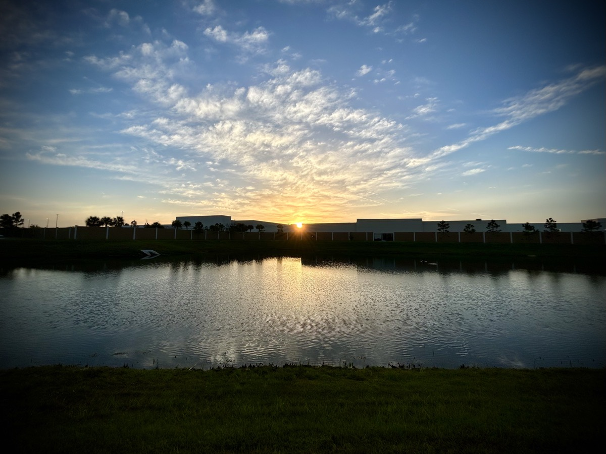

# TBD

## Before and After Text

Well, I slept on it. I've prayed about it. And I believe the answer is to let lying dogs lie. It was a brief moment of reacting to the text. I know for certain they did not intent to cause any sting. They were simply telling me that the way I looked before wasn't any less beautiful than how I look today. And they just don't know me well enough to know what I was feeling 7 years ago.

When I was obese, had long hair, and that hideous beard, I was at a time in my life when my outward appears directly reflected my inward state of being. I purposefully let myself go in every way physically because my soul was in anguish. There were other signs that I was suffering inside. But my outward appearance seemed to most to just be how I was built. It was not.

My friend just didn't know me at the time. And most people didn't know I was doing this to myself to help cope with those inner demons. So, just as I let go of my former self, I'm letting go of that text yesterday.

## Early Phone Call

I prefer my morning solitude regardless of where I am. Those first few hours of the morning really aren't a time to engage with me...hehehe It has nothing to do with coffee either. Coffee isn't that *pick-me-up* that it is for other people. It is more of a self awareness that until I get my mind going, interacting with me is somewhat pointless. A simple *good morning* or a smile is always welcome. But a true discussion of any kind will likely be met with a blank stare of, *I see your mouth moving but I am not comprehending your words*...hehehe

I'm sure it is because I am a thinker. I immediate start thinking the moment I'm awake. Having the *Lord's Prayer*, morning devotional, and prayer time has made a huge impact on training my *thinker* mind to focus on the most appropriate things. But that also means, at least for now, I need that time in the morning before I engage with other people.

This morning was like most mornings. I did all of the things I *need* to do in order to start my day off right. And I'm sure glad I did! Because, shortly after work began, I received a text asking if I could talk for a moment. That moment became somewhere around 45 minutes...LOL Before I dig deep into that, the topic of conversation was something God asked me just this morning to pray about. Well before the call, I was praying for the very thing that was about to come into my day. How great is our God?!?

This person had been needing to talk to me for quite some time. It was a difficult subject and they weren't sure how I would react. They even said so much as that when we were talking. I won't go into the specifics. I'm happy to discuss these things offline with my prayer warriors directly. It isn't appropriate for me to write it out in this journal.

I can certainly understand why they felt concerned how I might react. They know me from a time when all I did was react to things as opposed to respond to them. There is a huge difference in attitude between reacting and responding. When I react, I'm a human who might be angry, scared, judgemental, or take things personally. When I respond, I pray and mindful approach the situation with grace and mercy. My reactions are fueled by my sin; whereas my response is fueled by acknowledging my Creator.

Well, this person has known me for almost 24 years. And in those years, has mostly seen me react to things. They had no idea I start my days the way I do now. I believe over time, they will come to realize that I'm a responder now. And that my first task as a responder is to go to prayer about stuff. Reaction has become proaction for this guy. Who would have thunk it?!? LOL

I still have something to deal with later today concerning this matter. I've been praying about it and I feel God has supplied me with the attitude and words for dealing with the sensitive nature of what it is.

## Work Update

Last month, we got the news that the work I do, along with many others, was being outsourced. And as part of that announcement, many of us employees were going to be moving to the company the work was being outsourced to. At the time, they informed us that in early March we should expect to begin hearing if we were going to be offered our jobs at the new company.

Today is the 12th of March. *Early* March is almost past...hehehe In a meeting today, they asked us if we had anything else to discuss. So I raised the question of what the status was for these changes. With a humorous tone, I reminded them that we were told early March and that *early* March was almost at its end...LOL We all chuckled at that remark. I do that in these meetings to lighten the mode of the heavy ended questions I raise...hehehe

The update was well said and pretty much came down to the process was a little bit more involved than originally estimated. It is now predicted that there will be multiple rounds of change overs throughout the remainder of the year. So, even if we aren't in the first set of people moving, there is still the likelihood of being moved over at a later date.

I thanked our VP for his candid response and, again with humorous tone, said *so no news isn't really bad news at this point*?...hehehe He chucked and agreed. There isn't anything to be concerned about at this point. I'm honestly not concerned. I'm just one who prefers to have answers to the questions rolling around in my mind. Even if the answer is in the negatory sense, and answer is better than not knowing.

## Poem

Instead of a *Vitamin G* post today, I was inspired to write a poem. It was simple. But has a lot of meaning:

> There’s a chill in the air\
> Then the sun hits my face\
> Like a warm hug\
> Warmth envelopes my soul\
> \
> Trouble remains\
> But no longer controls\
> Seagulls laugh at my troubles\
> I join in the laughter\
> \
> Only hope is my focus\
> The pain grows dim\
> My soul grows brighter\
> The light shines within\

I went out to greet the morning sunrise as I usually do. With the time change, it currently happens just before work begins. Today, it was a little chilly out. I decided not to wear a hat and any slight breeze across my shaved head was quite cold...hehehe

As the sun began to peer over the mall across the way, I closed my eyes and just basked. I stood silently for a minute or two and allowed the warmth of the rising sun to penetrate my skin. It was such a peaceful moment that I had alone with God.

After the moment concluded, I snapped the above photo. It isn't unlike many I had captured countless times. But this time it felt different. It didn't feel like I needed to share any wisdom. It felt like I needed to share my heart's inspiration in the moment. Thus, the poem.

I cannot possible describe how the peace felt in words that most people could understand. Only a kind a gentle heart can read the poem and sit in silence for a moment to try and experience the same emotions I felt. It didn't gain much attention on social media; which I'm grateful for actually. It wasn't meant to grab anyone's attention. It is raw. It was intimate. It was only for the heart who can stop for a moment, read it, look at the photo, and then close their eyes and imagine standing there as the sun rose.

## Afternoon Tea

