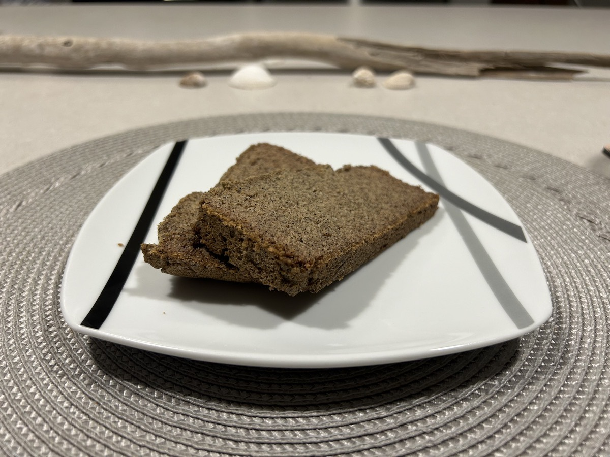

# Buckwheat Bread, Food for Thought, and 3:30am

My heart and mind are wide open. Always have been. This is a double edge sword of sorts. On one hand, that makes it easy for me to course correct when God is helping me navigate my world. On the other hand, when I seek navigational help from the world instead, I can be easily influenced by the world. I need to always feed my open mind and heart with godly influences, not the worldly ones. To be *in* the world, and not *of* it.

## Reflection

> Humble yourselves [with an attitude of repentance and insignificance] in the presence of the Lord, and He will exalt you [He will lift you up, He will give you purpose]. JAMES 4:10 AMP

*God is worthy of all our worship.*

*Picture yourself kneeling before Him, and speak out words of honor and praise.*

I am not worthy to be in Your presence! I am a sinner! Yet You welcome me into your presence. You invite me to be a part of Your story. I praise You for Who You are! Reveal in me all that does not bring You Glory. Examine my heart and know my anxious thoughts!

> Watch over your heart with all diligence, For from it flow the springs of life. PROVERBS 4:23 AMP

*Imagine you have a box in front of you, and you're placing your thoughts into that box.*

*What kind of things would be inside it?*

*As you do this exercise, talk to God about what's on your mind today.*

Things I'm placing in the box: my son, the friends I'm praying for, my work situation, my self examination of my anxieties, my purpose.

## Prayers

God, thank You for Your promise of peace. I may face uncertain and frightening things in this life, but I know You are bigger than my problems. As I walk with You today, help me to remember that no matter what I encounter, You are good. You promise to always be with me - and that brings me peace.

Thank You for deeply caring about who I am. I'm so grateful that one day, You will take away all the pain and hardship I've experienced. But until that day comes, I will trust You and cling to You. I will place my hope in You. I will bring You my pain, and allow You to comfort me.

You are more than willing to give Your wisdom to me. You want me to know how to live a godly life. Please make me eager to listen and discern Your voice. Give me a desire to obey You so that when You speak, I act with joy-filled faithfulness.

Finally, no matter what goes on around me today, help me to stay focused on You. It's when I'm close to You that I find the strength I need to accomplish whatever is before me. So right now, I choose to quiet my mind and refocus on Your presence.

In Jesus' name, Amen.

## 3:30am Anxiety

I woke up around 3:30 this morning with an anxiety attack. And I do mean ATTACK! I was asleep. So I wasn't even having any thoughts whatsoever. My *thinker* was shut down. So, where did this come from?! This particular attack has happened many times before. I often wonder if it is caused by or influenced by the *enemy* in someway.

I'm going to be open and honest here because I feel as though it might be the best for me at this moment in my life. Having been in the practice of journaling this year, I am finding that the more honest and open I am here, the better my reflections are on what I've written. With being so raw and vulnerable here, I question whether or not this should be on the Internet sometimes...hehehe But then I realize the struggles I write about are often common. And perhaps someone will read this someday and find encouragement as they follow along with what God has been doing in my life. When I say *honest*, I'm not saying I'm not normal honest. Because I am. I'm simply acknowledging that sometimes I feel like holding back here. Again, this is the Internet...hehehe

This attack was rooted in financial instability and mistakes I've made over the years. I'm doing well now. But I haven't always been. And I still have a ways to go in this area. With the end of the month coming, my largest bills are coming due quickly! I woke up with this *heart attack* like pain in my chest and my mind immediately went to the question of *do I have enough in my checking account to cover all of it?!?*

The short answer is *absolutely*. The long answer is that God is my provider. I have nothing to worry about. I've had times in my life when my bank account was empty as the bills came due. And then suddenly, the money I needed arrived in time. I can't explain it other than to say God is good to me!

I have also had times when the money still wasn't there when the bills were due. I've been late on payments and therefore paid penalties. These moments weren't caused by a lack on God's part. It was always my fault. And it wasn't a lack of faith on my part. It was poor financial planning. A weakness I still have. A weakness God is still working on...hehehe

Living *in the moment* can be a good thing most of the time. But I also need to be thinking about the next moments that are ahead. If I don't plan, I plan to fail...hehehe I'll probably go through my budget again soon just to validate I'm still on track. I do that more often now because of past failures in this area. I've learned that the more I watch my bank ledger, the more purposeful I am with my finances. I can't just wing it all the time. I want to be a good steward of the resources God has given me :)

## Food for Thought

A few days ago, I wrote some [Food for Thought](./23_new-grocer-food-for-thought-dog-toys-and-frozen.md#food-for-thought). At the time, I had some pondering questions about attachment of people, places, or things to certain emotions I experience ranging from anxiety and doubts to joy and excitement. In my thinking that day, I proposed some attachments might be beneficial and wondered if some might be harmful.

To continue feeding my thoughts, I meditated on this a bit more while I was driving to the Florida Botanical Gardens yesterday. As a part of that *meditation* I also talked quite a bit with myself...hehehe Yep, I talk out loud when I'm alone. It helps me process things. But the best way for me to process is to write...hehehe

I thought about a beneficial attachment I have between my late paternal grandfather and my drinking coffee most mornings. Before his passing, I had the occasional cup of coffee. But I never did like it back then. Once he passed in 2019, I started to drinking it more and more gradually. By 2021, I started to drink it most days. He was a daily coffee drinker himself. I always associated coffee with him.

I only have one bad memory of my grandfather. All the other memories are beautiful. The one bad memory was when I was a very little kid and I dumped a bag of potato chips on the chair a friend of his was sitting in. He naturally scolded me for doing so and I had to sit in timeout. That's it! It wasn't traumatizing at all...hehehe So, if that is the worst memory I have of him, you can imagine just how wonderful his impact was on my life.

His loss wasn't a tragic one either. He lived a long life and lost it through cancer. But he was surrounded by loved ones all the way to the end. I was even able to visit with him just 2 days before his passing. I snapped a photo of he and grandma having a sweet moment smiling at each other. He was a godly man who studied the scriptures consistently in his den. I will see him again one day in the presence of the Lord! Woohoo!!!

So, when I drink that morning coffee, I am filled with joy. We're coming up on the 5 year anniversary of his death. Some of my family seem to still be taking it hard. And understandably so. I wasn't the only whom he made such an impact on. But I can honestly say that the morning coffee has truly helped me mourn his passing with hope instead of sorrow in my own life.

2022 was actually the first year I was able to truly mourn his death on the anniversary. He passed on my third wife's birthday. So the anniversary was always overshadowed by her birthday celebration. Since our marriage ended, I obviously stopped celebrating her birthday...hehehe So that year I was finally able to hit that final stage of the grieving process. The great thing, though, was my coffee routine had already brought me far enough that it wasn't a difficult experience in 2022. And here we are 2 years after that (5 total years) and I'm still not sad. I'm still filled with joy.

As a part of my *food for thought* a few days ago, I further posed the rhetorical question of *what if that person, place, or thing was no longer in my life?* In this case, what if my *coffee* (the thing) was taken away or if I miss a morning and not have any for a day? I can confidently answer that question in the positive. I have days when I cannot have my coffee for whatever reason and it has no impact on me whatsoever. I don't feel sluggish during those days. I don't have any withdrawal headaches from missing caffeine. And I don't feel any sadness towards my grandfather not being with us anymore. Although I attach such great joy to the coffee, the joy does not leave me when the *thing* is missing. This sounds like a very healthy attachment to me. And if I had to give up my coffee, I can let go of the attachment completely because I have let go of the pain of missing him.

I think in my next reflection of this *food for thought*, I'll explore what I think might be a harmful attachment. As I continue to explore this, it is my hope that I can dig deep into some of the sources for my anxieties, fears, and doubts. Perhaps I can turns those into joy, happiness, and excitement.

## Buckwheat Bread

So, I attempted to make Chérie's buckwheat bread tonight...hehehe I hope I succeeded! It was a success as far as it was bread and it was edible...HAHAHA I actually liked it. It wasn't like anything I have had before. I'm hoping I made it as close to how she does so I can experience just a little of what she has experienced on her journey.

Doing things like this can help me pray more effectively for others while on my walk with Christ. The Holy Spirit leads me to things like this. And I'm grateful for the opportunities He provides, such as this. I cannot possibly experience the world as Christ did. And I cannot possibly experience the world as other people do. But I feel there is power in shared experiences and even the smallest of attempts to gain understanding.

Now that I've made it *her* way, I'll experiment with it a bit to my tastes the next few times I make it. Since I do not have any dietary restrictions to consider for myself, I have options to make this bread my own. Although I love to support my friends along their journeys, I have a journey of my own. Experiments like this lend themselves to becoming stepping stones on my path.

