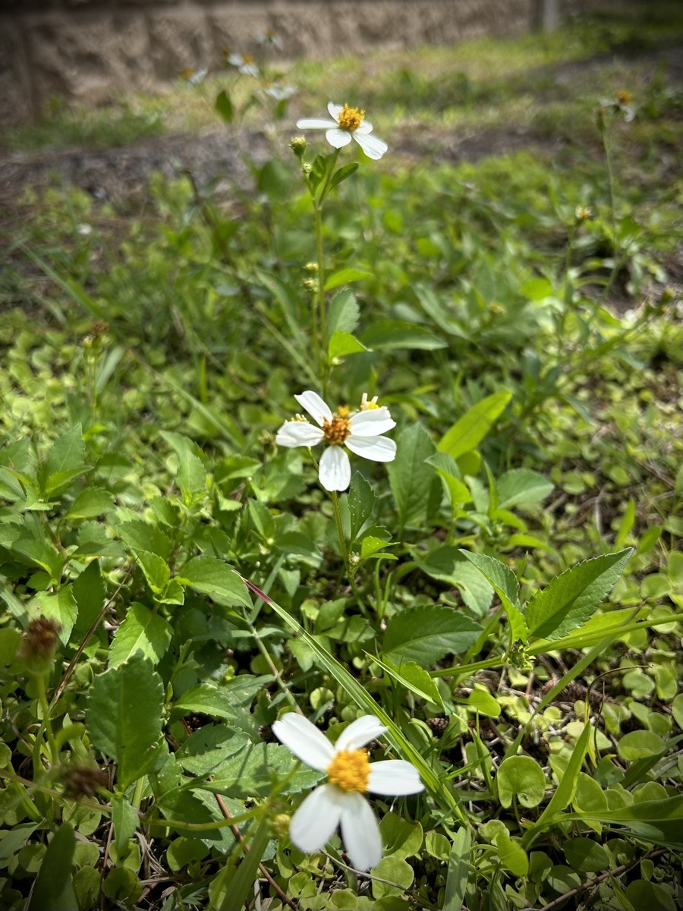

# Wildflowers

I originally wrote this journal entry yesterday. And the tone of it was much different. I erased all what I said yesterday and decided I would give it another chance today. It's okay when that happens. Sometimes I just need to write and then throw it away...hehehe

I've been sad for a few days. It began Saturday evening and has carried on into today. I've been talking to God about it and have been completely honest and open with Him about my feelings. Sadly, this is a new thing for me...hehehe God always knows my heart. So why try to hide anything from Him, right!? I suppose I haven't always been honest with Him concerning my feelings because I always want to try and do the *right* things or say the *right* things. In doing so, I didn't do or say what I was feeling in the moment.

God isn't like people. God wants me to be raw with Him. I have to hold back with most people. I don't need to hold back with Him. He's perfect, after all. He can handle what I need to say. People, on the other hand, can only process what I'm feeling from their own perspectives. They can't always handle what I'm feeling. And they aren't meant to. They have their own troubles in this life. They don't need mine.

That said, I feel as though I have some people in my life now who really do want to know what I'm feeling. I think that way because I'm that kind of person. I have people in my life that I want to know how they are feeling so God can use me to help them. I know I can't be the only person who thinks that way.

Why I hold back most of the time is because I have shared my feelings with people before. And they hurt me by using those things against me. I've spoken about this before and how I've found it difficult to trust people. I don't know how to trust. I don't have a model for how to know what real trust is. These days, though, I will sometimes share my feelings with certain people. I don't expect them to hurt me. And if they do, I'll see it as a lesson learned instead of holding on to any pain the hurt may cause. Live and move on...LOL

My sadness can be related to a multitude of things going on in my life right now. And I've become hyperaware lately of things that make me sad. I think that has happened mostly because I have removed so many distractions this year. I've replaced those distractions with prayer and meditation. My overthinking mind has been in a sort of overdrive these past few months. I almost need to find a distraction to slow it down a bit...hehehe But I don't want to go back to old distractions, such as TV. I need something small and temporary. Not something I could easily fall back into old, bad habits with.

For the past few days, I've been taking extra photos while on my walks. I sent them to a few people and then decided to post them on Instagram and Facebook. I attempted to post them on Threads. But for some reason the post didn't take. The photos have been a positive distraction while on my walks. My walks tend to lend themselves to prayer and meditation. So breaking up my thoughts when I see something I'd like to capture has been a welcome distraction.

Here is a photograph I took today that inspired the message below it:

These three flowers grew and bloomed for this very moment so I could take this very photograph. Not just for my own edification. But more so for His Glory. As a reminder that He is in control. These wildflowers did not clothe themselves. Yet they are clothed in more beauty than anything I will ever wear. They are here today and tomorrow will be gone. Why am I ever anxious about anything. Does not God love me more than these!?!

Luke 12:22-32