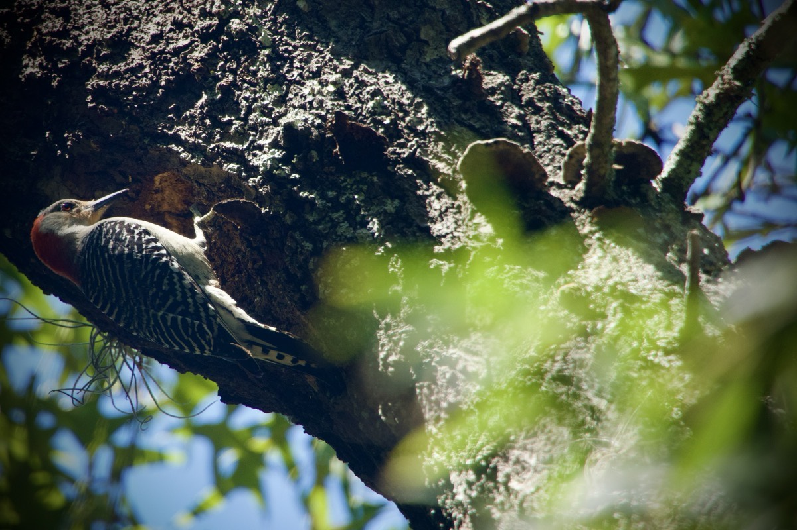

# TBD

## Food for Thought

In part 3 of [Food for Thought](../03/31_my-path-food-for-thought-and-love#food-for-thought), I talked about some negative attachments I've had to people, places, and things from my life in the mid-west. Thankfully, I believe I have overcome the triggers all of that use to cause me. Living in Florida has been just the *reset* I needed, I believe. I am grateful now for the lessons I've learned from that experience.

Today, I'd like to talk about what seems like a positive attachment, but which may actually be negative. I wouldn't go so far as to call it *toxic*. But I'd like to at least examine how it could lead to similar toxic emotions such as those I've experienced from past pain and trauma. Just as negative experiences can be turned around for positive lessons learned, positive attachments can lend themselves to negative outcomes if they are established for the wrong reasons.

In the beginning of this *Food for Thought* journey, I had mentioned I had no anxiety, fear, or doubts about where I was going or what I'd be doing when I explored three botanical gardens on my birthday this year. As I further mentioned, this was unusual for me as I had dealt with those feelings for years. I then explained how I attached a friend to the positive experiences I had that day through my sharing the day with her through videos and photographs.

Before I continue, I will say there is absolutely nothing wrong with enjoying and sharing moments. Positive experiences can remain just that, positive. The thought I'm exploring today is how a positive can become a negative should it be based on the wrong motivation. Even in the following example, I'm actually keeping it a positive motivator through exploring the possibility that it could potentially become negative if not kept in the right perspective. So, only view this as an example.

Although there isn't anything inherently wrong with sharing experiences with others, making unhealthy attachments can fester and cause an experience to because a painful memory should the relationship take a turn for the worse. Not to say that my relationship with my friend will go down that path. 

## Woodpecker

> A home is chosen\
> It must be built with patience\
> The sun lights the way\
\
> ~ A Haiku by Greg Marine (2024/04/05)

A week ago on Good Friday, my employer allowed us all to leave work around 1pm for an early dismal to celebrate the Easter weekend. I honestly wasn't expecting it and it was a very welcome surprise. With the extra 4 hours I was gifted, I decided to visit the *Nature Coast Botanical Gardens* in Spring Hill, Florida.

One of my favorite moments from that experience was the red-bellied woodpecker in the above photograph. I spent about 5 minutes enjoying this beautiful creation working on building some homes in the tree. I took several photographs by which to remember the moment through. As I was reviewing them this morning, I was inspired to write the haiku.

I cherish moments like these. It was simple. It was beautiful. And God has given me the ability to capture such moments through a lens. In this particular photograph, I shot through some leaves in the foreground. It was as if I was peering through into a secret place and watching God provide just what this creature needed to sustain its existence.

In my daily morning prayers, I first recite the Lord's Prayer from Matthew 6:9-15 in the Amplified Version (verses 14 & 15 are quite important). But after I do that, I then speak verses 9-13 in my own words. In regards to *daily bread*, I thank God for all the food and drink He provides to sustain me physically. I follow that up with thanking Him for the prayer and scripture that sustain me both mentally and spiritually. When I look at this woodpecker, or any other wildlife for that matter, I can't help but stand in awe of all that God provides.