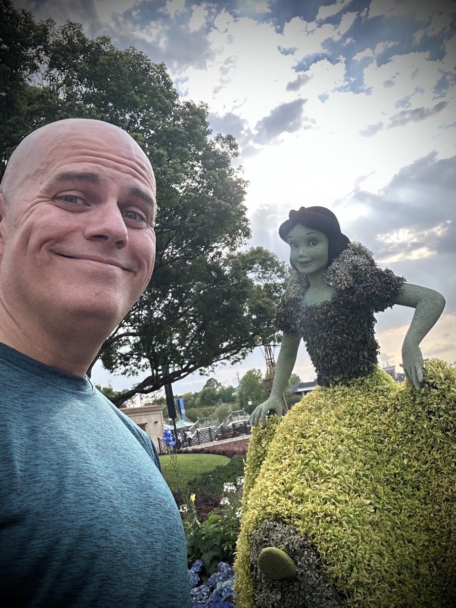
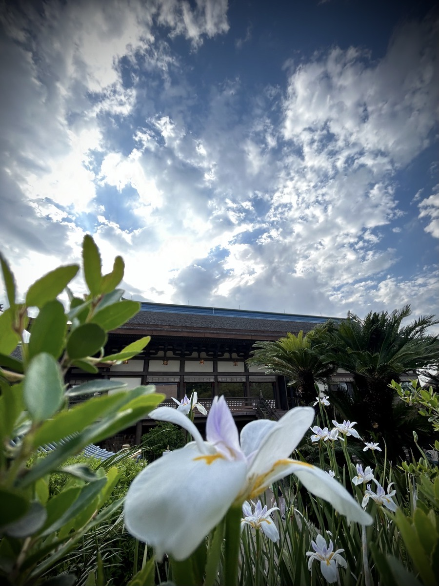

# TBD

## Magical Renewal

Well, it's official! I've renewed my Walt Disney World Annual Pass for another year...hehehe Although I still had some reservations as to whether or not I should renew, I ultimately decided it was a good idea. If I go there at least once per month, it pays for itself anyway. And it is most likely that I will go more than once each month, if I'm honest about it...LOL

As sort of a celebration of the pass renewal, I decided I would treat myself to a quick trip to EPCOT last night. I got out of work a few hours early and drove on over. Once I arrived, I booked a reservation to Teppan Edo, the hibachi grille in the Japan Pavilion. With the sadness I have been feeling lately and the discovery that it is likely due to loneliness, I thought it would be fun to take myself out on a *date*...hehehe

Since I was solo, and the hibachi tables seat 8 people, I was placed with a few other families. The couple to my left was from SoCal. I don't recall exactly which town/city they actually live in. But they do have one of the Magic Key passes to DL and DCA and live close enough to enjoy that often. They were visiting WDW for a vacation. The lady complimented me on the fact I was treating myself to dinner...hehehe She assumed that's why I was by myself and she was right...LOL

Besides walking around for a bit and listening to a few of the live performances going on throughout the park, I did ride a few attractions. I rode Test Track and Soarin'. I don't ride either of those very often. So it was nice to do that last night. The crowd levels were very lite yesterday. I kinda wish I would have had a little more time to enjoy a few more attractions that are normally longer waits. Both Frozen Ever After and Remy's Adventure attractions had shorter wait times than usually. But both were still too long for the brief time I was there since I took the time to have a nice dinner.

I didn't tell anyone I was doing this. I wanted it to be an intimate time with God and myself. I did take a few photos (above and below). But other than that, I just enjoyed the moment for what it was. I did have a few moments where I wanted to share what I was doing. But I had to remind myself that I was there for me. I am beginning to think that part of my loneliness is that I have been sharing so much of my alone time with others through texting. There isn't anything wrong with that, exactly. It just feels as if I had become dependant on that for my happiness. I need to have moments that are just for me so I can be just as happy and content in being alone sometimes.

I'll still share my experiences with others. That will never end. I feel a healthy connection with my friends and family is a great thing. It's just that I also need times like last night to enjoy being who I am without the attachment to people, places, and things that aren't always around. The only two that are always around are God and myself :) Enjoying my alone time is also very healthy.

When I was taking the selfie with Snow White (above), someone commented on how great a photo that was...hehehe He might have been poking fun. But then again, it was at Disney. Disney fans are a bit different. I believe that most people who say things like that at Disney are being genuine. I get comments when I dress with the Olaf theme and when I am carrying around my Olaf plush. All of which are positive remarks. By the way, Olaf did not join me last night. I was truly on a *date* with myself...hehehe

## Food for Thought

In the previous installment of [Food for Thought](./06_food-for-thought-woodpecker-and-sadness#food-for-thought), I discussed what seemed like a positive and healthy attachment that might have actually been an unhealthy one. Today, let's take a dip into a topic about attachments that clearly had both positive and negative effects on me.

The Walt Disney World Resort is described as the *Most Magical Place on Earth*. In contrast, Disneyland has always been labeled the *Happiest Place on Earth*. Regardless how one thinks of a Disney theme park experience, it truly is a wonderful place to enjoy time away from the worries of life!

My third wife and I loved to travel. We both have a wanderlust spirit. Furthermore, we both have a passion for Disney. So, naturally, we visited Walt Disney World frequently while we dated and throughout our marriage. That is also where I proposed to her and we got married. And for a time, we even ran a business together making merchandise for people to enjoy at home and at the parks. You might say that Disney was in the very DNA of our relationship.

Our separation and divorce were quite unpleasant experiences, as one can imagine. Sadly, that left me with some resentment toward her and returning to places we enjoyed together were reminders of the pain I personally suffered. Was my passion for Disney lost when my marriage was, almost! The *joy, happiness, and excitement* I once felt for the *Most Magical Place on Earth* turned into *anxiety, fears, and doubts*.