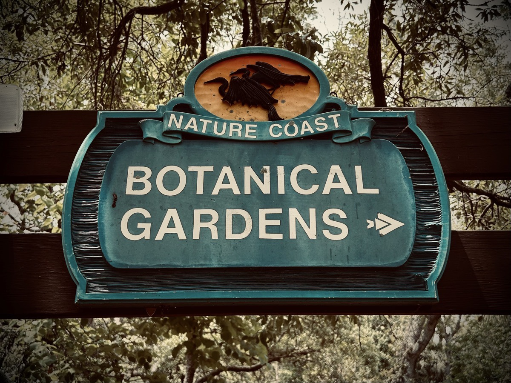
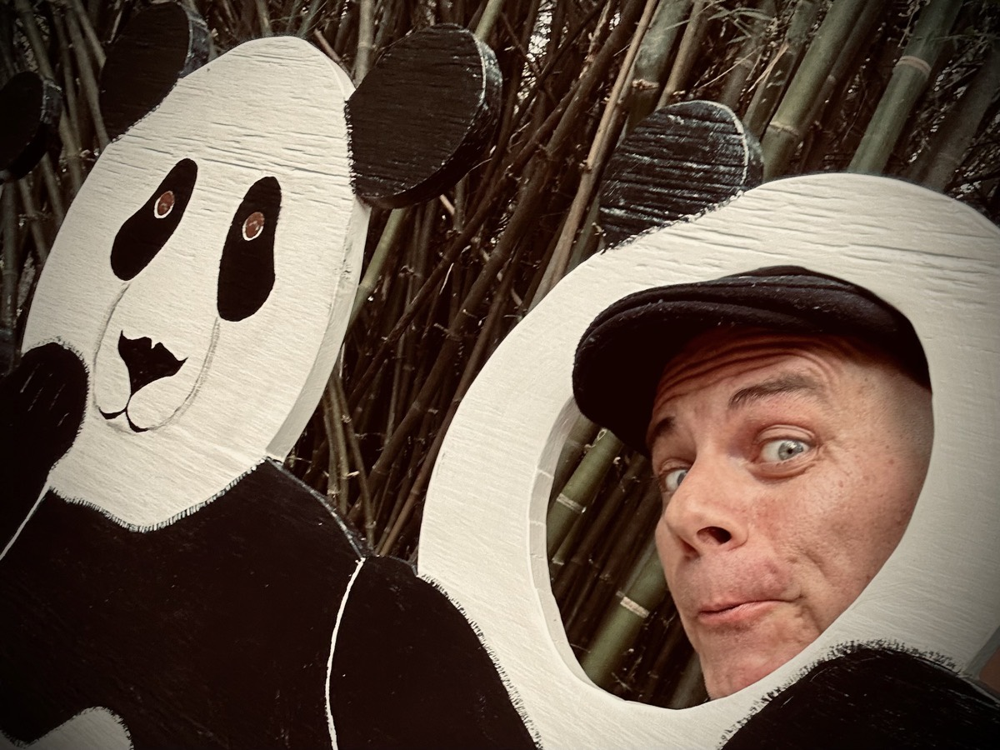

# Arboretum Day

Happy Arboretum Day!!! Yay!!! The day is finally here! For those who aren't me or Chérie, her and I planned a day where she went to the arboretum near her in California and I went to a botanical gardens in Florida near me. While at each, we did a FaceTime video call to share in each other's experiences. A virtual walk through the park, if you will. I've not done anything quite like that before. I've video chatted several times. But going somewhere, each of us in a different location, to do a shared experienced, this was new and exciting! I would definitely love to do more such experiences.

I went to the Nature Coast Botanical Gardens for my half of the experience. It's a nice little place. With an emphasis on *little*, that meant I was able to walk through the entire garden a few times to her one loop around the arboretum...hehehe But that's okay. If we do this particular thing again, I may go to the Sunken Gardens in St. Pete. It's a bit larger and has a lot more to show. For this being a first time experience, I'm still quite happy with my choice of gardens. Just as I was leaving the gardens, I became a panda...LOL

Despite my inability to cook for myself this week, I've had a great week. I have eaten some really good food at the places I went to. But the cost really adds up. I plan to go to the grocery tomorrow to get food for this coming week. I hope I can pull myself together and actually make the food work this week...hehehe I'm going to go simple all week to get back into the swing of things. I haven't a clue why last weekend derailed me in the kitchen...LOL There isn't anything bothering me. The best way I can describe what is happening is that I go to cook and something critical to the dish just doesn't turn out.

My writing has been a bit off this week as well. Yes, I've been writing. But some of what I have written doesn't get published. I've been making notes outside of my journal so I don't lose what I've written. Just today, I sat down to write out the story about my grocery store blessing last week. As I was writing, I could quite bring the story home. So, I've moved it over to my notes file for me to revise and finish another day. I never like to force anything. Some of my best writing has been done after I've written something, toss out the writing, and then re-imagine it all...hehehe For that story, I'll likely re-read what I've already written and then start over.

I haven't been drinking alcohol lately. I've mentioned in the past that I had been thinking about giving it up. I have fasted alcohol a time or two while praying for something specific. And I've had dry months when I would give it up to do a detox of my body. I'm not a drunk or alcoholic. I certainly know how much I can drink and when to stop. And I don't need to drink to have fun. I have been known to call alcohol liquid courage because it does calm my nerves a bit and allows me to be myself easier. But I can honestly say I do not need it and I've gotten to the point where I don't even like having it in my system. My current feelings on the matter resemble what it was like when I decided to give up meat for a bit. I feel my body telling me that it's time to give it up.

Something I have started to do is drink non-alcoholic beer and wine. I also order mocktails when I go out to eat. I love the taste of the drinks. I just don't like the toxicity of the alcohol in my body. These alcohol alternatives have been helping with the transition away from alcohol. I tend to be one who needs to gradually transition to such changes. Going cold turkey on things doesn't really work for me. Forgoing the alcohol itself has been easy. I don't crave it whatsoever. But I really love the taste of the drinks. That's what was so hard for me. That's what I miss when I fast or do a detox.

The funny thing about all this to me is that I haven't been a drinker most of my life. I had the occasional wine cooler or glass of wine. It wasn't until I met my third wife when I started to truly be a drinker...hehehe No, it wasn't because I needed it to deal with her...LOL It just happened that she introduced me to many of the things I came to enjoy drinking. That began in 2017. Here I am 7 years later and I think I might be done with it.

So, I've been practicing my "*So, I was thinking...*" pose...hehehe I think I'm nailing it...LOL What do you think!?!

