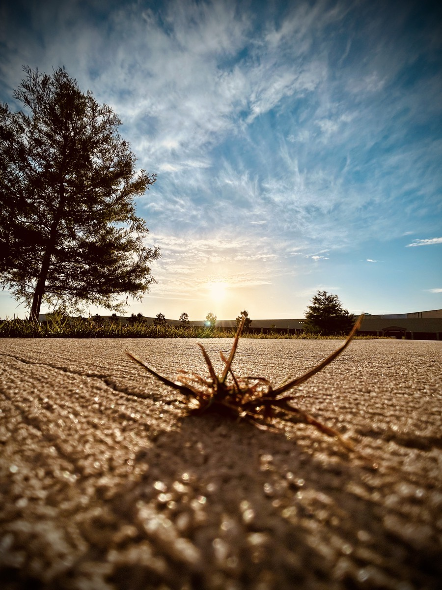

# TBD

This morning started out a bit rough. Between not feeling well physically this week, and some things getting triggered mentally, waking up today wasn't fun...hehehe Thankfully I have the mental strength through Jesus to still get up, do my early devotions, make my bed, shave my head and face, and get dressed...LOL I try to do that each day regardless of how I'm feeling when I wake up. I wasn't going to go for a walk because I'm physically under the weather. But I decided to do it anyway. It was a short distanced but took me quite a while to do. I'm sure if anyone saw me, they knew something must be wrong...hehehe I was definitely not my chipper bouncy self walking around the pond. But that's okay. I'm glad I took the walk.

I took the above photo while on that walk. I passed the patch of grass growing up through a crack in the sidewalk. I felt the Spirit prompt me to go back and take that photo. It later inspired today's *Vitamin G* post:

> I know the burden is heavy. I know the pain seems unbearable. Don’t lose hope 🙏 Hope will still grow from the cracks of your broken world 🙌

My day quickly turned around after I prayed. The rest of my day has had its ups and downs, though. Overall, it hasn't been a bad day. I've certainly had worse...LOL But I've also had better...hehehe

My hands, and every other muscle, have been extra shaky this afternoon. My trimmer is really acting up today. I'm not sure why. I think my body is fighting off something. I still feel as though my sinus issues are allergies. But there might also be something else going on. I'm not sure. I've been a bit off since that Disney weekend...hehehe

I'm going through another bout of doubt concerning my presence on social media. I honestly don't think it is good for my health. I don't believe it is good for the health of society in general. Although I have met some wonderful people, I'm still feeling as though its role in my own life might be coming to an end. It provides me no benefit in my life personally. If anything, it has been nothing but a burden.

Yeah, I think I'm not going to be posting this entry. It is just too sad and depressing. I don't want to bring anyone else down today...