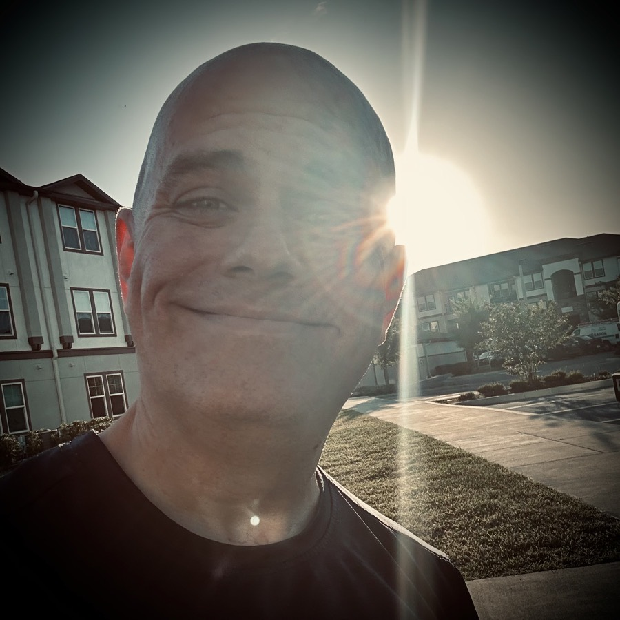

# TBD

Goodbye April showers! Hello May flowers! Oh wait...this is Florida...LOL We didn't have many April showers and the flowers bloom all year round...hehehe Well, welcome May! It's good to meet you!

I'm taking a break from social media. And I think this time it won't just be a break from posting. I am going to try and not be on social media at all. I'm tired of agonizing over it. Social media has been bringing me down quite a bit lately. Even some of the people I love to follow are dragging me down by their posts or replies to posts. And the technology itself is stressing me out. Last month, I tried to branch out and do Instagram Stories. I cannot express how stressful that was. It seems easy. But I do not find it easy. On one of my last attempts, I thought I had it all just the way I wanted. And then when I saw the results posted, the text I added was completely missing. I don't need that noise in my life. So I'm cutting it out. I'll likely never give stories a try again. I wanted to make it work. But it just wasn't working for me. As for the rest, I'm taking a break for now. But there is the likelihood that I might not go back. Although I have met some amazing people through social media, the ecosystem as a whole is not good for me. It might be good for other people. Good for them. I wish them the best. As for me, my heart is broken by it.

I posted the above photo on all my social media accounts at the end of the day yesterday. It represents the sun setting on my time on social media. I figured if this really is the end, I might as well make my last post one of the sun actually setting...LOL The photo was taken about a hour or so from the actually setting of the sun. But it think it works for its purpose. It's a sobering thought that I might not go back. I'm not really sad about it. If anything, it is more of a relief. I'm not sure if social media affects other people the way it has me. I know some folks have left specific platforms because they became too toxic for them. For me, it's social media as a whole now. It isn't just one specific platform. Of course, I haven't made up my mind just yet. This is just a thought for today. I haven't given myself a set goal to decide. And I haven't given my hiatus a time frame. It could be a few days. It could be a month. It could be permanent. I really do not know today. All I know is that for today, I will not be posting or scrolling...hehehe

I'm not sure what direction my writing is going. For now, the *Vitamin G* project has been sitting in the *freezer* of my mind. It isn't just on the back burner simmering. It's packed away and waiting for another day. I honestly thought it was going to happen this year. It is not. I do have a few other projects in mind that could still happen this year, though. As you can see from my journal, I'm writing quite a bit. There is plenty I have already written this year that could end up in a new project or spark something. I still have hope that I'll finish at least one book this year. If I don't, that's okay. I'm going to keep writing. I not only have this journal, but I am writing poetry. And I have photography to inspire some writing. Perhaps a photo book could happen too...hehehe And the current content of *Vitamin G* could end up being repurposed into something better than that original project. So, I'm not discouraged. I'm still quite inspired!

