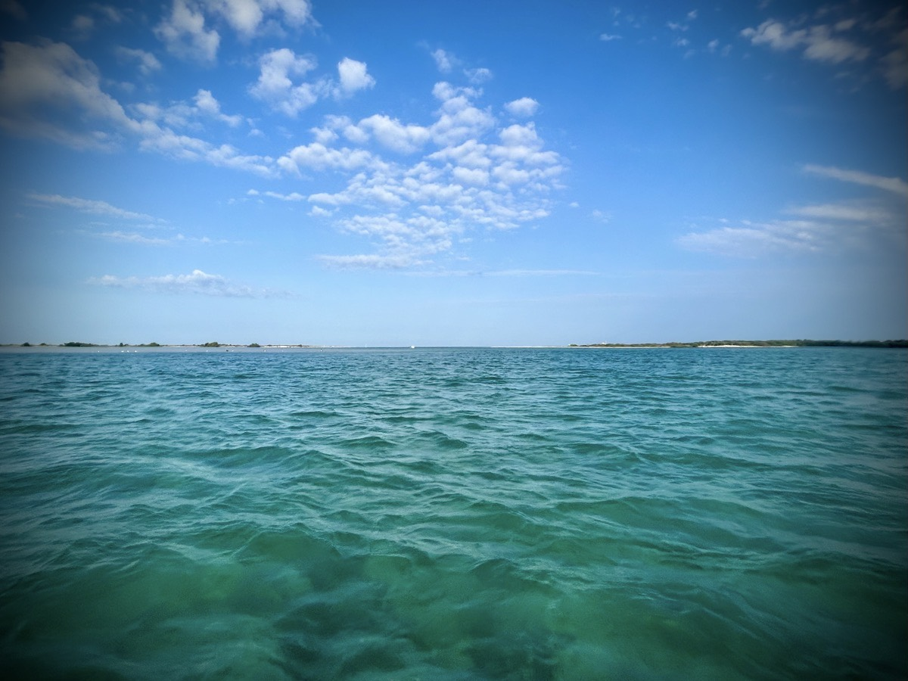

# I Saw a Dolphin Today!

I made it out on the water!!! In fact, I’m starting this journal entry while taking a rest break and floating…hehehe I am so glad I came out today. I’ve seen seagulls (of course), fish, a dolphin (yay!!!), several pelicans, people fishing, kayaks, canoes, other paddle boards, and a beautiful sunrise. I don’t have photos of any of it because I was living in the moment. Also, paddle boarding for the first time took extra strength and concentration…LOL Ooh, I just saw a drone! Were they spying on me?!? LOL And, again, I saw a dolphin! I took my paddle board out for the first time. Standing on the paddle board made me feel like I was walking on water!

I’m back home now…hehehe What a morning! I LOVED being out on the water again! I didn’t want it to end…hehehe But alas, it had to. I was getting worn out. Paddle boarding is so much more of a workout than kayaking. And although I ate before I went out, I burned off all that I had eaten. I was going to lose too much energy to stay out much longer than I did. I think I was out for about an hour. I’ll remember to pack some food bars next time. I’d love to journey over to Caladesi Island. It’s an island you cannot drive to. Technically you could walk to it from Clearwater. But the best option for me is to kayak/paddle board on over. I did make it out to about the half way point. But again, not enough energy to have gone the entire way and back without more food…hehehe

There are a few other lessons learned from this morning’s adventure. I need to remember to bring beach towels. I’d like to protect my car seat better after doing this. My bottom got a little wet when I was sitting on the paddle board a few times. I always remembered towels when I would kayak. I don’t know why I didn’t think of it this morning…hehehe Perhaps it was because it had been so long since I’d been out on the water…LOL I’d also like to pack sunscreen next time. The sun really isn’t an issue early in the morning. However, if I do go out to Caladesi, I’ll be out long enough for the UV index to become a factor. Plus, I’d probably take a picnic lunch to have on the island…hehehe More time in the sun and into the later part of the morning into noon time means greater risk of exposure…hehehe

It was so nice to be out there alone. I mean, I wasn’t truly alone because there were plenty of other people out there too. That helped make me feel safe. But what I mean is that I didn’t meet up with anyone. It was just me, God, and the water (and all that comes with water life). It gave me the opportunity to do some refection. God is transforming my loneliness into happiness. And transforming happiness into joyfulness. Experiences like this morning are helping build moments where I can find joy in being alone. The best way I can describe it is I’m no longer suffering in the loneliness. Sure, I still feel lonely sometimes. That will keep happening because I’m human. I’m still weak. But that weakness is a window I can look through that helps me see God’s goodness.

I’m at Zen Kitchen & Bar again…LOL I think I’m addicted to this place. This is the forth time I’ve been in here in the last 8 days…hehehe The funny thing is I still haven’t had the same thing twice. At least I don’t think so…I think I’ve ordered something different each time. I’ve only been coming here for a month now. But I’ve been here enough times in that month to equal what a normal person might do in a year or two…hehehe I told them today I think they are drugging me because I’m addicted…LOL I trust they are making healthy food. I know my body has been enjoying it. This isn’t your average Asian restaurant in America. I’ve met the *owners*. They seem genuine. Kerry introduced me to them as he and his wife know them. He’s the one who also introduced me to this restaurant, actually. They have been opened at this location since September.

My morning *wake up* devotion was inspiring, as usual. This time, I wanted to write about it. I’ve thought about writing about it each day. I’m not sure if I’ll do that here in this journal. I’m actually working on another website for my Bible resources. Perhaps I’ll journal about my devotions there someday.

Today’s verse of the day:

::: details Psalm 139:11-12 AMP
If I say, “Surely the darkness will cover me, And the night will be the only light around me,” Even the darkness is not dark to You and conceals nothing from You, But the night shines as bright as the day; Darkness and light are alike to You. [Dan 2:22]
:::

I think the scariest time of day is nighttime. When the sun is on the other side of the world and everything is dark outside, I cannot see much. I don’t even like to drive at night. Although I have headlights, they only illuminate the path directly in front of me. Here in Florida, there could be animals lurking just beyond my headlights’ shine and could attempt to cross the road in front of me at any moment. And when I’m walking at night, there could be bad guys lurking in the shadows. So, yes, I get anxious at night…hehehe

In the Psalm above, I’m encouraged that God can see just as clearly at night as He does during the day. Likewise, when my circumstances seem dark, He can clearly see the goodness and Light in the darkness. With my human eyes, and therefore my human understanding, I cannot see clearly in the dark. Even though I’ll never have the eyes to see at night, I can look to God to have Him reveal the Light in the dark circumstances I face through the Holy Spirit. At least, I can certainly try, right!? LOL

The follow passage was included in the devotion and encourages me to give the darkness (my selfish desires and my fears) over to God:

::: details 1 Peter 5:6-7 AMP
Therefore humble yourselves under the mighty hand of God [set aside self-righteous pride], so that He may exalt you [to a place of honor in His service] at the appropriate time, [John 3:30] casting all your cares [all your anxieties, all your worries, and all your concerns, once and for all] on Him, for He cares about you [with deepest affection, and watches over you very carefully]. [Ps 55:22]
:::

Is it self-righteous pride to try to navigate the darkness on my own? Perhaps it is. I cannot produce light on my own. If I’m trying to do this myself, believing that I think I know what I’m doing or believing I know what is best for my life, I’m going to fail. Without light, I’m going to stumble around in the darkness. I’m blind to my need for God. This passage reminds me that He cares for me. If I give Him all my worries, anxiety, my whole life, surely God with be the Light I need in that darkness.

In my aforementioned battle with loneliness, I stumbled along my path, always trying to navigate it on my own. It wasn’t until recently, very recently, that I finally gave it over to God. I did not expect that how I felt about it would change so quickly. I know with full certainty the reason I’m already feeling at Peace about it is because I’m in The Word daily now. And I’m consistently and constantly praying. I’m doing my current best to live out this passage from Proverbs…

::: details Proverbs 3:5-6 AMP
Trust in and rely confidently on the Lord with all your heart And do not rely on your own insight or understanding. In all your ways know and acknowledge and recognize Him, And He will make your paths straight and smooth [removing obstacles that block your way].
:::

And I’m doing so through the comfort I find in these passages…

::: details Psalms 119:105 AMP
Your word is a lamp to my feet And a light to my path. [Prov 6:23]
:::

::: details Proverbs 6:23 AMP
For the commandment is a lamp, and the teaching [of the law] is light, And reproofs (rebukes) for discipline are the way of life, [Ps 19:8; 119:105]
:::

::: details Psalms 19:8 AMP
The precepts of the Lord are right, bringing joy to the heart; The commandment of the Lord is pure, enlightening the eyes.
:::

As I reflect on my life wholly and not just on the dark moments, I have had an amazing journey. And when I reflect on those dark moments using the Light of God, I am amazed at how He is using those circumstances now.

Prayers:

> Father God, thank You for giving me Yourself. Thank You for empowering me to face whatever comes my way. Help me to remember that even when I'm weak, You are still strong. And You can take the darkest of circumstances and turn it around for Your glory and my good. So please help me to glorify You with all that I am. Let my weaknesses become windows to see Your goodness

> You desire a world that is marked by grace and mercy. Help me to be part of shaping that world by living a life that is pleasing to You. Please give me a heart that desires to be kind to others, not for show, but out of love for You and others.

> I am amazed that You delight in me! Thank You for seeing me not for my imperfections, but as Your child who delights in You. Help me to never lose focus on You, Your guidance, and Your love. I want You to be the most important part of my life. In Jesus' Name, Amen!

By the way, I’m not at Zen anymore. I went home half way through the above devotion writing…hehehe I didn’t want to interrupt those thoughts to declare my change of venue…LOL

Here is a reflection from my devotion with Kerry, *The Soul of a Worship Leader - Day 6*: I’ve had times when I just couldn’t pray. The hurt, pain, and suffering I was enduring were too great for me to utter words of prayer, lament, or praise. Yet God was still there giving me the warmest hugs. Like a child, I fought back the Love He had for me. He held all the more [tightly]. God held me until I burst into tears. And then I cried out with the sort of prayers and praise that can only have come from His Holy Spirit. I and my thoughts are precious to Him. He is my Creator. He is my Salvation. God, You are my God!

I’d love to include my reflection notes from today’s devotion from *The Chosen: Book One - Day 9: Reset*. But I hand write those in a physical journal. There is no copy/paste for that digitally. Technically, the OCR capabilities of Apple would allow that. However, my handwriting is so poor that it has trouble converting my writing into digital text…LOL Perhaps one day, I’ll get around to converting my handwritten journals into text. Today’s devotion prompted me to relate the idea of a *reset* to my time here in Florida. It was quite timely as I have been reflecting on that all day…hehehe Right now, God is doing a reset on my emotional and spiritual wellbeing. In my reflection, I equated what I’m going through to how one would unplug a computer and plug it back in to reset it. For me, God unplugged me but didn’t plug me back into the same power outlet I’ve always been plugged into. This time, He plugged me into the uninterruptible power supply of His Divine Graces. Being plugged into a Pure power source (Jesus Christ) is just the reset I’ve needed.

I went out to have a celebratory meal for my 2 year anniversary of living in Florida. I wanted to go to the same place I did 2 years ago this night. They were pretty busy. So I then decided to head some place else. Too busy. Then another place. Too busy. I drove around for about 2 and half hours…LOL I spent most of that time talking to my sister on the phone. So, it wasn’t a complete waste of time. Plus I was out driving around in this beautiful weather. So I’m grateful for the phone call and pleasant drive…hehehe I stopped off at the Chili’s near me. They weren’t too busy. I sat at the bar as to not take up a table. I sat for about 5 minutes and no one gave me any attention. There was someone there with a perfume that didn’t settle well with my sinuses and it was a tad noisy. So I left…LOL I wound up just getting Panera and eating at home…hehehe I really need to get to the store. I plan to go tomorrow…hehehe

All in all, this was a great day. A month ago, I was a broken man whose loneliness brought about great sadness. Today, I’m a joyful man whose loneliness is bringing about great rejoicing. What made the difference? God’s wonderful Light shining hope in the darkness. I’m a changed man because He has been changing me.

I just realized something. I’ve gone all day without turning on my television. I’ve had a full day and not once did I need to turn something on to entertain me between moments. Also, I’m currently on a hiatus from social media. I haven’t posted or scrolled in 4 days on any platform. I wrote about this hiatus the other day. But I didn’t publish it here in my journal. I suppose I didn’t really want to talk about it after I went to the trouble of writing it all out. I had 2 days like that this past week. I wrote an entire entry twice and then delete them…LOL Perhaps I’ll get around to talking about it once my thoughts are all lined up. For now, I’m on an unannounced break from social media. The TV thing today was just about how full my day was without it…hehehe

And as I reminder, I saw a dolphin today!