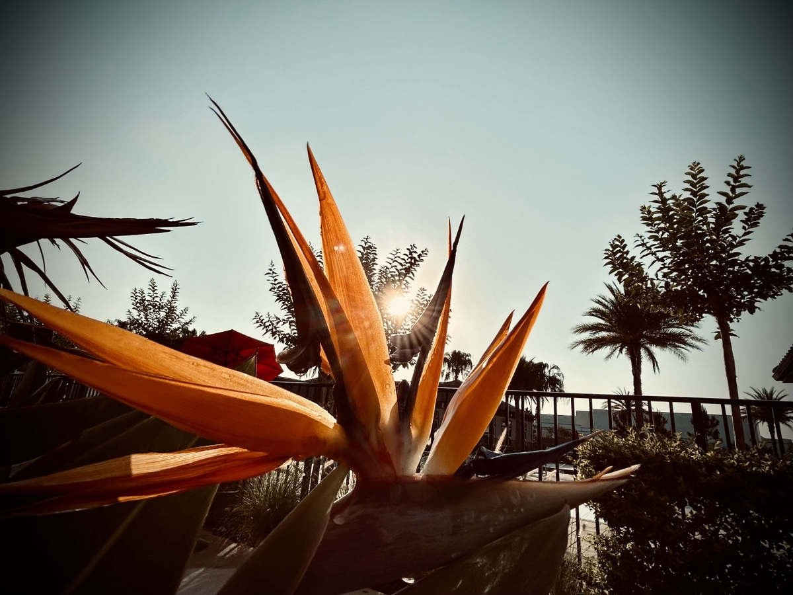
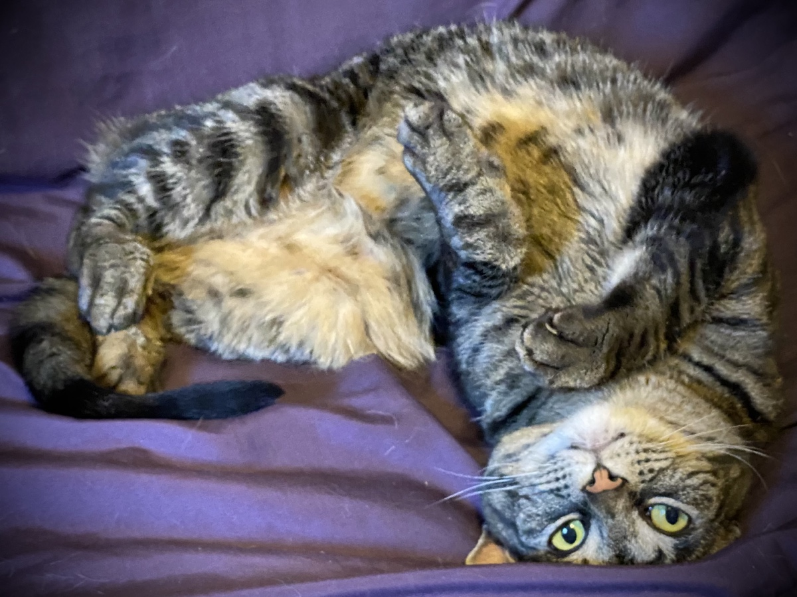
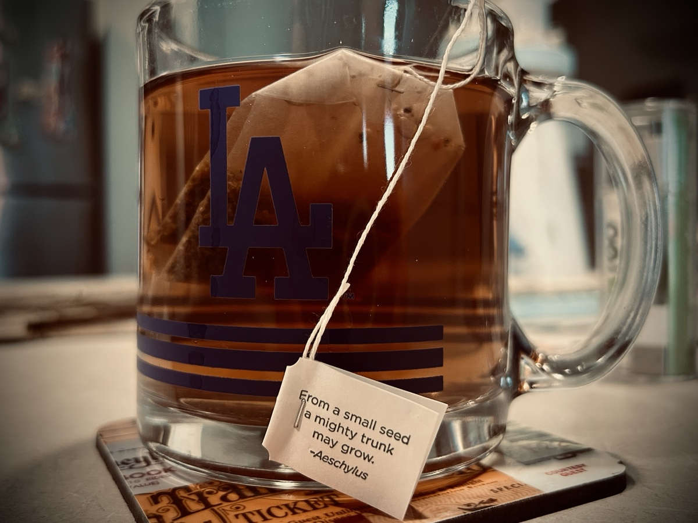
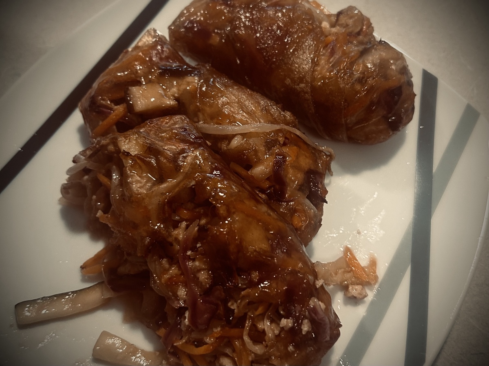

# Canine Eclipse

## 6:15 am

Good morning! Another day has arrived! Praise the Lord!

I’m going to continue with this timestamp format today. The first day, I simply wrote about my day. Yesterday, I mixed it up a little and included some deep thoughts. Today, I’m going to stick to writing about my day here. In a separate space, I’ll write my deep thoughts. As it turned out, my deep thinking was incomplete and a bit disconnected in yesterday’s entry. Which led to some confusion. That’s okay. If you read yesterday’s and was confused or concerned about my deep thoughts, you weren’t alone. Even when I go back and reread it myself, I’m like *I didn’t quite explain what I meant by that*…hehehe Part of the issue with how I did things yesterday is that once I’ve written a section in the timestamp way, I’m done with it. I move on. I don’t go back. It’s written, typos and all. Whereas, when I write a deep thought completely in a more formal format, I comb over the thought many times over and tweak it as needed until the thought is somewhat or entirely complete.

Let’s have a great day, shall we!

## 9:00 am

*Oh, what a beautiful mornin’! Oh, what a beautiful day! I've got a beautiful feelin', ev'rythin's goin' my way.* No, I’m not in Oklahoma…LOL But I sure am singing the opening song to that musical this morning…hehehe I’m off to another great start today =D

I have a public service announcement for you:

When observing an eclipse, it’s important not to look directly into it xD

<video controls src="./media/IMG_6523.mov" />

*The more you know…by Greg Marine* xD

The timing of the sun glare was perfect for my expression…LOL It was a happy accident. I would love to claim mad skillz, yo B) But alas, it was dumb luck…hehehe

I’m having a wonderful week. None of the circumstances I’m facing have changed. But my heart has. If ever I look back on this chapter of my story, I want to remember that God is so good. It isn’t only that I’m choosing happiness. Happiness is just a feeling. A human emotion. But what I’m experiencing is inexplicable Peace over and despite my circumstances.

My work day is actually off to a slow start. I’m in between projects. So, it feels more like a transitional time than it is a productive period…hehehe These are welcome moments, though. It’s nice to be able to slow down a bit at work. It helps give a reprieve between the more urgent tasks. And my new boss hasn’t directed me to anything to make a top priority. Again, I see the positives in this period.

## 10:00 am

I just got an email from my complex that our dog park is closed until Friday afternoon or evening for reseeding. My romanticizing Mr Long Legs running around the park will have to wait until the weekend xD He’ll just have to enjoy his squawking alligator from the comfort of his living room…LOL I kid, of course. He isn’t my dog, after all. But his Christmas card is still on my fridge xD

I miss my dogs and cats. A few of them are still alive. Most passed away years ago. Those still living I had to surrender to the family I lost. I’m not bitter about it. I just miss my Ginger and Frosty. Frosty wound up running away. I often ponder if she’s out there looking for me…hehehe Ginger is likely still happy with her life. I adopted her as a puppy while I was with that family. So the family is all she’s ever known. She probably just thinks I’m dead…LOL j/k But Frosty was mine as a kitten well before that family. I’m the only family she knew for a few years. I named her Frosty Sprinkles xD *Frosty* because she was a cool cat B) *Sprinkles* because I LOVE sprinkles all over my ice cream xD I named Ginger for the accent color of her coat. She was black with a *ginger* accent =D

## 1:30 pm

I came back from lunch to a meeting invite for…Friday…from 12-2 pm…ugh! First, a 2 hour meeting on a Friday!?! Really?!? Second, during normal lunch hours!?! I mean, really?!? LOL I suppose I need to let that go…hehehe It’s all a part of the job, right? As annoying at that is, I don’t have control over it. I can only control how I respond…hehe So, I reluctantly accepted the invite xD

My lunch breaks have been extra peaceful this week. With my new routine I’m trying out, I eat a lite lunch and work through a few of my devotions. Once again, I’m already caught up on them all now, freeing up my entire evening. I’ll take full advantage of this tonight. Right after work, I need to get something notarized. And I’ll do some lite housework to prep for my parents. I’m not messy. So that’s pretty easy to do. I thought about doing it Saturday morning. But I’ll take advantage of the extra time this evening and keep Saturday morning open.

I’ve been enjoying a small chocolate square and 2 small cookies at lunch. With how difficult it was to break my addiction to sweets, I was a bit nervous having sweets in the house again. But so far, I’ve been sticking to my quota…hehehe Self control is a fruit of the Spirit. I’m glad to see I’m currently passing the test…LOL In the proper moderation, these sweets are beneficial to my soul. They make my heart happy. I’ll keep on praying that God helps me resist overindulgence =D

## 3:00 pm

I remembered afternoon tea today…hehehe Instead of just relaxing, though, I took a few minutes to start working on a deep thought journal entry for today. I’m not sure if I’ll get it finished today or not. If I do, there’ll be 2 entries for today…hehehe I wanted to attempt making both a timestamp entry and a more formal thought entry on the same day. I’ll not try that every time. But I’ve been experimenting this week. So why not give that a try today?..hehehe

I’m going to try making spring rolls for dinner tonight. I’ve honestly never tried making them myself before. I’m sure I’ve mentioned this already, but one of my goals this year has been to learn to make several new recipes. I’ve already met this goal several times so far. I’m so happy to be branching out. The journey I’ve been on these past 15 or so months has been fascinating for sure. These spring rolls should be interesting. I’m going to do a similar *chicken-like* tofu that I made with the nuggets on Monday for the protein. The veggies are red cabbage, carrots, sprouts, and I’ll include shiitake mushrooms.

## 4:10 pm

I just had my favorite moment today xD Earlier today, Chérie sent me her eclipse video and it was hilarious…LOL HOWEVER, Mr Long Legs just sent his xD (Well, Chérie sent it) I was NOT expecting him to appear in an eclipse xD LOLOLOL I laughed so hard I literally cried and my gut hurt xD The rest of this day has a lot to live up to if it thinks it can provide a better moment to be my favorite xD

## 5:20 pm

I went to have my signature notarized for a legal document. The person at the UPS Store was there by themselves. The phone was ringing as I arrived. They asked me what service I was looking for and I indicated notary services. They invited me over to a specific area and proceeded to answer the phone. They were able to help me and the person on the phone at the same time. I complimented them on their ability to multitask…hehehe They said it sure wasn’t easy and I told them they did it quite well…hehehe After they signed and notarized my document, they asked if there was anything else I needed. I said that was it for today. They thanked me for coming in and said they’d wave the notary fee! Whoa! What a blessing! I honestly do not know how much their fee is for that service, but their kindness is greatly appreciated.

Now it’s time to make those spring rolls!

## 7:00 pm

Dinner turned out…edible…LOL My first attempt at making spring rolls became a spring mess xD The flavor of the filling was spot on. The wrappers did not work out. The first batch, pictured below, was a single wrap and fell apart immediately. The second batch was a double wrap. They held together better but not well enough. The rolls did not crisp up for the most part. The filling may have been too moist. The wrappers might have been too moist. I may have coated them with too much olive oil. And my air fryer just may not be up to the task (this isn’t the first time I’ve had issues with it).

Yes, I am disappointed. But I’m so glad I gave it a try. I’ll give it another try. Perhaps tomorrow night since I have all I need to make them. I’ll double wrap them for sure. I’m no pro…LOL I also have no shame. I’m amateur and proud of it…hehehe I don’t have to make everything *the right way*. I’ll do what I personally must do to make it work. It needs to be edible, have the right texture, excite my taste buds with flavor, and be as healthy as possible.

One thing about the filling that worked really well was the tofu. It had the texture and taste of ground chicken. It was delicious! Don’t believe me!? Ask the dishes! xD I forgot to mention earlier that zucchini was also in the filling.

## 8:45 pm

After dinner, I ate 2 more little cookies. That’s my quota for cookies today. I may have said I hit my quota earlier. But that was for the chocolate. The serving size for the cookies is 4. So I split that serving into 2 sessions. The chocolate serving size is technically half the entire bar. But I keep myself at a single square per day. If I ate half the bar every day, I’d trigger my addiction again…hehehe Cookies have never been a trigger for me. I enjoy them for what they are and love them. But chocolate and candy…ooohhhh my…LOL

I managed to do most of my housekeeping work tonight. Yay!!! I just need to clean my bathroom sink and toilet. I may wait until Friday night or Saturday morning for that. That way it is freshly clean for my parents. A few days won’t really make a difference…hehehe But mentally, I’ll know it will be freshly clean if I wait until the last minute…LOL

I started the deep thought entry but didn’t finish. I don’t think I have the capacity to do that at the moment. I’m still learning to vibe with my new routine. As this process settles a bit, I can try that again. I do want to finish my thoughts I started writing about. So I’ll keep writing in that tomorrow. Once I get all of it written well, I’ll post it the day I finish.

Another good day in the books. God is good!

## 9:15 pm

I don’t recall if I’ve mentioned this here in my journal, but back in March I sent Chérie some seeds from the EPCOT International Flower and Garden Festival. She planted them this past weekend and there are several flowers germinating!!! Yay!!! She keeps me updated and has been sending me photos of the progress. My heart is so happy she is growing the wildflowers that were in the seed packet I sent. The flowers represent our friendship. As our friendship continues to grow, I’m happy to see these flowers grow too. It’s a beautiful representation of what God is doing in our lives. I’m so excited!!!