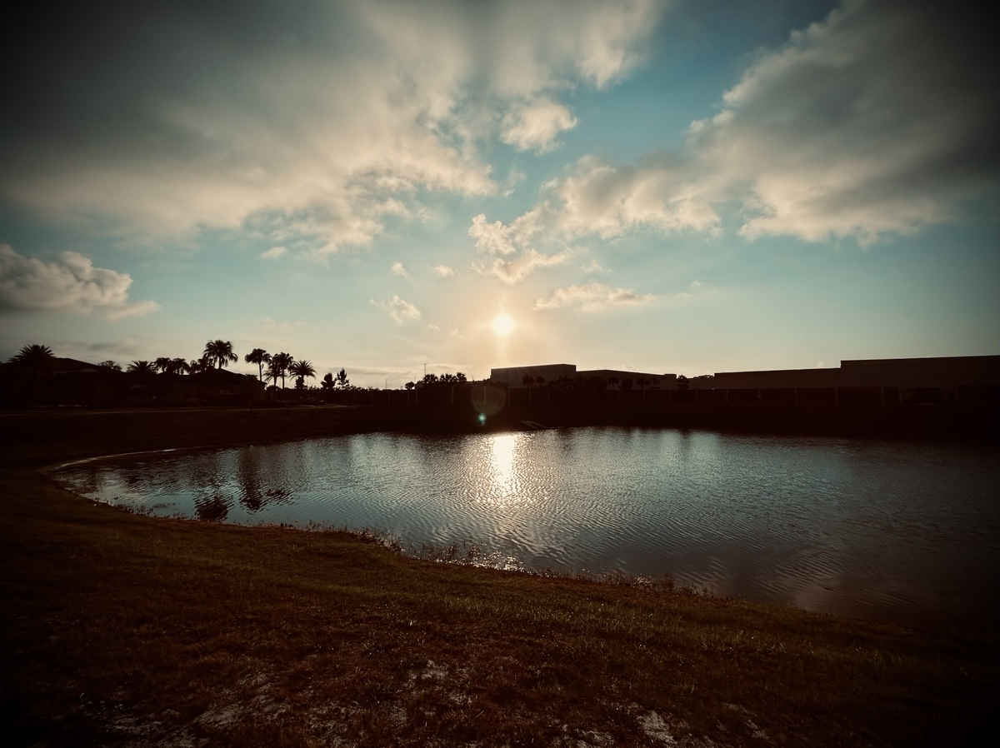
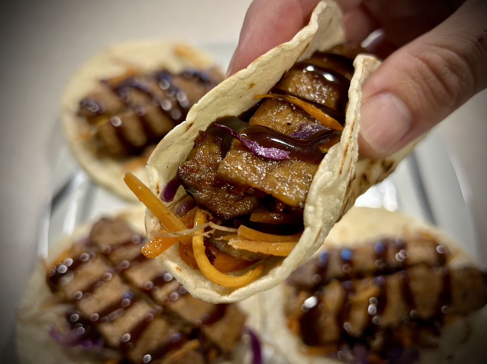
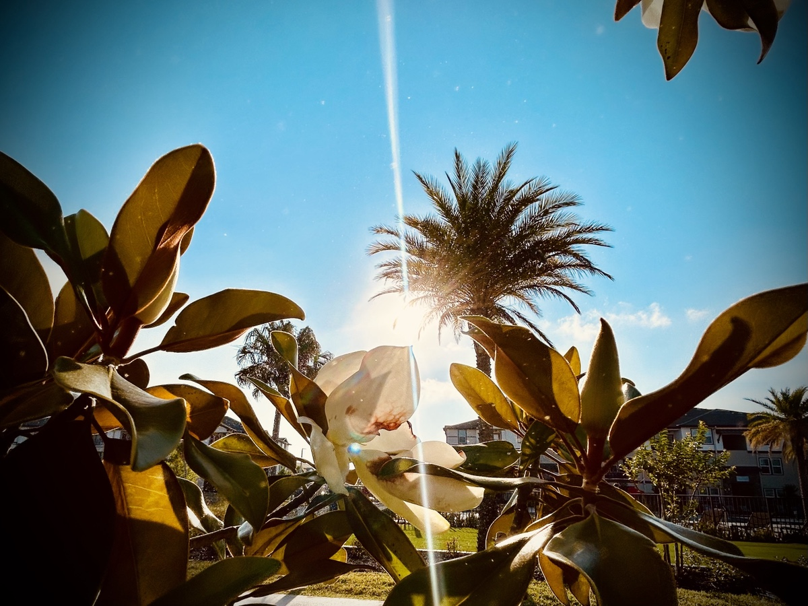
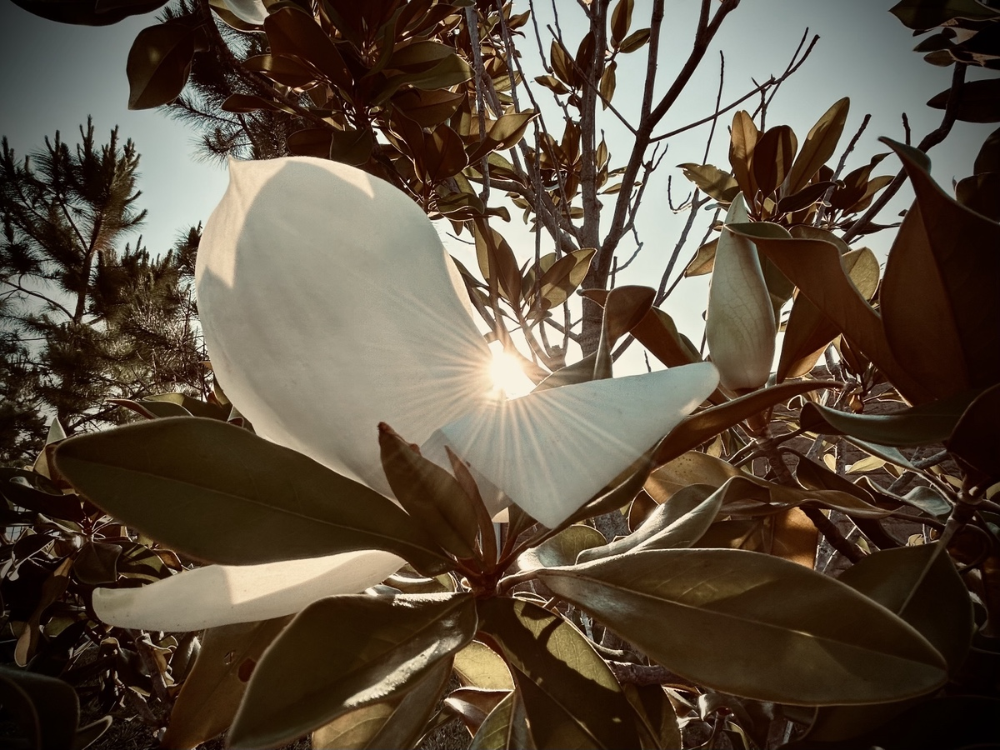

# Hot Beverage Switch Up and Tacos!

## 5:50 am

Good morning! Today is off to a wonderful, and early, start. I woke up around 5:30 something without an alarm. My alarm has been set for 6 am. Yet today I awoke well before that feeling very refreshed. I had a lot of dreams. They are fading quickly and I don’t feel I can journal them…hehehe But I do remember having them…LOL

Today’s verse of the day:

::: details Hebrews 13:8 AMP
Jesus Christ is [eternally changeless, always] the same yesterday and today and forever.
:::

One of the prayers I sometimes utter in the morning is this:

> Lord, I welcome You into this day. For this is a day You have made. I will rejoice and be glad in it. Please guide and direct everything I think, everything I say, everything I do. May it all bring glory to You.

Today was one of those days. As I remain constantly and consistently in prayer and daily read His Word, I believe this prayer, in faith, is being fulfilled. I am so grateful that I can call upon Him and He comes. As I go into the 8th month of beginning my day with *The Lord’s Prayer*, the daily refresh devotional, and my own personal prayers, I’m seeing the renewing of my heart, soul, and mind.

## 9:00 am

This morning is going about the same as it has been all week. Oh, but I didn’t have coffee this morning…hehehe I ran out yesterday and my new coffee order doesn’t arrive until later today. I was off by a day in my estimate…LOL I did have a cup of tea, though. I suppose you might say I swapped the two. Morning tea and afternoon coffee xD The coffee *should* arrive in time for an afternoon cup…hehehe

My parents will be on their way tomorrow. They’re driving. So they won’t arrive until Saturday mid-day. The intent of the timing for this visit is for my sister’s wedding on Wednesday. I’m not sure why they are coming so early, though…hehehe I feel like they’ll be bored for a few days. Her and I both will still be working during part of their trip. I took off from work Wednesday through Friday to spend with them. The wedding is Wednesday, as I said. And my parents and I will be going to Disney Thursday. We’re staying overnight and they leave Friday. I’ll likely have a second day at Disney by myself. There is a men’s event at church next Friday. I’m not sure I want to go. Disney is a good excuse not to if anyone asks if I’m going to the church event and I say no. The *marketing* for the event has been a put off for me. It has been coming across as toxic masculinity. I’m not a *manly man* type of person. I don’t relate to that attitude. I can joke about it and act all *tough* in a sarcastic way. But I’m having a hard time connecting with most men at the church because all of those groups are *manly* groups. That’s just not who I am.

## 10:30 am

I just had my first meeting after some of our folks moved over to the new company. Although the people are the same, the vibe was a bit different. I think they are dealing with some stress through the move. Change can be that way. They are making note of all the challenges with the move to make it a smoother transition for the rest when they move over. I’m still not sure if I’ll be one of them.

I’ve been thinking about how this timestamped approach to journaling has prevented me from writing out my deeper thoughts. Although I’m enjoying the style from *a day in the life of* perspective, I still miss writing the *So, I was thinking* thoughts. I tried to include deep thought a few days ago and didn’t like the outcome. Yesterday, I attempted to write 2 separate entries. Today I’m back to just timestamps so far. But, per usual, I’m overthinking this process…LOL I’m planning to keep with the timestamps today and tomorrow to finish this week out. I’m unlikely going to be able to focus on writing while my parents are here. I don’t really need or want a break from writing. I’ll miss it if I’m unable to do it while they’re here.

I’ve been in pain this week. Nothing major. But possibly warning signs? It somewhat reminds me of when I wasn’t active. So it could just be that I need to settle back into an exercise routine. I have not been faithful to that this year. The winter months really threw me off…hehehe But that’s just an excuse. I need to do better =D

I’m also having some weird abdominal *issues* this week. Nothing bad. Just weird. I’ve introduced new foods into my diet. So that could be it. It’s kind of fun to analyze these things, you know? Before last year, I never gave any thought to what I was eating or what the ingredients were. Now that’s all I think about when I eat…hehe

## 2:30 pm

My coffee arrived in time to have some this afternoon. Yay!!! I’m enjoying a Cinderella inspired brew in my Oswald the Lucky Rabbit mug…hehehe The flavor profile is described as a midnight dance with notes of vanilla custard and caramel. It is lovely for sure. I accidentally ordered it as ground coffee instead of beans. Oops! I also ordered another batch of Sumatra beans and Panama beans. The Panama one is new to me. Although I love the flavored blends Joffrey’s offers, I’m growing fond of the *plain* beans labeled for their source. Of the ones I’ve tried so far, Sumatra has been my favorite. I’ll likely order a bag every time now along with new ones to try.

## 3:55 pm

Afternoon coffee sure does hit differently xD Typically, coffee doesn’t really affect my mood or energy. It’s simply a hot beverage to me most of the time. Today, however, I was a little extra bouncy having it in the afternoon xD When I drink it in the morning, I’m just waking up for the most part. Even if I’ve been awake for more than an hour, I’m not really *awake*. So the coffee is sort of like a friendly tap on the shoulder and a warm *good morning* hug. Having it in the afternoon after being well awake for hours, it felt more like someone grabbing me, giving me a huge hug, and we both fell over xD I’m thinking about that scene in *The Office* where Michael does that to Jim…LOL

<video controls src="./media/IMG_6595.mov" />

## 4:45 pm

Why does my pee smell funny!?! Ooh, I had asparagus for lunch xD Random thought? Yep! I’ve been having asparagus quite a bit lately. I ate at home today and I happen to have asparagus with it. But I’ve noticed Zen Kitchen & Bar uses asparagus in several of their sushi and other dishes. I find it funny how a vegetable can do something like that. I also find it fascinating that if you take in too much of a vitamin, the body expels the excess through urine as well.

Random thought over…carry on xD

## 5:50 pm

For dinner tonight, I made tacos again. And once again, I went with a tempeh protein source and pan fried red cabbage, bean sprouts, and carrots in garlic infused olive oil. I used white corn tortillas and topped everything with Hoisin sauce. Just as they were on Tuesday, they were fantastic! I took a photo this time…hehehe

Before I made the tacos, I made the filling for the spring rolls I’ll make tomorrow. Upon sharing my experience last night with Chérie, she told me she makes her filling the day before and lets it sit in the refrigerator overnight. So I took that advice for my next attempt…hehe I also researched my moisture problem. That sounds like the main reason the wrappers didn’t crisp up. Rolling them wasn’t when they split open. It was because they didn’t truly fry up properly. There was an extreme amount of moisture. The filling, because I didn’t let it cool properly. The outside of the wrapper, because of the excess olive oil I brushed over them. Another reason it’s best to leave the filling overnight is the flavor sets better.

## 8:30 pm

I had a lovely walk this evening. I got to talk to Jan again. They’re doing well today. They went on a little water adventure. With it being so hot right now, being on the water would have been really nice…hehehe On my walk, I also prayed and meditated. The Spirit led me to reach out to a friend. He needed prayer and encouragement. We’ve been chatting via text most of the evening. I’ll be praying for him unceasingly.

I found an opportunity to photograph a magnolia blossom tonight that I also captured this morning. Sunrise to sunset =D Same blossom from opposite sides with the sun on equally opposite sides of the sky. Art in motion over a 12 hour period.

Sunrise:

Sunset:

