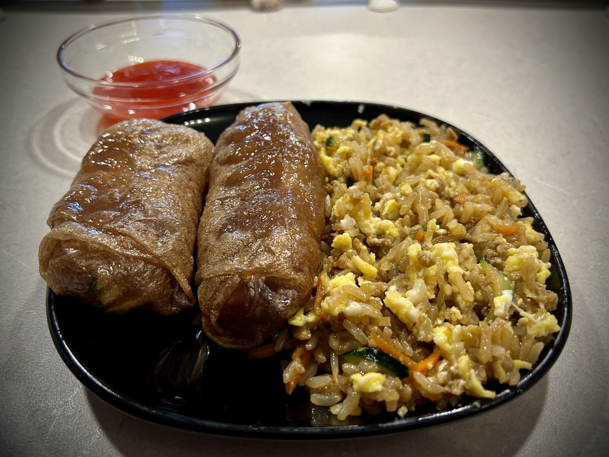

# Exit Strategy, Dining Experiences, and Travel

## 6:25 am

I often wonder what it truly means to ask God to *not lead me into temptation, but deliver me from evil*. I’ve also wondered about how He also provides a way out of temptation (1 Corinthians 10:13). Today, I face a temptation concerning one of the many struggles I’ve been praying about. And today, God provided an *exit strategy* for me to avoid this temptation. So as I face it today, I will take that exit. I will trust in the Lord with all my heart and not lean into my own understanding. I will fully acknowledge Him in this difficult circumstance and He will make my path straight.

::: details 1 Corinthians 10:13 AMP
No temptation [regardless of its source] has overtaken or enticed you that is not common to human experience [nor is any temptation unusual or beyond human resistance]; but God is faithful [to His word—He is compassionate and trustworthy], and He will not let you be tempted beyond your ability [to resist], but along with the temptation He [has in the past and is now and] will [always] provide the way out as well, so that you will be able to endure it [without yielding, and will overcome temptation with joy].
:::

God truly will not give me any circumstance He cannot handle. Praise the Lord!

::: details Proverbs 3:5-6 AMP
Trust in and rely confidently on the Lord with all your heart And do not rely on your own insight or understanding. In all your ways know and acknowledge and recognize Him, And He will make your paths straight and smooth [removing obstacles that block your way].
:::

Today’s verse of the day:

::: details 2 Thessalonians 3:3 AMP
But the Lord is faithful, and He will strengthen you [setting you on a firm foundation] and will protect and guard you from the evil one.
:::

## 9:40 am

I’ve been enjoying my morning bread this week. I didn’t realize how much I’ve missed it…hehehe I’m likely going to make my next loaf Saturday morning so I can continue having some through next Thursday. That’s the morning I’m heading to Disney for a few days with my parents.

I’ve been contemplating whether or not I’ll have the wine pairings for my dinner Thursday at California Grill. With my current abstinence going so well, I’ve wondered two things. 1) Is it going so well that enjoying one night of alcohol will not disrupt the process God is taking me through at the moment. 2) Or will partaking be a setback in the progress I’m making.

There are two goals in mind for why I’m abstaining. The first is about self control. Again, I’m not a drunkard or an alcoholic. When I feel it impacting my mood, I stop. And I never crave the alcohol itself. But when I’m drinking socially and having a good time, I can drink quite a bit and drive up the expense. I’m the type to say *next round’s on me* after I’ve crossed a certain threshold. That shows lack of self control. My self awareness remains intact. So, will having the wine pairing cause me to pay for my parents’ meal that night?

The second goal I’m aiming at with abstinence is physical. I’m allowing my body to rid itself of the toxins alcohol feeds. I’m on track with that at the moment. Do I feel my body will be ready for the wine by that night?

The mere fact I’m questioning it somewhat tells me my answer. However, I question that answer further…hehehe For example, is it fear that is keeping me from partaking? Or is it the Spirit telling me I should refrain? I’m praying for discernment and clarity on the matter. If I’m still questioning it by Thursday night when I order my dining experience, I’ll continue to abstain.

## 1:00 pm

I just finished that meeting I wrote about on Wednesday. The lunchtime meeting on a Friday…LOL It went well. I wasn’t really needed. However, I am glad I attended. It was good information for me to know and it was the first time I was exposed to existing people at the new company. Those who will make the decision if I will move over or not were on the call. So I feel it was good they saw my name as being someone in attendance.

Now it’s time for lunch! For the past month, I’ve been going to Zen Kitchen & Bar for Friday lunch. I will not be doing so today. This week, I’ve been working through a few devotions on my lunch break. I’d like to continue that today. I’ve been enjoying this routine.

## 3:45 pm

So, I’m going to attempt spring rolls again tonight using the lessons I learned a few nights ago. I’m pretty excited. But I’m also keeping my expectations under control…hehehe I’m making fried rice to accompany the rolls. I just started cooking the brown rice I’ll be using. I’m making a full batch of the rice and will portion out part of it for the fried rice. I’ll save the rest for other meals. That’s what I did with the quinoa the other day. I made an entire batch and used a portion for the tofu nuggets and the rest in my bread.

I’m thinking about starting up a new project in my personal free time. It’ll be an app and service that will require my day job skills. I’m not ready to reveal what it is just yet. I’d like to get it started and see if I can get it going before I really talk about it. That said, it’s a project I think I’m going to enjoy. It’s something I’ve attempted a few times in the past. Although I’ll be starting the technical details from scratch, the ideas aren’t new to me. I already have a good grasp on how I want to start and a few of the base features.

That rice sure does smell good xD One of the things I love most about cooking at home is how the home fills with the scents of delicious food. It helps my dining experience. As people get to know me, they realize I don’t just eat my food. I experience it! Everything from ingredients to the style of plate matters to me. I don’t always put the effort in. But oftentimes I do all that I can to optimize the experience. When something doesn’t work out, that’s okay. Edible is good enough to sustain me physically. But when everything works out, my soul is elevated to joy. I’d love to share this with others someday. Perhaps an invitation only dinner where I take my guests on a culinary adventure tailored specifically for them.

## 5:55 pm

Dinner turned out okay. I learned a few more things about how not to make spring rolls xD But they worked much better this time. I also accidentally added too much coco aminos to the fried rice…oops! I forgot to cook the egg with the fried rice. So I made it after and mixed it in after the fact. It all tasted pretty good. I can’t wait to try the spring rolls again. I’ll probably do that after my parents’ visit.

## 6:25 pm

I forgot to mention what my main flaw was tonight with the spring rolls…hehehe I did not roll them tight enough…LOL I was so afraid of ruining them that I rolled slow and loosely xD I’ll do better next time. Each time I make something new, I get better. Practice makes progress!

## 8:30 pm

Since my parents are coming this weekend, Chérie and I needed to move our regularly scheduled video call to tonight. Once again, it was such a lovely chat. We have a special friendship that I’m very grateful for. I can honestly say it is unique in every way. I’ve had *unique* friendships before because everyone is different. But this one is in a category all its own. And I really like that.

The aforementioned temptation, I’m happy to say, was avoided through God’s providence. I could not have done it without His help today. The temptation was very strong. I’m not really going to get into what the temptation was because it is somewhat embarrassing…hehehe It isn’t anything bad. It has nothing to do with what people typically associate with temptation or sin. In fact, it isn’t even about a sin. It’s about a character trait I’m trying to change about myself. I’m just so thankful God provided a way for me to pass the test today.

## 9:00 pm

I’ve given it a lot of thought, and I’m ready to start traveling again. It has been awhile. Now that my travel anxiety seems to be resolved, I want to go visit new places and see my friends. The first 3 places I’d like to go visit are California, Texas, and North Carolina.

I’ve already decided I don’t want to do a lot of *touristy* things when I go to these places. And I don’t want to be a disruptive presence for my friends. So, my main goal is to experience interesting places that locals would enjoy even if I’m by myself. And then meet up with friends to do things they would normally enjoy doing as well. In California, for example, I’d definitely want to do Disneyland because of my love to Disney. But I would love to go the arboretum and to Calvary Chapel Golden Springs as well. And I want to see the Pacific Ocean. I mentioned the arboretum and church to Chérie tonight. That’s why I’m thinking about this tonight…hehehe

This has been a great week. I’m ready for the next one!