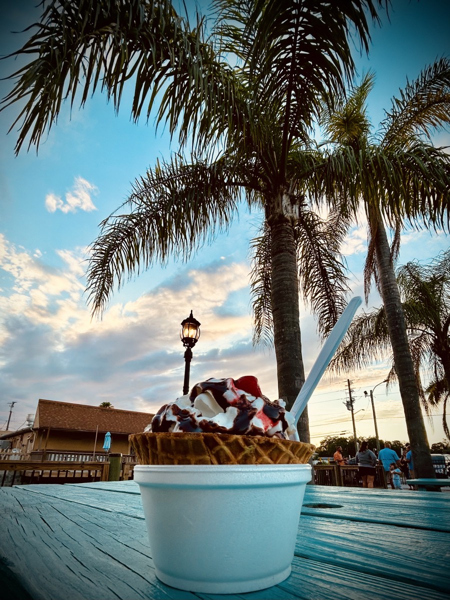

# Happy Snowman

## You are Both Wrong

I was going to post one of those *I don't know who needs to hear this* things today. I ended up not doing it. It was going to say, *I don't know who needs to hear this, but you are both wrong*...hehehe Although I never did post it, I found out later who needed to hear it...LOL It's kind of funny, and serendipitous, when something like that happens. Does that ever happen to you? You think something, and moments later it happens?...hehehe

I won't go into the details, but shortly after I thought about posting that, I go a phone call. A couple of people in my life were having a fight. They knew I could help settle it for them. Or at the very least, calm them both down...hehehe Toward the end of the call, I said, *you are both wrong...well, you are both right too...wrong about some things and right about others*. I was on speaker phone. So, they both heard me at the same time...hehehe

There are *rights* and *wrongs* on both sides of most arguments. There are typically 3 sides to every story, actually. There are the 2 different sides from the perspectives of both respective parties. And then there is the truth. Sometimes it takes mediation to resolve conflict. I almost always approach mediation with the attitude of *I don't need to know the details*. In fact, I used those exact words with them today. Oftentimes, I simply need to listen to both sides and ask clarifying questions that help each party get out of their own heads. Elevating someone out of *their* truth can help them see *the* truth.

## *Our* Father

Lately, I have been posting different content on my social media accounts. The context of each is something I'm still considering. But for Threads, I'm mostly just being me. One minute it could be a post about something I'm thinking, and the next it could be poetry. Sometimes it can even be something a bit vulnerable. I posted something today that is a dash of a lot of things.

> In that moment, though I could only see dimly, you were there. My heart’s eye could see clearly. It awakened before my eyes could see light. Thank you for being there, in a prayer. So softly is the embrace of a warm hug.

I had just finished doing my lunchtime *Bible in a Year* reading and was meditating on my morning. I got to thinking about how my mornings have changed since I adjusted my schedule a few weeks ago. From October through May, I started my day with reciting *The Lord's Prayer*, reading that day's *Verse of the Day*, and doing that day's *Daily Refresh* devotional. The latter two being from the Bible App. Well, this month, I started getting up at 7:30 am. I decided I would stop doing those latter two things for the time being.

Something I continue to do is recite *The Lord's Prayer*. But now I go through my entire morning prayer right after. I use to wait to do that when I brewed my coffee. With my coffee time being later (typically 2 hours after I wake), I thought it a good idea to move my morning prayer time to that first moment of the day. In the past, I would get out of bed and use the restroom before doing all of this. But even that comes after prayer time now.

So, I sit up and dangle my legs off the side of my bed now. I can barely open my eyes when I begin. I get a dim glimpse of light bouncing off the opposing wall opposite my bedroom window. As I recite *The Lord's Prayer*, peoples names and faces begin to appear. Obviously not literally...but mentally, they do *appear*. When I say the words *our* Father and forgive *us*, I'm communally including all of those people closest to me in my prayer.

I follow this up with specific prayers for several of the people laid on my heart that day. In my heart's eye, I can clearly see these people and their prayer needs. I'm grateful for this moment because people I love are the first God shows me each day now. It's a soft and warm hug for each of them. I thank God they are there. It's a great way to start the day!

## Summer Has Arrived

Yesterday ushered in a new season. My personal year begins on or around the first day of Spring (my birthday). I love that my personal year begins at the start of a new season. The calendar year begins just after Winter begins. That's not a great way to start the year. In terms of the calendar year, Summer is the third season. With my personal year, Summer is only the second.

If I were to choose a favorite, I'd go with Spring. It's the start of my personal year, yes. But it is also a symbol of awakening. Summer is a very close second. However, with where my heart is this year, I'm not so sure I can choose a season to call my favorite any longer. Everything has its pros and cons. As I tend to focus on the positive, I've learned to value each season for what it brings.

I'm one happy snowman...hehehe A lot of folks do not like the heat of summer. Yet, that is one of the things I love most about summer. When I first moved here, I didn't use the air conditioner in my car all summer...hehehe I enjoyed the heat that much...LOL I use my air conditioner now, though. I've learned that I need to pay close attention to my body. I can overheat easily if I'm not careful. I don't feel hot most of the time. I actually feel cold all the time. But that doesn't mean I'm actually cold and not hot. I have to be careful...hehehe

Something else I love about summer is all the sunlight. The Spring time brings more sunshine here. The first day of Summer is the peak of that. So Spring and Summer have the most sunshine in my world. I suppose that's why both are technically my favorites...hehehe But I need to stop thinking that way...LOL There is plenty to love about Autumn and Winter...hehehe

## Hudson Beach Ice Cream Parlor

I don't get ice cream as often as I'd like. It isn't the healthiest of treats. But I don't *cheat* very often. And lately, I haven't even been eating out. So, the occasional treat is just fine for me...hehehe Tonight, I decided I wanted to treat myself to one of my favorite old fashioned ice cream parlors. My sister introduced me to it 3 years ago when she first moved down here. Now that I live here, I typically only go there when people visit me...LOL But I do make it there a few times in the year.

This photo reminds me of one of the reasons I moved here. It looks like my version of paradise...

