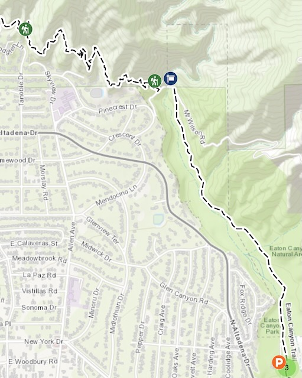
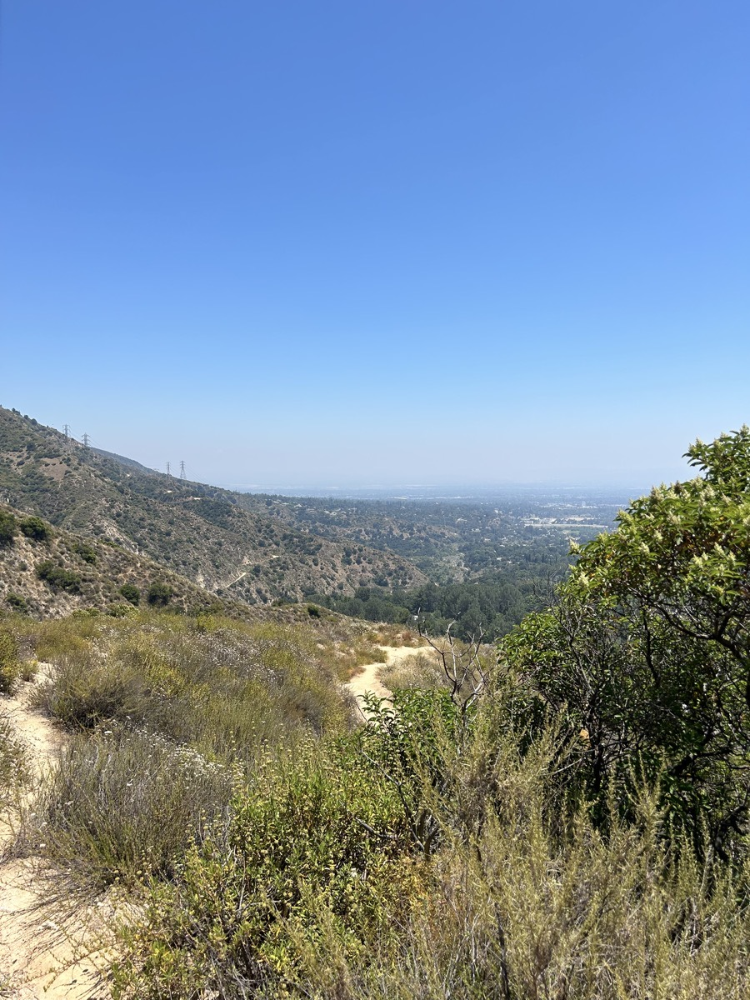
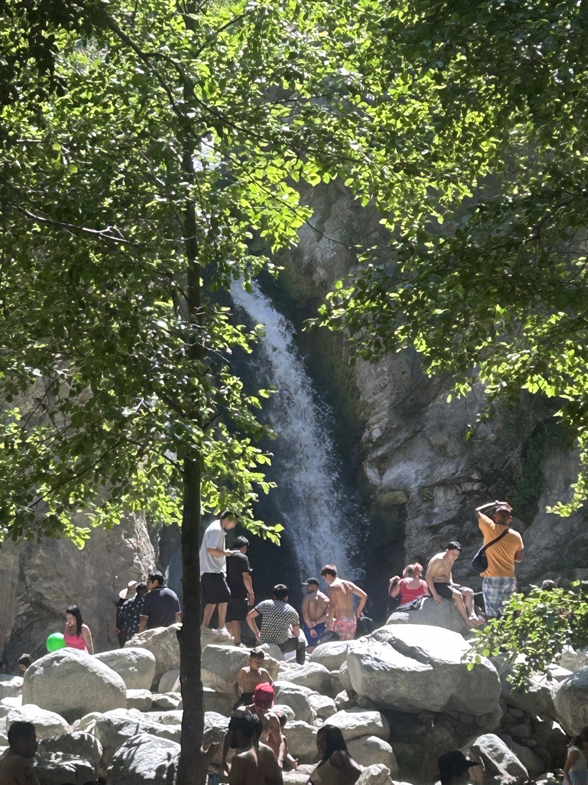

# TBD

First, and foremost, Happiest of Birthdays to Chérie! I know she reads this blog...hehehe So I wanted to say that to her, again, here...hehehe I can't wait to see her this weekend <3 It is so surreal that I'm currently only a few miles from her right now. We live over 2000 miles apart. But my trip has closed that gap quite a bit...hehehe

People seem to know my hotel well. It appears it is a local chain. I hadn't heard of it before this trip. I chose it due to its proximity to the church. It's actually turned out to be an excellent choice in general. It's really nice. For the most part, it has been quiet. I find it really easy to get to. When I adventure off away from the hotel, it has been really easy navigating back. Even coming in from the airport was super easy. The highway was backed up when I was coming in from the airport. But the exit I needed had a lane that was empty. So the traffic didn't bother me at all...LOL And the staff have been really friendly. There haven't been any spontaneous dance parties or random character meet & greets...hehehe But this isn't Disney...LOL

The views around here are amazing. I knew I loved the mountains. But it had been so long since I've been anywhere with mountains that I had forgotten just how much I loved them. Could I possible live in Diamond Bar someday?!? *Maybe*...hehehe Even with my stop in Las Vegas, what I loved seeing the most were the mountains. I could see a few of the famous hotels from the airport. But the mountains were where my eyes were drawn.

Well, today, I ended up on a mountain! Yay!!! I had no idea I would be *climbing* a mountain on this trip. I had absolutely no plans to do so and hadn't even given it a thought. I did look into Eaton Canyon as a possible place to check out. This morning, I prayed about where God wanted to join me for a day of adventure...hehehe I like to ask Him what He wants to teach me through my day's experiences. But today I worded the prayer to be more of *where are we going today?!?* As I've written before about this trip, I didn't want to plan out every moment. I wanted serendipity and spontaneity to play a role in this adventure. Today's page in the chapter of the book of my life was beyond words. I'll do my best to write a little about it here. But know that what I say does not come close to what it was like while experiencing it.

After I completed today's *The Chosen* devotional, I took a look at the list of places I had looked into. I almost decided to go to Azusa Wilderness Park today. I may go there tomorrow. But I ended up choosing Eaton Canyon because it is near Pasadena. I really wanted to find the *Little Old Lady from Pasadena*...LOL j/k But that song was really why I chose it today over Azusa...hehehe That's how my mind works sometimes...hehehe

I didn't really know what to expect with Eaton Canyon. I looked it up...but websites never capture what one can really expect out of a place like that. When I arrived, the place was packed. I suppose the holiday had something to do with that? They directed me to the overflow lot and instructed me to park on the street if the overflow lot was full. In my mind, I felt the lot would have a spot for me...and it did...hehehe

After parking, I headed right to the Eaton Canyon Trail. At first, I was like, *well, this is easy*. But my thoughts quickly turned toward the amazing views of the mountains. I started taking so many photos and thanking God for healing my body as much as He has so I could enjoy this adventure. Just 18 months ago, I could barely walk on a flat surface. Yet, here I was walking a hiking trail. The trail wasn't much at the beginning and people from all walks of life were enjoying it...no pun intended...hehehe

At one point, I was given a choice at a fork in the trail. One path led to a view of Eaton Canyon. Whereas the other path led to a water fall. I decided to go to the canyon view because I noticed there were fewer people on that path. As I mentioned above, the park was packed...hehehe

The canyon view was nice. But then I noticed another trail connected to the Eaton Canyon Trail. This one was called Altadena Crest Trail. The sign for this trail indicated it would be far more difficult than what I had already hiked. And I was game for it...hehehe

I walked about 1 mile of the Altadena Crest Trail. It wasn't nearly as long as the Eaton Canyon Trail. However, it was actually a mountain trail. There were moments when I was climbing at a 15% grade. That's insanely steep for a lot of people. I definitely could not have climbed that grade 18 months ago. So the difficulty wasn't light at all. I think it is considered moderate. Not being a seasoned hiker, I'd consider it at least moderate myself. But I knew it wouldn't be too difficult with my current health status. And I knew God had prepared me for this. Also, I felt like God would tell me when to turn around if the path was going to be too tough for me. I'm not ignorant when it comes to how these things play out. I listen to my body well when it comes to such things. I'm not a proud man. If I had to *give up*, I would have.

Here is a look at the distance I hiked...From the *P* at the bottom right up to the *hiker icon* in the top left. The *hiker icon* in the top middle next to the blue *trail maker* is where the Altadena Crest Trail begins from the Eaton Canyon park.

The Altadena Crest Trail portion looks a lot shorter...well, it is. That's 1 mile. But considering the grades at various spots, 1 mile is quite a hike up a mountainside. That Eaton Canyon Trail was quite a bit longer. But the grade was nominal. When I got to the top part of this portion the Altadena Crest Trail, I was probably 400-500 feet up from the base? The actual crest is 753 feet from the base. I didn't go that far. I probably could have had I been prepared to do the trail. As it were, I didn't know I'd be doing that today...LOL The photos I took will not do the view justice. But I did take several. Here is one of them from the highest point I reached...

While I was up there, I spent some time with God. Actually, the whole experience was time with God. But I dedicated some specific time to mediate, pray, and read scripture aloud. I'll not describe the specifics as that is between God and I. But I will describe how it felt as best I can. Have you ever had a moment when absolute nothing else existed? Only the moment existed. Although I'm sure there were sounds going on around me in the moment, I couldn't hear anything except my conversation with God. I wasn't thinking about work, anyone who is in my life, or even the fact that I had just hiked up a mountain. It was just me and Him. I didn't think about my health journey. I didn't think about my struggles with loneliness. I didn't think about what I'd be doing later in the day. Absolutely nothing else existed.

I don't chase after moments anymore, as I'm learning to just let things be what they are. But I'd have to say, I would love moments like that more often...hehehe When the Bible talks about how Jesus would go off and pray, I think this is somewhat what it must have been like for Him. I don't think I would need a mountainside to climb every time I want to experience God in this manner. But I'm going to pray for God to lead me to such a place I can go to regularly if it is His Will for me to experience this more often. Again, I'm not going to chase after this...as in, I'm not searching for a way to do this. I'll simply ask God, seek His Will, and knock on the door He places before me.

After this special time with God came to and end, I began my descent. It was much easier and quicker, as you can imagine...hehehe When I got back to the fork in the trail that led me on that adventure, I decided I would go check out the waterfall. As I mentioned earlier, that is where most people were headed. Yeah, there were so many people...LOL I did not like that part. Don't get me wrong, I do like people. What I don't like are crowds. And these crowds were loud...hehehe So many people were having a picnic, playing loud music, and some were even grilling. Side note: I didn't think they allowed grilling...it seems like a dangerous thing to be doing in this dryness...

I suppose my previous adventure up the mountain played a role in this, but the hike back to the waterfall was far more difficult that I expected. There weren't any steep grades besides a few times climbing some rocks. But it was quite difficult for me to do. I think the heat played a role as well. Up on the mountainside, the temperature didn't seem that bad and the breeze was nice. But down in the canyon, it was extremely hot. To best describe how hot it really was, I accidentally got one of my shoes wet when I slipped once. That shoe was completely dry in less than 5 minutes. And I mean bone dry!

I'm glad I went back to see the waterfall. Had I known how far back it was, I probably would not have attempted to see it. I think in a lot of ways, the same is true with the path God has for me. I need to just walk by faith and not ask Him what all it will take. If I know what the journey will take, I may not go. If He simply tells me where I'm headed but leaves out all the obstacles I'll face, I'm more likely to say, *sure...let's go!* It was certainly a test of trusting in God with all my heart, and leaning not on my own understanding. The entire hike, I was acknowledging Him, and He made my path *straight*. I say straight loosely here...hehehe It was actually windy, rocky, and sometimes wet. But He did guide me through all obstacles along the way. He prompted me when to rest, when to drink water, and when to simply look at the beauty of the world He created around me.

I am so full of happiness and joy today. Today was quite the unexpected adventure. Yes, happiness is a choice. But today's experiences really helped make that an easy choice. Although I had a physical backpack on me today, I also had a mental one that I carried containing all of the encouragement I've been given along my health journey. I'm sure I've written about this or said something...last year was the most difficult year of my life. What I had to do and what I went through to begin the healing process for my body seemed impossible several times. I wanted to give up more times than I care to admit. But I stuck with what God was doing with me. He also provided people in my life that kept cheering me on. I still have a ways to go...guess what...that's okay. I've made it this far. Back in November, I crossed a physical finish line at my runDisney 5k. That felt amazing. But today's adventure tops that 10 fold.

The health journey I've been on is not all that carried me into today's adventure. The heart transformation I've been going through this year is a major factor in how today played out. All of the lessons God is teaching me through the devotionals I'm doing are inspiring me to make soul changes as well. Unlike how difficult the health journey has been, the mental and spiritual journey I'm on isn't so rough. Part of that could be that the physical health improvements are enabling better thought processes. But I think acknowledging God and His Will has been giving me that Peace He describes in the Bible. Putting into practice the teachings of Jesus has been a mind blowing experience for me. I have no idea why that comes as such a surprise to me. It says it right there in the Word that this will happen. But it takes faith, and not feelings. I think my mistake in the past was going by feelings. Applying God's Word in faith is making all the difference this year. Yes, I still struggle. But just as with my physical health journey, I keep going. His process is far greater than my progress! As it is with my health journey, I've received encouragement in my spiritual journey this year as well.

As I type this out, I'm in tears...tears of joy! To all who read my story as I tell it...know that you can do this too. Keep allowing God to work in you. Healing is never the easy part. But all of it is well worth it when you can cross the finish line, climb the mountainside, or simply find happiness and joy. Today would not have happened had I given up when I wanted last year or if I did not remain constantly and consistently in prayer and the Word this year. I am grateful for everyone who, in their own way, told me to keep going. And keep going is what I did. Because of their support, God's healing power, and my willingness to obey, I climbed a mountain today 🥹❤️