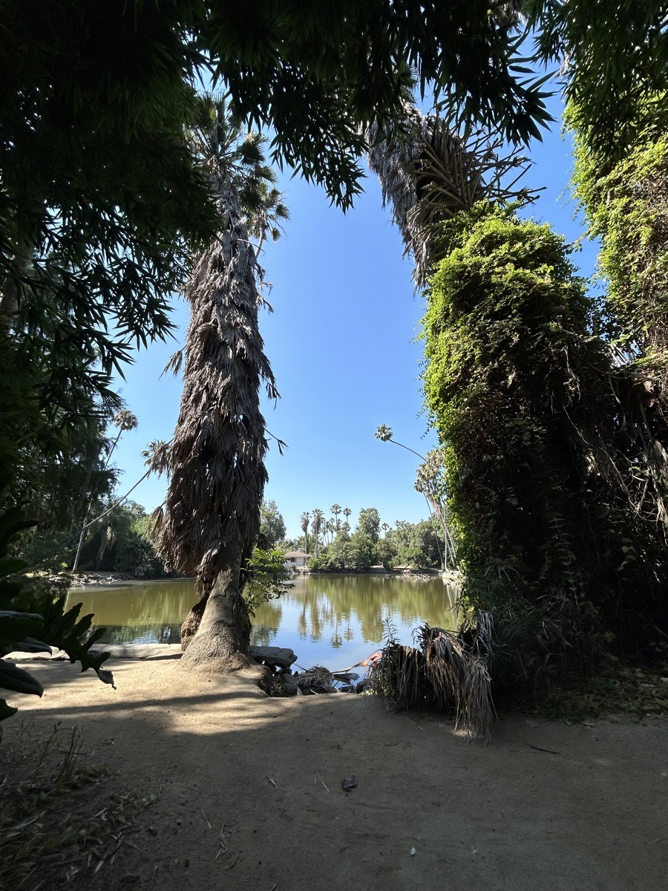
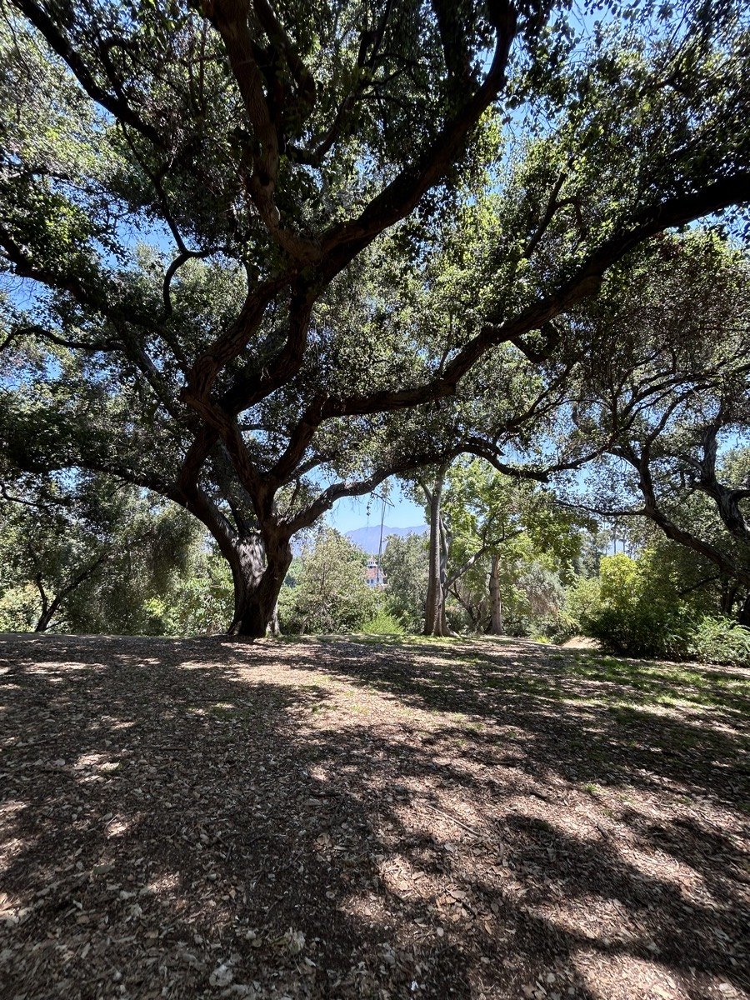
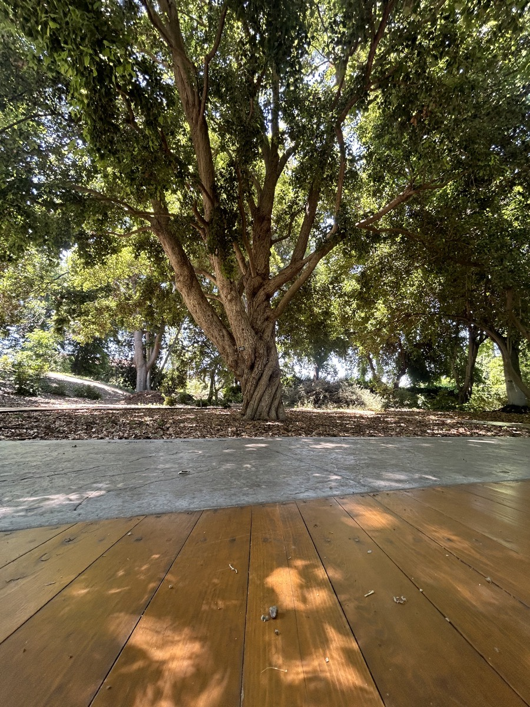
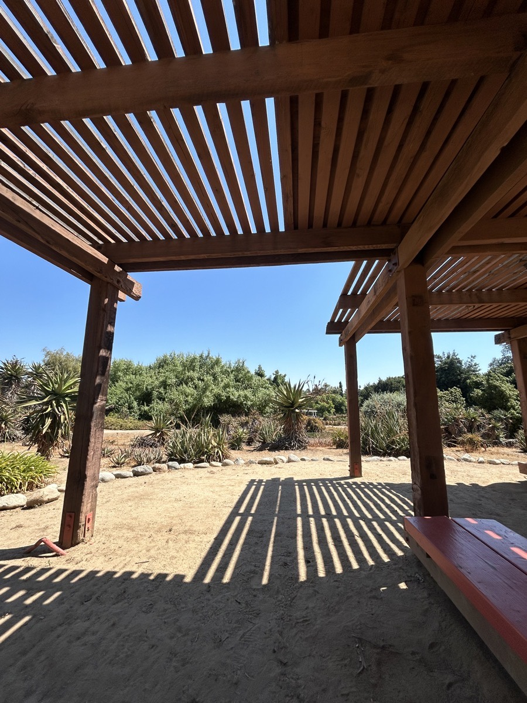

# I Experienced God!

Today was my last full day on this adventure. And what a great day it was! But I'll admit, I'm not sad that this is my last. I'm already dreaming about my next visit...hehehe I would like to make this a regular thing...except maybe not in the summer again...hehehe I was fine with the heat. But it was a bit hot for Chérie yesterday. And also, the crowds were a bit much for me. But none of that is the point of today's journal entry...so let's get started!

I skipped breakfast today...LOL I was too excited to be at church to deal with trying to fit breakfast in before going. Breakfast at the hotel didn't start until 7am today and church started at 8am. I didn't want to feel rushed. I got to the church a bit early. I actually always do that...hehehe I think I was there around 7:40ish. That service isn't packed. So I probably could have had breakfast and gotten there at 7:55 and would have been okay.

The service went well as usual. I felt a little out of place, though. I like to move a lot when I worship. So I felt a little restrained today. I actually felt that way on Wednesday as well. I'm not sure I mentioned it...hehehe Worship isn't about how I feel, though. It is about acknowledging the subject of my affection...God. I no longer allow the song choices, how well the band plays, how well the singers sing, or how much movement the congregation is accustomed to, to affect my worship. It's all about the heart of worship. I've wrestled with this throughout my life. Knowing who it is I'm worship is making the difference now. I'm basically saying that I'm not performing...hehehe And I have an audience of 1...God Himself. May my song be an offering to my King...hehehe

The sermon was the first in what Pastor Raul is calling a series on Angels & Demons. He read from Genesis 3 today. One of the things I love about this church is that he reads directly from the word. It isn't some message with a few scriptures sprinkled in, justified by a message. It's the Word justified by itself. That said, I'm not saying that most modern churches get it wrong. Perhaps both styles are good. For those just coming to Christ, perhaps they need a modern message with scripture sprinkled in. I'm not going to question how God uses the church. I'm simply saying I prefer the verse by verse approach. I want to know and understand the whole Word of God. That's what God uses to grow me personally.

There isn't a perfect church. They are all organized by humans, after all. Just like us as individuals, the church body is being sanctified by Jesus. So, although I am openly in *search* of a church, I'm certainly not going to expect to find the *perfect* church...hehehe By *search*, I really mean that I'm currently seeking God's Will in faith. I believe that I'll know when I'm meant to know. I'm asking Him to lead me to a church, as I seek His Will, and He will be the one who provides the door for me to knock on.

Anyway...hehehe After church, I headed over to the LA Arboretum. WOW!!! That places is AMAZING! I want to move here just so I can become a member and frequent the place! I already knew it was going to be really nice. But I honestly was not prepared for what I found there. I did take some photographs today. However, I spent most of my time just soaking it all in. I didn't take enough to showcase the beauty that makes up the entire experience. There was just too much to take in to be bothered with capturing it all. The funniest part, though, was the fact I was there for more than 8 hours...LOL So, technically, I probably could have captured it all...hehehe The following paragraphs will explain best why I didn't take a lot of photos even though I was there for so long...

There is scripture referenced below. Feel free to read it here, in your preferred translation, later in your personal time with God, or not at all. It's up to you! I included for myself and anyone who is interested in what was inspired today...hehehe

## God Time, Session 1

For the first hour I was there, I sat with the above view and did today's *The Chosen* devotional. I'm far more comfortable, physically, when I'm sitting at a desk or table doing that devotional. However, I find the overall experience more meaningful when I'm doing it outside. Even with the distractions of passersby, I'm able to focus on the lesson, prayer, and reflection. Plus it makes the photos of my notes more pleasant...hehehe

Today's struck me to the core of my number one struggle. It begged the question of whether I could give up my treasure for His Kingdom. My treasure is people...my family and friends. I'm not going to bore this journal entry with all that surfaced today regarding that. I may need to journal about it eventually. But I'm not ready to just yet.

This actually led to what I did for the rest of my time at the arboretum...hehehe This was just the first of 4 one hour sessions I had with God on this subject...LOL Hence, why I didn't take the time to capture the entire experience with a lens...hehehe

The scripture references associated with this are:

::: details Mark 10:17-31
17As Jesus started on His way, a man ran up and knelt before Him. “Good Teacher,” he asked, “what must I do to inherit eternal life?”

18“Why do you call Me good?” Jesus replied. “No one is good except God alone. 19You know the commandments: ‘Do not murder, do not commit adultery, do not steal, do not bear false witness, do not cheat others, honor your father and mother.’e”

20“Teacher,” he replied, “all these I have kept from my youth.”

21Jesus looked at him, loved him, and said to him, “There is one thing you lack: Go, sell everything you own and give to the poor, and you will have treasure in heaven. Then come, follow Me.f”

22But the man was saddened by these words and went away in sorrow, because he had great wealth.

23Then Jesus looked around and said to His disciples, “How hard it is for the rich to enter the kingdom of God!”

24And the disciples were amazed at His words.

But Jesus said to them again, “Children, how hard it is to enterg the kingdom of God! 25It is easier for a camel to pass through the eye of a needle than for a rich man to enter the kingdom of God.”

26They were even more astonished and said to one another, “Who then can be saved?”

27Jesus looked at them and said, “With man this is impossible, but not with God. For all things are possible with God.”

28Peter began to say to Him, “Look, we have left everything and followed You.”

29“Truly I tell you,” Jesus replied, “no one who has left home or brothers or sisters or mother or father or children or fields for My sake and for the gospel 30will fail to receive a hundredfold in the present age—houses and brothers and sisters and mothers and children and fields, along with persecutions—and in the age to come, eternal life. 31But many who are first will be last, and the last will be first.”
:::

::: details Philippians 4:12-13
12I know how to live humbly, and I know how to abound. I am accustomed to any and every situation—to being filled and being hungry, to having plenty and having need. 13I can do all things through Christ who gives me strength.b
:::

I also found [this article](https://www.gotquestions.org/camel-eye-needle.html) that was related to the passage in Mark. (Including it here for reference...it wasn't actually mentioned in the devotional itself.)

## God Time, Session 2

After the devotional, I walked around a bit. I think maybe an hour or so. At this point, I had been there 2 hours. The first hour doing the devotional...the second exploring. But then I came upon the above view. Here, I sat another hour praying about what God was revealing to me in the devotional.

I hadn't planned to sit there for an hour. It just sort of happened. Along with a time of prayer and reflection, I also did today's *Bible in a Year* reading. It was so peaceful to be talking with God out in nature. It wasn't quite the same as the time on Thursday on the mountainside. However, it was still pretty special.

The scripture reference the Spirit led me to during this session was:

::: details Psalms 107
1Give thanks to the LORD, for He is good;
His loving devotion endures forever.
2Let the redeemed of the LORD say so,
whom He has redeemed from the hand of the enemy
3and gathered from the lands,
from east and west, from north and south.a
4Some wandered in desert wastelands,
finding no path to a city in which to dwell.
5They were hungry and thirsty;
their soul fainted within them.
6Then they cried out to the LORD in their trouble,
and He delivered them from their distress.
7He led them on a straight path
to reach a city where they could live.
8Let them give thanks to the LORD for His loving devotion
and His wonders to the sons of men.
9For He satisfies the thirsty
and fills the hungry with good things.
10Some sat in darkness and in the shadow of death,
prisoners in affliction and chains,
11because they rebelled against the words of God
and despised the counsel of the Most High.
12He humbled their hearts with hard labor;
they stumbled, and there was no one to help.
13Then they cried out to the LORD in their trouble,
and He saved them from their distress.
14He brought them out of darkness and the shadow of death
and broke away their chains.
15Let them give thanks to the LORD for His loving devotion
and His wonders to the sons of men.
16For He has broken down the gates of bronze
and cut through the bars of iron.
17Fools, in their rebellious ways,
and through their iniquities, suffered affliction.
18They loathed all food
and drew near to the gates of death.
19Then they cried out to the LORD in their trouble,
and He saved them from their distress.
20He sent forth His word and healed them;
He rescued them from the Pit.
21Let them give thanks to the LORD for His loving devotion
and His wonders to the sons of men.
22Let them offer sacrifices of thanksgiving
and declare His works with rejoicing.
23Others went out to sea in ships,
conducting trade on the mighty waters.
24They saw the works of the LORD,
and His wonders in the deep.
25For He spoke and raised a tempest
that lifted the waves of the sea.
26They mounted up to the heavens, then sunk to the depths;
their courage melted in their anguish.
27They reeled and staggered like drunkards,
and all their skill was useless.b
28Then they cried out to the LORD in their trouble,
and He brought them out of their distress.
29He calmed the storm to a whisper,
and the waves of the seac were hushed.
30They rejoiced in the silence,
and He guided them to the harbor they desired.
31Let them give thanks to the LORD for His loving devotion
and His wonders to the sons of men.
32Let them exalt Him in the assembly of the people
and praise Him in the council of the elders.
33He turns rivers into deserts,
springs of water into thirsty ground,
34and fruitful land into fields of salt,
because of the wickedness of its dwellers.
35He turns a desert into pools of water
and a dry land into flowing springs.
36He causes the hungry to settle there,
that they may establish a city in which to dwell.
37They sow fields and plant vineyards
that yield a fruitful harvest.
38He blesses them, and they multiply greatly;
He does not let their herds diminish.
39When they are decreased and humbled
by oppression, evil, and sorrow,
40He pours out contempt on the nobles
and makes them wander in a trackless wasteland.
41But He lifts the needy from affliction
and increases their families like flocks.
42The upright see and rejoice,
and all iniquity shuts its mouth.
43Let him who is wise pay heed to these things
and consider the loving devotion of the LORD.
:::

## God Time, Session 3

I started to walk around exploring for a bit again. I think this time was around 30 minutes or so. Then I came across the above view. It grabbed my attention in a new way for the day. Instead of just praying and reading scripture, I actually meditated with my eyes closed and taking in the ambience.

I did 2 separate 10 minute meditation sessions for this time. So about 20 minutes total. I was here for another full hour. So the other 40 minutes was still prayer and scripture. What stood out was the meditation, though. I had a similar experience with that as I did on Thursday's mountainside adventure. Most things that were on my mind just simply vanished for each meditation cycle. I hadn't really ever done that before. So I have no idea if what I was doing was right or not...hehehe For what it was today, it served a purpose...LOL

This one hour session led me to the following scripture:

::: details Psalm 102
1Hear my prayer, O LORD;
let my cry for help come before You.
2Do not hide Your face from me
in my day of distress.
Incline Your ear to me;
answer me quickly when I call.
3For my days vanish like smoke,
and my bones burn like glowing embers.
4My heart is afflicted, and withered like grass;
I even forget to eat my bread.
5Through my loud groaning
my flesh clings to my bones.
6I am like a desert owl,
like an owl among the ruins.
7I lie awake;
I am like a lone bird on a housetop.
8All day long my enemies taunt me;
they ridicule me and curse me.
9For I have eaten ashes like bread
and mixed my drink with tears
10because of Your indignation and wrath,
for You have picked me up and cast me aside.
11My days are like lengthening shadows,
and I wither away like grass.
12But You, O LORD, sit enthroned forever;
Your renown endures to all generations.
13You will rise up and have compassion on Zion,
for it is time to show her favor—
the appointed time has come.
14For Your servants delight in her stones
and take pity on her dust.
15So the nations will fear the name of the LORD,
and all the kings of the earth will fear Your glory.
16For the LORD will rebuild Zion;
He has appeared in His glory.
17He will turn toward the prayer of the destitute;
He will not despise their prayer.
18Let this be written for the generation to come,
so that a people not yet created may praise the LORD.
19For He looked down from the heights of His sanctuary;
the LORD gazed out from heaven to earth
20to hear a prisoner’s groaning,
to release those condemned to death,
21that they may proclaim the name of the LORD in Zion
and praise Him in Jerusalem,
22when peoples and kingdoms assemble
to serve the LORD.
23He has broken my strength on the way;
He has cut short my days.
24I say: “O my God, do not take me in the midst of my days!
Your years go on through all generations.
25In the beginning You laid the foundations of the earth,
and the heavens are the work of Your hands.
26They will perish, but You remain;
they will all wear out like a garment.
Like clothing You will change them,
and they will be passed on.
27But You remain the same,
and Your years will never end.a
28The children of Your servants will dwell securely,
and their descendants will be established before You.”
:::

## God Time, Session 4

After another half hour exploration, I came to the above view. This began my forth and final session with God. Up to this point, I had already been at the arboretum for 5 hours...hehehe 3 of those hours were time with God and only 2 of exploring the arboretum itself...hehehe

This session was also quite different, except that it too was an hour. I loved how each of these had different views, different prayers and meditation, and different scriptures brought to bear. This time, I mostly sat there and listened for God's voice. In order to do so, I did some Bible research. As you'll see below, there is much more scripture referenced. Some are related stories from multiple gospels. But I felt it important to cross reference them all.

As I was sitting there, a peacock ran up to me, checked me out, and then ran off. It was a bit weird and fascinating at the same time...hehehe Like, why was he in a hurry? Where was he going? What made him stop and check me out? Come on Alex! WHY?!?

::: details Matthew 19:29-30
 29And everyone who has left houses or brothers or sisters or father or mother or wifeh or children or fields for the sake of My name will receive a hundredfold and will inherit eternal life. 30But many who are first will be last, and the last will be first.
:::

::: details Mark 10:29-31
29“Truly I tell you,” Jesus replied, “no one who has left home or brothers or sisters or mother or father or children or fields for My sake and for the gospel 30will fail to receive a hundredfold in the present age—houses and brothers and sisters and mothers and children and fields, along with persecutions—and in the age to come, eternal life. 31But many who are first will be last, and the last will be first.”
:::

::: details Luke 18:29-30
29“Truly I tell you,” Jesus replied, “no one who has left home or wife or brothers or parents or children for the sake of the kingdom of God 30will fail to receive many times more in this age—and in the age to come, eternal life.”
:::

::: details Luke 14:25-33
25Large crowds were now traveling with Jesus, and He turned and said to them, 26“If anyone comes to Me and does not hate his father and mother and wife and children and brothers and sisters—yes, even his own life—he cannot be My disciple. 27And whoever does not carry his cross and follow Me cannot be My disciple.

28Which of you, wishing to build a tower, does not first sit down and count the cost to see if he has the resources to complete it? 29Otherwise, if he lays the foundation and is unable to finish the work, everyone who sees it will ridicule him, 30saying, ‘This man could not finish what he started to build.’

31Or what king on his way to war with another king will not first sit down and consider whether he can engage with ten thousand men the one coming against him with twenty thousand? 32And if he is unable, he will send a delegation while the other king is still far off, to ask for terms of peace.

33In the same way, any one of you who does not give up everything he has cannot be My disciple.
:::

::: details Matthew 8:18-22
18When Jesus saw a large crowd around Him, He gave orders to cross to the other side of the sea.e 19And one of the scribes came to Him and said, “Teacher, I will follow You wherever You go.”

20Jesus replied, “Foxes have dens and birds of the air have nests, but the Son of Man has no place to lay His head.”

21Another of His disciples requested, “Lord, first let me go and bury my father.”

22But Jesus told him, “Follow Me, and let the dead bury their own dead.”
:::

::: details Luke 9:57-62
57As they were walking along the road, someone said to Jesus, “I will follow You wherever You go.”

58Jesus replied, “Foxes have dens and birds of the air have nests, but the Son of Man has no place to lay His head.”

59Then He said to another man, “Follow Me.”

The man replied, “Lord, first let me go and bury my father.”

60But Jesus told him, “Let the dead bury their own dead. You, however, go and proclaim the kingdom of God.”

61Still another said, “I will follow You, Lord; but first let me bid farewell to my family.”

62Then Jesus declared, “No one who puts his hand to the plow and then looks back is fit for the kingdom of God.”
:::

::: details John 6:59-66
59Jesus said this while teaching in the synagogue in Capernaum. 60On hearing it, many of His disciples said, “This is a difficult teaching. Who can accept it?”

61Aware that His disciples were grumbling about this teaching, Jesus asked them, “Does this offend you? 62Then what will happen if you see the Son of Man ascend to where He was before?

63The Spirit gives life; the flesh profits nothing. The words I have spoken to you are spirit and they are life. 64However, there are some of you who do not believe.” (For Jesus had known from the beginning which of them did not believe and who would betray Him.)

65Then Jesus said, “This is why I told you that no one can come to Me unless the Father has granted it to him.”

66From that time on many of His disciples turned back and no longer walked with Him.
:::

::: details Proverbs 18:24
24A man of many companions may come to ruin,
but there is a friend who stays closer than a brother.
:::

::: details Psalms 34
1I will bless the LORD at all times;
His praise will always be on my lips.
2My soul boasts in the LORD;
let the oppressed hear and rejoice.
3Magnify the LORD with me;
let us exalt His name together.
4I sought the LORD, and He answered me;
He delivered me from all my fears.
5Those who look to Him are radiant with joy;
their faces shall never be ashamed.
6This poor man called out, and the LORD heard him;
He saved him from all his troubles.
7The angel of the LORD encamps around those who fear Him,
and he delivers them.
8Taste and see that the LORD is good;
blessed is the man who takes refuge in Him!
9Fear the LORD, you His saints,
for those who fear Him lack nothing.
10Young lions go lacking and hungry,
but those who seek the LORD lack no good thing.
11Come, children, listen to me;
I will teach you the fear of the LORD.
12Who is the man who delights in life,
who desires to see good days?
13Keep your tongue from evil
and your lips from deceitful speech.
14Turn away from evil and do good;
seek peace and pursue it.
15The eyes of the LORD are on the righteous,
and His ears are inclined to their cry.c
16But the face of the LORD is against those who do evil,d
to wipe out all memory of them from the earth.
17The righteous cry out, and the LORD hears;
He delivers them from all their troubles.
18The LORD is near to the brokenhearted;
He saves the contrite in spirit.
19Many are the afflictions of the righteous,
but the LORD delivers him from them all.
20He protects all his bones;
not one of them will be broken.e
21Evil will slay the wicked,
and the haters of the righteous will be condemned.
22The LORD redeems His servants,
and none who take refuge in Him will be condemned.
:::

::: details Proverbs 27:4-10
4Wrath is cruel and anger is like a flood,
but who can withstand jealousy?
5Better an open rebuke
than love that is concealed.
6The wounds of a friend are faithful,
but the kisses of an enemy are deceitful.
7The soul that is full loathes honey,
but to a hungry soul, any bitter thing is sweet.
8Like a bird that strays from its nest
is a man who wanders from his home.
9Oil and incense bring joy to the heart,
and the sweetness of a friend is counsel to the soul.
10Do not forsake your friend or your father’s friend,
and do not go to your brother’s house
in the day of your calamity;
better a neighbor nearby
than a brother far away.
:::

## And Adventure Ends

Okay, at this point, it was now 4pm and I had been at the arboretum for 6 hours. 4 of those hours were in prayer, meditation, and scripture reading/research and only 2 hours of exploring...LOL So I spent the remainder of my time there, about 2 hours 15 minutes, exploring. Although I did quite a bit of walking around and looking, I don't think I covered the entire place. It is huge! I did go to each *area*. But each area had some smaller areas within.

I found several of the locations Chérie had featured in photos. That was a fun challenge today! There was one location I never did find. But after talking with her, I know exactly where it is. I'll find it on my next visit to this amazing place. I'll also hopefully take a lot of pictures myself...hehehe I did take enough to remember today's experiences, though. There are the 4 above...plus several others I'll keep in my private collection until I have time to process them.

After the arboretum, I had dinner at Banana Leaf. It's another Indonesian restaurant Chérie recommended to me. It was so good! The portion size was way too big for me. But I decided to go ahead and eat the whole thing. I hadn't eaten much today and it was my last official meal out on this visit. I wouldn't be able to have leftovers tomorrow...hehehe

It was such a wonderful day. I loved today. Actually, I've loved this entire adventure! I had so many wonderful new experiences. And I came way under budget! That's always a nice surprise...hehehe I am scheduled to fly home tomorrow. Assuming there aren't any delays or cancellations, I should be landing by 1am Eastern Tuesday morning. Home by 2 or 3am. It'll be nice to be in my own bed again. And I'm definitely looking forward to being back in my kitchen this week! I'll probably eat out the day I get back. But I'll go to grocery as soon as possible. I don't like eating out anymore...hehehe