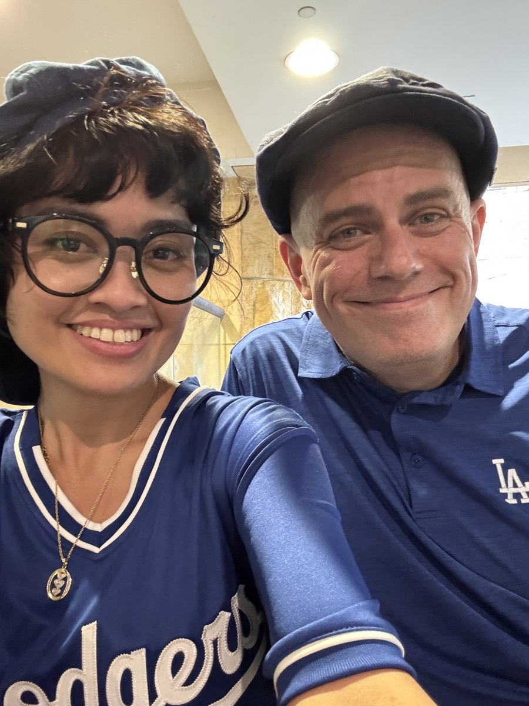

# Resetting

It's travel day once again...hehehe This time, I'm headed home from my visit to California. I'll be waiting at a few airports today. The one in Ontario, California. And then again in Las Vegas, Nevada. I'm going to use the wait time to reflect and write about my experience. Right now, I'm sitting at an airport restaurant in Ontario. I didn't eat at airport restaurants on my way here. I typically do eat. I'm not really sure why I didn't last week...hehehe Today I'm mostly doing so to have a place to write. It's easier with a table...hehehe It also helps me avoid some of the crowds since only restaurant guests are in the restaurant...LOL I just wish it wasn't so loud (in the whole airport...not just the restaurant area). I'd wear my headphones except I want to be aware of people around me. Not that I think someone would steal any of my stuff while I wasn't looking. After all, everyone here is paying to be here and no one wants their stuff taken. But being aware of those around you is just plain smart.

Now that I don't drink alcohol, I keep asking restaurants if they have non-alcoholic beer. Back home, everywhere has them. Here in California, they keep looking at me like they have never heard of such a thing...LOL They are like, *sir, you know you are sitting at a bar, right?!?* Or even when I'm not sitting at the bar, they are like *sir, you know alcohol is awesome, right!?!* The only place I was able to get some was at the chain restaurant I went to on Thursday...hehehe I only went there because it was the holiday and the local restaurant I wanted to check out was closed for the holiday...LOL Oh well, perhaps someday I'll stop asking. It's just that I don't typically like tap water and I don't drink sodas anymore. I'll sometimes order tea. But that isn't any better than soda when it's that fountain junk. I'll sometimes drink soda too. But that stuff just doesn't make me feel right anymore. Non-alcoholic beer doesn't have that affect on me, though. I feel fine with it. And I do love the taste...hehehe Coffee does the trick in a pinch. But I don't need the caffeine. I only like drinking that at home as more of a meditative thing. I may switch that to teas soon. I drink tea sometimes...perhaps that will become more of a regular thing soon. Wow...I just talked a lot about drinks...hehehe

As I reflect on the experiences I just had, I'm feeling so much joy. I really needed this trip. I didn't realize how much I needed it. And God Blessed me in ways that I didn't even expect, ask for, or imagine could have happened. The time on the mountainside, seeing the Pacific Ocean for the first time, spending a day with my deerest friend, and 4 hours of prayer, meditation, and scripture at the arboretum were all beyond words. The only thing I knew would happen was spending time with Chérie. But what happened that day was unexpected. She just texted me to remind me of Peggy...hehehe 🤭 Peggy was a peg-legged pigeon we met at Union Station on Saturday...LOL See, that was something I just didn't expect to experience on this trip. It's moments like that which make my life so wonderful.

Something I believe I forgot to mention Saturday was how we were joking with each other about how *The Last Bookstore* could have been the...laaaaast...bookstore we'd ever visit...bwhahaha That part of the city was a bit shady. I think I mentioned something about that. But we had some fun later on joking about it being the last bookstore we'd ever see...hehehe I did my golden age of Hollywood voice and said, *this will be the last bookstore...seeeeee You'll never make it out alive...seeeeee* 🤭

It's difficult to pick just one moment to say it was my favorite. Even when I wrote about my favorite moment from Saturday, I felt like I was cheating on the other moments that day...hehehe Every moment was my favorite...hehehe I suppose to some that means none of my moments were a favorite. That's not how I feel. I feel as though each moment has value. I still find it important to reflect each day and find my favorite moment of the day. That exercise keeps my days going in my mind. But I honestly do find value in all moments. So, when I ask someone what their favorite moment is, I'm really just asking them to reflect on their day. That's what I do. And I love it!

I sent a few people my sad face and happy face expressions stating that I'm sad to be leaving but happy I came. Well, honestly, I'm not sad about leaving at all. I am so full of joy today. Although I don't like that this trip is over, it was one of those experiences that I can't help but be extremely happy today. I can't be sad. And I know I'll be back, if the Lord Wills it. If He doesn't, that's okay too. He was with me the whole time. He always is. But I was more aware of it this time. Perhaps that is why I am so full of joy. This was exactly what I needed when I needed it. Have I said that before?!? LOL I'm sure I've said it and will keep saying it. That's what I believe. God's Will, even though I don't know it or understand it, is always going to happen just when it needs to. Realizing that now has made it so much easier for me to enjoy things like this.

Yesterday, I quoted a lot of scripture. There really wasn't any context to which passages I included. Those were notes for me. I think I'll be writing more about what I discovered yesterday and provide more context to those passages. Again, I'll be doing that for myself. But for anyone reading this blog, you might have been confused about the scriptures if you've already read yesterdays...hehehe I'm sure I do this a lot, actually. Here's the thing, my journal/blog is just a bunch of random thoughts and musings. If I ever do publish something formally, those thoughts will become complete in the writings. They won't be on this site. I think yesterday's scripture may end up on my future Bible site. What God has to say to me and through me isn't for everyone. But I do feel as though He is calling me to write it all in a formal manor and share it. More to come on that in the future...

I traveled Wednesday. Thursday, I climbed the side of a mountain. Friday I saw the Pacific Ocean. I got to hug Chérie on Saturday. And Sunday I experienced God in a whole new way. Today, I'm traveling once again. In those short sentences, it sounds like this trip went by quickly. It did not. I took the time to experience each moment and absorb the energy each presented. In a world that seems to be going quicker and quicker each year, I'm finding a way to slow myself down. It's kind of like those videos of the person who is in focus and the world around them is zipping by in a blur. I've typically seen those videos as a person who is depressed or sad. That isn't me at all. I'm breathing in, finding peace, and enjoying the small and the big moments. In a way, I wish I could tap into that and share my secret with others who desire to slow things down a bit. Sorry, I haven't found a way to do that yet...hehehe As we talked about on Saturday, there are people who live the *you only live once* lifestyle and try to do *everything*. My *YOLO* lifestyle is, *yes, I will only live once*. So what I'm going to do is make that life count. I'm only going to do the things that matter to me. I don't have to concern myself with what I'm missing out on. That's because I'm not really missing out. I use to have the fear of missing out. I just don't anymore. One way I look at this is remembering that nothing in this life will compare to what Heaven will be like. So I'm not going to chase after life's experiences anymore. I'm going to carefully consider what it is I can do in this life and focus on those things that truly matter to me. I'll still try a bunch of new things just to try them. But that doesn't mean I'm going out every weekend, travel the world, or do all of those meetups like I did last year. And my favorite things to do will be done as often as I can.

I'm in Las Vegas now...hehehe I took a short nap on the plane. It started while we were waiting to take off. Apparently the Las Vegas airport is rather busy. So, we had to wait in Ontario for a bit. I slept until about 15 minutes left in the flight.

I mentioned things like not needing to do things every weekend, traveling the world, and meetups. I wanted to come back to that because I don't mean I won't do those things. I simply don't have to do them to fill fulfilled with my life. If my path leads me to weekend happenings, travel, or even a meetup from time to time, I'm okay with that.

I don't recall a time in my life when I was this happy. I do recall moments of happiness like this. For example, the day I met my son...hehehe I got to see him come into this world and gave him his first diaper. That was a very happy moment. I also fondly remember Rainbow Falls in Smoky Mountain National Park. I had never been up close to such a huge and beautiful waterfall before that. And I don't think I have since, actually...hehehe And I love that moment I walked into my high school graduation. All very happy moments in time. But I don't think I have ever felt as happy about the whole of my life as I do right now.

I know happiness is a choice. And I also know there are things in life that help make me happy. But where could this joy I'm feeling possibly be coming from? God...God is the only answer I have. As someone who claims to not be super religious, I do talk about God quite a bit. But I've said this before. I'm all about the relationship part. Now that my relationship with Him is growing, so is the joy I'm feeling.

Now, what am I going to do with all of this joy? Part of the point of this trip was to do a reset of sorts. I've been stuck in a tiny rut lately. I haven't really been talking much about it as far as I know. At least, I don't recall writing about it or posting about it on social. And I don't talk about it with anyone in person...hehehe

What does a reset look like to me? They are all different. Part of this one was to get over my travel anxieties. I've mentioned before that I use to love to travel. But it had been 3 years since my last real trip. I needed a trip this year to get going with travel again. The job thing derailed that for a few months. But when I let that change go in my mind, I started planning this trip. I won't go into all the details about why I stopped traveling. But dealing with my past trauma released me from the anxieties that caused me to stop. That process began on my birthday this year. Which now brings to mind that God's timing is perfect. I had originally planned to travel to California for my birthday...LOL The work thing derailing those plans may have been just the opportunity God wanted to take to work in me to prepare me for doing it now...hehehe God is so good!

Another reset I felt I needed was with the church thing. It just so happened that I left theChapel the weekend before this trip. And this trip was the first time I attended Calvary Chapel Golden Springs physically. I've been attending virtually since March. This trip felt like a transitionary moment for what I'm dealing with spiritually regarding church. I didn't post my journal online last year. But I wrote about this church thing last August. I only started talking to other people about it more recently. So I've been dealing with this for quite some time actually.

I find church to be a very important part of my faith. I need that community. I just haven't quite found the community I fit into. I'm a puzzle piece who hasn't found the puzzle I belong to...hehehe That's okay. I'm not worried about it. It has been drawing me closer to God, actually. And the recent conversations about where I should be going to church have brought up some important questions.

I won't go into all of the questions yet. I think I should journal about this whole thing by itself...hehehe But one question I've had is if virtual church is okay. I've felt as though it is as long as there is still Bible study and fellowship involved. There would still be a need for community. Virtual communities are a thing now. So it only makes sense to me that a virtual church is feasible. I talked with Chérie about it briefly on Saturday. She was the one who introduced me to CCGS. I'll want to ask others about this too. But she seems to agree with me on it. I've known people who believed that if you could physically go anywhere, you belong in the church. But I personally believe that there are reasons not to be there physically. The whole point to the church is to have a community, be taught about God, and go into the world. It isn't a place you go to. It's a place you go from. Also, if the church isn't drawing you closer to God but is actually pulling you away, that is likely not the place to be, right!?

My diet is another reset I went through on this trip. Lately, I've been going back and forth in my head as to whether I'll go back to eating flesh meats or stay a vegetarian. I decided before the trip that I would eat some meat on this trip. It's already difficult sticking to a diet when traveling. Leaving meat out was just adding more restrictions that I didn't want to deal with. It isn't that it is impossible to find options. It just adds stress on travel; which can be stressful to begin with. That said, I wasn't stressed at all this entire trip. I've had a few moments at the airports and in LA. But that was all crowd related...hehehe

Back to my diet, though. I had both chicken and sausage on this trip. I almost get a steak once. But the place I was at was a chain restaurant. I didn't order steak at one of those in the past. Why do it now?..LOL A friend of mine wanted to take me to their favorite burger place this weekend. He then came back to say that we could go somewhere else because of my diet. I told him I really wanted to check out his favorite place and that I'm not strict about my diet. So I'll get beef on Saturday...LOL But I think my body is ready for me to have flesh meats once again. It didn't seem as though it was back in early March. I'm not sure what has changed. I know I have changed. But my changes are more mental and spiritual than physical. I know all 3 aspects of health balance each other out. Perhaps that is what is happening?

So, it would seem I've reset my diet now. I may slowly make the change back. I'll still eat some vegetarian dishes. But I won't give it much thought. Whatever I want to eat, I'll make. I'm actually looking forward to this. I do love change. It won't be like I'm going back to dishes I use to make. I'll be making all new stuff. But instead of plant-based proteins, I'll be using meats instead. I've been branching out my cooking style through this plant-based adventure. I'll just continue exploring.

Although I have traveled alone before, this was the first trip I've ever taken that wasn't business related or something where I needed someone's permission to do it. 4 years ago, I took a solo trip. But I had to get permission for it. Long story...hehehe So, this was my first ever truly solo trip. I conceived it, planned, executed it, and enjoyed it. So, in another way, that is sort of a reset for me too.

I normally do big things like this with someone or for someone. This experience, and spending so much time with just God, made me realize how amazing doing solo things can be. I'm never truly alone because I have God with me and I can share my experiences with friends and family via text. I have now reset how I view those relationships. I'm more okay with being remote than I was before this trip. I've talked about how loneliness is one of my issues and how I wish I had friends who were physically closer to me. I've also talked about how I wish I didn't need to plan most of my hangouts with friends. Well, I no longer *feel sorry for myself*. I say it that way because, in away, I was just feeling sorry for myself.

I'm a people person who didn't have people around me...hehehe But they are still there. Why was I so focused on wanting people closer? I was being a bit selfish. Sometimes that kind of selfishness is probably okay. We do need people around us. But I didn't like the feeling of loneliness. Well, most of what I did on this trip was all by myself. And I had a great time! I'm going to pray that this feeling of joy in being alone continues. I really like it. I'll still do things with other people. I'm just not going to chase after it anymore.

I'm already mentally dreaming about and planning new trips...hehehe I haven't decided anything specifically yet with the exception of an already planned trip to Disneyland with Chérie in November. I do think traveling will become a regular thing for me. I think what I'd like to do are short weekend trips. This one was around the holiday. So I had extra time off to make it into a full length vacation. Long weekends are the best kind of trips for me, though. Friday to Monday at the longest. Even if I go far for a 1 or 2 days visit someplace, I would love to take this experience and continue it. I could also do the occasional mid-week trip if that helps with crowds. I do get time off from work. So I could do weekday trips too. If I'm going somewhere with crowds, like Disneyland, a weekday trip is probably better. But if I'm going to climb a mountain, weekends should be fine. Either way, I'm looking forward to where God will be taking me in the future.

I'm going to prepare for my next flight now. So I'm going to call this journal entry complete. My flight should be boarding in a little less than an hour. But I need to use the bathroom, get some water, and maybe eat one or two of my food bars before the flight. I know this one is long. If you made it this far, congratulations! Thank you for listening. I am so happy. This reset is exactly what I needed.

I leave you now with my favorite photo from this trip <3

