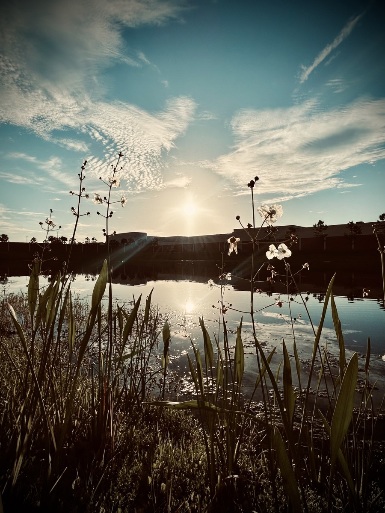

# TBD

> My *you only live once* attitude has become slowing down and focusing on what truly matters to me. I’m letting the world pass me by now. I don’t need to fill my life to *find* meaning. I need to fill my life *with* meaning.
>
> 

The above was today's *Vitamin G*. I've talked about this numerous times recently. At least for this season of my life, I'm done with the world's definition of *YOLO*. I just cannot talk about it enough or express enough just how freeing it has been to stop chasing after this world. Now that I'm traveling once again, I can go to places and simply enjoy each moment for the amazing thing that it is. It could be doing some activity that everyone else is doing. But it could also just be sitting on a bench watching the birds playing in a tree or a deer panting at a brook. I also talk to others about what they'd like to do or where they'd like to go and I start dreaming about giving those things and places a try myself. Even as I type this entry, I'm considering a weekend trip in a community a few hours south of me here in Florida...just to do it. While there, I may paint a painting, write a chapter of a book, or take photos. Perhaps all of that. Regardless of what such a weekend brings to my life, it will have meaning. Not because I was searching for it. Rather, because it existed all along. It will be the same for this weekend. It's meaning will be a video call with my deer friend, a trip to the grocery, and some quiet time at home. I may even paint, write, or take photos too. But there isn't any pressure. How amazing is that?!.hehehe

