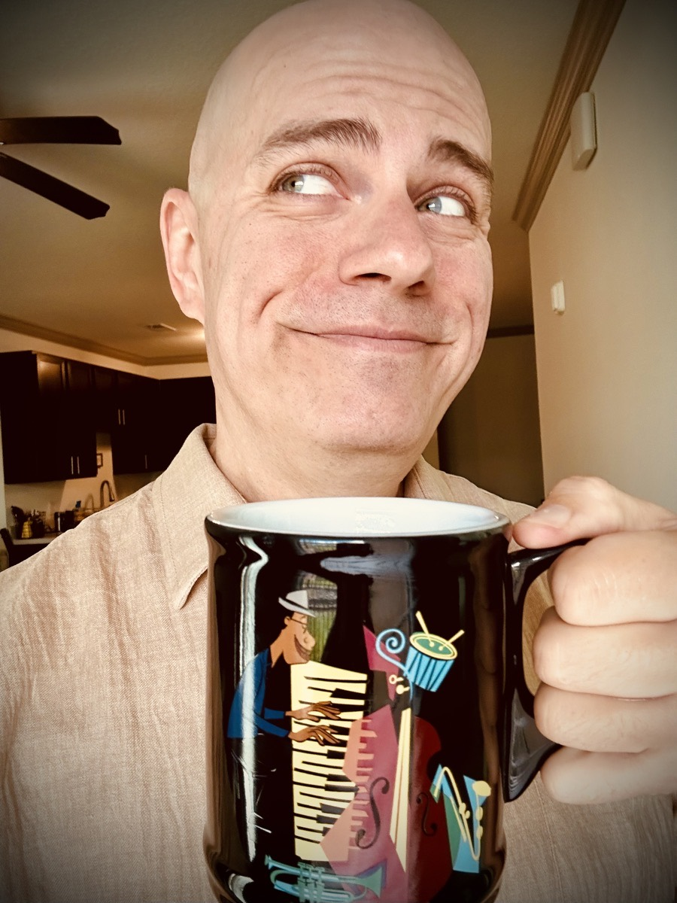

# TBD

So, I'm trying a new (to me) soap. A little over a week ago, I bought some Zum Bar soap. I had seen that Chérie had gotten some but I didn't think much about it at the time. Then when I was shopping at Sprouts one day, I came across it while I was looking for something else. I recognized it and my curiosity was peaked...hehehe I liked the scents and the ingredients looked good. Since she trusts it, I decided to give it a try. I've been using it for just over a week now and have been quite surprised at the results. I've had issues with dry skin and scalp for about 30 or so years and have tried all sorts of soaps and shampoos. Some medicated and some just your basic *Head & Shoulders* type stuff. I've even tried various lotions and whatnot to keep my skin moisturized. Nothing too serious and no risk of cancer. Just the type of irritation that became a struggle because it just wouldn't go away. Well, within a week, every single skin irritation, rash, and dry spot on my body has cleared up. I even had this spot on my right ear that just wouldn't clear up for months no matter what I tried. Yet, within a few days of using Zum Bar, poof...all gone!

Not everything other people do is right for me. But I do pay attention to what others use to take care of themselves. Sometimes I give something a try and it doesn't work out. Sometimes, like has been the case with Zum Bar thus far, it works out rather well. I'm finding it important to not stick with *tradition* for tradition sake or to keep with the status quo. I much prefer to grow through new experiences if it seems like it might be good fit. Sometimes, *good enough* is, well, good enough. But other times, I need to break the cycle in order to grow. To some, a simple thing like changing soap might seem like something silly to celebrate. But that's just who I am. When I have faced something that has truly been a struggle for 3 decades, then something so simple comes along to change or eliminate the struggle, I want to celebrate it. Perhaps that is one of the things that sets me apart from the *YOLO* and *FOMO* folks? I'm not judging them or anything. In fact, I have been a *YOLO* person and have had *FOMO* most of my life...LOL But it no longer takes the big moments in life to get me excited or to find happiness. Oftentimes, it is just as simple as a bar of soap. I hope I remain this way for the rest of my life...hehehe

That reminds me of a little cloud I saw yesterday that made me happy. I was sitting outside having lunch and decided to capture the moment in a photograph. This little cloud was perfectly lined up in the middle of the frame of what I wanted to capture. Although taking photos helps me connect to fond memories, I also see it as a means by which I can express myself artistically. The little cloud being in just the right spot in just the right moment really made me happy...hehehe And it's a pleasant reminder that I'm always in just the right spot at just the right moment for God's plan for my life. I mess it up all the time. But I'm not even the point of my own story...hehehe He is the point. He is the hero. I'm the side kick. I'm the little cloud in the photograph. Just passing through the portrait of His Beauty and Love.

I was going to post something about this on social media. But I decided not to because it is difficult to put context around some things on socials. Even if I posted *something*, I still intended to journal about it...hehehe I had ordered a cookie. One that I have recently ordered a few times. But this time, she asked me which color I preferred; pink or blue. I honestly didn't have a preference and said either was fine. She replied with, *I'll go with blue because that's my favorite color!* I absolutely love interactions such as this. It is one of those moments where I see our separate journeys coming into parallel and are now forever connected. I don't know who she was or if I'll ever see her again. As far as I know, this was our first, and possibly only, interaction for the entirety of our lives. But I will forever remember that *her* favorite color is *blue*.

For added context, I've been getting this particular cookie lately because my body has been craving sugar. Back in January, I finally kicked my candy addiction in the behind...hehehe I continued getting natural sugars from fruits and my daily orange juice. I still have some fruit in my diet. But as of my return from California, I have dropped my daily 7 oz of orange juice. This particular cookie is made with clean ingredients. Even the coloring doesn't use dyes. They use vegetable sourced coloring in the icing. That said, I wouldn't call this cookie healthy...LOL Clean ingredients just means my body can process what's in it. I shouldn't make this little delight a regular part of my diet...hehehe I still need to keep my sugar consumption regulated by more natural sources. This is just a fun little cheat snack that led me to find out that blue is someone's favorite color...hehehe

The seemingly simple details are important to me. And lately, I'm finding it easier and easier to recall some of the simplest of things. I suppose it helps me remain connected to the important people in my life. But I also tend to connect to the details of random folks as well. Perhaps that's just a way for my soul to stay in practice?..hehehe I think one of the reasons this has become increasingly easy for me is the whole *slowing* down thing. Since my mind isn't so busy chasing after that next big thing, it has time to observe the world around me to see it for what it truly is. I also feel as though journaling has freed up my mind to store some of these details. And one of the added benefits of all of this is the ability to more easily recall some lessons God has been teaching me so I can apply it to whatever circumstances I'm facing in any given moment; big or small. My life somewhat seems random on the surface. Yet, I still wonder if all of these things are connected somehow.

I had a conversation with my boss today about my faith. We were talking about something related to work. But I suppose I said something that triggered him to ask about my faith...hehehe I think this is only the second time in 4 years that my faith has come up in conversations with this job. He and I have previously discussed philosophy and such. But we have never delved down into any great detail about why my character is the way it is today. He straight up asked me about it today, though. I personally don't bring it up. I'll make some statements that have often sparked conversations. Something as simple as saying *I'll keep you in my prayers* has sparked these things. Actually, the words *prayer* and *Bible* I believe were the trigger words today. I had mentioned a project I'm working on personally and I mentioned those 2 words. This conversation led to us discussing the importance of living outwardly. Helping one another through life's circumstances is important and something he and I see eye to eye on. I didn't equate it to love. But I see that as one way I can love others.

> When I make the wrong choice, it’s often my next choice that makes it good or bad.

Today's *Vitamin G* was inspired by jazz legend Miles Davis...hehehe I saw a quote of his that was something like, *When you hit a wrong note, it's the next note that makes it good or bad.* Although some choices are just bad from the start, most choices aren't inherently bad. Some can simply be wrong. But that next choice, or the response to the original choice, can be what tips the scale. The same is true when someone else's choice impacts me in a negative way. Their wrong choice may not be bad or intentionally harmful, but my next choice or response could very well make the difference between good and bad.

::: details Ephesians 4:26-27
*Be angry, yet do not sin.* Do not let the sun set upon your anger, and do not give the devil a foothold.
:::

::: details Psalms 4:4
Be angry, yet do not sin; on your bed, search your heart and be still.
:::

I've made a lot of wrong choices over the years. Oftentimes I just lack the proper information to make the right choice. But if I'm being absolutely honest, I'd say the only time a choice became a bad one was when I'd make that next choice. If ever I put this in a book, I'll expand on this with examples from my life. For the purposes of today's journal entry, I mostly wanted to give some context and note the scripture behind it. This is for *future Greg* to reflect on...hehehe

I don't recall if I complain much in my journal. But I do have a small complaint today that has been weighing on my mind. Yesterday I made mention that I had gained 5 lbs in the last week. And I think I previously had mentioned I had lost about that much at the beginning of the month. So, I'm basically back to where I was a month ago. No big deal, right!? I'm personally not concerned with my weight at all and I'm not actively trying to lose or gain at the moment. I only measure it weekly to stay on top of trends and see if there are any warning signs. But for some reason, other people feel they can tell me that I don't need to lose any more weight...

I can't think of a time when I have ever made such a comment either way...*you could lose a few pounds* or *you don't need to lose any more* or *you are too skinny* or *you've put on a few pounds*. Why do people feel like they can make such comments? I get that sometimes it is just that they *care*. But I didn't ask...LOL Can't unsolicited comments such as these lead to dysmorphophobia? I've dealt with that before and I don't plan to ever again. I sure wish I could ignore these comments. My problem with this before wasn't weight related. But comments on my body led to it. I still have lingering mental and physical affects of what I went through. The physical manifested as a result of the mental and the remaining mental still make an impact on certain habits I have today. Would it be rude of me to tell these people to stop making comments on my weight? I don't mind compliments. You know, like *hey, you are looking good these days.* That's nice to hear. But, *hey, you don't need to lose any more weight* just hits me hard.

I clearly need to apply today's *Vitamin G* to this. Whether or not it's their wrong choice of making a comment or my taking the comment the wrong way, I need to make sure my next choice is right. Otherwise, this could turn into something bad...hehehe I'm going to apply a Jesus lens to it. Deep down, I know their intentions are likely good. I may need to stick up for myself with some of these people as they are important people in my life that need to understand how this impacts me. But other people are just acquaintances that know nothing of my struggles or past. Either way, I have a few things I can do to remain positive by looking at this as Jesus might.

For one, I can simply forgive them. The Lord's Prayer states that plainly...hehehe And the scripture following that prayer actually spells out the consequence for not forgiving them...LOL I can also look at my body as a temple of the Holy Spirit. I've been taking great care for it during this health journey. Although I still have a little ways to go, I'm doing a great job. *Keep going Greg! You've got this!* Something else to bear in mind is that Jesus is my strength. He went through far worse than ignorant comments; which is basically what this is all about...ignorance, or lack of information and understanding. Sure, they are responsible for what they say. But I can't say that I blame them for their lack...hehehe And my healing is something I can focus on. Mentally speaking, I no longer suffer any of the mental health issues I was once tormented by. The lingering impacts are what I'd consider trivial; with one physical exception. With these tools *in hand*, I know God has equipped me to navigate this *storm*. I've grown and can apply all that God has been teaching. I'm grateful for the process He has taken me through and the progress I've made along the way.

Today was my brother's wedding anniversary. They've been married 24 years now. They have 2 adult children and 1 who is still in high school. The oldest has already graduated college and the second is starting college in a few weeks. I was my brother's best man...hehehe I still remember that day quite well. I also remember the bachelor's party quite well too...LOL But it's not what you think. To set the scene, one of our cousins asked me if there were going to be stripers at the party. I told him no and he declined to go...LOL The *party* was basically a worship service that included a moment where each of the attendees had the opportunity to tell my brother what he meant to them. He made such a positive impact on so many people even at that early age. I wanted him know how important he was to all of us. I should give him a call this week and remind him of the impact he has made on me. I had a lot to say to him that night 24 years ago. But the impact has grown exponentially ever since...LOL

Above I spoke of how my separate journey with the cookie gal is now forever connected with her journey now that I know her favorite color is blue. Something quite similar happened on Saturday that I forgot to mention. It had been a bit since I had seen the Gulf of Mexico or eaten at Sam's Beach Bar in Hudson. I decide I'd have dinner there Saturday and was able to sit in a seat right next to the water. I was fortunate enough to get there just in time for some live music as well! As I was watching some boats pass by, one of them had a friendly group who waved at me. I waved back and our separate waves grew even bigger as we made that connection. Our separate journeys are now connected. Happiness is sometimes just a wave away <3

