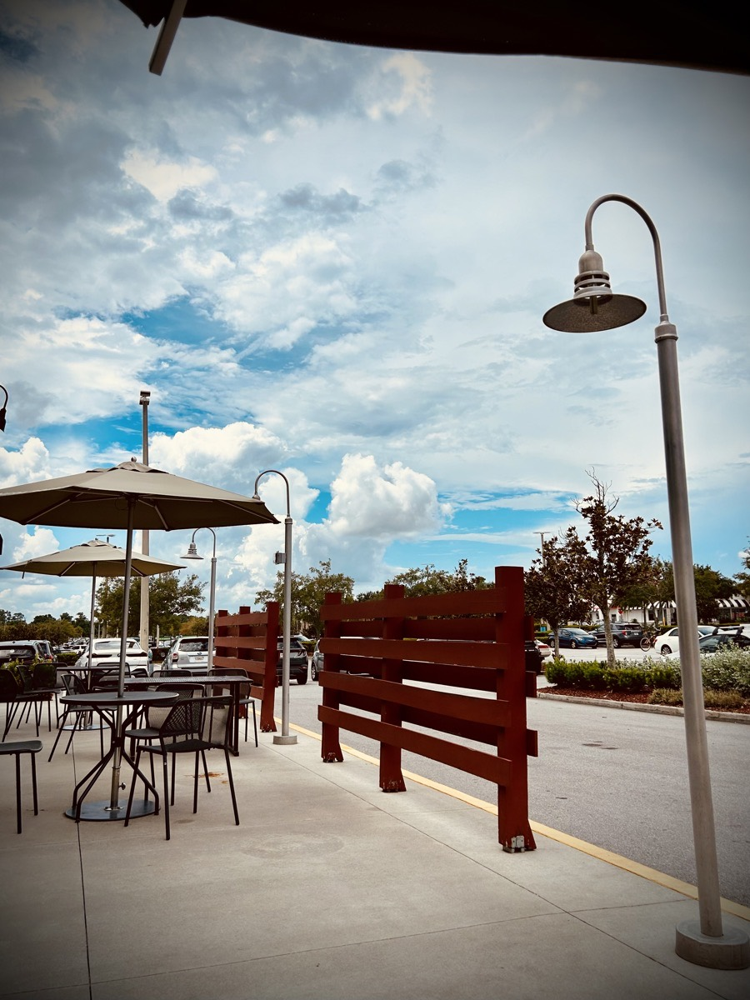

# TBD

So, I'm trying a new (to me) soap. A little over a week ago, I bought some Zum Bar soap. I had seen that Chérie had gotten some but I didn't think much about it at the time. Then when I was shopping at Sprouts one day, I came across it while I was looking for something else. I recognized it and my curiosity was peaked...hehehe I liked the scents and the ingredients looked good. Since she also trusts it, I decided to give it a try. I've been using it for just over a week now and have been quite surprised at the results. I've had issues with dry skin and scalp for about 30 or so years and have tried all sorts of soaps and shampoos. Some medicated and some just your basic *Head & Shoulders* type stuff. I've even tried various lotions and whatnot to keep my skin moisturized. Well, within a week, every single skin irritation, rash, and dry spot on my body has cleared up. I even had this spot on my right ear that just wouldn't clear up no matter what I tried for months. Yet, within a few days of using Zum Bar, poof...gone!

Not everything other people do is right for me. But I do pay attention to what others use to take care of themselves. Sometimes I give something a try and it doesn't work out. Sometimes, like has been the case with Zum Bar thus far, it works out rather well. I'm finding it important to not stick with tradition for tradition sake or to keep with the status quo. I much prefer to grow through new experiences if it seems like it might be good fit. Sometimes, *good enough* is, well, good enough. But other times, I need to break the cycle in order to grow. To some, a simple thing like changing soap might seem like something silly to celebrate. But that's just who I am. When I have faced something that has truly been a struggle, then something so simple comes along to change or eliminate the struggle, I want to celebrate it. Perhaps that is one of the things that sets me apart from the *YOLO* and *FOMO* folks? I'm not judging them or anything. But it doesn't take the big moments in life to get me excited or to find happiness. Oftentimes, it is just as simple as a bar of soap.

That reminds me of a little cloud I saw yesterday that made me happy. I was sitting outside having lunch and decided to capture the moment in a photograph. This little cloud was perfectly lined up in the middle of the frame of what I wanted to capture. Although taking photos helps me connect to fond memories, I also see it as a means by which I can express myself artistically. The little cloud being in just the right spot in just the right moment really made me happy...hehehe

