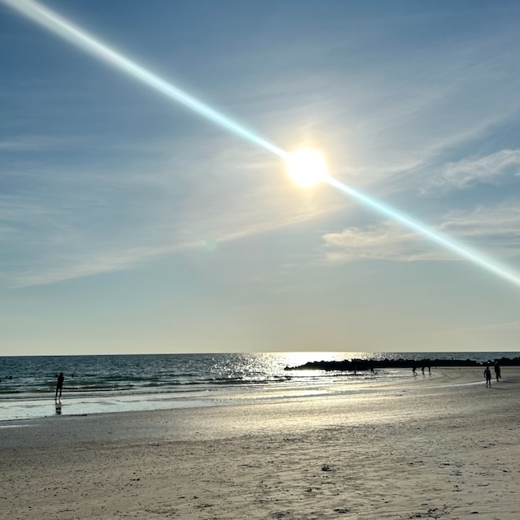
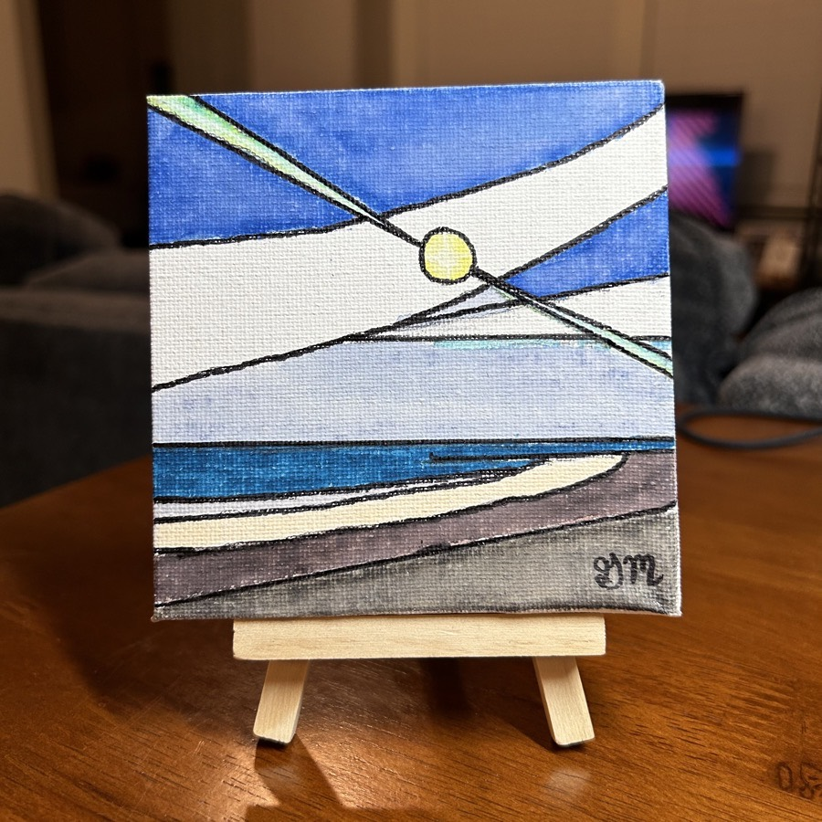

# TBD

## Journal?

I have a confession to make. This is my 4th attempt at journaling in the past week...hehehe Plus there is still an unpublished journal entry from the week before that. I'll copy those yet unpublished entries to a private journal so I don't lose them. But I have been having difficulty finishing so many thoughts lately...LOL I can't say as to why I'm having trouble completing these things. I feel that's okay, though. It's okay not to finish and it's okay not knowing why.

## Hurricane Debby

I survived another hurricane. This one was named Debby. She wasn't very powerful. However, she was very slow. That means she dumped quite a bit of rain on me for quite sometime. It was the most exhausting storm I've experienced. The reason being that when such a storm is here, you have to remain alert of any risks or dangers. I fully trust God is my protector. So I wasn't anxious at any moment. By being alert, I mean that I had to pay attention to all of the warnings and keep watch on how the weather was affecting things. There wasn't any time to relax from Friday through Monday. I did sleep each night. But it wasn't restful sleep. And with the atmospheric pressure changes throughout the storm, it made a huge impact on me physically. From my sinuses to the arthritis in my right wrist and hand, it was quite the discomforting weekend. Nothing to be concerned about. It is just an inconvenience that prevents true rest. This was by far the longest storm I have experienced. The other hurricanes I've been through we no more than 12 hours of rain, wind, and my being alert. With Debby, it began on Saturday and didn't end until about mid-day yesterday. So about 48 hours of being alert...LOL

The community pool is about 20 feet from my patio. So I always keep an eye on it during these storms. Well, this time, the pool finally overflowed...LOL It has been close before. With how much rain for how long it fell, the pool couldn't contain the water this time. Fortunately, the water didn't make it to my home. Also, there is a large storm drain right outside my patio. The slight flooding just outside was being whisked away by that drain. None of the water made it to my home. I guess the breezeway had a lot of water too. But none of that came in through my front door either. I didn't bother to check. I just heard some folks outside talking about it.

I hadn't been outside in over 2 days. I was finally able to go out for my morning walk this morning...hehehe I never realize how much I miss something like that until I come to days when I'm simply unable to do it. I had no choice, really. You don't *brave* a storm like this...hehehe There's a fine line between *brave* and *stupid*...LOL I prefer to remain *smart* and decided to remain in my home through the whole thing. Aside from my morning walk earlier, it's going to be so nice to be out again. I need to go to the grocery...LOL

The sinus pressure is subsiding. As is the arthritic pain in my wrist and hand. My jaw remained unaffected by the change in atmospheric pressure. So that's also good to go. It seems as though Debby is gone now...hehehe

## Happy, Social Engagement, Focused

Some of the thoughts I've journaled about in my unpublished entries have revolved around happiness and social disengagement. I won't go into the details of my thoughts now. I can't seem to finish writing about that...hehehe But I will state my conclusions. I am very happy right now. The peace and joy I feel has a single source: Jesus. And socially speaking, I remain engaged with the people I'm suppose to. Those I can't seem to engage with today will either go about their journey without me or our paths will cross again. I'm okay either way. These things are only for a season. I'm not isolated. I'm just more focused. I recognize I have weaknesses and Jesus is filling those up with more of Himself. I'm also focusing more on finding happiness within my needs with very little focus on anything I want. Some of this may seem confusing for now without the context of the thoughts that led to these conclusions. When I read this again in the future, I'll know where to go to find my thoughts privately...hehehe And you never know...some of those thoughts might end up in my book(s)...LOL I'm still working on my formal writings.

## Travel Plans

I'm planning a trip up to North Carolina later this month. I still have some plans to solidify. But it is looking like I'll be driving up August 17th and driving home the 25th. With me driving for this trip, the dates are a little more flexible. I'm planning to go to Disney with Dan and Corban on the 16th. I'll then start my drive up and stay the night in a hotel part way to NC. I'm considering renting a house for the week I'm there. One of my goals for this trip is to see if NC is a place I may want to live. Decades ago, I had considered NC as a place I'd want to live someday. Now that I have family and friends near the area I'm attracted to, it is on my short list...hehehe Renting a house will give me a better feel for life in at least the area I'll be staying in. The problem with hotels is they aren't a real representation of living some place.

I loved my hotel in California. But I think on my next visit, I'd like to rent a house or at least do an extended stay hotel where I can still cook my own food. As I visit places now, I truly want to immerse myself in life. Renting a house gives me a taste of that. One house I looked into in NC had a nice oasis in their backyard. I was imagining myself doing my Bible study and devotional time back there. I imagined myself cooking in the kitchen for at least lunch. I plan to work 3 days on my NC trip. I'll do that on my next California trip as well.

I'm considering a trip to Texas. I've never been there. I'm not sure it's a place I want to live, though. I'll likely just do a weekend there. I have a friend who works at NASA and offered to take me on a tour. It'll be nice to visit with a friend and take a little vacation. If I do end up doing a week there like I'm doing other places, I'll make it an evaluation trip instead of vacation. Since I'm not sure I want to live there, it is more likely I won't be doing that...LOL

## Where I Belong

I'm also considering doing something like this in a few other areas of Florida. There are other places here that I'm attracted to. Most of them are on the Gulf Coast, like where I am now...hehehe After this past weekend, though, I'm not sure I want to remain on the coast...LOL Hurricanes have the added risk of storm surges on coastal areas. Think of it as a tub of water you are holding and you slosh the water back and forth. Now imagine if that is the ocean sloshing back and forth across the land and into your living room...LOL Yeah, that's not a fun thought...hehehe Why...oh why...did I move to this apartment?!? LOL Fortunately that has not yet happened. God is good and I feel safe. It's just exhausting thinking about it...ugh!

There are some places inland that I think I'd like to look into, though. One of my concerns with any of these experiences is how do I find a place that I actually want to experience? I don't want to be *in* a city area, really. I'd love to be out in the country a bit. But I don't think there are places to rent for a week out away from populated areas. If I were actually looking to buy a place, I'm most likely to be searching out away from the population a bit. Probably not as far out as my country home I use to own. Although, I do miss the feeling that place gave me...hehehe

I have given some thought to the reverse, sort of. There are some quaint little *cities* here in Florida that might actually be nice to live right in the heart of. Places like Tarpon Springs and Dunedin have wonderfully sweet downtown areas. I don't mind people whatsoever. I just don't want to live in an actual city with the busyness. So, places like those two offer the people and convenience of location without that city feel. They feel more like towns with small businesses and everyone knows each other. I'm imagining that early scene in *Disney's Beauty and the Beast* when Belle is going through town and everyone is singing about her. Downtown Tarpon Springs and Dunedin have that feel when I visit them. If it feels that way while living there, that sounds lovely <3 *There goes Greg...I wonder what he's writing, painting, or capturing through a lens today?* Of course, they might be thinking, *There goes that weirdo again...Craig...or Steve...or something* LOLOL

## Painting Contest

Speaking of painting, I entered a painting in my first contest! The photo below inspired the painting below it. My new company is doing an activities week and a drawing/painting contest is part of the festivities. I hesitated to enter the contest. I hadn't ever done such a thing. All of my paintings have either been gifts or ones I've done for myself. I wasn't anxious or anything about submitting my work. But there was a mental block that kept me from painting. I talked with Chérie about it on Saturday. Something she said got me to thinking about how this painting just needed to exist. And then it needed submitted. Whatever happens next isn't so important. Just doing it and letting it be what it is...that's what is important. I'm really happy with how the painting turned out and the feedback I've already gotten has been a Blessing. It has that stained glass look I was going for. This water color on canvas is special and I'm glad it exists now. I painted it during the hurricane. It currently adorns my the counter in my bathroom. It's colors and theme match my decor in the bathroom. Now I get to see it every day...hehehe Voting will be on Thursday and the winner announced on Friday. We shall see how it does!..hehehe I give you, *Sunset on Honeymoon Island* by Greg Marine (2024/08/04)

(Sun setting on Honeymoon Island State Park Beach)

(Mini painting: *Sunset on Honeymoon Island*)

