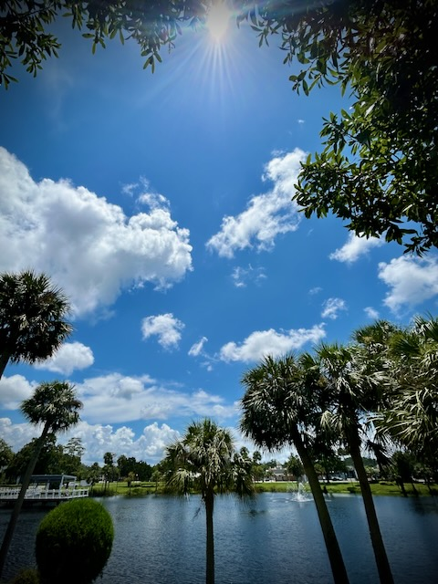

# TBD

## New Port Richey

On Friday, my sister reached out to me to see if I wanted to hang out with her on Saturday. Since I rarely see her, I made myself available. I had wanted to be out and about on that day anyway. Having someone come along was an added bonus...hehehe When I got to her place, she asked what I wanted to do. I was interested in doing a *downtown* sort of day. My first thought was downtown Dunedin where she lives. In the conversation I had mentioned downtown New Port Richey. She had never been. So I offered the suggestion we go there instead. So we did...hehehe

NPR is one of the few places near me that I have considered as a possible place to move to next year. It seemed like a great idea to check it out. I've been there a few times. My favorite Asian restaurant is there, actually. But besides that, I've only ever checked out the ice cream parlor. I hadn't ever just spent the day exploring it.

We were there for about 4 or 5 hours. We ate at that aforementioned restaurant, walked around Sims Park, checked out where a few apartment buildings were, had some ice cream, and walked up and down a few of the downtown streets. Everything we did was all within walking distance. It was quite lovely. At first it seemed like the sort of place I'd like to live. But then my sister pointed out that there were very few actual shops. Most of the businesses were eateries. She didn't really like it and I absorbed her vibe and started thinking it might not be a place I'd live after all.

Now that I'm a few days out from that adventure, I now recognize I was absorbing her vibe and not really making any thoughts of my own about what life in NPR might feel like for me...hehehe It's a place *she* would definitely not want to live. But what about *me*?..hehehe Although I do like to do shopping from time to time, eateries are definitely my thing...LOL I'm a foodie...LOL Plus, many of them have live music...hehehe Another one of my *things*...LOL They often do live music throughout the week. Not just on the weekends. So, I could pick a different place to eat each week, on say Tuesday, and enjoy a meal with live music. All the while enjoying home cooked meals most of the time. And I could enjoy that nice park. Which also has live music concerts at an ampitheater. And it looked like they have a movie night there too...hehehe

The more I think about it, NPR seems like my kind of place. I need to keep considering it. And I should probably check it out again by myself. I have this habit of feeling the vibes of others. While I welcome all input, I must feel things for myself when those things do not impact the other person...hehehe All of the things I liked about the downtown area were within walking distance of the two main apartment complexes. I could do all of those things without driving anywhere. That seems like *my* vibe.

## Happiness/Sadness Storm

Over the weekend, I was thinking about how I have been really focused on finding happiness in all areas of my life. That sounds like a good thing. But I got to wondering, if by doing so, was I suppressing other emotions by ignoring them? Just like two weather fronts can generate a storm when they collide, two opposing emotions have the potential of creating a storm in my soul.

In [my last journal entry](09_happy-friyay#sad-for-a-moment), I mentioned there was a moment of sadness that came over me. It happened a few more times throughout the weekend. The storm that manifested itself this time was relatively tame by comparison to struggles I've had in the past. I imagine my growth these past 4 years is making an impact on the severity of these emotional *storms*. And in addition to that growth, this year's journey with Jesus through my devotional time with Chérie is making an equally effective impact.

After I was pondering the storm analogy this morning, I opened up today's *The Chosen: Book 3, Day 30* devotional. Just as it has been quite often with these books, today's was directly related to what I'm experiencing in my life. The concept of the storm was the very subject of today's devotional. The disciples freaked out and questioned if Jesus cared they were going to perish in the storm because He was taking a nap...LOL He rebuked the storm and all became calm. Rather than answering their question, He took the opportunity to ask them why they were afraid. It was a teachable moment.

The storm I faced this past weekend did not frighten me. In fact, I responded on Sunday by taking a nap...LOL That's right, I literally took a nap. I sure wish I responded to all storms with such peace...hehehe That just so happened to be how I faced it this time. Today's devotional was reassurance about God's sovereignty over these things. I just need to trust in Him. I hope to always remember how I trusted Him this time; when I face my next storm. This one wasn't very big. But regardless how big a storm is, God is so much bigger...hehehe

## One Foot In

The Lord's Prayer, and passages like Matthew 6:33, remind me to have a Kingdom focus. But I also *live* in the world. I'm fine with living in the world and not being of it. I just need to remain in the mindset that I have one foot on earth while I also keep one foot in Heaven.

As the world and Heaven play *tug-of-war* with my soul, I can become a bit weary...hehehe