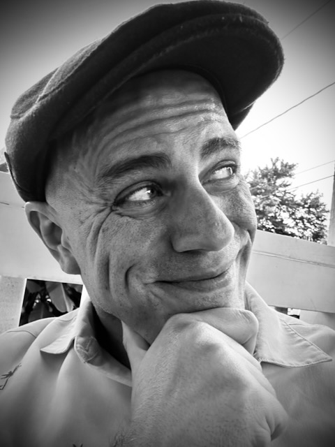
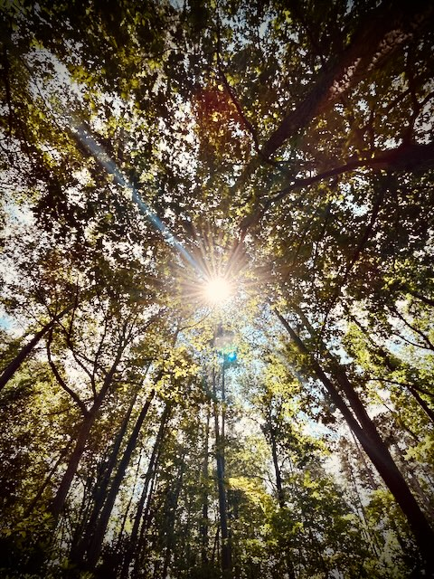

# TBD

Wow! I've really been slacking on my journal this month...LOL As I always say, that's okay...hehehe The only unfortunate thing about that is the fact I've been on a trip for 3 days already and haven't journaled anything from the experience yet. When I went to California last month, I was really consistent about journaling each day to cover things as they happened. This time, however, the only free time I've given myself has been at the tail end of the day when I'm not really feeling like being on the computer...hehehe

## Sleep Schedule

This really wasn't planned, but it would seem my sleep time is shifting again. I had gotten use to going to sleep around 1:30am and waking around 7:30am. Gradually, it seems I have shifted closer to midnight now. Of course, that means I'm waking around 6-6:30am instead. So, about the same amount of sleep...just slightly different timing. Again, this wasn't really planned. It just sort of started happening. I have found it important to *listen to my body* when it comes to sleep, food, and hygiene (note the change in soap [last month](../07/29_new-soap-connected-journeys-and-wrong-choices)). So, I'm glad to do what's best for my body when it comes to rest.

## I'm Tired

Speaking of rest, the other day I posted a *Vitamin G* about being tired, but not giving up. I just need rest. Social media doesn't really lend itself to context due to limited number of characters. But it's also difficult to explain what I meant by being tired. I'm not speaking physically, mentally, or spiritually...hehehe So, what's left? I suppose it is sort of like a combination of the 3? I think the best way for me to describe it is that my mind has been pulled in several different directions lately. I have a lot going on in life. I'm evolving health-wise. I'm being transformed spiritually through the devotionals. And I'm learning new ways to think. Lately, I feel like I need a break from things and take a real vacation. But I don't vacation anymore. People think what I do for travel is vacation. I definitely do not see it as such. Either I don't know what a vacation is or everyone else can't understand what I'm doing...LOL Or both...LOLOL

As someone who isn't planted, where I am in the moment is just my life. Going somewhere else doesn't equate to a vacation for me. Case in point, I worked today...while on what someone else would call a *vacation*. For the past 3 years, I haven't had a real home; by my definition of *home*. I'm not going to mince words here, though. So, okay, I'll concede I'm on *vacation*. I'll concede that my apartment in Florida is *home*. However, I'm in a perpetual state of not feeling at *home* or on *vacation*.

Which takes me back to my point. I'm tired. I'm tired because I don't have a place to recharge anymore. I didn't realize that was the case until recently. And what I'm learning now is to find rest right where I am *in the now*. The part of me that is worn out is my nervous system. The part of me that connects all of the other stuff together. Since I'm neither at home nor on vacation, I'm learning to find rest by embracing where I am in the moment.

I use to be someone who was in a perpetual state of disassociation. It was as if my life was happening on a movie screen and I was just an observer in the audience. Everything was happening to me and not for me or with me. Or another way to look at it as if I was reading a book. Each chapter built on the last. But I was merely reading it and not truly experiencing things. I wasn't a character in the book. I just couldn't connect with it and now I'm ready to put the book down or walk out of the movie theater...hehehe

I'm not entirely sure where these thoughts are leading to. How I'm finding rest these days is not chasing anything. I am asking God for guidance, seeking His Will, and waiting on the doors He'd like me to knock on. But as for rest, I have been spending more time just waiting. Waiting for what? I really don't know...LOL But something as simple as closing my eyes as the sun hits my face while it sets for the evening has been very restful. Listening to the wind flow through the trees. Doing my daily routine; even while I'm on *vacation* (LOL). Doing the daily devotionals from *The Chosen*. Reading the Bible and praying consistently. All of these things are where I'm finding my rest.

## Health Update

A quick health update. I'm *feeling* really well these days. As I've mentioned, I'm not really on a *diet* of any kind now. My *exercise* really isn't formal anymore. I'm back to having the occasional alcoholic beverage. My sleep has been really good. And my energy levels are higher than I've had in decades. I should probably get a doctor soon. Even if I have to *doctor hop* until I find one who will listen, I should take a more active approach to that so I can get the tests and whatnot done that I need. My body's needs have been changing and I should probably get some blood work done sooner than later...hehehe *Feeling* good and *being* good are separate things...LOL I've seen so many seemingly healthy people have hidden health problems. But the good news is that my health tracker app says I'm doing well and my mind is as sharp as it was when I was in my late teens - early twenties.

## New Bible

I have a new Bible...hehehe As part of my spiritual journey this year, I've switched my preferred translation. I'm now reading from the Berean Standard Bible. It's one of the few English translations in the public domain. I really like how it reads and they also include all of the other versions of their text that led to this translation; all in the public domain. This includes the original Hebrew and Greek resources they use for translation. Although I read and listen to this translation on the app, I wanted a physical copy as well. It arrived a few weeks ago. But since I haven't been journaling consistently this month, I failed to mention it until now...LOL

Just like the Berean's of the book of Acts, I do not simply take anyone's word for what the Bible says or how to interpret any of it. I listen, pray, and do my own reading and research/study. So, it is somewhat fitting that the name of my preferred translation has *Berean* in it...hehehe I also love how it and its resources are all in the public domain. The *Bible* should not be copyrighted in my opinion. I feel it is okay to be paid for developing these resources. But controlling its distribution and whatnot shouldn't be up to us as humans. Again, in my opinion. I could be completely off on my thoughts...hehehe So, I'm not stating that as fact. I also feel God will provide the finances for such endeavors. Forcing payment for the Bible just doesn't set well with me.

Distribution control and payment concerns are a real issue throughout the world. It's easy to get the Bible here in the USA and other first world countries. But there is a large portion of the world where such restrictions (cost and distribution rights) prevent safe availability for the Bible to reach the hands of those in need. My feelings on the matter are leading me to wonder if I should focus more effort in helping resolve such issues in places of the world where this makes such a negative impact on people.

## Relationships

I've been giving relationships quite a bit of thought lately. Relationships being any type...family, friends, work, acquittances, companion/romantic, etc. It seems people in general make it out to be complicated. Even I have complicated relationships in the past. The whole *it takes work* thing seems to be common.

Sure, it takes *something*...hehehe I wouldn't call it work, though. If it is *work*, then perhaps the relationship isn't meant to be. Even the case with family. I don't believe in the whole *blood is thinker than water* mindset. Before I delve too deeply, I do want to state that *work* and *responsibility* are separate constructs in my thinking. For example, my son was my responsibility until he became an adult. And someday I may take on some responsibilities with my parents if my brother isn't able to. That's out of respect for the human decision of commitment to have children...hehehe Similar truth in regards to marriage. If one is married, there is a responsibility between the two people that is a human decision to be committed to the relationship. So, with child-parent and marriage relationships, there is a *responsibility* that may disguise itself as *work*.

Okay, back to *work*. Nope, I don't like that...LOL What I'm leaning into now is *consistency*. I have friends and family I have consistent connection with. And none of those relationships are work whatsoever. What we have is true connection. Whether it is similar interests or simply details about our lives that just click with one another, we have a consistent bond that transcends circumstance.

As such relationships evolve over time, there may be times of change. But that comes with growth. As our relationship grows, small changes will occur to balance it all out. But consistency is far greater than simply working hard at keeping the relationship alive.

There is this saying: *if you do what you love, you'll never work a day in your life.* I'd say it is the same with relationships. To rephrase: *if you love those you relate to, you'll never work for the relationship a day in your life.*

This is, of course, a two-way *street*. In any relationship, it takes both sides to make that work. If both sides aren't being consistent or balanced, perhaps the relationship has come to its natural conclusion. Or perhaps it was never truly meant to be. It can be a loss and you'd have to go through the grieving process. As for me, I'm okay with that. I never want anyone to feel as though they *need* to be in a relationship with me. If it feels like *work* for them, it's better to say *goodbye* to me than to suffer...hehehe

So, I'll consistently love those I relate to. And when I do that, I'll never have to work for the relationship a single day for the rest of our lives...hehehe

## New Profile Photos

Every so often I update my profile and banner photos. I finally got around to doing it again today. I had been wanting to do a new one soon. My last one was from around Easter time. I think it was taken on Easter, actually. I don't actually have a set cadence for when I update it. I go by how I feel...hehehe So, basically random...LOL One of the selfies I took tonight felt right. And the banner photo is based on one I took yesterday at Duke Gardens.

*New profile photo*

*Original photo from where my social media banner comes from*

## Conclusion

Today's entry is basically the continuation of the [More to Come](./13_more-to-come) from my last entry...hehehe I also included a few things I've been thinking about since the last entry. I'd love to get around to journaling about this adventure I'm currently on. I really should have been better at keeping up with my journal. I think it has a lot to do with how [*tired*](#im-tired) I've been...hehehe As always, that's okay. This place on the internet is mostly for me. I love it when someone reads along. But the point of this journal is to express myself in thoughts. Hence the title *So, I was thinking...*. It isn't so much of a *So, What Do You Think...* LOL

That said, I'm wide open for other's thoughts. I love to hear from different perspectives. Privately, of course. I don't have a comment section on here and I don't always respond to replies to social media posts publicly. That's because I am a one-on-one sort of person. I can stand before a crowd and speak without any issue. But a dialog...that's a different story. That I reserve for the *safe space* of private conversation.

I'm getting some much needed rest so far this week. But I have also found that my mind drifts back to overthinking. I'm somewhat sad that it takes going someplace away from *home* to find rest. But that's kind of the point of why I'm traveling in this season. I'm looking for a real home. A place that God has prepared for me to begin planting. My *field* of sorts.

Tonight I spent quite a bit of time sitting out on the front porch of the little Airbnb I'm renting this week. It was such a lovely time just listening to the sounds of dusk. I don't get to do that back in Florida. Where I live doesn't lend itself to such peace. I can't say I ever had that in Indiana or Illinois either. So, none of the places I've called *home* have ever been as peaceful...hehehe Once again, that's okay. As it is with all moments, I'm exactly where I am suppose to be at exactly the moment I'm suppose to be there. And someday, I hope most of my moments will be exactly in my real home.