# Disney, Duke Gardens

## Seeking

Once again, today's *The Chosen* devotional (*Book 3, Day 37*) is quite relatable to current circumstances. In [yesterday's entry](./19_more-continued#im-tired), I talked a little about something that was applicable from today's devotional...hehehe It isn't directly related. But it certain can be applied.

Today's talked about *Hope in Trouble*.

## Disney

The adventure I'm currently on began last Thursday night...hehehe I had plans to be at Disney World on Friday. As a last minute decision, I wanted to head there a little early and stay the night on property. Although it is expensive, I really do love staying at Disney World. Doing so a few times a year can be fun...hehehe I think this might be like the third time I've stayed there this year? This time, it was 2 nights at Disney's Port Orleans: French Quarter. I had stayed there with my parents back in May for 1 night. But I didn't really take in what that place is. Wow! It is amazing! I didn't spend enough time there this time either...LOL But I did take in more of the vibe and I truly enjoyed my brief time there.

I was solo that first night. So I spent most of the evening at Disney Springs. I ate at The Boathouse. It was my first time there. They have an outside bar area that stands above the lake. I grabbed one of the tables next to the water that was facing the sunset. Yesterday when I described finding rest in the warmth of the sunset hitting my face, that was the sunset I was thinking about at the time...hehehe I was being my full animated self that night and my bartender/waiter (Joel...pronounced Jo El) asked if I was one of the magic makers...LOL He thought I was Cast...LOL I suppose I give off that vibe when I'm at Disney, don't I?!? It's not that I'm a different person. That part of me just shines in a place like Disney...hehehe

After that, I made my way over to the area to see the temporary drone show they are putting on at Springs. I'm not going to go into that much. I do recommend watching it online if it's available. It isn't a bad show. But it isn't one I'll go out of my way to see again. I love the idea of drone shows. And it is pretty neat to hear those little things buzzing around in the dark.

Once the show was over, I made my way to the World of Disney store to do some gift shopping. Chérie had gifted me a gift card that was burning a hole in my pocket...hehehe I wanted to find something that would be something she might pick out for me and something that would remind me of her every time I looked at it. I did not find anything there. So, I made my way over to the Christmas shop. I did find something I almost got. But I changed my mind. I was singing Christmas carols in that shop and had a lovely conversation with a Cast Member named Grace.

I made my way back to my hotel after not finding anything. I decided to have a look in the Emporium at Magic Kingdom while I waited for Dan and Corban to arrive on Friday. Thankfully I did find something there...hehehe I found 3 pins that inspired a purchase. The first has Bambi and Thumper. Thumper was my favorite character before Olaf came along. The second pin has Olaf and Elsa. I obviously got that one for Olaf. And the third has my favorite princess, Snow White. She's my favorite because she was the first princess as part of a feature length cartoon...not just for Disney, but I believe for any animation studio in the history of the world...hehehe

I had a lovely conversation with a Cast Member named Rhonda while in the Emporium. Deer are her favorite creatures. She told the story of a close encounter with a buck after she moved to Florida. She heard him huff and then stomp its foot. That is a sign they are about to charge...yikes! Fortunately, he did not charge at her...hehehe Her story inspired me to submit a Cast Compliment in the app...hehehe

Thank you, Chérie, for my pins. I cherish them very much <3

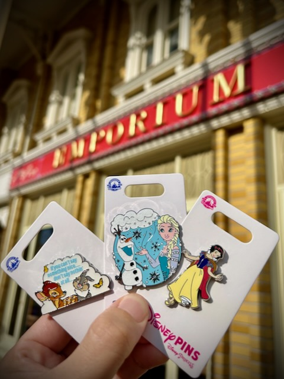

The rest of the day was spent with Dan and Corban. It was Corban's 31st birthday. I've known him since he was 17ish I think. A little backstory about Corban. He has autism. He is verbal. But he'll not be able to live on his own. He needs someone to guide him through all aspects of life. He is highly functional with the right guidance. One thing that has stood out to me is that I consider him a friend. His parents have always appreciated that I call him friend and not their son when I address him. I still remember the day when Dan first acknowledged that. Dan was so excited that his autistic son had someone in his life that considered him a friend. I'll cherish that memory because I never realized how important something like that is to a parent. I was already a parent at the time. But my kid had tons of friends. Corban did not have any. Well, ever since I've been in his life, Corban has had a friend. And he always will so long as we are both alive.

## Sarah P Duke Gardens

I spent part of the day, Sunday, at Duke Gardens. The gardens are why I picked the apartment I'm in for the week...hehehe I wanted to be close in case I could enjoy it more than once. So far, I've only been once. But I may go again before the end of the week.

It's a large property that is fenced in with gates. The gardens themselves are free. Parking is not, however. It is located on the Duke campus. So, the only people I saw there, and I saw a lot, were mostly students and their parents. I imagine some of the other folks were locals or people like me, simply visiting.

My favorite section is the Japanese garden area. Most of the photographs below are from that area...hehehe But I also included some from other areas. As a whole, the place reminds me of the LA Arboretum I went to last month. The 2 most notable exceptions are the lack of peacocks and I didn't find a desert area. I'm not sure it is as large as the LA Arboretum either. But it is still rather large.

There are so many trails in this garden. I didn't come close to walking them all. And many of them are in some beautifully wooded areas of the gardens. It was like stepping into a storybook. I would imagine it is quite spectacular in the Spring when all of the flowers are in full bloom. There were several flowering plants. But the wildflowers were a tad light when I got to that area. Most of the photographs and videos I took with flowers didn't really turn out. That's okay...hehehe

There were a couple of little cottages. One was actually a restroom...hehehe I'm not sure what the other was. Perhaps a little café or something? There are also some shelters throughout and few gazebos. I saw several people picnicking or just laying on a blanket enjoying a Sunday afternoon *at the park*...hehehe

Here is a small photo dump from the day...hehehe

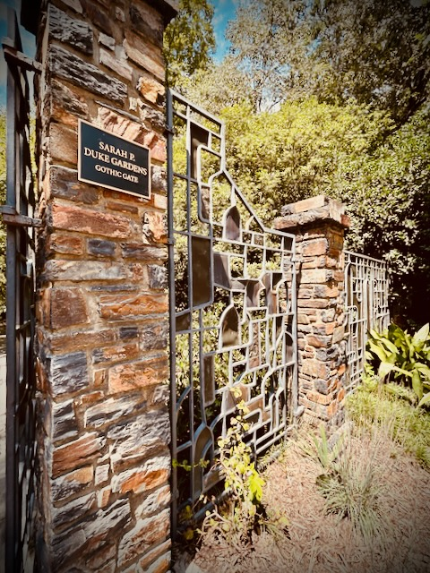

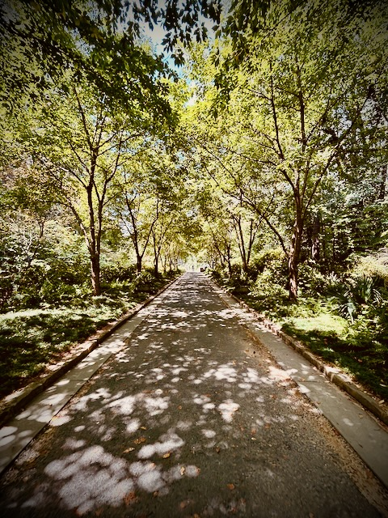

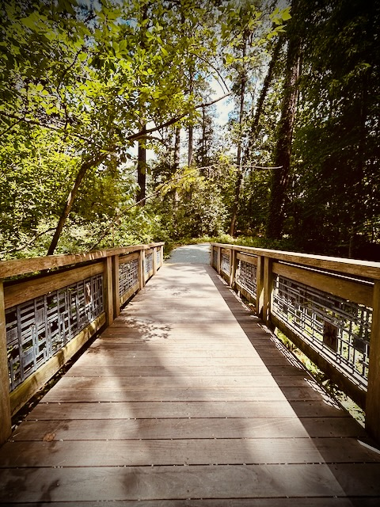

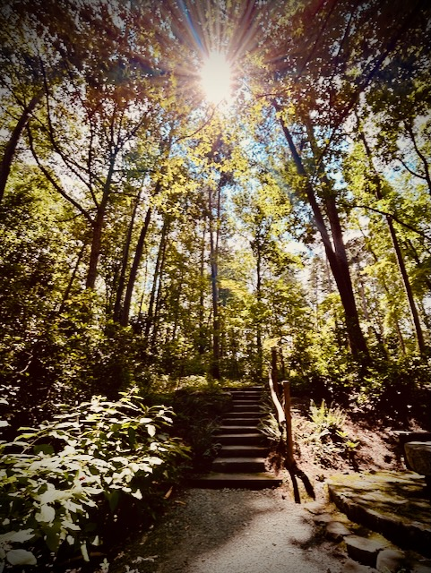

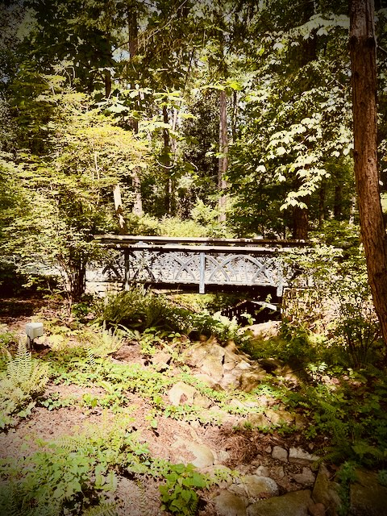

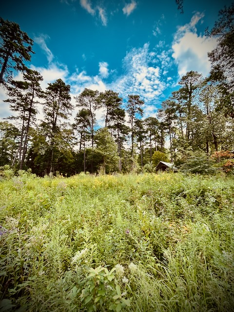

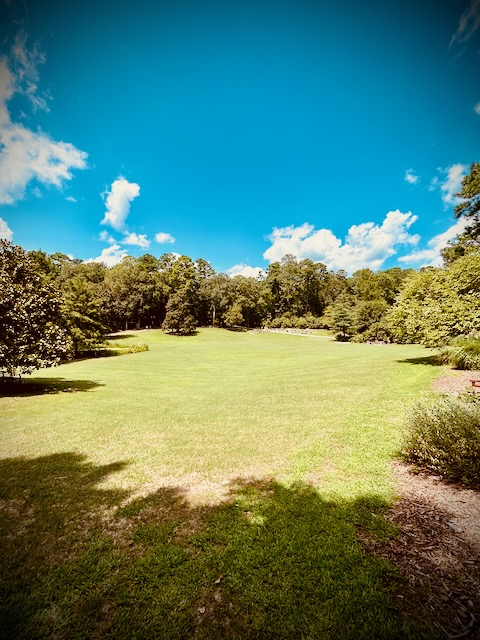

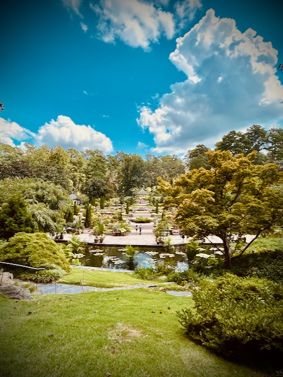

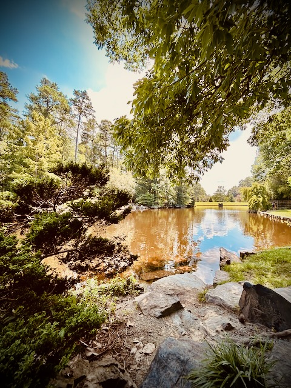

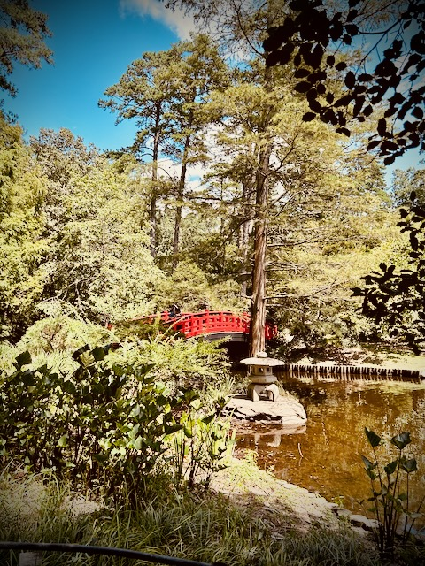

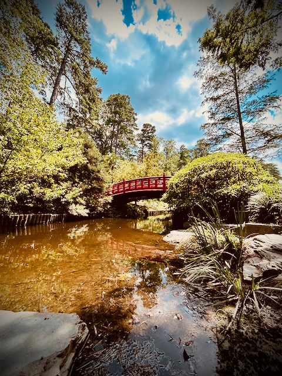

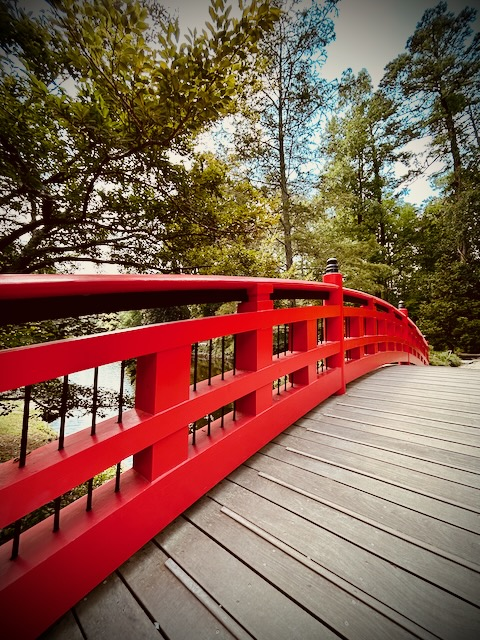

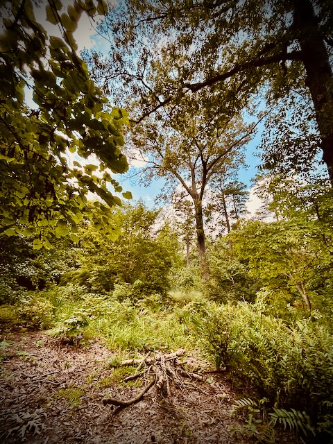

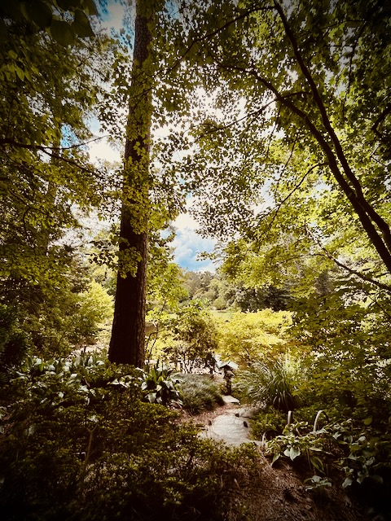

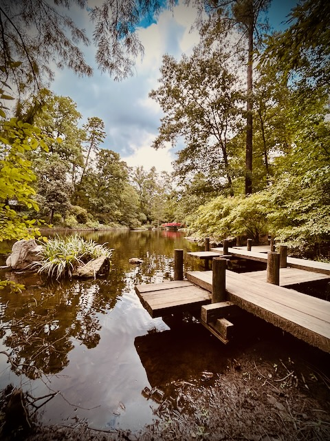

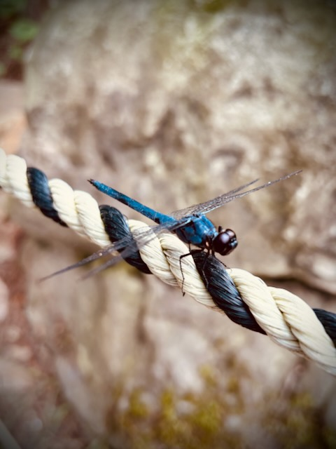

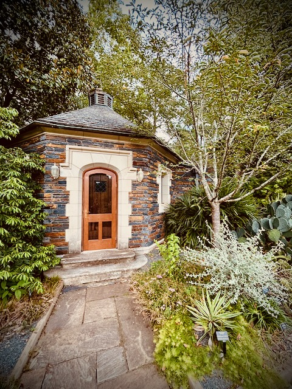

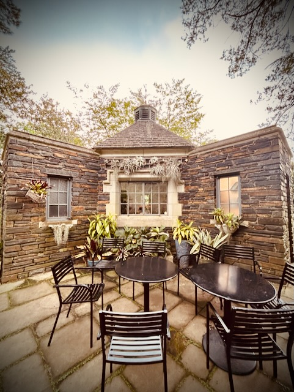

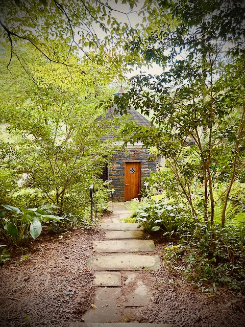

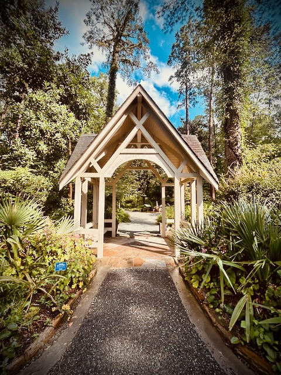