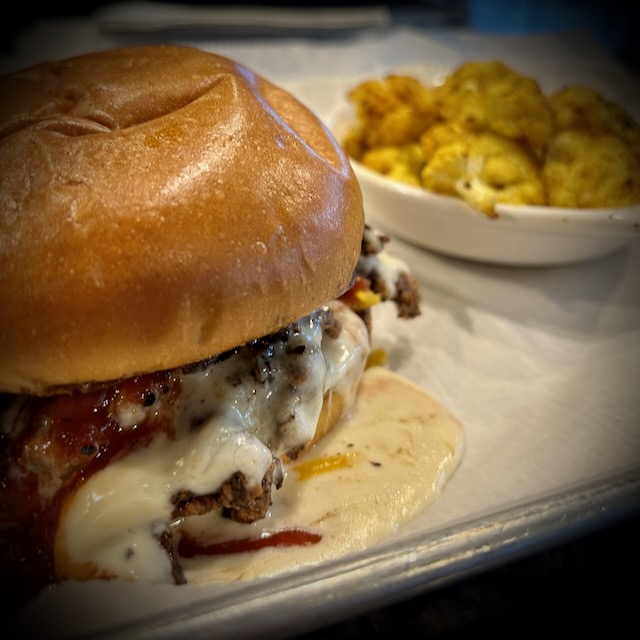
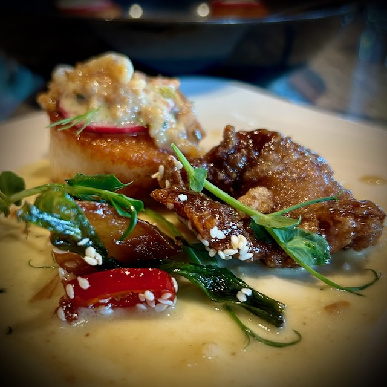
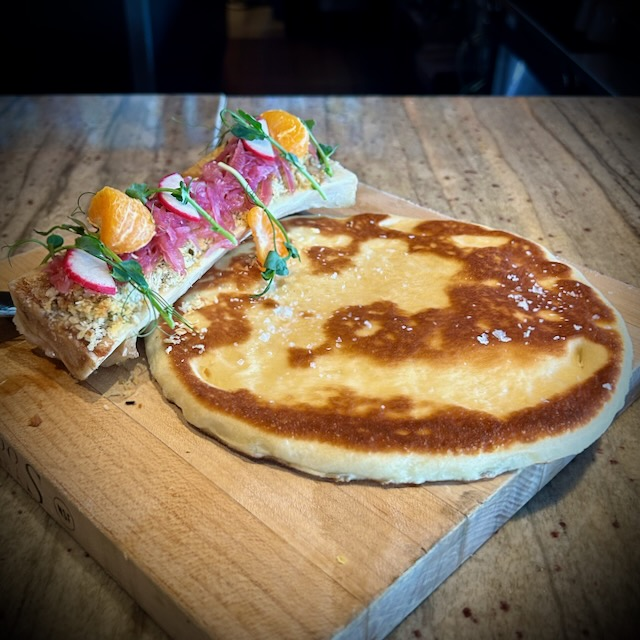
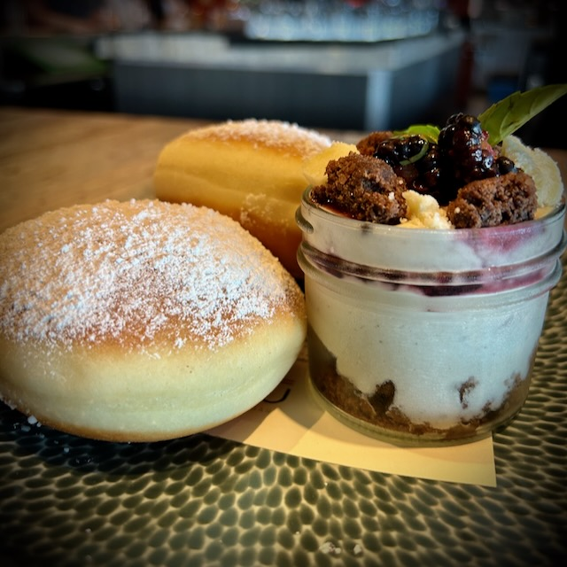
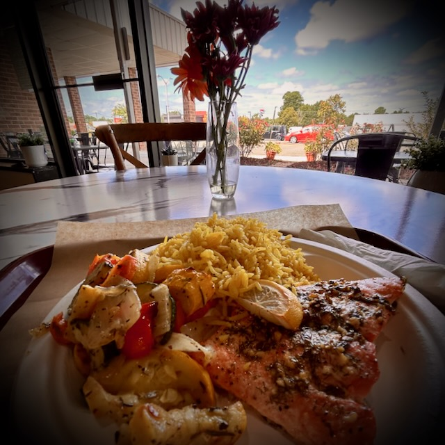

# TBD

## Lindsay

Today is the 25th anniversary of Lindsay's passing from this life into her life in God's Kingdom. Although our journeys had a brief moment of being parallel, I sure do miss her. She's been on my mind a lot this year. It could be that it has been 25 years; 25 typically being a significant anniversary year for stuff...hehehe I ponder the idea of what life would have been like if she were still a part of mine.

I love you, Lindsay. I miss you. I'm glad you are with Jesus. I'm glad you were in my life. I can still see your smile all these years later. And it warms my heart. I can't wait to see you again. Until then, I'll keep living my life with and for Jesus. I don't owe that to you, of course. I owe that to myself...hehehe I just wanted to tell you in hopes that it makes you smile. I loved your smile. I loved your laugh. Thank you for inviting me into your journey.

## Work

As part of this trip to North Carolina, I decided I would work 3 days. That has been going like it typically does for a workday...hehehe I'm glad. That was the point of trying to work this week. I wanted to see how it felt to work and *live* in this area for the week. I've also been enjoying the Nemo's Dreamscapes on YouTube. Feels very homey here...hehehe

## Food (So far)

Most of my meals have been at *home*. But I have gone out a few times.

### Tobacco Wood Brewing

When I arrived on Saturday, I was quite hungry and didn't feel like going to the grocery until the next morning. So I checked out a local gastro and brew pub. I had a shaved steak sandwich with a side of cauliflower. It was really good! I also had a few of their beers that were also really good. They were nice enough to put the Dodgers game on the TV for me. Sadly, they lost to my brother's Cardinals.

### JuJu

I visited one of the local Panera Bread locations to get some coffee on Sunday. While I was sitting outside enjoying my coffee, I had a look up and down the street where I was. I noticed a nice looking Asian restaurant on the corner named JuJu. I looked it up and saw it had very limited hours. But the menu looked fantastic. I decided to book an evening there on Monday. I had Mongolian beef, scallops, and bone marrow with bing. For dessert, I had some sort of doughnut thing. It was all wonderful. I also had a few beers there. It was a really nice experience and I ended up giving them a review since I was impressed.

### Café Meridian

For lunch yesterday, I went to a small bistro style restaurant. There, I had the salmon with roasted vegetables and rice. Once again, the food was amazing. The atmosphere was quite lovely despite it being in a strip mall...hehehe The chairs and tables were so cute. I sat by the window so I could enjoy some natural light and the lovely sky. The outside seating didn't look inviting. Otherwise I would have sat outside...LOL As it was with JuJu, they had very limited hours.

I'm not sure if that is common around here. But I'd say that I chose a few very one of a kind places that limit when you can enjoy them. Perhaps that's why they are so good? We'll see if the next few days will include more amazing food...hehehe

## Museum Park

Last night after work, I went to an art museum park that had giant sculptures throughout the property and several trails. I had very limited time there. It's definitely a place I'd like to visit again. The park was beautiful and was quite large. It was in a very nice part of Raleigh. The park was free and several people were enjoying it.

With limited time, I just sort of meandered through a few of the trails. I saw most of the sculptures, though. And I even came across some deer...hehehe Overall, it was a very pleasant experience.

Since I love art, I'm glad I saw all of the wonderful creations last night. With limited time, I didn't take the opportunity to read all of the signs for what I saw. I'll eventually go back and take the time to take it all in. I'd also like to visit the actual museum sometime.

Here is a small photo dump from last night:

